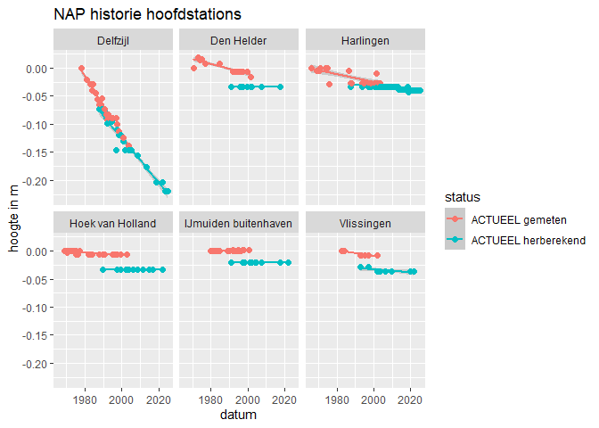
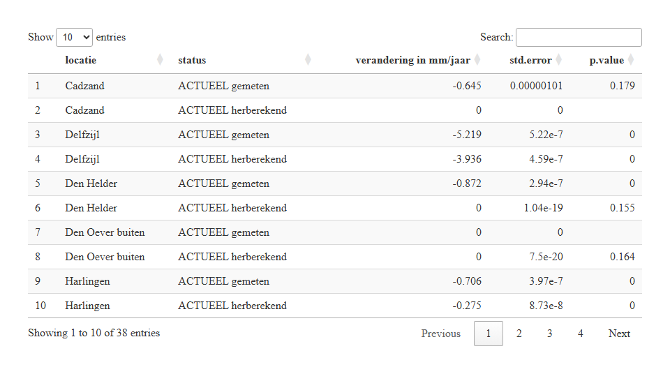
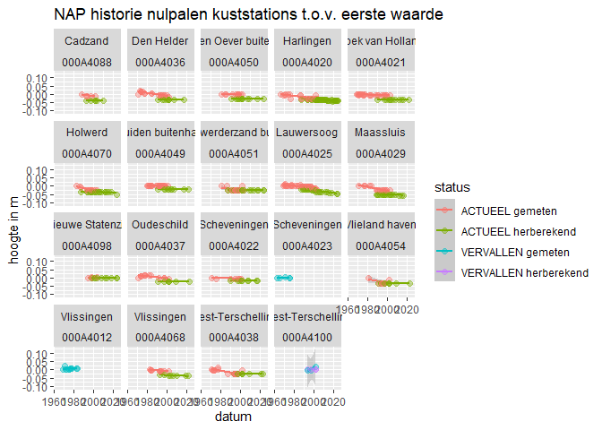
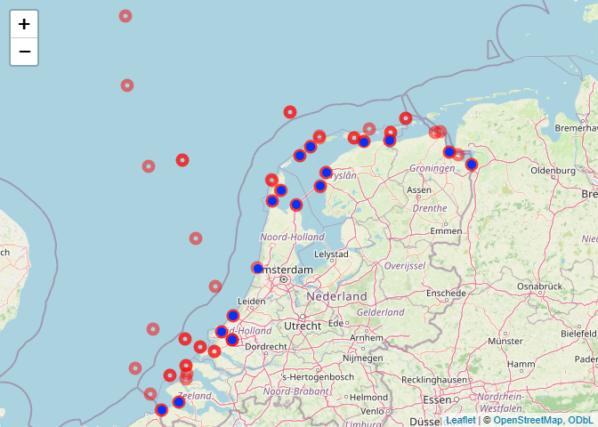

NAP info
================
Willem Stolte
2025-05-19

[Source
script](https://github.com/Deltares-research/sealevelmonitor/blob/main/analysis/NAP/napinfo.Rmd)

## Nulpalen van de kuststations

Via RWS-CIV verkregen informatie uit NAP-info wordt ingelezen en
verwerkt.

``` r
historie_nulpalen <- readxl::read_excel("../../data\\rijkswaterstaat\\NAP\\Historie_nulpalen_20250530.xlsx")
nulpalen_info <- readxl::read_excel("../../data\\rijkswaterstaat\\NAP\\Nulpalen_info_met_locatie_20250530.xlsx")
stationLocations <- stationLocations <- sf::st_read("../../data/rijkswaterstaat/waterhoogtestations.geojson", crs= 25831, quiet = T)
mainstations_df <- readMainStationInfo(filepath = "../../")

nulpalen_all <- nulpalen_info %>% 
  dplyr::filter(locatie %in% stationLocations$locatie.naam)
historie_all <- historie_nulpalen %>% 
  dplyr::filter(puntnummer %in% nulpalen_all$puntnummer) %>%
dplyr::left_join(nulpalen_all %>% dplyr::select(puntnummer, locatie, status))  

nulpalen_main <- nulpalen_info %>% 
  dplyr::filter((locatie %in% mainstations_df$name & puntnummer != "000A4012") | locatie == "IJmuiden buitenhaven")

historie_main <- historie_nulpalen %>%
  dplyr::filter(puntnummer %in% nulpalen_main$puntnummer) %>%
dplyr::left_join(nulpalen_main %>% dplyr::select(puntnummer, locatie, status))  
```

``` r
plot_nap_historie <- function(naphistory.df){
  
  naphistory.df %>%
    mutate(
      status = case_when(
        grepl("=", project_id) ~ paste(status, "herberekend"),
        .default = paste(status, "gemeten")
      ),
      datum = as_date(projectdatum)  #, format = "%d-%m-%Y %H:%M:%S"
    ) %>%
    arrange(datum) %>%
    group_by(locatie, puntnummer) %>%
    mutate(norm_height = hoogte - hoogte[datum == min(datum)]) %>%
    ggplot(aes(datum, norm_height, color = status)) +
    # geom_line(linewidth = 1) +
    geom_smooth(method = "lm") +
    geom_point(size = 2) +
    ggtitle(paste("NAP historie", "hoofdstations")) +
    ylab("hoogte in m") +
    facet_wrap("locatie")
}

plot_nap_historie(naphistory.df = historie_main)
```

<!-- -->

``` r
q <- historie_all %>%
  # filter(status == "ACTUEEL") %>%
    mutate(
        status = case_when(
      grepl("=", project_id) ~ paste(status, "herberekend"),
      .default = paste(status, "gemeten")
        ),
      datum = as_date(projectdatum)  #, format = "%d-%m-%Y %H:%M:%S"
  ) %>%
  arrange(datum) %>%
  group_by(locatie, puntnummer) %>%
  ungroup() %>%
  # filter(locatie != "Delfzijl") %>%
  dplyr::select(locatie, datum, status, hoogte) %>%
  group_by(locatie, status) %>%
  nest(data = -c(locatie, status)) %>%
  mutate(
    fit = map(data, ~ lm(hoogte ~ datum, data = .x)),
    tidied = map(fit, broom::tidy),
    glanced = map(fit, broom::glance),
    augmented = map(fit, broom::augment)
  )

r <- q %>%
    dplyr::select(
      locatie,
      status,
      tidied
    ) %>%
    unnest(tidied) %>%
    filter(
      # p.value < 0.05,
      term == "datum"
      ) %>%
  dplyr::select(
    locatie, 
    status, 
    `verandering in mm/jaar` = estimate, 
    std.error,
    p.value
    ) %>%
  mutate(
    `verandering in mm/jaar` = round(1000*(`verandering in mm/jaar` * 365), 3),
    p.value = round(p.value, 3),
    std.error = signif(std.error, 3)
    ) %>%
  arrange(locatie, status)
    # arrange(`verandering in mm/jaar`) #%>%

    DT::datatable(r)
```

<!-- -->

## Wat is het verschil in verandering voor en na de NAP aanpassing?

``` r
# check p values and make verandering zero when p > 0.05

r %>% 
  filter(locatie %in% mainstations_df$location | locatie == "IJmuiden buitenhaven") %>%
  select(locatie, status, `verandering in mm/jaar`) %>%
  pivot_wider(id_cols = "locatie", names_from = status, values_from = `verandering in mm/jaar`) %>%
  mutate(verschil = `ACTUEEL herberekend` - `ACTUEEL gemeten`) %>%
  arrange(-verschil)
```

    FALSE # A tibble: 6 × 5
    FALSE # Groups:   locatie [6]
    FALSE   locatie   `ACTUEEL gemeten` `ACTUEEL herberekend` `VERVALLEN gemeten` verschil
    FALSE   <chr>                 <dbl>                 <dbl>               <dbl>    <dbl>
    FALSE 1 Delfzijl             -5.22                 -3.94                NA       1.28 
    FALSE 2 Den Held…            -0.872                 0                   NA       0.872
    FALSE 3 Harlingen            -0.706                -0.275               NA       0.431
    FALSE 4 Vlissing…            -0.5                  -0.26                 0.17    0.24 
    FALSE 5 Hoek van…            -0.199                 0                   NA       0.199
    FALSE 6 IJmuiden…             0.061                 0                   NA      -0.061

``` r
p <- historie_all %>%
    mutate(
        status = case_when(
      grepl("=", project_id) ~ paste(status, "herberekend"),
      .default = paste(status, "gemeten")
        ),
      datum = as_date(projectdatum)  #, format = "%d-%m-%Y %H:%M:%S"
  ) %>%
  arrange(datum) %>%
  group_by(locatie, puntnummer) %>%
  mutate(norm_height = hoogte - hoogte[datum == min(datum)]) %>%
  filter(locatie != "Delfzijl") %>%
  ggplot(aes(datum, norm_height, color = status)) +
  # geom_line(linewidth = 1) +
  geom_smooth(method = "lm") +
  geom_point(size = 2, alpha = 0.4) +
  ggtitle(paste("NAP historie", "nulpalen kuststations", "t.o.v. eerste waarde")) +
  ylab("hoogte in m") +
  facet_wrap(c("locatie", "puntnummer"), ncol = 5)
p
```

<!-- -->

## Nulpalen en stations op de kaart

``` r
require(sf)
require(leaflet)

m <- nulpalen_all %>%
  dplyr::select(puntnummer, locatie, code, x_rd, y_rd, status) %>%
  sf::st_as_sf(coords = c("x_rd", "y_rd"), crs = 28992) %>%
  sf::st_transform(4326) %>%
  leaflet() %>%
  addTiles() %>%
  addCircleMarkers(data = stationLocations %>% st_transform(4326), radius = 5, fillColor = "transparent", stroke = 0.5, color = "red", label = ~paste(locatie.naam, locatie.code)) %>%
    addCircleMarkers(radius = 5, stroke = 0, fillOpacity = 1, label = ~paste("np_", locatie, status))

library(htmlwidgets)
saveWidget(m, file="nap-map.html")

m
```

<figure>

<figcaption aria-hidden="true">In rood de getijdestations en in blauw de
nulpalen die gekoppeld zijn aan getijdestations.</figcaption>
</figure>
