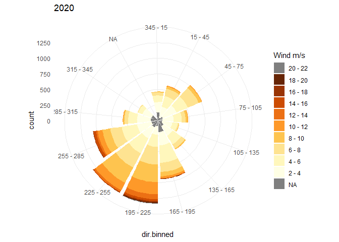
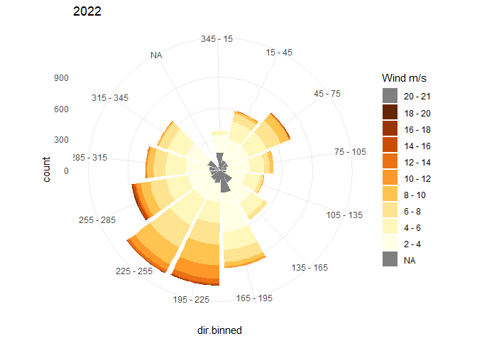
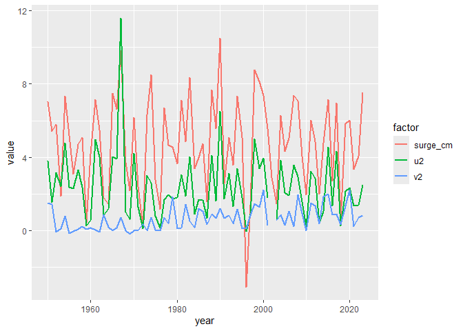

2024-09-12

# Compare GTSM with wind measurements and reanalyses

## Global Tide and Surge Model

The GTSM model results for wind surge were produced by Deltares (Muis et
al., 2016). Wind surge is extracted for the segement representative for
each one of the Dutch main tide gauge stations, and averaged per year.
This results in wind surge per year and station. Based on previous
comparisons with alternative corrections for wind, GTSM was chosen as
the preferential method (Deltares 2023).

A first glance at the GTSM wind surge results is shown below.

``` r
gtsm <- read_yearly_gtsm(filename = "../../data/deltares/gtsm/gtsm_surge_annual_mean_main_stations.csv") |>
  mutate(
    year = year(ymd(t)),
    surge_mm = surge *1000
    ) %>% 
  select(-t, -surge)

kableExtra::kable(align = "c",
    gtsm %>% arrange(-year),
    caption = "GTSM wind surge per station and year.",
    digits = 2
    ) %>%
  kableExtra::scroll_box(height = "500px") %>%
  kableExtra::kable_styling(full_width = T)
```

<div style="border: 1px solid #ddd; padding: 0px; overflow-y: scroll; height:500px; ">

<table class="table" style="color: black; margin-left: auto; margin-right: auto;">

<caption>

GTSM wind surge per station and year.
</caption>

<thead>

<tr>

<th style="text-align:center;position: sticky; top:0; background-color: #FFFFFF;">

name
</th>

<th style="text-align:center;position: sticky; top:0; background-color: #FFFFFF;">

ddl_id
</th>

<th style="text-align:center;position: sticky; top:0; background-color: #FFFFFF;">

year
</th>

<th style="text-align:center;position: sticky; top:0; background-color: #FFFFFF;">

surge_mm
</th>

</tr>

</thead>

<tbody>

<tr>

<td style="text-align:center;">

Delfzijl
</td>

<td style="text-align:center;">

DELFZL
</td>

<td style="text-align:center;">

2024
</td>

<td style="text-align:center;">

72.24
</td>

</tr>

<tr>

<td style="text-align:center;">

Den Helder
</td>

<td style="text-align:center;">

DENHDR
</td>

<td style="text-align:center;">

2024
</td>

<td style="text-align:center;">

68.44
</td>

</tr>

<tr>

<td style="text-align:center;">

Harlingen
</td>

<td style="text-align:center;">

HARLGN
</td>

<td style="text-align:center;">

2024
</td>

<td style="text-align:center;">

84.48
</td>

</tr>

<tr>

<td style="text-align:center;">

Hoek van Holland
</td>

<td style="text-align:center;">

HOEKVHLD
</td>

<td style="text-align:center;">

2024
</td>

<td style="text-align:center;">

56.19
</td>

</tr>

<tr>

<td style="text-align:center;">

IJmuiden
</td>

<td style="text-align:center;">

IJMDBTHVN
</td>

<td style="text-align:center;">

2024
</td>

<td style="text-align:center;">

66.24
</td>

</tr>

<tr>

<td style="text-align:center;">

NL
</td>

<td style="text-align:center;">

NL
</td>

<td style="text-align:center;">

2024
</td>

<td style="text-align:center;">

65.86
</td>

</tr>

<tr>

<td style="text-align:center;">

Vlissingen
</td>

<td style="text-align:center;">

VLISSGN
</td>

<td style="text-align:center;">

2024
</td>

<td style="text-align:center;">

47.55
</td>

</tr>

<tr>

<td style="text-align:center;">

Delfzijl
</td>

<td style="text-align:center;">

DELFZL
</td>

<td style="text-align:center;">

2023
</td>

<td style="text-align:center;">

83.54
</td>

</tr>

<tr>

<td style="text-align:center;">

Den Helder
</td>

<td style="text-align:center;">

DENHDR
</td>

<td style="text-align:center;">

2023
</td>

<td style="text-align:center;">

75.35
</td>

</tr>

<tr>

<td style="text-align:center;">

Harlingen
</td>

<td style="text-align:center;">

HARLGN
</td>

<td style="text-align:center;">

2023
</td>

<td style="text-align:center;">

95.24
</td>

</tr>

<tr>

<td style="text-align:center;">

Hoek van Holland
</td>

<td style="text-align:center;">

HOEKVHLD
</td>

<td style="text-align:center;">

2023
</td>

<td style="text-align:center;">

61.32
</td>

</tr>

<tr>

<td style="text-align:center;">

IJmuiden
</td>

<td style="text-align:center;">

IJMDBTHVN
</td>

<td style="text-align:center;">

2023
</td>

<td style="text-align:center;">

73.32
</td>

</tr>

<tr>

<td style="text-align:center;">

NL
</td>

<td style="text-align:center;">

NL
</td>

<td style="text-align:center;">

2023
</td>

<td style="text-align:center;">

73.40
</td>

</tr>

<tr>

<td style="text-align:center;">

Vlissingen
</td>

<td style="text-align:center;">

VLISSGN
</td>

<td style="text-align:center;">

2023
</td>

<td style="text-align:center;">

51.59
</td>

</tr>

<tr>

<td style="text-align:center;">

Delfzijl
</td>

<td style="text-align:center;">

DELFZL
</td>

<td style="text-align:center;">

2022
</td>

<td style="text-align:center;">

58.98
</td>

</tr>

<tr>

<td style="text-align:center;">

Den Helder
</td>

<td style="text-align:center;">

DENHDR
</td>

<td style="text-align:center;">

2022
</td>

<td style="text-align:center;">

40.71
</td>

</tr>

<tr>

<td style="text-align:center;">

Harlingen
</td>

<td style="text-align:center;">

HARLGN
</td>

<td style="text-align:center;">

2022
</td>

<td style="text-align:center;">

59.54
</td>

</tr>

<tr>

<td style="text-align:center;">

Hoek van Holland
</td>

<td style="text-align:center;">

HOEKVHLD
</td>

<td style="text-align:center;">

2022
</td>

<td style="text-align:center;">

25.71
</td>

</tr>

<tr>

<td style="text-align:center;">

IJmuiden
</td>

<td style="text-align:center;">

IJMDBTHVN
</td>

<td style="text-align:center;">

2022
</td>

<td style="text-align:center;">

35.80
</td>

</tr>

<tr>

<td style="text-align:center;">

NL
</td>

<td style="text-align:center;">

NL
</td>

<td style="text-align:center;">

2022
</td>

<td style="text-align:center;">

39.71
</td>

</tr>

<tr>

<td style="text-align:center;">

Vlissingen
</td>

<td style="text-align:center;">

VLISSGN
</td>

<td style="text-align:center;">

2022
</td>

<td style="text-align:center;">

17.52
</td>

</tr>

<tr>

<td style="text-align:center;">

Delfzijl
</td>

<td style="text-align:center;">

DELFZL
</td>

<td style="text-align:center;">

2021
</td>

<td style="text-align:center;">

44.27
</td>

</tr>

<tr>

<td style="text-align:center;">

Den Helder
</td>

<td style="text-align:center;">

DENHDR
</td>

<td style="text-align:center;">

2021
</td>

<td style="text-align:center;">

33.33
</td>

</tr>

<tr>

<td style="text-align:center;">

Harlingen
</td>

<td style="text-align:center;">

HARLGN
</td>

<td style="text-align:center;">

2021
</td>

<td style="text-align:center;">

48.04
</td>

</tr>

<tr>

<td style="text-align:center;">

Hoek van Holland
</td>

<td style="text-align:center;">

HOEKVHLD
</td>

<td style="text-align:center;">

2021
</td>

<td style="text-align:center;">

23.54
</td>

</tr>

<tr>

<td style="text-align:center;">

IJmuiden
</td>

<td style="text-align:center;">

IJMDBTHVN
</td>

<td style="text-align:center;">

2021
</td>

<td style="text-align:center;">

31.14
</td>

</tr>

<tr>

<td style="text-align:center;">

NL
</td>

<td style="text-align:center;">

NL
</td>

<td style="text-align:center;">

2021
</td>

<td style="text-align:center;">

32.90
</td>

</tr>

<tr>

<td style="text-align:center;">

Vlissingen
</td>

<td style="text-align:center;">

VLISSGN
</td>

<td style="text-align:center;">

2021
</td>

<td style="text-align:center;">

17.11
</td>

</tr>

<tr>

<td style="text-align:center;">

Delfzijl
</td>

<td style="text-align:center;">

DELFZL
</td>

<td style="text-align:center;">

2020
</td>

<td style="text-align:center;">

70.89
</td>

</tr>

<tr>

<td style="text-align:center;">

Den Helder
</td>

<td style="text-align:center;">

DENHDR
</td>

<td style="text-align:center;">

2020
</td>

<td style="text-align:center;">

60.04
</td>

</tr>

<tr>

<td style="text-align:center;">

Harlingen
</td>

<td style="text-align:center;">

HARLGN
</td>

<td style="text-align:center;">

2020
</td>

<td style="text-align:center;">

84.08
</td>

</tr>

<tr>

<td style="text-align:center;">

Hoek van Holland
</td>

<td style="text-align:center;">

HOEKVHLD
</td>

<td style="text-align:center;">

2020
</td>

<td style="text-align:center;">

40.37
</td>

</tr>

<tr>

<td style="text-align:center;">

IJmuiden
</td>

<td style="text-align:center;">

IJMDBTHVN
</td>

<td style="text-align:center;">

2020
</td>

<td style="text-align:center;">

54.54
</td>

</tr>

<tr>

<td style="text-align:center;">

NL
</td>

<td style="text-align:center;">

NL
</td>

<td style="text-align:center;">

2020
</td>

<td style="text-align:center;">

56.56
</td>

</tr>

<tr>

<td style="text-align:center;">

Vlissingen
</td>

<td style="text-align:center;">

VLISSGN
</td>

<td style="text-align:center;">

2020
</td>

<td style="text-align:center;">

29.43
</td>

</tr>

<tr>

<td style="text-align:center;">

Delfzijl
</td>

<td style="text-align:center;">

DELFZL
</td>

<td style="text-align:center;">

2019
</td>

<td style="text-align:center;">

68.57
</td>

</tr>

<tr>

<td style="text-align:center;">

Den Helder
</td>

<td style="text-align:center;">

DENHDR
</td>

<td style="text-align:center;">

2019
</td>

<td style="text-align:center;">

58.19
</td>

</tr>

<tr>

<td style="text-align:center;">

Harlingen
</td>

<td style="text-align:center;">

HARLGN
</td>

<td style="text-align:center;">

2019
</td>

<td style="text-align:center;">

76.74
</td>

</tr>

<tr>

<td style="text-align:center;">

Hoek van Holland
</td>

<td style="text-align:center;">

HOEKVHLD
</td>

<td style="text-align:center;">

2019
</td>

<td style="text-align:center;">

43.31
</td>

</tr>

<tr>

<td style="text-align:center;">

IJmuiden
</td>

<td style="text-align:center;">

IJMDBTHVN
</td>

<td style="text-align:center;">

2019
</td>

<td style="text-align:center;">

54.28
</td>

</tr>

<tr>

<td style="text-align:center;">

NL
</td>

<td style="text-align:center;">

NL
</td>

<td style="text-align:center;">

2019
</td>

<td style="text-align:center;">

55.92
</td>

</tr>

<tr>

<td style="text-align:center;">

Vlissingen
</td>

<td style="text-align:center;">

VLISSGN
</td>

<td style="text-align:center;">

2019
</td>

<td style="text-align:center;">

34.40
</td>

</tr>

<tr>

<td style="text-align:center;">

Delfzijl
</td>

<td style="text-align:center;">

DELFZL
</td>

<td style="text-align:center;">

2018
</td>

<td style="text-align:center;">

16.68
</td>

</tr>

<tr>

<td style="text-align:center;">

Den Helder
</td>

<td style="text-align:center;">

DENHDR
</td>

<td style="text-align:center;">

2018
</td>

<td style="text-align:center;">

6.18
</td>

</tr>

<tr>

<td style="text-align:center;">

Harlingen
</td>

<td style="text-align:center;">

HARLGN
</td>

<td style="text-align:center;">

2018
</td>

<td style="text-align:center;">

15.07
</td>

</tr>

<tr>

<td style="text-align:center;">

Hoek van Holland
</td>

<td style="text-align:center;">

HOEKVHLD
</td>

<td style="text-align:center;">

2018
</td>

<td style="text-align:center;">

1.62
</td>

</tr>

<tr>

<td style="text-align:center;">

IJmuiden
</td>

<td style="text-align:center;">

IJMDBTHVN
</td>

<td style="text-align:center;">

2018
</td>

<td style="text-align:center;">

5.25
</td>

</tr>

<tr>

<td style="text-align:center;">

NL
</td>

<td style="text-align:center;">

NL
</td>

<td style="text-align:center;">

2018
</td>

<td style="text-align:center;">

7.34
</td>

</tr>

<tr>

<td style="text-align:center;">

Vlissingen
</td>

<td style="text-align:center;">

VLISSGN
</td>

<td style="text-align:center;">

2018
</td>

<td style="text-align:center;">

-0.78
</td>

</tr>

<tr>

<td style="text-align:center;">

Delfzijl
</td>

<td style="text-align:center;">

DELFZL
</td>

<td style="text-align:center;">

2017
</td>

<td style="text-align:center;">

88.87
</td>

</tr>

<tr>

<td style="text-align:center;">

Den Helder
</td>

<td style="text-align:center;">

DENHDR
</td>

<td style="text-align:center;">

2017
</td>

<td style="text-align:center;">

69.67
</td>

</tr>

<tr>

<td style="text-align:center;">

Harlingen
</td>

<td style="text-align:center;">

HARLGN
</td>

<td style="text-align:center;">

2017
</td>

<td style="text-align:center;">

92.57
</td>

</tr>

<tr>

<td style="text-align:center;">

Hoek van Holland
</td>

<td style="text-align:center;">

HOEKVHLD
</td>

<td style="text-align:center;">

2017
</td>

<td style="text-align:center;">

52.30
</td>

</tr>

<tr>

<td style="text-align:center;">

IJmuiden
</td>

<td style="text-align:center;">

IJMDBTHVN
</td>

<td style="text-align:center;">

2017
</td>

<td style="text-align:center;">

64.54
</td>

</tr>

<tr>

<td style="text-align:center;">

NL
</td>

<td style="text-align:center;">

NL
</td>

<td style="text-align:center;">

2017
</td>

<td style="text-align:center;">

68.23
</td>

</tr>

<tr>

<td style="text-align:center;">

Vlissingen
</td>

<td style="text-align:center;">

VLISSGN
</td>

<td style="text-align:center;">

2017
</td>

<td style="text-align:center;">

41.46
</td>

</tr>

<tr>

<td style="text-align:center;">

Delfzijl
</td>

<td style="text-align:center;">

DELFZL
</td>

<td style="text-align:center;">

2016
</td>

<td style="text-align:center;">

35.10
</td>

</tr>

<tr>

<td style="text-align:center;">

Den Helder
</td>

<td style="text-align:center;">

DENHDR
</td>

<td style="text-align:center;">

2016
</td>

<td style="text-align:center;">

27.18
</td>

</tr>

<tr>

<td style="text-align:center;">

Harlingen
</td>

<td style="text-align:center;">

HARLGN
</td>

<td style="text-align:center;">

2016
</td>

<td style="text-align:center;">

42.12
</td>

</tr>

<tr>

<td style="text-align:center;">

Hoek van Holland
</td>

<td style="text-align:center;">

HOEKVHLD
</td>

<td style="text-align:center;">

2016
</td>

<td style="text-align:center;">

17.49
</td>

</tr>

<tr>

<td style="text-align:center;">

IJmuiden
</td>

<td style="text-align:center;">

IJMDBTHVN
</td>

<td style="text-align:center;">

2016
</td>

<td style="text-align:center;">

24.94
</td>

</tr>

<tr>

<td style="text-align:center;">

NL
</td>

<td style="text-align:center;">

NL
</td>

<td style="text-align:center;">

2016
</td>

<td style="text-align:center;">

26.47
</td>

</tr>

<tr>

<td style="text-align:center;">

Vlissingen
</td>

<td style="text-align:center;">

VLISSGN
</td>

<td style="text-align:center;">

2016
</td>

<td style="text-align:center;">

11.98
</td>

</tr>

<tr>

<td style="text-align:center;">

Delfzijl
</td>

<td style="text-align:center;">

DELFZL
</td>

<td style="text-align:center;">

2015
</td>

<td style="text-align:center;">

95.54
</td>

</tr>

<tr>

<td style="text-align:center;">

Den Helder
</td>

<td style="text-align:center;">

DENHDR
</td>

<td style="text-align:center;">

2015
</td>

<td style="text-align:center;">

71.62
</td>

</tr>

<tr>

<td style="text-align:center;">

Harlingen
</td>

<td style="text-align:center;">

HARLGN
</td>

<td style="text-align:center;">

2015
</td>

<td style="text-align:center;">

102.84
</td>

</tr>

<tr>

<td style="text-align:center;">

Hoek van Holland
</td>

<td style="text-align:center;">

HOEKVHLD
</td>

<td style="text-align:center;">

2015
</td>

<td style="text-align:center;">

46.32
</td>

</tr>

<tr>

<td style="text-align:center;">

IJmuiden
</td>

<td style="text-align:center;">

IJMDBTHVN
</td>

<td style="text-align:center;">

2015
</td>

<td style="text-align:center;">

63.04
</td>

</tr>

<tr>

<td style="text-align:center;">

NL
</td>

<td style="text-align:center;">

NL
</td>

<td style="text-align:center;">

2015
</td>

<td style="text-align:center;">

68.71
</td>

</tr>

<tr>

<td style="text-align:center;">

Vlissingen
</td>

<td style="text-align:center;">

VLISSGN
</td>

<td style="text-align:center;">

2015
</td>

<td style="text-align:center;">

32.89
</td>

</tr>

<tr>

<td style="text-align:center;">

Delfzijl
</td>

<td style="text-align:center;">

DELFZL
</td>

<td style="text-align:center;">

2014
</td>

<td style="text-align:center;">

51.52
</td>

</tr>

<tr>

<td style="text-align:center;">

Den Helder
</td>

<td style="text-align:center;">

DENHDR
</td>

<td style="text-align:center;">

2014
</td>

<td style="text-align:center;">

47.94
</td>

</tr>

<tr>

<td style="text-align:center;">

Harlingen
</td>

<td style="text-align:center;">

HARLGN
</td>

<td style="text-align:center;">

2014
</td>

<td style="text-align:center;">

63.91
</td>

</tr>

<tr>

<td style="text-align:center;">

Hoek van Holland
</td>

<td style="text-align:center;">

HOEKVHLD
</td>

<td style="text-align:center;">

2014
</td>

<td style="text-align:center;">

34.41
</td>

</tr>

<tr>

<td style="text-align:center;">

IJmuiden
</td>

<td style="text-align:center;">

IJMDBTHVN
</td>

<td style="text-align:center;">

2014
</td>

<td style="text-align:center;">

44.32
</td>

</tr>

<tr>

<td style="text-align:center;">

NL
</td>

<td style="text-align:center;">

NL
</td>

<td style="text-align:center;">

2014
</td>

<td style="text-align:center;">

44.82
</td>

</tr>

<tr>

<td style="text-align:center;">

Vlissingen
</td>

<td style="text-align:center;">

VLISSGN
</td>

<td style="text-align:center;">

2014
</td>

<td style="text-align:center;">

26.84
</td>

</tr>

<tr>

<td style="text-align:center;">

Delfzijl
</td>

<td style="text-align:center;">

DELFZL
</td>

<td style="text-align:center;">

2013
</td>

<td style="text-align:center;">

30.81
</td>

</tr>

<tr>

<td style="text-align:center;">

Den Helder
</td>

<td style="text-align:center;">

DENHDR
</td>

<td style="text-align:center;">

2013
</td>

<td style="text-align:center;">

20.06
</td>

</tr>

<tr>

<td style="text-align:center;">

Harlingen
</td>

<td style="text-align:center;">

HARLGN
</td>

<td style="text-align:center;">

2013
</td>

<td style="text-align:center;">

30.80
</td>

</tr>

<tr>

<td style="text-align:center;">

Hoek van Holland
</td>

<td style="text-align:center;">

HOEKVHLD
</td>

<td style="text-align:center;">

2013
</td>

<td style="text-align:center;">

14.68
</td>

</tr>

<tr>

<td style="text-align:center;">

IJmuiden
</td>

<td style="text-align:center;">

IJMDBTHVN
</td>

<td style="text-align:center;">

2013
</td>

<td style="text-align:center;">

19.05
</td>

</tr>

<tr>

<td style="text-align:center;">

NL
</td>

<td style="text-align:center;">

NL
</td>

<td style="text-align:center;">

2013
</td>

<td style="text-align:center;">

21.19
</td>

</tr>

<tr>

<td style="text-align:center;">

Vlissingen
</td>

<td style="text-align:center;">

VLISSGN
</td>

<td style="text-align:center;">

2013
</td>

<td style="text-align:center;">

11.76
</td>

</tr>

<tr>

<td style="text-align:center;">

Delfzijl
</td>

<td style="text-align:center;">

DELFZL
</td>

<td style="text-align:center;">

2012
</td>

<td style="text-align:center;">

61.03
</td>

</tr>

<tr>

<td style="text-align:center;">

Den Helder
</td>

<td style="text-align:center;">

DENHDR
</td>

<td style="text-align:center;">

2012
</td>

<td style="text-align:center;">

48.67
</td>

</tr>

<tr>

<td style="text-align:center;">

Harlingen
</td>

<td style="text-align:center;">

HARLGN
</td>

<td style="text-align:center;">

2012
</td>

<td style="text-align:center;">

67.88
</td>

</tr>

<tr>

<td style="text-align:center;">

Hoek van Holland
</td>

<td style="text-align:center;">

HOEKVHLD
</td>

<td style="text-align:center;">

2012
</td>

<td style="text-align:center;">

35.12
</td>

</tr>

<tr>

<td style="text-align:center;">

IJmuiden
</td>

<td style="text-align:center;">

IJMDBTHVN
</td>

<td style="text-align:center;">

2012
</td>

<td style="text-align:center;">

45.12
</td>

</tr>

<tr>

<td style="text-align:center;">

NL
</td>

<td style="text-align:center;">

NL
</td>

<td style="text-align:center;">

2012
</td>

<td style="text-align:center;">

47.50
</td>

</tr>

<tr>

<td style="text-align:center;">

Vlissingen
</td>

<td style="text-align:center;">

VLISSGN
</td>

<td style="text-align:center;">

2012
</td>

<td style="text-align:center;">

27.16
</td>

</tr>

<tr>

<td style="text-align:center;">

Delfzijl
</td>

<td style="text-align:center;">

DELFZL
</td>

<td style="text-align:center;">

2011
</td>

<td style="text-align:center;">

76.53
</td>

</tr>

<tr>

<td style="text-align:center;">

Den Helder
</td>

<td style="text-align:center;">

DENHDR
</td>

<td style="text-align:center;">

2011
</td>

<td style="text-align:center;">

60.25
</td>

</tr>

<tr>

<td style="text-align:center;">

Harlingen
</td>

<td style="text-align:center;">

HARLGN
</td>

<td style="text-align:center;">

2011
</td>

<td style="text-align:center;">

85.01
</td>

</tr>

<tr>

<td style="text-align:center;">

Hoek van Holland
</td>

<td style="text-align:center;">

HOEKVHLD
</td>

<td style="text-align:center;">

2011
</td>

<td style="text-align:center;">

41.03
</td>

</tr>

<tr>

<td style="text-align:center;">

IJmuiden
</td>

<td style="text-align:center;">

IJMDBTHVN
</td>

<td style="text-align:center;">

2011
</td>

<td style="text-align:center;">

53.94
</td>

</tr>

<tr>

<td style="text-align:center;">

NL
</td>

<td style="text-align:center;">

NL
</td>

<td style="text-align:center;">

2011
</td>

<td style="text-align:center;">

57.84
</td>

</tr>

<tr>

<td style="text-align:center;">

Vlissingen
</td>

<td style="text-align:center;">

VLISSGN
</td>

<td style="text-align:center;">

2011
</td>

<td style="text-align:center;">

30.29
</td>

</tr>

<tr>

<td style="text-align:center;">

Delfzijl
</td>

<td style="text-align:center;">

DELFZL
</td>

<td style="text-align:center;">

2010
</td>

<td style="text-align:center;">

25.11
</td>

</tr>

<tr>

<td style="text-align:center;">

Den Helder
</td>

<td style="text-align:center;">

DENHDR
</td>

<td style="text-align:center;">

2010
</td>

<td style="text-align:center;">

19.45
</td>

</tr>

<tr>

<td style="text-align:center;">

Harlingen
</td>

<td style="text-align:center;">

HARLGN
</td>

<td style="text-align:center;">

2010
</td>

<td style="text-align:center;">

22.61
</td>

</tr>

<tr>

<td style="text-align:center;">

Hoek van Holland
</td>

<td style="text-align:center;">

HOEKVHLD
</td>

<td style="text-align:center;">

2010
</td>

<td style="text-align:center;">

23.09
</td>

</tr>

<tr>

<td style="text-align:center;">

IJmuiden
</td>

<td style="text-align:center;">

IJMDBTHVN
</td>

<td style="text-align:center;">

2010
</td>

<td style="text-align:center;">

22.67
</td>

</tr>

<tr>

<td style="text-align:center;">

NL
</td>

<td style="text-align:center;">

NL
</td>

<td style="text-align:center;">

2010
</td>

<td style="text-align:center;">

22.74
</td>

</tr>

<tr>

<td style="text-align:center;">

Vlissingen
</td>

<td style="text-align:center;">

VLISSGN
</td>

<td style="text-align:center;">

2010
</td>

<td style="text-align:center;">

23.54
</td>

</tr>

<tr>

<td style="text-align:center;">

Delfzijl
</td>

<td style="text-align:center;">

DELFZL
</td>

<td style="text-align:center;">

2009
</td>

<td style="text-align:center;">

46.94
</td>

</tr>

<tr>

<td style="text-align:center;">

Den Helder
</td>

<td style="text-align:center;">

DENHDR
</td>

<td style="text-align:center;">

2009
</td>

<td style="text-align:center;">

40.55
</td>

</tr>

<tr>

<td style="text-align:center;">

Harlingen
</td>

<td style="text-align:center;">

HARLGN
</td>

<td style="text-align:center;">

2009
</td>

<td style="text-align:center;">

54.84
</td>

</tr>

<tr>

<td style="text-align:center;">

Hoek van Holland
</td>

<td style="text-align:center;">

HOEKVHLD
</td>

<td style="text-align:center;">

2009
</td>

<td style="text-align:center;">

31.24
</td>

</tr>

<tr>

<td style="text-align:center;">

IJmuiden
</td>

<td style="text-align:center;">

IJMDBTHVN
</td>

<td style="text-align:center;">

2009
</td>

<td style="text-align:center;">

38.69
</td>

</tr>

<tr>

<td style="text-align:center;">

NL
</td>

<td style="text-align:center;">

NL
</td>

<td style="text-align:center;">

2009
</td>

<td style="text-align:center;">

39.60
</td>

</tr>

<tr>

<td style="text-align:center;">

Vlissingen
</td>

<td style="text-align:center;">

VLISSGN
</td>

<td style="text-align:center;">

2009
</td>

<td style="text-align:center;">

25.34
</td>

</tr>

<tr>

<td style="text-align:center;">

Delfzijl
</td>

<td style="text-align:center;">

DELFZL
</td>

<td style="text-align:center;">

2008
</td>

<td style="text-align:center;">

82.77
</td>

</tr>

<tr>

<td style="text-align:center;">

Den Helder
</td>

<td style="text-align:center;">

DENHDR
</td>

<td style="text-align:center;">

2008
</td>

<td style="text-align:center;">

70.61
</td>

</tr>

<tr>

<td style="text-align:center;">

Harlingen
</td>

<td style="text-align:center;">

HARLGN
</td>

<td style="text-align:center;">

2008
</td>

<td style="text-align:center;">

93.05
</td>

</tr>

<tr>

<td style="text-align:center;">

Hoek van Holland
</td>

<td style="text-align:center;">

HOEKVHLD
</td>

<td style="text-align:center;">

2008
</td>

<td style="text-align:center;">

51.79
</td>

</tr>

<tr>

<td style="text-align:center;">

IJmuiden
</td>

<td style="text-align:center;">

IJMDBTHVN
</td>

<td style="text-align:center;">

2008
</td>

<td style="text-align:center;">

65.02
</td>

</tr>

<tr>

<td style="text-align:center;">

NL
</td>

<td style="text-align:center;">

NL
</td>

<td style="text-align:center;">

2008
</td>

<td style="text-align:center;">

67.34
</td>

</tr>

<tr>

<td style="text-align:center;">

Vlissingen
</td>

<td style="text-align:center;">

VLISSGN
</td>

<td style="text-align:center;">

2008
</td>

<td style="text-align:center;">

40.81
</td>

</tr>

<tr>

<td style="text-align:center;">

Delfzijl
</td>

<td style="text-align:center;">

DELFZL
</td>

<td style="text-align:center;">

2007
</td>

<td style="text-align:center;">

95.57
</td>

</tr>

<tr>

<td style="text-align:center;">

Den Helder
</td>

<td style="text-align:center;">

DENHDR
</td>

<td style="text-align:center;">

2007
</td>

<td style="text-align:center;">

73.66
</td>

</tr>

<tr>

<td style="text-align:center;">

Harlingen
</td>

<td style="text-align:center;">

HARLGN
</td>

<td style="text-align:center;">

2007
</td>

<td style="text-align:center;">

96.15
</td>

</tr>

<tr>

<td style="text-align:center;">

Hoek van Holland
</td>

<td style="text-align:center;">

HOEKVHLD
</td>

<td style="text-align:center;">

2007
</td>

<td style="text-align:center;">

60.76
</td>

</tr>

<tr>

<td style="text-align:center;">

IJmuiden
</td>

<td style="text-align:center;">

IJMDBTHVN
</td>

<td style="text-align:center;">

2007
</td>

<td style="text-align:center;">

70.79
</td>

</tr>

<tr>

<td style="text-align:center;">

NL
</td>

<td style="text-align:center;">

NL
</td>

<td style="text-align:center;">

2007
</td>

<td style="text-align:center;">

74.89
</td>

</tr>

<tr>

<td style="text-align:center;">

Vlissingen
</td>

<td style="text-align:center;">

VLISSGN
</td>

<td style="text-align:center;">

2007
</td>

<td style="text-align:center;">

52.40
</td>

</tr>

<tr>

<td style="text-align:center;">

Delfzijl
</td>

<td style="text-align:center;">

DELFZL
</td>

<td style="text-align:center;">

2006
</td>

<td style="text-align:center;">

62.17
</td>

</tr>

<tr>

<td style="text-align:center;">

Den Helder
</td>

<td style="text-align:center;">

DENHDR
</td>

<td style="text-align:center;">

2006
</td>

<td style="text-align:center;">

50.42
</td>

</tr>

<tr>

<td style="text-align:center;">

Harlingen
</td>

<td style="text-align:center;">

HARLGN
</td>

<td style="text-align:center;">

2006
</td>

<td style="text-align:center;">

70.16
</td>

</tr>

<tr>

<td style="text-align:center;">

Hoek van Holland
</td>

<td style="text-align:center;">

HOEKVHLD
</td>

<td style="text-align:center;">

2006
</td>

<td style="text-align:center;">

35.62
</td>

</tr>

<tr>

<td style="text-align:center;">

IJmuiden
</td>

<td style="text-align:center;">

IJMDBTHVN
</td>

<td style="text-align:center;">

2006
</td>

<td style="text-align:center;">

46.04
</td>

</tr>

<tr>

<td style="text-align:center;">

NL
</td>

<td style="text-align:center;">

NL
</td>

<td style="text-align:center;">

2006
</td>

<td style="text-align:center;">

48.57
</td>

</tr>

<tr>

<td style="text-align:center;">

Vlissingen
</td>

<td style="text-align:center;">

VLISSGN
</td>

<td style="text-align:center;">

2006
</td>

<td style="text-align:center;">

26.97
</td>

</tr>

<tr>

<td style="text-align:center;">

Delfzijl
</td>

<td style="text-align:center;">

DELFZL
</td>

<td style="text-align:center;">

2005
</td>

<td style="text-align:center;">

57.58
</td>

</tr>

<tr>

<td style="text-align:center;">

Den Helder
</td>

<td style="text-align:center;">

DENHDR
</td>

<td style="text-align:center;">

2005
</td>

<td style="text-align:center;">

43.12
</td>

</tr>

<tr>

<td style="text-align:center;">

Harlingen
</td>

<td style="text-align:center;">

HARLGN
</td>

<td style="text-align:center;">

2005
</td>

<td style="text-align:center;">

59.13
</td>

</tr>

<tr>

<td style="text-align:center;">

Hoek van Holland
</td>

<td style="text-align:center;">

HOEKVHLD
</td>

<td style="text-align:center;">

2005
</td>

<td style="text-align:center;">

34.05
</td>

</tr>

<tr>

<td style="text-align:center;">

IJmuiden
</td>

<td style="text-align:center;">

IJMDBTHVN
</td>

<td style="text-align:center;">

2005
</td>

<td style="text-align:center;">

41.21
</td>

</tr>

<tr>

<td style="text-align:center;">

NL
</td>

<td style="text-align:center;">

NL
</td>

<td style="text-align:center;">

2005
</td>

<td style="text-align:center;">

43.77
</td>

</tr>

<tr>

<td style="text-align:center;">

Vlissingen
</td>

<td style="text-align:center;">

VLISSGN
</td>

<td style="text-align:center;">

2005
</td>

<td style="text-align:center;">

27.55
</td>

</tr>

<tr>

<td style="text-align:center;">

Delfzijl
</td>

<td style="text-align:center;">

DELFZL
</td>

<td style="text-align:center;">

2004
</td>

<td style="text-align:center;">

75.02
</td>

</tr>

<tr>

<td style="text-align:center;">

Den Helder
</td>

<td style="text-align:center;">

DENHDR
</td>

<td style="text-align:center;">

2004
</td>

<td style="text-align:center;">

62.73
</td>

</tr>

<tr>

<td style="text-align:center;">

Harlingen
</td>

<td style="text-align:center;">

HARLGN
</td>

<td style="text-align:center;">

2004
</td>

<td style="text-align:center;">

84.57
</td>

</tr>

<tr>

<td style="text-align:center;">

Hoek van Holland
</td>

<td style="text-align:center;">

HOEKVHLD
</td>

<td style="text-align:center;">

2004
</td>

<td style="text-align:center;">

47.22
</td>

</tr>

<tr>

<td style="text-align:center;">

IJmuiden
</td>

<td style="text-align:center;">

IJMDBTHVN
</td>

<td style="text-align:center;">

2004
</td>

<td style="text-align:center;">

58.91
</td>

</tr>

<tr>

<td style="text-align:center;">

NL
</td>

<td style="text-align:center;">

NL
</td>

<td style="text-align:center;">

2004
</td>

<td style="text-align:center;">

60.93
</td>

</tr>

<tr>

<td style="text-align:center;">

Vlissingen
</td>

<td style="text-align:center;">

VLISSGN
</td>

<td style="text-align:center;">

2004
</td>

<td style="text-align:center;">

37.13
</td>

</tr>

<tr>

<td style="text-align:center;">

Delfzijl
</td>

<td style="text-align:center;">

DELFZL
</td>

<td style="text-align:center;">

2003
</td>

<td style="text-align:center;">

32.99
</td>

</tr>

<tr>

<td style="text-align:center;">

Den Helder
</td>

<td style="text-align:center;">

DENHDR
</td>

<td style="text-align:center;">

2003
</td>

<td style="text-align:center;">

14.69
</td>

</tr>

<tr>

<td style="text-align:center;">

Harlingen
</td>

<td style="text-align:center;">

HARLGN
</td>

<td style="text-align:center;">

2003
</td>

<td style="text-align:center;">

28.68
</td>

</tr>

<tr>

<td style="text-align:center;">

Hoek van Holland
</td>

<td style="text-align:center;">

HOEKVHLD
</td>

<td style="text-align:center;">

2003
</td>

<td style="text-align:center;">

6.68
</td>

</tr>

<tr>

<td style="text-align:center;">

IJmuiden
</td>

<td style="text-align:center;">

IJMDBTHVN
</td>

<td style="text-align:center;">

2003
</td>

<td style="text-align:center;">

11.95
</td>

</tr>

<tr>

<td style="text-align:center;">

NL
</td>

<td style="text-align:center;">

NL
</td>

<td style="text-align:center;">

2003
</td>

<td style="text-align:center;">

16.25
</td>

</tr>

<tr>

<td style="text-align:center;">

Vlissingen
</td>

<td style="text-align:center;">

VLISSGN
</td>

<td style="text-align:center;">

2003
</td>

<td style="text-align:center;">

2.52
</td>

</tr>

<tr>

<td style="text-align:center;">

Delfzijl
</td>

<td style="text-align:center;">

DELFZL
</td>

<td style="text-align:center;">

2002
</td>

<td style="text-align:center;">

35.37
</td>

</tr>

<tr>

<td style="text-align:center;">

Den Helder
</td>

<td style="text-align:center;">

DENHDR
</td>

<td style="text-align:center;">

2002
</td>

<td style="text-align:center;">

28.88
</td>

</tr>

<tr>

<td style="text-align:center;">

Harlingen
</td>

<td style="text-align:center;">

HARLGN
</td>

<td style="text-align:center;">

2002
</td>

<td style="text-align:center;">

43.86
</td>

</tr>

<tr>

<td style="text-align:center;">

Hoek van Holland
</td>

<td style="text-align:center;">

HOEKVHLD
</td>

<td style="text-align:center;">

2002
</td>

<td style="text-align:center;">

20.66
</td>

</tr>

<tr>

<td style="text-align:center;">

IJmuiden
</td>

<td style="text-align:center;">

IJMDBTHVN
</td>

<td style="text-align:center;">

2002
</td>

<td style="text-align:center;">

27.93
</td>

</tr>

<tr>

<td style="text-align:center;">

NL
</td>

<td style="text-align:center;">

NL
</td>

<td style="text-align:center;">

2002
</td>

<td style="text-align:center;">

28.81
</td>

</tr>

<tr>

<td style="text-align:center;">

Vlissingen
</td>

<td style="text-align:center;">

VLISSGN
</td>

<td style="text-align:center;">

2002
</td>

<td style="text-align:center;">

16.13
</td>

</tr>

<tr>

<td style="text-align:center;">

Delfzijl
</td>

<td style="text-align:center;">

DELFZL
</td>

<td style="text-align:center;">

2001
</td>

<td style="text-align:center;">

62.21
</td>

</tr>

<tr>

<td style="text-align:center;">

Den Helder
</td>

<td style="text-align:center;">

DENHDR
</td>

<td style="text-align:center;">

2001
</td>

<td style="text-align:center;">

55.72
</td>

</tr>

<tr>

<td style="text-align:center;">

Harlingen
</td>

<td style="text-align:center;">

HARLGN
</td>

<td style="text-align:center;">

2001
</td>

<td style="text-align:center;">

69.73
</td>

</tr>

<tr>

<td style="text-align:center;">

Hoek van Holland
</td>

<td style="text-align:center;">

HOEKVHLD
</td>

<td style="text-align:center;">

2001
</td>

<td style="text-align:center;">

48.71
</td>

</tr>

<tr>

<td style="text-align:center;">

IJmuiden
</td>

<td style="text-align:center;">

IJMDBTHVN
</td>

<td style="text-align:center;">

2001
</td>

<td style="text-align:center;">

55.75
</td>

</tr>

<tr>

<td style="text-align:center;">

NL
</td>

<td style="text-align:center;">

NL
</td>

<td style="text-align:center;">

2001
</td>

<td style="text-align:center;">

55.71
</td>

</tr>

<tr>

<td style="text-align:center;">

Vlissingen
</td>

<td style="text-align:center;">

VLISSGN
</td>

<td style="text-align:center;">

2001
</td>

<td style="text-align:center;">

42.12
</td>

</tr>

<tr>

<td style="text-align:center;">

Delfzijl
</td>

<td style="text-align:center;">

DELFZL
</td>

<td style="text-align:center;">

2000
</td>

<td style="text-align:center;">

79.47
</td>

</tr>

<tr>

<td style="text-align:center;">

Den Helder
</td>

<td style="text-align:center;">

DENHDR
</td>

<td style="text-align:center;">

2000
</td>

<td style="text-align:center;">

73.63
</td>

</tr>

<tr>

<td style="text-align:center;">

Harlingen
</td>

<td style="text-align:center;">

HARLGN
</td>

<td style="text-align:center;">

2000
</td>

<td style="text-align:center;">

96.22
</td>

</tr>

<tr>

<td style="text-align:center;">

Hoek van Holland
</td>

<td style="text-align:center;">

HOEKVHLD
</td>

<td style="text-align:center;">

2000
</td>

<td style="text-align:center;">

54.44
</td>

</tr>

<tr>

<td style="text-align:center;">

IJmuiden
</td>

<td style="text-align:center;">

IJMDBTHVN
</td>

<td style="text-align:center;">

2000
</td>

<td style="text-align:center;">

68.52
</td>

</tr>

<tr>

<td style="text-align:center;">

NL
</td>

<td style="text-align:center;">

NL
</td>

<td style="text-align:center;">

2000
</td>

<td style="text-align:center;">

69.19
</td>

</tr>

<tr>

<td style="text-align:center;">

Vlissingen
</td>

<td style="text-align:center;">

VLISSGN
</td>

<td style="text-align:center;">

2000
</td>

<td style="text-align:center;">

42.86
</td>

</tr>

<tr>

<td style="text-align:center;">

Delfzijl
</td>

<td style="text-align:center;">

DELFZL
</td>

<td style="text-align:center;">

1999
</td>

<td style="text-align:center;">

90.46
</td>

</tr>

<tr>

<td style="text-align:center;">

Den Helder
</td>

<td style="text-align:center;">

DENHDR
</td>

<td style="text-align:center;">

1999
</td>

<td style="text-align:center;">

81.21
</td>

</tr>

<tr>

<td style="text-align:center;">

Harlingen
</td>

<td style="text-align:center;">

HARLGN
</td>

<td style="text-align:center;">

1999
</td>

<td style="text-align:center;">

103.76
</td>

</tr>

<tr>

<td style="text-align:center;">

Hoek van Holland
</td>

<td style="text-align:center;">

HOEKVHLD
</td>

<td style="text-align:center;">

1999
</td>

<td style="text-align:center;">

64.17
</td>

</tr>

<tr>

<td style="text-align:center;">

IJmuiden
</td>

<td style="text-align:center;">

IJMDBTHVN
</td>

<td style="text-align:center;">

1999
</td>

<td style="text-align:center;">

76.94
</td>

</tr>

<tr>

<td style="text-align:center;">

NL
</td>

<td style="text-align:center;">

NL
</td>

<td style="text-align:center;">

1999
</td>

<td style="text-align:center;">

78.24
</td>

</tr>

<tr>

<td style="text-align:center;">

Vlissingen
</td>

<td style="text-align:center;">

VLISSGN
</td>

<td style="text-align:center;">

1999
</td>

<td style="text-align:center;">

52.90
</td>

</tr>

<tr>

<td style="text-align:center;">

Delfzijl
</td>

<td style="text-align:center;">

DELFZL
</td>

<td style="text-align:center;">

1998
</td>

<td style="text-align:center;">

95.36
</td>

</tr>

<tr>

<td style="text-align:center;">

Den Helder
</td>

<td style="text-align:center;">

DENHDR
</td>

<td style="text-align:center;">

1998
</td>

<td style="text-align:center;">

87.78
</td>

</tr>

<tr>

<td style="text-align:center;">

Harlingen
</td>

<td style="text-align:center;">

HARLGN
</td>

<td style="text-align:center;">

1998
</td>

<td style="text-align:center;">

112.41
</td>

</tr>

<tr>

<td style="text-align:center;">

Hoek van Holland
</td>

<td style="text-align:center;">

HOEKVHLD
</td>

<td style="text-align:center;">

1998
</td>

<td style="text-align:center;">

69.74
</td>

</tr>

<tr>

<td style="text-align:center;">

IJmuiden
</td>

<td style="text-align:center;">

IJMDBTHVN
</td>

<td style="text-align:center;">

1998
</td>

<td style="text-align:center;">

84.06
</td>

</tr>

<tr>

<td style="text-align:center;">

NL
</td>

<td style="text-align:center;">

NL
</td>

<td style="text-align:center;">

1998
</td>

<td style="text-align:center;">

84.44
</td>

</tr>

<tr>

<td style="text-align:center;">

Vlissingen
</td>

<td style="text-align:center;">

VLISSGN
</td>

<td style="text-align:center;">

1998
</td>

<td style="text-align:center;">

57.28
</td>

</tr>

<tr>

<td style="text-align:center;">

Delfzijl
</td>

<td style="text-align:center;">

DELFZL
</td>

<td style="text-align:center;">

1997
</td>

<td style="text-align:center;">

31.87
</td>

</tr>

<tr>

<td style="text-align:center;">

Den Helder
</td>

<td style="text-align:center;">

DENHDR
</td>

<td style="text-align:center;">

1997
</td>

<td style="text-align:center;">

14.08
</td>

</tr>

<tr>

<td style="text-align:center;">

Harlingen
</td>

<td style="text-align:center;">

HARLGN
</td>

<td style="text-align:center;">

1997
</td>

<td style="text-align:center;">

29.66
</td>

</tr>

<tr>

<td style="text-align:center;">

Hoek van Holland
</td>

<td style="text-align:center;">

HOEKVHLD
</td>

<td style="text-align:center;">

1997
</td>

<td style="text-align:center;">

3.97
</td>

</tr>

<tr>

<td style="text-align:center;">

IJmuiden
</td>

<td style="text-align:center;">

IJMDBTHVN
</td>

<td style="text-align:center;">

1997
</td>

<td style="text-align:center;">

10.86
</td>

</tr>

<tr>

<td style="text-align:center;">

NL
</td>

<td style="text-align:center;">

NL
</td>

<td style="text-align:center;">

1997
</td>

<td style="text-align:center;">

14.88
</td>

</tr>

<tr>

<td style="text-align:center;">

Vlissingen
</td>

<td style="text-align:center;">

VLISSGN
</td>

<td style="text-align:center;">

1997
</td>

<td style="text-align:center;">

-1.20
</td>

</tr>

<tr>

<td style="text-align:center;">

Delfzijl
</td>

<td style="text-align:center;">

DELFZL
</td>

<td style="text-align:center;">

1996
</td>

<td style="text-align:center;">

-22.19
</td>

</tr>

<tr>

<td style="text-align:center;">

Den Helder
</td>

<td style="text-align:center;">

DENHDR
</td>

<td style="text-align:center;">

1996
</td>

<td style="text-align:center;">

-30.66
</td>

</tr>

<tr>

<td style="text-align:center;">

Harlingen
</td>

<td style="text-align:center;">

HARLGN
</td>

<td style="text-align:center;">

1996
</td>

<td style="text-align:center;">

-29.37
</td>

</tr>

<tr>

<td style="text-align:center;">

Hoek van Holland
</td>

<td style="text-align:center;">

HOEKVHLD
</td>

<td style="text-align:center;">

1996
</td>

<td style="text-align:center;">

-23.81
</td>

</tr>

<tr>

<td style="text-align:center;">

IJmuiden
</td>

<td style="text-align:center;">

IJMDBTHVN
</td>

<td style="text-align:center;">

1996
</td>

<td style="text-align:center;">

-26.63
</td>

</tr>

<tr>

<td style="text-align:center;">

NL
</td>

<td style="text-align:center;">

NL
</td>

<td style="text-align:center;">

1996
</td>

<td style="text-align:center;">

-25.39
</td>

</tr>

<tr>

<td style="text-align:center;">

Vlissingen
</td>

<td style="text-align:center;">

VLISSGN
</td>

<td style="text-align:center;">

1996
</td>

<td style="text-align:center;">

-19.71
</td>

</tr>

<tr>

<td style="text-align:center;">

Delfzijl
</td>

<td style="text-align:center;">

DELFZL
</td>

<td style="text-align:center;">

1995
</td>

<td style="text-align:center;">

68.25
</td>

</tr>

<tr>

<td style="text-align:center;">

Den Helder
</td>

<td style="text-align:center;">

DENHDR
</td>

<td style="text-align:center;">

1995
</td>

<td style="text-align:center;">

50.86
</td>

</tr>

<tr>

<td style="text-align:center;">

Harlingen
</td>

<td style="text-align:center;">

HARLGN
</td>

<td style="text-align:center;">

1995
</td>

<td style="text-align:center;">

68.27
</td>

</tr>

<tr>

<td style="text-align:center;">

Hoek van Holland
</td>

<td style="text-align:center;">

HOEKVHLD
</td>

<td style="text-align:center;">

1995
</td>

<td style="text-align:center;">

42.01
</td>

</tr>

<tr>

<td style="text-align:center;">

IJmuiden
</td>

<td style="text-align:center;">

IJMDBTHVN
</td>

<td style="text-align:center;">

1995
</td>

<td style="text-align:center;">

49.13
</td>

</tr>

<tr>

<td style="text-align:center;">

NL
</td>

<td style="text-align:center;">

NL
</td>

<td style="text-align:center;">

1995
</td>

<td style="text-align:center;">

52.42
</td>

</tr>

<tr>

<td style="text-align:center;">

Vlissingen
</td>

<td style="text-align:center;">

VLISSGN
</td>

<td style="text-align:center;">

1995
</td>

<td style="text-align:center;">

35.98
</td>

</tr>

<tr>

<td style="text-align:center;">

Delfzijl
</td>

<td style="text-align:center;">

DELFZL
</td>

<td style="text-align:center;">

1994
</td>

<td style="text-align:center;">

84.22
</td>

</tr>

<tr>

<td style="text-align:center;">

Den Helder
</td>

<td style="text-align:center;">

DENHDR
</td>

<td style="text-align:center;">

1994
</td>

<td style="text-align:center;">

73.29
</td>

</tr>

<tr>

<td style="text-align:center;">

Harlingen
</td>

<td style="text-align:center;">

HARLGN
</td>

<td style="text-align:center;">

1994
</td>

<td style="text-align:center;">

96.11
</td>

</tr>

<tr>

<td style="text-align:center;">

Hoek van Holland
</td>

<td style="text-align:center;">

HOEKVHLD
</td>

<td style="text-align:center;">

1994
</td>

<td style="text-align:center;">

57.53
</td>

</tr>

<tr>

<td style="text-align:center;">

IJmuiden
</td>

<td style="text-align:center;">

IJMDBTHVN
</td>

<td style="text-align:center;">

1994
</td>

<td style="text-align:center;">

70.02
</td>

</tr>

<tr>

<td style="text-align:center;">

NL
</td>

<td style="text-align:center;">

NL
</td>

<td style="text-align:center;">

1994
</td>

<td style="text-align:center;">

71.43
</td>

</tr>

<tr>

<td style="text-align:center;">

Vlissingen
</td>

<td style="text-align:center;">

VLISSGN
</td>

<td style="text-align:center;">

1994
</td>

<td style="text-align:center;">

47.38
</td>

</tr>

<tr>

<td style="text-align:center;">

Delfzijl
</td>

<td style="text-align:center;">

DELFZL
</td>

<td style="text-align:center;">

1993
</td>

<td style="text-align:center;">

51.53
</td>

</tr>

<tr>

<td style="text-align:center;">

Den Helder
</td>

<td style="text-align:center;">

DENHDR
</td>

<td style="text-align:center;">

1993
</td>

<td style="text-align:center;">

35.61
</td>

</tr>

<tr>

<td style="text-align:center;">

Harlingen
</td>

<td style="text-align:center;">

HARLGN
</td>

<td style="text-align:center;">

1993
</td>

<td style="text-align:center;">

52.77
</td>

</tr>

<tr>

<td style="text-align:center;">

Hoek van Holland
</td>

<td style="text-align:center;">

HOEKVHLD
</td>

<td style="text-align:center;">

1993
</td>

<td style="text-align:center;">

27.66
</td>

</tr>

<tr>

<td style="text-align:center;">

IJmuiden
</td>

<td style="text-align:center;">

IJMDBTHVN
</td>

<td style="text-align:center;">

1993
</td>

<td style="text-align:center;">

34.87
</td>

</tr>

<tr>

<td style="text-align:center;">

NL
</td>

<td style="text-align:center;">

NL
</td>

<td style="text-align:center;">

1993
</td>

<td style="text-align:center;">

37.49
</td>

</tr>

<tr>

<td style="text-align:center;">

Vlissingen
</td>

<td style="text-align:center;">

VLISSGN
</td>

<td style="text-align:center;">

1993
</td>

<td style="text-align:center;">

22.50
</td>

</tr>

<tr>

<td style="text-align:center;">

Delfzijl
</td>

<td style="text-align:center;">

DELFZL
</td>

<td style="text-align:center;">

1992
</td>

<td style="text-align:center;">

65.04
</td>

</tr>

<tr>

<td style="text-align:center;">

Den Helder
</td>

<td style="text-align:center;">

DENHDR
</td>

<td style="text-align:center;">

1992
</td>

<td style="text-align:center;">

50.96
</td>

</tr>

<tr>

<td style="text-align:center;">

Harlingen
</td>

<td style="text-align:center;">

HARLGN
</td>

<td style="text-align:center;">

1992
</td>

<td style="text-align:center;">

72.28
</td>

</tr>

<tr>

<td style="text-align:center;">

Hoek van Holland
</td>

<td style="text-align:center;">

HOEKVHLD
</td>

<td style="text-align:center;">

1992
</td>

<td style="text-align:center;">

36.49
</td>

</tr>

<tr>

<td style="text-align:center;">

IJmuiden
</td>

<td style="text-align:center;">

IJMDBTHVN
</td>

<td style="text-align:center;">

1992
</td>

<td style="text-align:center;">

47.42
</td>

</tr>

<tr>

<td style="text-align:center;">

NL
</td>

<td style="text-align:center;">

NL
</td>

<td style="text-align:center;">

1992
</td>

<td style="text-align:center;">

49.87
</td>

</tr>

<tr>

<td style="text-align:center;">

Vlissingen
</td>

<td style="text-align:center;">

VLISSGN
</td>

<td style="text-align:center;">

1992
</td>

<td style="text-align:center;">

27.03
</td>

</tr>

<tr>

<td style="text-align:center;">

Delfzijl
</td>

<td style="text-align:center;">

DELFZL
</td>

<td style="text-align:center;">

1991
</td>

<td style="text-align:center;">

48.70
</td>

</tr>

<tr>

<td style="text-align:center;">

Den Helder
</td>

<td style="text-align:center;">

DENHDR
</td>

<td style="text-align:center;">

1991
</td>

<td style="text-align:center;">

25.56
</td>

</tr>

<tr>

<td style="text-align:center;">

Harlingen
</td>

<td style="text-align:center;">

HARLGN
</td>

<td style="text-align:center;">

1991
</td>

<td style="text-align:center;">

45.93
</td>

</tr>

<tr>

<td style="text-align:center;">

Hoek van Holland
</td>

<td style="text-align:center;">

HOEKVHLD
</td>

<td style="text-align:center;">

1991
</td>

<td style="text-align:center;">

13.05
</td>

</tr>

<tr>

<td style="text-align:center;">

IJmuiden
</td>

<td style="text-align:center;">

IJMDBTHVN
</td>

<td style="text-align:center;">

1991
</td>

<td style="text-align:center;">

21.86
</td>

</tr>

<tr>

<td style="text-align:center;">

NL
</td>

<td style="text-align:center;">

NL
</td>

<td style="text-align:center;">

1991
</td>

<td style="text-align:center;">

27.00
</td>

</tr>

<tr>

<td style="text-align:center;">

Vlissingen
</td>

<td style="text-align:center;">

VLISSGN
</td>

<td style="text-align:center;">

1991
</td>

<td style="text-align:center;">

6.87
</td>

</tr>

<tr>

<td style="text-align:center;">

Delfzijl
</td>

<td style="text-align:center;">

DELFZL
</td>

<td style="text-align:center;">

1990
</td>

<td style="text-align:center;">

126.98
</td>

</tr>

<tr>

<td style="text-align:center;">

Den Helder
</td>

<td style="text-align:center;">

DENHDR
</td>

<td style="text-align:center;">

1990
</td>

<td style="text-align:center;">

104.86
</td>

</tr>

<tr>

<td style="text-align:center;">

Harlingen
</td>

<td style="text-align:center;">

HARLGN
</td>

<td style="text-align:center;">

1990
</td>

<td style="text-align:center;">

138.46
</td>

</tr>

<tr>

<td style="text-align:center;">

Hoek van Holland
</td>

<td style="text-align:center;">

HOEKVHLD
</td>

<td style="text-align:center;">

1990
</td>

<td style="text-align:center;">

77.32
</td>

</tr>

<tr>

<td style="text-align:center;">

IJmuiden
</td>

<td style="text-align:center;">

IJMDBTHVN
</td>

<td style="text-align:center;">

1990
</td>

<td style="text-align:center;">

96.09
</td>

</tr>

<tr>

<td style="text-align:center;">

NL
</td>

<td style="text-align:center;">

NL
</td>

<td style="text-align:center;">

1990
</td>

<td style="text-align:center;">

100.96
</td>

</tr>

<tr>

<td style="text-align:center;">

Vlissingen
</td>

<td style="text-align:center;">

VLISSGN
</td>

<td style="text-align:center;">

1990
</td>

<td style="text-align:center;">

62.06
</td>

</tr>

<tr>

<td style="text-align:center;">

Delfzijl
</td>

<td style="text-align:center;">

DELFZL
</td>

<td style="text-align:center;">

1989
</td>

<td style="text-align:center;">

74.69
</td>

</tr>

<tr>

<td style="text-align:center;">

Den Helder
</td>

<td style="text-align:center;">

DENHDR
</td>

<td style="text-align:center;">

1989
</td>

<td style="text-align:center;">

55.77
</td>

</tr>

<tr>

<td style="text-align:center;">

Harlingen
</td>

<td style="text-align:center;">

HARLGN
</td>

<td style="text-align:center;">

1989
</td>

<td style="text-align:center;">

76.62
</td>

</tr>

<tr>

<td style="text-align:center;">

Hoek van Holland
</td>

<td style="text-align:center;">

HOEKVHLD
</td>

<td style="text-align:center;">

1989
</td>

<td style="text-align:center;">

39.40
</td>

</tr>

<tr>

<td style="text-align:center;">

IJmuiden
</td>

<td style="text-align:center;">

IJMDBTHVN
</td>

<td style="text-align:center;">

1989
</td>

<td style="text-align:center;">

50.10
</td>

</tr>

<tr>

<td style="text-align:center;">

NL
</td>

<td style="text-align:center;">

NL
</td>

<td style="text-align:center;">

1989
</td>

<td style="text-align:center;">

54.51
</td>

</tr>

<tr>

<td style="text-align:center;">

Vlissingen
</td>

<td style="text-align:center;">

VLISSGN
</td>

<td style="text-align:center;">

1989
</td>

<td style="text-align:center;">

30.51
</td>

</tr>

<tr>

<td style="text-align:center;">

Delfzijl
</td>

<td style="text-align:center;">

DELFZL
</td>

<td style="text-align:center;">

1988
</td>

<td style="text-align:center;">

88.05
</td>

</tr>

<tr>

<td style="text-align:center;">

Den Helder
</td>

<td style="text-align:center;">

DENHDR
</td>

<td style="text-align:center;">

1988
</td>

<td style="text-align:center;">

76.87
</td>

</tr>

<tr>

<td style="text-align:center;">

Harlingen
</td>

<td style="text-align:center;">

HARLGN
</td>

<td style="text-align:center;">

1988
</td>

<td style="text-align:center;">

100.57
</td>

</tr>

<tr>

<td style="text-align:center;">

Hoek van Holland
</td>

<td style="text-align:center;">

HOEKVHLD
</td>

<td style="text-align:center;">

1988
</td>

<td style="text-align:center;">

60.87
</td>

</tr>

<tr>

<td style="text-align:center;">

IJmuiden
</td>

<td style="text-align:center;">

IJMDBTHVN
</td>

<td style="text-align:center;">

1988
</td>

<td style="text-align:center;">

73.25
</td>

</tr>

<tr>

<td style="text-align:center;">

NL
</td>

<td style="text-align:center;">

NL
</td>

<td style="text-align:center;">

1988
</td>

<td style="text-align:center;">

75.08
</td>

</tr>

<tr>

<td style="text-align:center;">

Vlissingen
</td>

<td style="text-align:center;">

VLISSGN
</td>

<td style="text-align:center;">

1988
</td>

<td style="text-align:center;">

50.89
</td>

</tr>

<tr>

<td style="text-align:center;">

Delfzijl
</td>

<td style="text-align:center;">

DELFZL
</td>

<td style="text-align:center;">

1987
</td>

<td style="text-align:center;">

24.80
</td>

</tr>

<tr>

<td style="text-align:center;">

Den Helder
</td>

<td style="text-align:center;">

DENHDR
</td>

<td style="text-align:center;">

1987
</td>

<td style="text-align:center;">

15.83
</td>

</tr>

<tr>

<td style="text-align:center;">

Harlingen
</td>

<td style="text-align:center;">

HARLGN
</td>

<td style="text-align:center;">

1987
</td>

<td style="text-align:center;">

26.69
</td>

</tr>

<tr>

<td style="text-align:center;">

Hoek van Holland
</td>

<td style="text-align:center;">

HOEKVHLD
</td>

<td style="text-align:center;">

1987
</td>

<td style="text-align:center;">

10.59
</td>

</tr>

<tr>

<td style="text-align:center;">

IJmuiden
</td>

<td style="text-align:center;">

IJMDBTHVN
</td>

<td style="text-align:center;">

1987
</td>

<td style="text-align:center;">

15.45
</td>

</tr>

<tr>

<td style="text-align:center;">

NL
</td>

<td style="text-align:center;">

NL
</td>

<td style="text-align:center;">

1987
</td>

<td style="text-align:center;">

16.74
</td>

</tr>

<tr>

<td style="text-align:center;">

Vlissingen
</td>

<td style="text-align:center;">

VLISSGN
</td>

<td style="text-align:center;">

1987
</td>

<td style="text-align:center;">

7.07
</td>

</tr>

<tr>

<td style="text-align:center;">

Delfzijl
</td>

<td style="text-align:center;">

DELFZL
</td>

<td style="text-align:center;">

1986
</td>

<td style="text-align:center;">

61.17
</td>

</tr>

<tr>

<td style="text-align:center;">

Den Helder
</td>

<td style="text-align:center;">

DENHDR
</td>

<td style="text-align:center;">

1986
</td>

<td style="text-align:center;">

47.56
</td>

</tr>

<tr>

<td style="text-align:center;">

Harlingen
</td>

<td style="text-align:center;">

HARLGN
</td>

<td style="text-align:center;">

1986
</td>

<td style="text-align:center;">

68.71
</td>

</tr>

<tr>

<td style="text-align:center;">

Hoek van Holland
</td>

<td style="text-align:center;">

HOEKVHLD
</td>

<td style="text-align:center;">

1986
</td>

<td style="text-align:center;">

33.93
</td>

</tr>

<tr>

<td style="text-align:center;">

IJmuiden
</td>

<td style="text-align:center;">

IJMDBTHVN
</td>

<td style="text-align:center;">

1986
</td>

<td style="text-align:center;">

44.22
</td>

</tr>

<tr>

<td style="text-align:center;">

NL
</td>

<td style="text-align:center;">

NL
</td>

<td style="text-align:center;">

1986
</td>

<td style="text-align:center;">

46.93
</td>

</tr>

<tr>

<td style="text-align:center;">

Vlissingen
</td>

<td style="text-align:center;">

VLISSGN
</td>

<td style="text-align:center;">

1986
</td>

<td style="text-align:center;">

25.99
</td>

</tr>

<tr>

<td style="text-align:center;">

Delfzijl
</td>

<td style="text-align:center;">

DELFZL
</td>

<td style="text-align:center;">

1985
</td>

<td style="text-align:center;">

54.59
</td>

</tr>

<tr>

<td style="text-align:center;">

Den Helder
</td>

<td style="text-align:center;">

DENHDR
</td>

<td style="text-align:center;">

1985
</td>

<td style="text-align:center;">

39.84
</td>

</tr>

<tr>

<td style="text-align:center;">

Harlingen
</td>

<td style="text-align:center;">

HARLGN
</td>

<td style="text-align:center;">

1985
</td>

<td style="text-align:center;">

58.03
</td>

</tr>

<tr>

<td style="text-align:center;">

Hoek van Holland
</td>

<td style="text-align:center;">

HOEKVHLD
</td>

<td style="text-align:center;">

1985
</td>

<td style="text-align:center;">

27.94
</td>

</tr>

<tr>

<td style="text-align:center;">

IJmuiden
</td>

<td style="text-align:center;">

IJMDBTHVN
</td>

<td style="text-align:center;">

1985
</td>

<td style="text-align:center;">

36.70
</td>

</tr>

<tr>

<td style="text-align:center;">

NL
</td>

<td style="text-align:center;">

NL
</td>

<td style="text-align:center;">

1985
</td>

<td style="text-align:center;">

39.78
</td>

</tr>

<tr>

<td style="text-align:center;">

Vlissingen
</td>

<td style="text-align:center;">

VLISSGN
</td>

<td style="text-align:center;">

1985
</td>

<td style="text-align:center;">

21.60
</td>

</tr>

<tr>

<td style="text-align:center;">

Delfzijl
</td>

<td style="text-align:center;">

DELFZL
</td>

<td style="text-align:center;">

1984
</td>

<td style="text-align:center;">

43.76
</td>

</tr>

<tr>

<td style="text-align:center;">

Den Helder
</td>

<td style="text-align:center;">

DENHDR
</td>

<td style="text-align:center;">

1984
</td>

<td style="text-align:center;">

33.97
</td>

</tr>

<tr>

<td style="text-align:center;">

Harlingen
</td>

<td style="text-align:center;">

HARLGN
</td>

<td style="text-align:center;">

1984
</td>

<td style="text-align:center;">

50.34
</td>

</tr>

<tr>

<td style="text-align:center;">

Hoek van Holland
</td>

<td style="text-align:center;">

HOEKVHLD
</td>

<td style="text-align:center;">

1984
</td>

<td style="text-align:center;">

26.60
</td>

</tr>

<tr>

<td style="text-align:center;">

IJmuiden
</td>

<td style="text-align:center;">

IJMDBTHVN
</td>

<td style="text-align:center;">

1984
</td>

<td style="text-align:center;">

33.34
</td>

</tr>

<tr>

<td style="text-align:center;">

NL
</td>

<td style="text-align:center;">

NL
</td>

<td style="text-align:center;">

1984
</td>

<td style="text-align:center;">

34.97
</td>

</tr>

<tr>

<td style="text-align:center;">

Vlissingen
</td>

<td style="text-align:center;">

VLISSGN
</td>

<td style="text-align:center;">

1984
</td>

<td style="text-align:center;">

21.78
</td>

</tr>

<tr>

<td style="text-align:center;">

Delfzijl
</td>

<td style="text-align:center;">

DELFZL
</td>

<td style="text-align:center;">

1983
</td>

<td style="text-align:center;">

105.44
</td>

</tr>

<tr>

<td style="text-align:center;">

Den Helder
</td>

<td style="text-align:center;">

DENHDR
</td>

<td style="text-align:center;">

1983
</td>

<td style="text-align:center;">

83.60
</td>

</tr>

<tr>

<td style="text-align:center;">

Harlingen
</td>

<td style="text-align:center;">

HARLGN
</td>

<td style="text-align:center;">

1983
</td>

<td style="text-align:center;">

111.00
</td>

</tr>

<tr>

<td style="text-align:center;">

Hoek van Holland
</td>

<td style="text-align:center;">

HOEKVHLD
</td>

<td style="text-align:center;">

1983
</td>

<td style="text-align:center;">

63.78
</td>

</tr>

<tr>

<td style="text-align:center;">

IJmuiden
</td>

<td style="text-align:center;">

IJMDBTHVN
</td>

<td style="text-align:center;">

1983
</td>

<td style="text-align:center;">

77.62
</td>

</tr>

<tr>

<td style="text-align:center;">

NL
</td>

<td style="text-align:center;">

NL
</td>

<td style="text-align:center;">

1983
</td>

<td style="text-align:center;">

82.18
</td>

</tr>

<tr>

<td style="text-align:center;">

Vlissingen
</td>

<td style="text-align:center;">

VLISSGN
</td>

<td style="text-align:center;">

1983
</td>

<td style="text-align:center;">

51.64
</td>

</tr>

<tr>

<td style="text-align:center;">

Delfzijl
</td>

<td style="text-align:center;">

DELFZL
</td>

<td style="text-align:center;">

1982
</td>

<td style="text-align:center;">

59.57
</td>

</tr>

<tr>

<td style="text-align:center;">

Den Helder
</td>

<td style="text-align:center;">

DENHDR
</td>

<td style="text-align:center;">

1982
</td>

<td style="text-align:center;">

48.51
</td>

</tr>

<tr>

<td style="text-align:center;">

Harlingen
</td>

<td style="text-align:center;">

HARLGN
</td>

<td style="text-align:center;">

1982
</td>

<td style="text-align:center;">

70.90
</td>

</tr>

<tr>

<td style="text-align:center;">

Hoek van Holland
</td>

<td style="text-align:center;">

HOEKVHLD
</td>

<td style="text-align:center;">

1982
</td>

<td style="text-align:center;">

30.65
</td>

</tr>

<tr>

<td style="text-align:center;">

IJmuiden
</td>

<td style="text-align:center;">

IJMDBTHVN
</td>

<td style="text-align:center;">

1982
</td>

<td style="text-align:center;">

43.02
</td>

</tr>

<tr>

<td style="text-align:center;">

NL
</td>

<td style="text-align:center;">

NL
</td>

<td style="text-align:center;">

1982
</td>

<td style="text-align:center;">

45.50
</td>

</tr>

<tr>

<td style="text-align:center;">

Vlissingen
</td>

<td style="text-align:center;">

VLISSGN
</td>

<td style="text-align:center;">

1982
</td>

<td style="text-align:center;">

20.36
</td>

</tr>

<tr>

<td style="text-align:center;">

Delfzijl
</td>

<td style="text-align:center;">

DELFZL
</td>

<td style="text-align:center;">

1981
</td>

<td style="text-align:center;">

87.68
</td>

</tr>

<tr>

<td style="text-align:center;">

Den Helder
</td>

<td style="text-align:center;">

DENHDR
</td>

<td style="text-align:center;">

1981
</td>

<td style="text-align:center;">

70.98
</td>

</tr>

<tr>

<td style="text-align:center;">

Harlingen
</td>

<td style="text-align:center;">

HARLGN
</td>

<td style="text-align:center;">

1981
</td>

<td style="text-align:center;">

90.02
</td>

</tr>

<tr>

<td style="text-align:center;">

Hoek van Holland
</td>

<td style="text-align:center;">

HOEKVHLD
</td>

<td style="text-align:center;">

1981
</td>

<td style="text-align:center;">

60.42
</td>

</tr>

<tr>

<td style="text-align:center;">

IJmuiden
</td>

<td style="text-align:center;">

IJMDBTHVN
</td>

<td style="text-align:center;">

1981
</td>

<td style="text-align:center;">

69.32
</td>

</tr>

<tr>

<td style="text-align:center;">

NL
</td>

<td style="text-align:center;">

NL
</td>

<td style="text-align:center;">

1981
</td>

<td style="text-align:center;">

71.81
</td>

</tr>

<tr>

<td style="text-align:center;">

Vlissingen
</td>

<td style="text-align:center;">

VLISSGN
</td>

<td style="text-align:center;">

1981
</td>

<td style="text-align:center;">

52.43
</td>

</tr>

<tr>

<td style="text-align:center;">

Delfzijl
</td>

<td style="text-align:center;">

DELFZL
</td>

<td style="text-align:center;">

1980
</td>

<td style="text-align:center;">

47.24
</td>

</tr>

<tr>

<td style="text-align:center;">

Den Helder
</td>

<td style="text-align:center;">

DENHDR
</td>

<td style="text-align:center;">

1980
</td>

<td style="text-align:center;">

36.38
</td>

</tr>

<tr>

<td style="text-align:center;">

Harlingen
</td>

<td style="text-align:center;">

HARLGN
</td>

<td style="text-align:center;">

1980
</td>

<td style="text-align:center;">

51.20
</td>

</tr>

<tr>

<td style="text-align:center;">

Hoek van Holland
</td>

<td style="text-align:center;">

HOEKVHLD
</td>

<td style="text-align:center;">

1980
</td>

<td style="text-align:center;">

30.90
</td>

</tr>

<tr>

<td style="text-align:center;">

IJmuiden
</td>

<td style="text-align:center;">

IJMDBTHVN
</td>

<td style="text-align:center;">

1980
</td>

<td style="text-align:center;">

36.90
</td>

</tr>

<tr>

<td style="text-align:center;">

NL
</td>

<td style="text-align:center;">

NL
</td>

<td style="text-align:center;">

1980
</td>

<td style="text-align:center;">

38.09
</td>

</tr>

<tr>

<td style="text-align:center;">

Vlissingen
</td>

<td style="text-align:center;">

VLISSGN
</td>

<td style="text-align:center;">

1980
</td>

<td style="text-align:center;">

25.94
</td>

</tr>

<tr>

<td style="text-align:center;">

Delfzijl
</td>

<td style="text-align:center;">

DELFZL
</td>

<td style="text-align:center;">

1979
</td>

<td style="text-align:center;">

41.70
</td>

</tr>

<tr>

<td style="text-align:center;">

Den Helder
</td>

<td style="text-align:center;">

DENHDR
</td>

<td style="text-align:center;">

1979
</td>

<td style="text-align:center;">

45.50
</td>

</tr>

<tr>

<td style="text-align:center;">

Harlingen
</td>

<td style="text-align:center;">

HARLGN
</td>

<td style="text-align:center;">

1979
</td>

<td style="text-align:center;">

57.11
</td>

</tr>

<tr>

<td style="text-align:center;">

Hoek van Holland
</td>

<td style="text-align:center;">

HOEKVHLD
</td>

<td style="text-align:center;">

1979
</td>

<td style="text-align:center;">

36.47
</td>

</tr>

<tr>

<td style="text-align:center;">

IJmuiden
</td>

<td style="text-align:center;">

IJMDBTHVN
</td>

<td style="text-align:center;">

1979
</td>

<td style="text-align:center;">

44.14
</td>

</tr>

<tr>

<td style="text-align:center;">

NL
</td>

<td style="text-align:center;">

NL
</td>

<td style="text-align:center;">

1979
</td>

<td style="text-align:center;">

42.59
</td>

</tr>

<tr>

<td style="text-align:center;">

Vlissingen
</td>

<td style="text-align:center;">

VLISSGN
</td>

<td style="text-align:center;">

1979
</td>

<td style="text-align:center;">

30.62
</td>

</tr>

<tr>

<td style="text-align:center;">

Delfzijl
</td>

<td style="text-align:center;">

DELFZL
</td>

<td style="text-align:center;">

1978
</td>

<td style="text-align:center;">

53.90
</td>

</tr>

<tr>

<td style="text-align:center;">

Den Helder
</td>

<td style="text-align:center;">

DENHDR
</td>

<td style="text-align:center;">

1978
</td>

<td style="text-align:center;">

46.76
</td>

</tr>

<tr>

<td style="text-align:center;">

Harlingen
</td>

<td style="text-align:center;">

HARLGN
</td>

<td style="text-align:center;">

1978
</td>

<td style="text-align:center;">

58.92
</td>

</tr>

<tr>

<td style="text-align:center;">

Hoek van Holland
</td>

<td style="text-align:center;">

HOEKVHLD
</td>

<td style="text-align:center;">

1978
</td>

<td style="text-align:center;">

40.87
</td>

</tr>

<tr>

<td style="text-align:center;">

IJmuiden
</td>

<td style="text-align:center;">

IJMDBTHVN
</td>

<td style="text-align:center;">

1978
</td>

<td style="text-align:center;">

47.09
</td>

</tr>

<tr>

<td style="text-align:center;">

NL
</td>

<td style="text-align:center;">

NL
</td>

<td style="text-align:center;">

1978
</td>

<td style="text-align:center;">

47.16
</td>

</tr>

<tr>

<td style="text-align:center;">

Vlissingen
</td>

<td style="text-align:center;">

VLISSGN
</td>

<td style="text-align:center;">

1978
</td>

<td style="text-align:center;">

35.44
</td>

</tr>

<tr>

<td style="text-align:center;">

Delfzijl
</td>

<td style="text-align:center;">

DELFZL
</td>

<td style="text-align:center;">

1977
</td>

<td style="text-align:center;">

72.02
</td>

</tr>

<tr>

<td style="text-align:center;">

Den Helder
</td>

<td style="text-align:center;">

DENHDR
</td>

<td style="text-align:center;">

1977
</td>

<td style="text-align:center;">

67.14
</td>

</tr>

<tr>

<td style="text-align:center;">

Harlingen
</td>

<td style="text-align:center;">

HARLGN
</td>

<td style="text-align:center;">

1977
</td>

<td style="text-align:center;">

84.34
</td>

</tr>

<tr>

<td style="text-align:center;">

Hoek van Holland
</td>

<td style="text-align:center;">

HOEKVHLD
</td>

<td style="text-align:center;">

1977
</td>

<td style="text-align:center;">

56.72
</td>

</tr>

<tr>

<td style="text-align:center;">

IJmuiden
</td>

<td style="text-align:center;">

IJMDBTHVN
</td>

<td style="text-align:center;">

1977
</td>

<td style="text-align:center;">

65.69
</td>

</tr>

<tr>

<td style="text-align:center;">

NL
</td>

<td style="text-align:center;">

NL
</td>

<td style="text-align:center;">

1977
</td>

<td style="text-align:center;">

65.81
</td>

</tr>

<tr>

<td style="text-align:center;">

Vlissingen
</td>

<td style="text-align:center;">

VLISSGN
</td>

<td style="text-align:center;">

1977
</td>

<td style="text-align:center;">

48.94
</td>

</tr>

<tr>

<td style="text-align:center;">

Delfzijl
</td>

<td style="text-align:center;">

DELFZL
</td>

<td style="text-align:center;">

1976
</td>

<td style="text-align:center;">

26.37
</td>

</tr>

<tr>

<td style="text-align:center;">

Den Helder
</td>

<td style="text-align:center;">

DENHDR
</td>

<td style="text-align:center;">

1976
</td>

<td style="text-align:center;">

11.67
</td>

</tr>

<tr>

<td style="text-align:center;">

Harlingen
</td>

<td style="text-align:center;">

HARLGN
</td>

<td style="text-align:center;">

1976
</td>

<td style="text-align:center;">

20.78
</td>

</tr>

<tr>

<td style="text-align:center;">

Hoek van Holland
</td>

<td style="text-align:center;">

HOEKVHLD
</td>

<td style="text-align:center;">

1976
</td>

<td style="text-align:center;">

9.27
</td>

</tr>

<tr>

<td style="text-align:center;">

IJmuiden
</td>

<td style="text-align:center;">

IJMDBTHVN
</td>

<td style="text-align:center;">

1976
</td>

<td style="text-align:center;">

12.03
</td>

</tr>

<tr>

<td style="text-align:center;">

NL
</td>

<td style="text-align:center;">

NL
</td>

<td style="text-align:center;">

1976
</td>

<td style="text-align:center;">

14.49
</td>

</tr>

<tr>

<td style="text-align:center;">

Vlissingen
</td>

<td style="text-align:center;">

VLISSGN
</td>

<td style="text-align:center;">

1976
</td>

<td style="text-align:center;">

6.85
</td>

</tr>

<tr>

<td style="text-align:center;">

Delfzijl
</td>

<td style="text-align:center;">

DELFZL
</td>

<td style="text-align:center;">

1975
</td>

<td style="text-align:center;">

42.68
</td>

</tr>

<tr>

<td style="text-align:center;">

Den Helder
</td>

<td style="text-align:center;">

DENHDR
</td>

<td style="text-align:center;">

1975
</td>

<td style="text-align:center;">

28.03
</td>

</tr>

<tr>

<td style="text-align:center;">

Harlingen
</td>

<td style="text-align:center;">

HARLGN
</td>

<td style="text-align:center;">

1975
</td>

<td style="text-align:center;">

41.83
</td>

</tr>

<tr>

<td style="text-align:center;">

Hoek van Holland
</td>

<td style="text-align:center;">

HOEKVHLD
</td>

<td style="text-align:center;">

1975
</td>

<td style="text-align:center;">

19.96
</td>

</tr>

<tr>

<td style="text-align:center;">

IJmuiden
</td>

<td style="text-align:center;">

IJMDBTHVN
</td>

<td style="text-align:center;">

1975
</td>

<td style="text-align:center;">

25.65
</td>

</tr>

<tr>

<td style="text-align:center;">

NL
</td>

<td style="text-align:center;">

NL
</td>

<td style="text-align:center;">

1975
</td>

<td style="text-align:center;">

28.78
</td>

</tr>

<tr>

<td style="text-align:center;">

Vlissingen
</td>

<td style="text-align:center;">

VLISSGN
</td>

<td style="text-align:center;">

1975
</td>

<td style="text-align:center;">

14.51
</td>

</tr>

<tr>

<td style="text-align:center;">

Delfzijl
</td>

<td style="text-align:center;">

DELFZL
</td>

<td style="text-align:center;">

1974
</td>

<td style="text-align:center;">

87.28
</td>

</tr>

<tr>

<td style="text-align:center;">

Den Helder
</td>

<td style="text-align:center;">

DENHDR
</td>

<td style="text-align:center;">

1974
</td>

<td style="text-align:center;">

85.15
</td>

</tr>

<tr>

<td style="text-align:center;">

Harlingen
</td>

<td style="text-align:center;">

HARLGN
</td>

<td style="text-align:center;">

1974
</td>

<td style="text-align:center;">

104.18
</td>

</tr>

<tr>

<td style="text-align:center;">

Hoek van Holland
</td>

<td style="text-align:center;">

HOEKVHLD
</td>

<td style="text-align:center;">

1974
</td>

<td style="text-align:center;">

73.55
</td>

</tr>

<tr>

<td style="text-align:center;">

IJmuiden
</td>

<td style="text-align:center;">

IJMDBTHVN
</td>

<td style="text-align:center;">

1974
</td>

<td style="text-align:center;">

84.24
</td>

</tr>

<tr>

<td style="text-align:center;">

NL
</td>

<td style="text-align:center;">

NL
</td>

<td style="text-align:center;">

1974
</td>

<td style="text-align:center;">

83.26
</td>

</tr>

<tr>

<td style="text-align:center;">

Vlissingen
</td>

<td style="text-align:center;">

VLISSGN
</td>

<td style="text-align:center;">

1974
</td>

<td style="text-align:center;">

65.15
</td>

</tr>

<tr>

<td style="text-align:center;">

Delfzijl
</td>

<td style="text-align:center;">

DELFZL
</td>

<td style="text-align:center;">

1973
</td>

<td style="text-align:center;">

88.95
</td>

</tr>

<tr>

<td style="text-align:center;">

Den Helder
</td>

<td style="text-align:center;">

DENHDR
</td>

<td style="text-align:center;">

1973
</td>

<td style="text-align:center;">

63.25
</td>

</tr>

<tr>

<td style="text-align:center;">

Harlingen
</td>

<td style="text-align:center;">

HARLGN
</td>

<td style="text-align:center;">

1973
</td>

<td style="text-align:center;">

84.92
</td>

</tr>

<tr>

<td style="text-align:center;">

Hoek van Holland
</td>

<td style="text-align:center;">

HOEKVHLD
</td>

<td style="text-align:center;">

1973
</td>

<td style="text-align:center;">

51.03
</td>

</tr>

<tr>

<td style="text-align:center;">

IJmuiden
</td>

<td style="text-align:center;">

IJMDBTHVN
</td>

<td style="text-align:center;">

1973
</td>

<td style="text-align:center;">

60.19
</td>

</tr>

<tr>

<td style="text-align:center;">

NL
</td>

<td style="text-align:center;">

NL
</td>

<td style="text-align:center;">

1973
</td>

<td style="text-align:center;">

64.95
</td>

</tr>

<tr>

<td style="text-align:center;">

Vlissingen
</td>

<td style="text-align:center;">

VLISSGN
</td>

<td style="text-align:center;">

1973
</td>

<td style="text-align:center;">

41.36
</td>

</tr>

<tr>

<td style="text-align:center;">

Delfzijl
</td>

<td style="text-align:center;">

DELFZL
</td>

<td style="text-align:center;">

1972
</td>

<td style="text-align:center;">

6.01
</td>

</tr>

<tr>

<td style="text-align:center;">

Den Helder
</td>

<td style="text-align:center;">

DENHDR
</td>

<td style="text-align:center;">

1972
</td>

<td style="text-align:center;">

1.44
</td>

</tr>

<tr>

<td style="text-align:center;">

Harlingen
</td>

<td style="text-align:center;">

HARLGN
</td>

<td style="text-align:center;">

1972
</td>

<td style="text-align:center;">

10.20
</td>

</tr>

<tr>

<td style="text-align:center;">

Hoek van Holland
</td>

<td style="text-align:center;">

HOEKVHLD
</td>

<td style="text-align:center;">

1972
</td>

<td style="text-align:center;">

-1.21
</td>

</tr>

<tr>

<td style="text-align:center;">

IJmuiden
</td>

<td style="text-align:center;">

IJMDBTHVN
</td>

<td style="text-align:center;">

1972
</td>

<td style="text-align:center;">

2.15
</td>

</tr>

<tr>

<td style="text-align:center;">

NL
</td>

<td style="text-align:center;">

NL
</td>

<td style="text-align:center;">

1972
</td>

<td style="text-align:center;">

2.64
</td>

</tr>

<tr>

<td style="text-align:center;">

Vlissingen
</td>

<td style="text-align:center;">

VLISSGN
</td>

<td style="text-align:center;">

1972
</td>

<td style="text-align:center;">

-2.78
</td>

</tr>

<tr>

<td style="text-align:center;">

Delfzijl
</td>

<td style="text-align:center;">

DELFZL
</td>

<td style="text-align:center;">

1971
</td>

<td style="text-align:center;">

40.68
</td>

</tr>

<tr>

<td style="text-align:center;">

Den Helder
</td>

<td style="text-align:center;">

DENHDR
</td>

<td style="text-align:center;">

1971
</td>

<td style="text-align:center;">

24.28
</td>

</tr>

<tr>

<td style="text-align:center;">

Harlingen
</td>

<td style="text-align:center;">

HARLGN
</td>

<td style="text-align:center;">

1971
</td>

<td style="text-align:center;">

36.99
</td>

</tr>

<tr>

<td style="text-align:center;">

Hoek van Holland
</td>

<td style="text-align:center;">

HOEKVHLD
</td>

<td style="text-align:center;">

1971
</td>

<td style="text-align:center;">

18.25
</td>

</tr>

<tr>

<td style="text-align:center;">

IJmuiden
</td>

<td style="text-align:center;">

IJMDBTHVN
</td>

<td style="text-align:center;">

1971
</td>

<td style="text-align:center;">

22.93
</td>

</tr>

<tr>

<td style="text-align:center;">

NL
</td>

<td style="text-align:center;">

NL
</td>

<td style="text-align:center;">

1971
</td>

<td style="text-align:center;">

26.19
</td>

</tr>

<tr>

<td style="text-align:center;">

Vlissingen
</td>

<td style="text-align:center;">

VLISSGN
</td>

<td style="text-align:center;">

1971
</td>

<td style="text-align:center;">

14.03
</td>

</tr>

<tr>

<td style="text-align:center;">

Delfzijl
</td>

<td style="text-align:center;">

DELFZL
</td>

<td style="text-align:center;">

1970
</td>

<td style="text-align:center;">

69.29
</td>

</tr>

<tr>

<td style="text-align:center;">

Den Helder
</td>

<td style="text-align:center;">

DENHDR
</td>

<td style="text-align:center;">

1970
</td>

<td style="text-align:center;">

61.67
</td>

</tr>

<tr>

<td style="text-align:center;">

Harlingen
</td>

<td style="text-align:center;">

HARLGN
</td>

<td style="text-align:center;">

1970
</td>

<td style="text-align:center;">

77.91
</td>

</tr>

<tr>

<td style="text-align:center;">

Hoek van Holland
</td>

<td style="text-align:center;">

HOEKVHLD
</td>

<td style="text-align:center;">

1970
</td>

<td style="text-align:center;">

54.62
</td>

</tr>

<tr>

<td style="text-align:center;">

IJmuiden
</td>

<td style="text-align:center;">

IJMDBTHVN
</td>

<td style="text-align:center;">

1970
</td>

<td style="text-align:center;">

62.06
</td>

</tr>

<tr>

<td style="text-align:center;">

NL
</td>

<td style="text-align:center;">

NL
</td>

<td style="text-align:center;">

1970
</td>

<td style="text-align:center;">

62.29
</td>

</tr>

<tr>

<td style="text-align:center;">

Vlissingen
</td>

<td style="text-align:center;">

VLISSGN
</td>

<td style="text-align:center;">

1970
</td>

<td style="text-align:center;">

48.19
</td>

</tr>

<tr>

<td style="text-align:center;">

Delfzijl
</td>

<td style="text-align:center;">

DELFZL
</td>

<td style="text-align:center;">

1969
</td>

<td style="text-align:center;">

23.02
</td>

</tr>

<tr>

<td style="text-align:center;">

Den Helder
</td>

<td style="text-align:center;">

DENHDR
</td>

<td style="text-align:center;">

1969
</td>

<td style="text-align:center;">

21.91
</td>

</tr>

<tr>

<td style="text-align:center;">

Harlingen
</td>

<td style="text-align:center;">

HARLGN
</td>

<td style="text-align:center;">

1969
</td>

<td style="text-align:center;">

26.83
</td>

</tr>

<tr>

<td style="text-align:center;">

Hoek van Holland
</td>

<td style="text-align:center;">

HOEKVHLD
</td>

<td style="text-align:center;">

1969
</td>

<td style="text-align:center;">

24.51
</td>

</tr>

<tr>

<td style="text-align:center;">

IJmuiden
</td>

<td style="text-align:center;">

IJMDBTHVN
</td>

<td style="text-align:center;">

1969
</td>

<td style="text-align:center;">

25.63
</td>

</tr>

<tr>

<td style="text-align:center;">

NL
</td>

<td style="text-align:center;">

NL
</td>

<td style="text-align:center;">

1969
</td>

<td style="text-align:center;">

24.28
</td>

</tr>

<tr>

<td style="text-align:center;">

Vlissingen
</td>

<td style="text-align:center;">

VLISSGN
</td>

<td style="text-align:center;">

1969
</td>

<td style="text-align:center;">

23.77
</td>

</tr>

<tr>

<td style="text-align:center;">

Delfzijl
</td>

<td style="text-align:center;">

DELFZL
</td>

<td style="text-align:center;">

1968
</td>

<td style="text-align:center;">

42.26
</td>

</tr>

<tr>

<td style="text-align:center;">

Den Helder
</td>

<td style="text-align:center;">

DENHDR
</td>

<td style="text-align:center;">

1968
</td>

<td style="text-align:center;">

37.12
</td>

</tr>

<tr>

<td style="text-align:center;">

Harlingen
</td>

<td style="text-align:center;">

HARLGN
</td>

<td style="text-align:center;">

1968
</td>

<td style="text-align:center;">

47.35
</td>

</tr>

<tr>

<td style="text-align:center;">

Hoek van Holland
</td>

<td style="text-align:center;">

HOEKVHLD
</td>

<td style="text-align:center;">

1968
</td>

<td style="text-align:center;">

33.94
</td>

</tr>

<tr>

<td style="text-align:center;">

IJmuiden
</td>

<td style="text-align:center;">

IJMDBTHVN
</td>

<td style="text-align:center;">

1968
</td>

<td style="text-align:center;">

38.07
</td>

</tr>

<tr>

<td style="text-align:center;">

NL
</td>

<td style="text-align:center;">

NL
</td>

<td style="text-align:center;">

1968
</td>

<td style="text-align:center;">

38.23
</td>

</tr>

<tr>

<td style="text-align:center;">

Vlissingen
</td>

<td style="text-align:center;">

VLISSGN
</td>

<td style="text-align:center;">

1968
</td>

<td style="text-align:center;">

30.64
</td>

</tr>

<tr>

<td style="text-align:center;">

Delfzijl
</td>

<td style="text-align:center;">

DELFZL
</td>

<td style="text-align:center;">

1967
</td>

<td style="text-align:center;">

113.32
</td>

</tr>

<tr>

<td style="text-align:center;">

Den Helder
</td>

<td style="text-align:center;">

DENHDR
</td>

<td style="text-align:center;">

1967
</td>

<td style="text-align:center;">

98.26
</td>

</tr>

<tr>

<td style="text-align:center;">

Harlingen
</td>

<td style="text-align:center;">

HARLGN
</td>

<td style="text-align:center;">

1967
</td>

<td style="text-align:center;">

127.65
</td>

</tr>

<tr>

<td style="text-align:center;">

Hoek van Holland
</td>

<td style="text-align:center;">

HOEKVHLD
</td>

<td style="text-align:center;">

1967
</td>

<td style="text-align:center;">

74.16
</td>

</tr>

<tr>

<td style="text-align:center;">

IJmuiden
</td>

<td style="text-align:center;">

IJMDBTHVN
</td>

<td style="text-align:center;">

1967
</td>

<td style="text-align:center;">

91.35
</td>

</tr>

<tr>

<td style="text-align:center;">

NL
</td>

<td style="text-align:center;">

NL
</td>

<td style="text-align:center;">

1967
</td>

<td style="text-align:center;">

93.86
</td>

</tr>

<tr>

<td style="text-align:center;">

Vlissingen
</td>

<td style="text-align:center;">

VLISSGN
</td>

<td style="text-align:center;">

1967
</td>

<td style="text-align:center;">

58.43
</td>

</tr>

<tr>

<td style="text-align:center;">

Delfzijl
</td>

<td style="text-align:center;">

DELFZL
</td>

<td style="text-align:center;">

1966
</td>

<td style="text-align:center;">

63.37
</td>

</tr>

<tr>

<td style="text-align:center;">

Den Helder
</td>

<td style="text-align:center;">

DENHDR
</td>

<td style="text-align:center;">

1966
</td>

<td style="text-align:center;">

66.18
</td>

</tr>

<tr>

<td style="text-align:center;">

Harlingen
</td>

<td style="text-align:center;">

HARLGN
</td>

<td style="text-align:center;">

1966
</td>

<td style="text-align:center;">

78.65
</td>

</tr>

<tr>

<td style="text-align:center;">

Hoek van Holland
</td>

<td style="text-align:center;">

HOEKVHLD
</td>

<td style="text-align:center;">

1966
</td>

<td style="text-align:center;">

59.32
</td>

</tr>

<tr>

<td style="text-align:center;">

IJmuiden
</td>

<td style="text-align:center;">

IJMDBTHVN
</td>

<td style="text-align:center;">

1966
</td>

<td style="text-align:center;">

67.01
</td>

</tr>

<tr>

<td style="text-align:center;">

NL
</td>

<td style="text-align:center;">

NL
</td>

<td style="text-align:center;">

1966
</td>

<td style="text-align:center;">

64.54
</td>

</tr>

<tr>

<td style="text-align:center;">

Vlissingen
</td>

<td style="text-align:center;">

VLISSGN
</td>

<td style="text-align:center;">

1966
</td>

<td style="text-align:center;">

52.69
</td>

</tr>

<tr>

<td style="text-align:center;">

Delfzijl
</td>

<td style="text-align:center;">

DELFZL
</td>

<td style="text-align:center;">

1965
</td>

<td style="text-align:center;">

79.93
</td>

</tr>

<tr>

<td style="text-align:center;">

Den Helder
</td>

<td style="text-align:center;">

DENHDR
</td>

<td style="text-align:center;">

1965
</td>

<td style="text-align:center;">

74.84
</td>

</tr>

<tr>

<td style="text-align:center;">

Harlingen
</td>

<td style="text-align:center;">

HARLGN
</td>

<td style="text-align:center;">

1965
</td>

<td style="text-align:center;">

91.92
</td>

</tr>

<tr>

<td style="text-align:center;">

Hoek van Holland
</td>

<td style="text-align:center;">

HOEKVHLD
</td>

<td style="text-align:center;">

1965
</td>

<td style="text-align:center;">

64.84
</td>

</tr>

<tr>

<td style="text-align:center;">

IJmuiden
</td>

<td style="text-align:center;">

IJMDBTHVN
</td>

<td style="text-align:center;">

1965
</td>

<td style="text-align:center;">

73.91
</td>

</tr>

<tr>

<td style="text-align:center;">

NL
</td>

<td style="text-align:center;">

NL
</td>

<td style="text-align:center;">

1965
</td>

<td style="text-align:center;">

73.77
</td>

</tr>

<tr>

<td style="text-align:center;">

Vlissingen
</td>

<td style="text-align:center;">

VLISSGN
</td>

<td style="text-align:center;">

1965
</td>

<td style="text-align:center;">

57.18
</td>

</tr>

<tr>

<td style="text-align:center;">

Delfzijl
</td>

<td style="text-align:center;">

DELFZL
</td>

<td style="text-align:center;">

1964
</td>

<td style="text-align:center;">

30.46
</td>

</tr>

<tr>

<td style="text-align:center;">

Den Helder
</td>

<td style="text-align:center;">

DENHDR
</td>

<td style="text-align:center;">

1964
</td>

<td style="text-align:center;">

14.15
</td>

</tr>

<tr>

<td style="text-align:center;">

Harlingen
</td>

<td style="text-align:center;">

HARLGN
</td>

<td style="text-align:center;">

1964
</td>

<td style="text-align:center;">

28.41
</td>

</tr>

<tr>

<td style="text-align:center;">

Hoek van Holland
</td>

<td style="text-align:center;">

HOEKVHLD
</td>

<td style="text-align:center;">

1964
</td>

<td style="text-align:center;">

7.30
</td>

</tr>

<tr>

<td style="text-align:center;">

IJmuiden
</td>

<td style="text-align:center;">

IJMDBTHVN
</td>

<td style="text-align:center;">

1964
</td>

<td style="text-align:center;">

12.39
</td>

</tr>

<tr>

<td style="text-align:center;">

NL
</td>

<td style="text-align:center;">

NL
</td>

<td style="text-align:center;">

1964
</td>

<td style="text-align:center;">

15.92
</td>

</tr>

<tr>

<td style="text-align:center;">

Vlissingen
</td>

<td style="text-align:center;">

VLISSGN
</td>

<td style="text-align:center;">

1964
</td>

<td style="text-align:center;">

2.82
</td>

</tr>

<tr>

<td style="text-align:center;">

Delfzijl
</td>

<td style="text-align:center;">

DELFZL
</td>

<td style="text-align:center;">

1963
</td>

<td style="text-align:center;">

25.26
</td>

</tr>

<tr>

<td style="text-align:center;">

Den Helder
</td>

<td style="text-align:center;">

DENHDR
</td>

<td style="text-align:center;">

1963
</td>

<td style="text-align:center;">

18.06
</td>

</tr>

<tr>

<td style="text-align:center;">

Harlingen
</td>

<td style="text-align:center;">

HARLGN
</td>

<td style="text-align:center;">

1963
</td>

<td style="text-align:center;">

29.42
</td>

</tr>

<tr>

<td style="text-align:center;">

Hoek van Holland
</td>

<td style="text-align:center;">

HOEKVHLD
</td>

<td style="text-align:center;">

1963
</td>

<td style="text-align:center;">

12.55
</td>

</tr>

<tr>

<td style="text-align:center;">

IJmuiden
</td>

<td style="text-align:center;">

IJMDBTHVN
</td>

<td style="text-align:center;">

1963
</td>

<td style="text-align:center;">

17.46
</td>

</tr>

<tr>

<td style="text-align:center;">

NL
</td>

<td style="text-align:center;">

NL
</td>

<td style="text-align:center;">

1963
</td>

<td style="text-align:center;">

18.61
</td>

</tr>

<tr>

<td style="text-align:center;">

Vlissingen
</td>

<td style="text-align:center;">

VLISSGN
</td>

<td style="text-align:center;">

1963
</td>

<td style="text-align:center;">

8.94
</td>

</tr>

<tr>

<td style="text-align:center;">

Delfzijl
</td>

<td style="text-align:center;">

DELFZL
</td>

<td style="text-align:center;">

1962
</td>

<td style="text-align:center;">

73.75
</td>

</tr>

<tr>

<td style="text-align:center;">

Den Helder
</td>

<td style="text-align:center;">

DENHDR
</td>

<td style="text-align:center;">

1962
</td>

<td style="text-align:center;">

55.04
</td>

</tr>

<tr>

<td style="text-align:center;">

Harlingen
</td>

<td style="text-align:center;">

HARLGN
</td>

<td style="text-align:center;">

1962
</td>

<td style="text-align:center;">

76.38
</td>

</tr>

<tr>

<td style="text-align:center;">

Hoek van Holland
</td>

<td style="text-align:center;">

HOEKVHLD
</td>

<td style="text-align:center;">

1962
</td>

<td style="text-align:center;">

41.78
</td>

</tr>

<tr>

<td style="text-align:center;">

IJmuiden
</td>

<td style="text-align:center;">

IJMDBTHVN
</td>

<td style="text-align:center;">

1962
</td>

<td style="text-align:center;">

51.61
</td>

</tr>

<tr>

<td style="text-align:center;">

NL
</td>

<td style="text-align:center;">

NL
</td>

<td style="text-align:center;">

1962
</td>

<td style="text-align:center;">

55.22
</td>

</tr>

<tr>

<td style="text-align:center;">

Vlissingen
</td>

<td style="text-align:center;">

VLISSGN
</td>

<td style="text-align:center;">

1962
</td>

<td style="text-align:center;">

32.74
</td>

</tr>

<tr>

<td style="text-align:center;">

Delfzijl
</td>

<td style="text-align:center;">

DELFZL
</td>

<td style="text-align:center;">

1961
</td>

<td style="text-align:center;">

80.27
</td>

</tr>

<tr>

<td style="text-align:center;">

Den Helder
</td>

<td style="text-align:center;">

DENHDR
</td>

<td style="text-align:center;">

1961
</td>

<td style="text-align:center;">

71.59
</td>

</tr>

<tr>

<td style="text-align:center;">

Harlingen
</td>

<td style="text-align:center;">

HARLGN
</td>

<td style="text-align:center;">

1961
</td>

<td style="text-align:center;">

90.72
</td>

</tr>

<tr>

<td style="text-align:center;">

Hoek van Holland
</td>

<td style="text-align:center;">

HOEKVHLD
</td>

<td style="text-align:center;">

1961
</td>

<td style="text-align:center;">

57.67
</td>

</tr>

<tr>

<td style="text-align:center;">

IJmuiden
</td>

<td style="text-align:center;">

IJMDBTHVN
</td>

<td style="text-align:center;">

1961
</td>

<td style="text-align:center;">

68.12
</td>

</tr>

<tr>

<td style="text-align:center;">

NL
</td>

<td style="text-align:center;">

NL
</td>

<td style="text-align:center;">

1961
</td>

<td style="text-align:center;">

69.50
</td>

</tr>

<tr>

<td style="text-align:center;">

Vlissingen
</td>

<td style="text-align:center;">

VLISSGN
</td>

<td style="text-align:center;">

1961
</td>

<td style="text-align:center;">

48.65
</td>

</tr>

<tr>

<td style="text-align:center;">

Delfzijl
</td>

<td style="text-align:center;">

DELFZL
</td>

<td style="text-align:center;">

1960
</td>

<td style="text-align:center;">

32.63
</td>

</tr>

<tr>

<td style="text-align:center;">

Den Helder
</td>

<td style="text-align:center;">

DENHDR
</td>

<td style="text-align:center;">

1960
</td>

<td style="text-align:center;">

41.64
</td>

</tr>

<tr>

<td style="text-align:center;">

Harlingen
</td>

<td style="text-align:center;">

HARLGN
</td>

<td style="text-align:center;">

1960
</td>

<td style="text-align:center;">

48.48
</td>

</tr>

<tr>

<td style="text-align:center;">

Hoek van Holland
</td>

<td style="text-align:center;">

HOEKVHLD
</td>

<td style="text-align:center;">

1960
</td>

<td style="text-align:center;">

39.64
</td>

</tr>

<tr>

<td style="text-align:center;">

IJmuiden
</td>

<td style="text-align:center;">

IJMDBTHVN
</td>

<td style="text-align:center;">

1960
</td>

<td style="text-align:center;">

44.13
</td>

</tr>

<tr>

<td style="text-align:center;">

NL
</td>

<td style="text-align:center;">

NL
</td>

<td style="text-align:center;">

1960
</td>

<td style="text-align:center;">

40.40
</td>

</tr>

<tr>

<td style="text-align:center;">

Vlissingen
</td>

<td style="text-align:center;">

VLISSGN
</td>

<td style="text-align:center;">

1960
</td>

<td style="text-align:center;">

35.87
</td>

</tr>

<tr>

<td style="text-align:center;">

Delfzijl
</td>

<td style="text-align:center;">

DELFZL
</td>

<td style="text-align:center;">

1959
</td>

<td style="text-align:center;">

13.41
</td>

</tr>

<tr>

<td style="text-align:center;">

Den Helder
</td>

<td style="text-align:center;">

DENHDR
</td>

<td style="text-align:center;">

1959
</td>

<td style="text-align:center;">

4.01
</td>

</tr>

<tr>

<td style="text-align:center;">

Harlingen
</td>

<td style="text-align:center;">

HARLGN
</td>

<td style="text-align:center;">

1959
</td>

<td style="text-align:center;">

13.80
</td>

</tr>

<tr>

<td style="text-align:center;">

Hoek van Holland
</td>

<td style="text-align:center;">

HOEKVHLD
</td>

<td style="text-align:center;">

1959
</td>

<td style="text-align:center;">

-0.29
</td>

</tr>

<tr>

<td style="text-align:center;">

IJmuiden
</td>

<td style="text-align:center;">

IJMDBTHVN
</td>

<td style="text-align:center;">

1959
</td>

<td style="text-align:center;">

3.47
</td>

</tr>

<tr>

<td style="text-align:center;">

NL
</td>

<td style="text-align:center;">

NL
</td>

<td style="text-align:center;">

1959
</td>

<td style="text-align:center;">

5.31
</td>

</tr>

<tr>

<td style="text-align:center;">

Vlissingen
</td>

<td style="text-align:center;">

VLISSGN
</td>

<td style="text-align:center;">

1959
</td>

<td style="text-align:center;">

-2.56
</td>

</tr>

<tr>

<td style="text-align:center;">

Delfzijl
</td>

<td style="text-align:center;">

DELFZL
</td>

<td style="text-align:center;">

1958
</td>

<td style="text-align:center;">

53.61
</td>

</tr>

<tr>

<td style="text-align:center;">

Den Helder
</td>

<td style="text-align:center;">

DENHDR
</td>

<td style="text-align:center;">

1958
</td>

<td style="text-align:center;">

50.64
</td>

</tr>

<tr>

<td style="text-align:center;">

Harlingen
</td>

<td style="text-align:center;">

HARLGN
</td>

<td style="text-align:center;">

1958
</td>

<td style="text-align:center;">

62.08
</td>

</tr>

<tr>

<td style="text-align:center;">

Hoek van Holland
</td>

<td style="text-align:center;">

HOEKVHLD
</td>

<td style="text-align:center;">

1958
</td>

<td style="text-align:center;">

45.80
</td>

</tr>

<tr>

<td style="text-align:center;">

IJmuiden
</td>

<td style="text-align:center;">

IJMDBTHVN
</td>

<td style="text-align:center;">

1958
</td>

<td style="text-align:center;">

51.22
</td>

</tr>

<tr>

<td style="text-align:center;">

NL
</td>

<td style="text-align:center;">

NL
</td>

<td style="text-align:center;">

1958
</td>

<td style="text-align:center;">

50.81
</td>

</tr>

<tr>

<td style="text-align:center;">

Vlissingen
</td>

<td style="text-align:center;">

VLISSGN
</td>

<td style="text-align:center;">

1958
</td>

<td style="text-align:center;">

41.48
</td>

</tr>

<tr>

<td style="text-align:center;">

Delfzijl
</td>

<td style="text-align:center;">

DELFZL
</td>

<td style="text-align:center;">

1957
</td>

<td style="text-align:center;">

59.39
</td>

</tr>

<tr>

<td style="text-align:center;">

Den Helder
</td>

<td style="text-align:center;">

DENHDR
</td>

<td style="text-align:center;">

1957
</td>

<td style="text-align:center;">

47.16
</td>

</tr>

<tr>

<td style="text-align:center;">

Harlingen
</td>

<td style="text-align:center;">

HARLGN
</td>

<td style="text-align:center;">

1957
</td>

<td style="text-align:center;">

64.33
</td>

</tr>

<tr>

<td style="text-align:center;">

Hoek van Holland
</td>

<td style="text-align:center;">

HOEKVHLD
</td>

<td style="text-align:center;">

1957
</td>

<td style="text-align:center;">

36.32
</td>

</tr>

<tr>

<td style="text-align:center;">

IJmuiden
</td>

<td style="text-align:center;">

IJMDBTHVN
</td>

<td style="text-align:center;">

1957
</td>

<td style="text-align:center;">

44.22
</td>

</tr>

<tr>

<td style="text-align:center;">

NL
</td>

<td style="text-align:center;">

NL
</td>

<td style="text-align:center;">

1957
</td>

<td style="text-align:center;">

46.77
</td>

</tr>

<tr>

<td style="text-align:center;">

Vlissingen
</td>

<td style="text-align:center;">

VLISSGN
</td>

<td style="text-align:center;">

1957
</td>

<td style="text-align:center;">

29.22
</td>

</tr>

<tr>

<td style="text-align:center;">

Delfzijl
</td>

<td style="text-align:center;">

DELFZL
</td>

<td style="text-align:center;">

1956
</td>

<td style="text-align:center;">

47.90
</td>

</tr>

<tr>

<td style="text-align:center;">

Den Helder
</td>

<td style="text-align:center;">

DENHDR
</td>

<td style="text-align:center;">

1956
</td>

<td style="text-align:center;">

31.06
</td>

</tr>

<tr>

<td style="text-align:center;">

Harlingen
</td>

<td style="text-align:center;">

HARLGN
</td>

<td style="text-align:center;">

1956
</td>

<td style="text-align:center;">

46.48
</td>

</tr>

<tr>

<td style="text-align:center;">

Hoek van Holland
</td>

<td style="text-align:center;">

HOEKVHLD
</td>

<td style="text-align:center;">

1956
</td>

<td style="text-align:center;">

24.67
</td>

</tr>

<tr>

<td style="text-align:center;">

IJmuiden
</td>

<td style="text-align:center;">

IJMDBTHVN
</td>

<td style="text-align:center;">

1956
</td>

<td style="text-align:center;">

30.23
</td>

</tr>

<tr>

<td style="text-align:center;">

NL
</td>

<td style="text-align:center;">

NL
</td>

<td style="text-align:center;">

1956
</td>

<td style="text-align:center;">

33.43
</td>

</tr>

<tr>

<td style="text-align:center;">

Vlissingen
</td>

<td style="text-align:center;">

VLISSGN
</td>

<td style="text-align:center;">

1956
</td>

<td style="text-align:center;">

20.24
</td>

</tr>

<tr>

<td style="text-align:center;">

Delfzijl
</td>

<td style="text-align:center;">

DELFZL
</td>

<td style="text-align:center;">

1955
</td>

<td style="text-align:center;">

69.27
</td>

</tr>

<tr>

<td style="text-align:center;">

Den Helder
</td>

<td style="text-align:center;">

DENHDR
</td>

<td style="text-align:center;">

1955
</td>

<td style="text-align:center;">

52.04
</td>

</tr>

<tr>

<td style="text-align:center;">

Harlingen
</td>

<td style="text-align:center;">

HARLGN
</td>

<td style="text-align:center;">

1955
</td>

<td style="text-align:center;">

64.44
</td>

</tr>

<tr>

<td style="text-align:center;">

Hoek van Holland
</td>

<td style="text-align:center;">

HOEKVHLD
</td>

<td style="text-align:center;">

1955
</td>

<td style="text-align:center;">

47.26
</td>

</tr>

<tr>

<td style="text-align:center;">

IJmuiden
</td>

<td style="text-align:center;">

IJMDBTHVN
</td>

<td style="text-align:center;">

1955
</td>

<td style="text-align:center;">

51.38
</td>

</tr>

<tr>

<td style="text-align:center;">

NL
</td>

<td style="text-align:center;">

NL
</td>

<td style="text-align:center;">

1955
</td>

<td style="text-align:center;">

54.51
</td>

</tr>

<tr>

<td style="text-align:center;">

Vlissingen
</td>

<td style="text-align:center;">

VLISSGN
</td>

<td style="text-align:center;">

1955
</td>

<td style="text-align:center;">

42.68
</td>

</tr>

<tr>

<td style="text-align:center;">

Delfzijl
</td>

<td style="text-align:center;">

DELFZL
</td>

<td style="text-align:center;">

1954
</td>

<td style="text-align:center;">

81.89
</td>

</tr>

<tr>

<td style="text-align:center;">

Den Helder
</td>

<td style="text-align:center;">

DENHDR
</td>

<td style="text-align:center;">

1954
</td>

<td style="text-align:center;">

73.30
</td>

</tr>

<tr>

<td style="text-align:center;">

Harlingen
</td>

<td style="text-align:center;">

HARLGN
</td>

<td style="text-align:center;">

1954
</td>

<td style="text-align:center;">

97.49
</td>

</tr>

<tr>

<td style="text-align:center;">

Hoek van Holland
</td>

<td style="text-align:center;">

HOEKVHLD
</td>

<td style="text-align:center;">

1954
</td>

<td style="text-align:center;">

56.56
</td>

</tr>

<tr>

<td style="text-align:center;">

IJmuiden
</td>

<td style="text-align:center;">

IJMDBTHVN
</td>

<td style="text-align:center;">

1954
</td>

<td style="text-align:center;">

69.32
</td>

</tr>

<tr>

<td style="text-align:center;">

NL
</td>

<td style="text-align:center;">

NL
</td>

<td style="text-align:center;">

1954
</td>

<td style="text-align:center;">

70.73
</td>

</tr>

<tr>

<td style="text-align:center;">

Vlissingen
</td>

<td style="text-align:center;">

VLISSGN
</td>

<td style="text-align:center;">

1954
</td>

<td style="text-align:center;">

45.85
</td>

</tr>

<tr>

<td style="text-align:center;">

Delfzijl
</td>

<td style="text-align:center;">

DELFZL
</td>

<td style="text-align:center;">

1953
</td>

<td style="text-align:center;">

34.50
</td>

</tr>

<tr>

<td style="text-align:center;">

Den Helder
</td>

<td style="text-align:center;">

DENHDR
</td>

<td style="text-align:center;">

1953
</td>

<td style="text-align:center;">

18.98
</td>

</tr>

<tr>

<td style="text-align:center;">

Harlingen
</td>

<td style="text-align:center;">

HARLGN
</td>

<td style="text-align:center;">

1953
</td>

<td style="text-align:center;">

36.65
</td>

</tr>

<tr>

<td style="text-align:center;">

Hoek van Holland
</td>

<td style="text-align:center;">

HOEKVHLD
</td>

<td style="text-align:center;">

1953
</td>

<td style="text-align:center;">

6.98
</td>

</tr>

<tr>

<td style="text-align:center;">

IJmuiden
</td>

<td style="text-align:center;">

IJMDBTHVN
</td>

<td style="text-align:center;">

1953
</td>

<td style="text-align:center;">

15.03
</td>

</tr>

<tr>

<td style="text-align:center;">

NL
</td>

<td style="text-align:center;">

NL
</td>

<td style="text-align:center;">

1953
</td>

<td style="text-align:center;">

18.73
</td>

</tr>

<tr>

<td style="text-align:center;">

Vlissingen
</td>

<td style="text-align:center;">

VLISSGN
</td>

<td style="text-align:center;">

1953
</td>

<td style="text-align:center;">

0.25
</td>

</tr>

<tr>

<td style="text-align:center;">

Delfzijl
</td>

<td style="text-align:center;">

DELFZL
</td>

<td style="text-align:center;">

1952
</td>

<td style="text-align:center;">

68.15
</td>

</tr>

<tr>

<td style="text-align:center;">

Den Helder
</td>

<td style="text-align:center;">

DENHDR
</td>

<td style="text-align:center;">

1952
</td>

<td style="text-align:center;">

58.14
</td>

</tr>

<tr>

<td style="text-align:center;">

Harlingen
</td>

<td style="text-align:center;">

HARLGN
</td>

<td style="text-align:center;">

1952
</td>

<td style="text-align:center;">

73.24
</td>

</tr>

<tr>

<td style="text-align:center;">

Hoek van Holland
</td>

<td style="text-align:center;">

HOEKVHLD
</td>

<td style="text-align:center;">

1952
</td>

<td style="text-align:center;">

50.11
</td>

</tr>

<tr>

<td style="text-align:center;">

IJmuiden
</td>

<td style="text-align:center;">

IJMDBTHVN
</td>

<td style="text-align:center;">

1952
</td>

<td style="text-align:center;">

56.93
</td>

</tr>

<tr>

<td style="text-align:center;">

NL
</td>

<td style="text-align:center;">

NL
</td>

<td style="text-align:center;">

1952
</td>

<td style="text-align:center;">

58.58
</td>

</tr>

<tr>

<td style="text-align:center;">

Vlissingen
</td>

<td style="text-align:center;">

VLISSGN
</td>

<td style="text-align:center;">

1952
</td>

<td style="text-align:center;">

44.92
</td>

</tr>

<tr>

<td style="text-align:center;">

Delfzijl
</td>

<td style="text-align:center;">

DELFZL
</td>

<td style="text-align:center;">

1951
</td>

<td style="text-align:center;">

55.19
</td>

</tr>

<tr>

<td style="text-align:center;">

Den Helder
</td>

<td style="text-align:center;">

DENHDR
</td>

<td style="text-align:center;">

1951
</td>

<td style="text-align:center;">

54.02
</td>

</tr>

<tr>

<td style="text-align:center;">

Harlingen
</td>

<td style="text-align:center;">

HARLGN
</td>

<td style="text-align:center;">

1951
</td>

<td style="text-align:center;">

70.77
</td>

</tr>

<tr>

<td style="text-align:center;">

Hoek van Holland
</td>

<td style="text-align:center;">

HOEKVHLD
</td>

<td style="text-align:center;">

1951
</td>

<td style="text-align:center;">

39.96
</td>

</tr>

<tr>

<td style="text-align:center;">

IJmuiden
</td>

<td style="text-align:center;">

IJMDBTHVN
</td>

<td style="text-align:center;">

1951
</td>

<td style="text-align:center;">

50.15
</td>

</tr>

<tr>

<td style="text-align:center;">

NL
</td>

<td style="text-align:center;">

NL
</td>

<td style="text-align:center;">

1951
</td>

<td style="text-align:center;">

50.43
</td>

</tr>

<tr>

<td style="text-align:center;">

Vlissingen
</td>

<td style="text-align:center;">

VLISSGN
</td>

<td style="text-align:center;">

1951
</td>

<td style="text-align:center;">

32.48
</td>

</tr>

<tr>

<td style="text-align:center;">

Delfzijl
</td>

<td style="text-align:center;">

DELFZL
</td>

<td style="text-align:center;">

1950
</td>

<td style="text-align:center;">

75.44
</td>

</tr>

<tr>

<td style="text-align:center;">

Den Helder
</td>

<td style="text-align:center;">

DENHDR
</td>

<td style="text-align:center;">

1950
</td>

<td style="text-align:center;">

70.35
</td>

</tr>

<tr>

<td style="text-align:center;">

Harlingen
</td>

<td style="text-align:center;">

HARLGN
</td>

<td style="text-align:center;">

1950
</td>

<td style="text-align:center;">

91.74
</td>

</tr>

<tr>

<td style="text-align:center;">

Hoek van Holland
</td>

<td style="text-align:center;">

HOEKVHLD
</td>

<td style="text-align:center;">

1950
</td>

<td style="text-align:center;">

53.65
</td>

</tr>

<tr>

<td style="text-align:center;">

IJmuiden
</td>

<td style="text-align:center;">

IJMDBTHVN
</td>

<td style="text-align:center;">

1950
</td>

<td style="text-align:center;">

66.13
</td>

</tr>

<tr>

<td style="text-align:center;">

NL
</td>

<td style="text-align:center;">

NL
</td>

<td style="text-align:center;">

1950
</td>

<td style="text-align:center;">

66.83
</td>

</tr>

<tr>

<td style="text-align:center;">

Vlissingen
</td>

<td style="text-align:center;">

VLISSGN
</td>

<td style="text-align:center;">

1950
</td>

<td style="text-align:center;">

43.65
</td>

</tr>

</tbody>

</table>

</div>

For validation of GTSM wind surge, and perhaps a first explanation of
its variation, GTSM surge is compared to measured wind along the Dutch
coast, and a commonly used reanalysis of wind selection for the Dutch
coast.

## measured wind at De Kooy

KNMI daily average wind observations were downloaded via
<https://www.knmi.nl/nederland-nu/klimatologie/daggegevens>. . Data for
station De Kooy ([station nr
235](https://cdn.knmi.nl/knmi/map/page/klimatologie/gegevens/daggegevens/etmgeg_235.zip))
were selected. This station is close by the tidal station Den Helder.
Wind data, originally as wind direction and wind speed, were decomposed
in its two perpendicular components ***u*** and ***v***.

``` r
list.files("../../data/knmi/metingen")
```

    FALSE [1] "dekooy_uurgeg_wind.txt" "etmgeg_235.txt"

``` r
# daggemiddelden (alleen gebruikt voor het berekenen van jaargemiddelden)
kooy_raw = read_delim("../../data/knmi/metingen/etmgeg_235.txt", comment = "#", trim_ws = T)

# uurgemiddelden voor gebruik in windrozen
kooy_uur_raw = read_delim("../../data/knmi/metingen/dekooy_uurgeg_wind.txt", comment = "#", trim_ws = T) %>%
  rename(
    DDVEC = DD,
    FHVEC = FH
  )

kooy = kooy_raw %>%
  mutate(
    year = YYYYMMDD %/% 10000,
    windspeed = as.numeric(FHVEC) / 10,
    metrad = as.numeric(DDVEC) * pi / 180,
    u = (windspeed) * (-sin(metrad)),
    v = (windspeed) * (-cos(metrad)),
       # Mathematical metrad
   rad = 2*pi - metrad - pi/2,
   rad = ifelse(rad >= 2*pi, rad - 2*pi, rad)
         ) %>%
  filter(year < params$monitoryear) %>%
  group_by(year, STN) %>%
  summarise(
    windspeed = mean(windspeed),
    u = mean(u),
    v = mean(v),
    rad = mean(rad),
    u2 = u^2 * sign(u),
    v2 = v^2 * sign(v)
            )
```

## Windrose

Windroses for the last four years show that there is considerable
variation in average wind speed, and direction distribution.

``` r
yearsToPlot <-  seq(params$monitoryear - 4, params$monitoryear-1)

kooy_raw_last_4_years = kooy_uur_raw %>% 
  mutate(
    year = YYYYMMDD %/% 10000,
    spd = as.numeric(FHVEC) / 10,
    dir = as.numeric(DDVEC)
  ) %>%
  filter(year %in% yearsToPlot) %>%
  select(year, spd, dir) %>%
  group_by(year) %>%
  nest()

walk(1:length(kooy_raw_last_4_years$data), 
     function(x) {
       plot.windrose(
         spd = kooy_raw_last_4_years$data[[x]]$spd, 
         dir = kooy_raw_last_4_years$data[[x]]$dir,
       plot.title = kooy_raw_last_4_years$year[x], 
       palette = "YlOrBr"
       )
     }
)
```

<div class="figure">


<p class="caption">

Windroses of measured wind at De Kooy station for the last 4 years.
</p>

</div>

### ERA5 reanalysis

``` r
eraURL <- "data/copernicus/era5/era5_wind_for_analysis.csv"

era5wind <- read_delim(file.path("../../", eraURL)) %>%
  rename(
    u = u_mean,
    v = v_mean,
  ) %>%
  mutate(
    year = year(year),
    u2 = u^2 * sign(u),
    v2 = v^2 * sign(v),
    source = "ERA5"
    ) %>%
  filter(year < params$monitoryear)
```

``` r
era5wind %>%
  filter(stationname == "DEN HELDER") %>%
  bind_rows(kooy %>% mutate(stationname = "DEN HELDER") %>% mutate(source = "KNMI")) %>%
  pivot_longer(cols = c(u,v), names_to = "component", values_to = "windspeed_ms") %>%
  ggplot(aes(year, windspeed_ms)) +
  geom_line(aes(color = source), linewidth = 1) +
  facet_wrap("component", ncol = 1) +
  ggtitle(
    label = "Annual average wind",
    subtitle = "ERA5 reanalysis for Den Helder - KNMI measured wind at De Kooy."
    ) +
  theme_minimal()
```

<!-- -->

``` r
  # left_join(kooy, by = c(year = "year")) %>%
```

## Wind components

Wind speed and direction were parsed in two components *u* and *v*
perpendicular to eachother. *u* represents the component from west to
east, *v* the component from south to north. Furthermore, the quadratic
wind speeds *u^2* and *v^2* were compared with surge, since wind force
is proportional to the square of wind speed.

### Compare GTSM with KNMI measured wind at Den Helder

``` r
gtsm %>%
  filter(name == "Den Helder") %>%
  left_join(kooy) %>%
  ggplot() +
  geom_point(aes(u2, surge_mm)) +
  geom_text(aes(u2, surge_mm, label = year), alpha = 0.5, nudge_x = 0.1, nudge_y = 1) +
  geom_smooth(aes(u2, surge_mm, label = year), method = 'lm')

gtsm %>%
  filter(name == "Den Helder") %>%
  left_join(kooy) %>%
  ggplot() +
  geom_point(aes(v2, surge_mm)) +
  geom_text(aes(v2, surge_mm, label = year), alpha = 0.5, nudge_x = 0.1, nudge_y = 1) +
  geom_smooth(aes(v2, surge_mm, label = year), method = 'lm')
```


``` r
gtsm %>%
  filter(name == "Den Helder") %>%
  mutate(surge_cm = surge_mm / 10) %>%
  left_join(kooy) %>%
  filter(year < params$monitoryear) %>%
  select(year, u2, v2, surge_cm) %>%
  pivot_longer(c(u2, v2, surge_cm), names_to = "factor", values_to = "value") %>%
  ggplot() +
  geom_path(aes(year, value, color = factor), size = 1)
```

<!-- -->

### Compare GTSM with ERA5 reanalysis wind at Den Helder

``` r
gtsm %>%
  filter(name == "Den Helder") %>%
  left_join(era5wind %>% filter(stationname == "DEN HELDER"), by = c(year = "year") ) %>%
  ggplot() +
  geom_point(aes(u2, surge_mm)) +
  geom_text(aes(u2, surge_mm, label = year), alpha = 0.5, nudge_x = 0.1, nudge_y = 0) +
  geom_smooth(aes(u2, surge_mm, label = year), method = 'lm') +
  ggtitle(label = NULL, subtitle = "GTSM surge and ERA5 wind reanalysis component u")

gtsm %>%
  filter(name == "Den Helder") %>%
  left_join(era5wind %>% filter(stationname == "DEN HELDER"), by = c(year = "year") ) %>%
  ggplot() +
  geom_point(aes(v2, surge_mm)) +
  geom_text(aes(v2, surge_mm, label = year), alpha = 0.5, nudge_x = 0.1, nudge_y = 0) +
  geom_smooth(aes(v2, surge_mm, label = year), method = 'lm') +
  ggtitle(label = NULL, subtitle = "GTSM surge and ERA5 wind reanalysis component v")
```


``` r
gtsm %>%
  filter(name == "Den Helder") %>%
  mutate(surge_cm = surge_mm / 10) %>%
  left_join(era5wind %>% filter(stationname == "DEN HELDER"), by = c(year = "year")) %>%
  filter(year < 2024) %>%
  select(year, u2, v2, surge_cm) %>%
  pivot_longer(c(u2, v2, surge_cm), names_to = "factor", values_to = "value") %>%
  ggplot() +
  geom_path(aes(year, value, color = factor), size = 1)
```

<!-- -->

# Literatuur

Muis, Sanne, Martin Verlaan, Hessel C. Winsemius, and Philip J. Ward
Jeroen C. J. H. Aerts. 2016. A Global Reanalysis of Storm Surges and
Extreme Sea Levels. Nature Communications, Articles 7.
<https://doi.org/10.1038/ncomms11969>.
