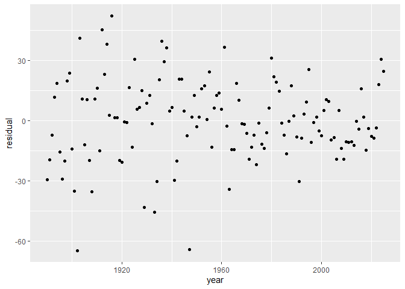
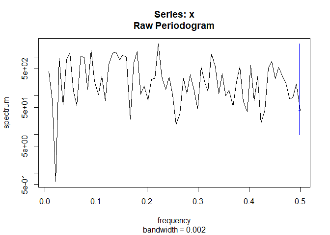

Zeespiegelmonitor harmonic analysis
================
Willem Stolte
06 October, 2026

# Harmonische analyse op residu van de Zeespiegelmonitor analyse

## De meest recente gegevens uit het bestand ophalen

In [het
Sealevelmonitor-script](https://github.com/Deltares-research/sealevelmonitor/blob/main/analysis/sealevelmonitor/20_sealevelmonitor.md)
worden gegevens over de gemiddelde jaarlijkse zeespiegelstand bij de
belangrijkste Nederlandse meetstations – afkomstig van de website van de
[Permanent Service for Mean Sea Level](http://www.psmsl.org) –
gecombineerd met de gemiddelde jaarlijkse waarden voor de
stormvloedopzet volgens het Global Tide and Surge Model (GTSM). Er wordt
een model gefit om de beste waarde voor de zeespiegelstijging over de
afgelopen decennia te bepalen. Een van de factoren waarvoor wordt
gecorrigeerd, is de nodale cyclus.

Dit document heeft tot doel te onderzoeken of er nog andere harmonische
signalen in de residuen aanwezig zijn. Mocht dit het geval zijn, dan
moeten we overwegen om deze harmonische component in de analyse op te
nemen.

``` r
aug_long <- read_delim(file = "../../data/deltares/results/dutch-sea-level-products.csv", comment = "#")

seaLevelClean <- aug_long %>%
  select(year, name, height, fitted_total) %>%
  mutate(residual = height - fitted_total)

ggplot(seaLevelClean, aes(year, residual)) + geom_point()
```

<figure>

<figcaption aria-hidden="true">Tijdserie voor residuen</figcaption>
</figure>

## Eerste stap: spectrum bekijken

``` r
spec <- stats::spectrum(seaLevelClean$residual, log = "yes")
```

<!-- -->

## Automatisch pieken selecteren (semi-automatisch)

## Fourier

``` r
# Residuals selecteren
y <- seaLevelClean$residual
y <- y[is.finite(y)]

n <- length(y)
y <- y - mean(y)

# FFT van de oorspronkelijke data
z <- fft(y)
freq <- (0:(n - 1)) / n
power <- Mod(z)^2 / n

# Positieve frequenties, zonder nulfrequentie
idx_pos <- 2:(floor(n / 2) + 1)

freq_pos <- freq[idx_pos]
power_pos <- power[idx_pos]

# Geobserveerde hoogste piek
peak_index <- which.max(power_pos)
observed_peak <- power_pos[peak_index]

observed_frequency <- freq_pos[peak_index]
observed_period <- 1 / observed_frequency

c(
  frequency = observed_frequency,
  period_years = observed_period,
  power = observed_peak
)
```

    FALSE    frequency period_years        power 
    FALSE    0.1764706    5.6666667 1939.0964649

De sterkste piek heeft dus een periode van 5.6667 jaar. Hieronder wordt
bekeken of deze piek ook significant is, dat wil zeggen wat de kans is
dat de piek op toeval berust.

``` r
set.seed(123)

n_sim <- 5000
max_powers <- numeric(n_sim)

for (i in seq_len(n_sim)) {
  y_sim <- sample(y)

  z_sim <- fft(y_sim)
  power_sim <- Mod(z_sim)^2 / n

  # Gebruik dezelfde positieve frequenties
  power_sim_pos <- power_sim[idx_pos]

  max_powers[i] <- max(power_sim_pos)
}

# Empirische p-waarde
p_value <- (
  1 + sum(max_powers >= observed_peak)
) / (n_sim + 1)

cat("De p-waarde voor de maximale piek is ", p_value)
```

    FALSE De p-waarde voor de maximale piek is  0.4493101

De geschatte p-waarde moet als volgt geïnterpreteerd worden. Een p_value
\< 0.05 wijst op een piek die sterker is dan je op basis van willekeurig
herschikte residuals zou verwachten. Deze eenvoudige test veronderstelt
wel dat de residuals onderling onafhankelijk zijn. Het zou aanbevolen
worden om rekening te houden met autoregressie. Aangezien de p-waarde
niet in de buurt van significantie zit, nemen we voorlopig aan dat er
geen harmonische componenten meer in het residu-signaal zitten.

## Conclusie

Er lijkt geen significant harmonisch signaal te zitten in het residu van
de Zeespiegelmonitor analyse.
