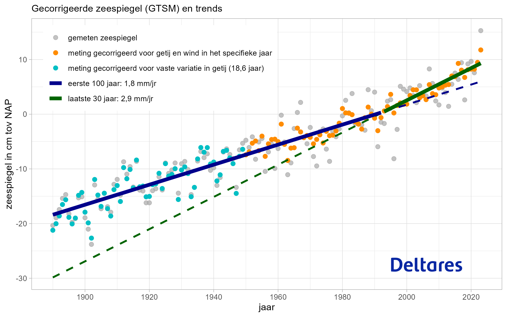

```{asis, echo = knitr::is_html_output()}

# Samenvatting Zeespiegelmonitor {.unnumbered #samenvatting}

Sinds 2014 onderhoudt Deltares in opdracht van Ministerie van I&W de Zeespiegelmonitor. Doel is de stand en ontwikkeling van de zeespiegel vast te stellen, ter ondersteuning van het waterveiligheidsbeleid. Het gaat met name om de gemiddelde hoeveelheid jaarlijks te suppleren zand en het toetsen en ontwerpen van de primaire waterkeringen.

De Zeespiegelmonitor stelt jaarlijks de stand van de zeespiegel vast van de zes Nederlandse hoofdgetijdenstations (Delfzijl, Harlingen, Den Helder, IJmuiden, Hoek van Holland en Vlissingen), die continu de waterstand vastleggen/meten. De methodiek voor de Zeespiegelmonitor is in 2014 vastgesteld en berekent de langjarige trend. Bij deze berekening wordt rekening gehouden met de verschillende factoren die de fluctuaties in waterstanden beïnvloeden. Wind en getij zijn daarvan de belangrijkste. Het resultaat van de zeespiegelmonitor wordt representatief geacht voor de gemiddelde zeespiegelstijging in de komende ca 15 jaar. Iedere vier jaar wordt gerapporteerd over de waarnemingen en de onderzoeksresultaten. Dit is de derde rapportage.

 In de laatste rapportage is geconcludeerd datdat de stijging van de zeespiegel langs de Nederlandse kust het best beschreven kan worden door een trend tot circa 1990 van 1.8 ± 0.1 mm/jaar, en een gemiddelde jaarlijkse stijging over de laatste 30 jaar van 2.9 ± 0.4 mm/jaar. Deze toename past bij de verwachting, op basis van de kennis over de wereldwijde stand van de zeespiegel, van een langzaam opbouwende versnelling van de zeespiegelstijging.
 
Voor de komende ca 15 jaar is een trend van 2.9 mm/jaar een verantwoorde benadering. De methodiek toegepast in de zeespiegelmonitor, is niet geschikt voor een berekening van de trend over de periode daarna.
```

```{r, include=knitr::is_html_output(), out.width="80%", fig.cap="De verandering van de zeespiegeltrend in de tijd."}

```

```{asis, echo = knitr::is_html_output()}
Uit bovenstaande figuur zijn drie belangrijke boodschappen te halen:

-   In Nederland is een versnelling van de zeespiegelstijging waarneembaar. De stijging is in de komende decennia naar verwachting hoger dan de trend in de vorige eeuw.
-   De gegevens vanaf 1950 vertonen een kleinere variatie dan daarvoor. Dit komt doordat vanaf 1950 gecorrigeerd wordt voor de jaarlijkse variatie in windopzet. Dat verhoogt de nauwkeurigheid van de beschrijving van de lokale zeespiegelstijging in recente tijdvakken.
-   De jaar op jaar variatie van de zeespiegel (ca. ± 10 cm) is veel groter dan de onzekerheid in de langjarige trend  (ca. ± 0.4 mm/jaar).

In deze zeespiegelmonitor zijn de gegevens van vijf van de zes Nederlandse stations gebruikt. Delfzijl is buiten de analyse gelaten. 

```
