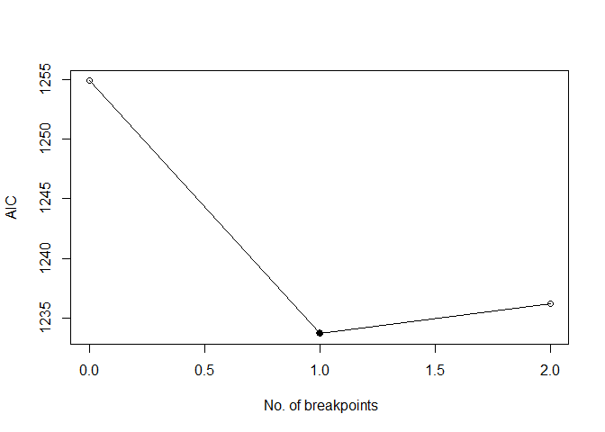
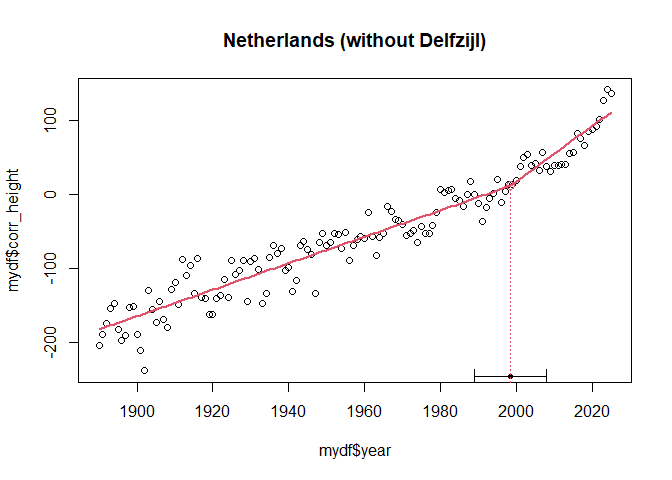

Untitled
================
Willem Stolte
2025-06-16

## Introduction

One of the models used in the Sea Level Monitor is a broken linear
model. In previous reports, the breakpoint was defined in the year 1993.
This was done for two reasons:

- Analyses showed that global and Dutch sea level in the beginning of
  the 1990’s was lower than expected. One of the explanations was a
  global temperature drop due to the Pinatubo eruption
- By choosing the year 1993, the trend of the part after the break could
  be easily compared to trends calculated from satellite observations,
  as they also start in this year. At the same time, the connection with
  earlier years is kept intact.

This notebook explores the most likely breakpoint year. A strong
deviation from 1993 would indicate that the breakpoint year may have to
change, or that the model is no longer valid.

## Read sea level data

``` r
  df <- read_delim(file.path("../", "../data/deltares/input/psmsl_gtsm_yr-latest.csv"), delim = ";") %>%
  # filter(station %in% params$station) %>%
  filter(year >= 1890)
```

## Find breakpoints for broken linear regression

Note: no correction is made for nodal tide in this implementation.

``` r
library(segmented)
```

Breakpoint function

``` r
slm_breakpoint <- function(
    df, 
    mystation = "Netherlands (without Delfzijl)", 
    startyear = 1890, 
    endyear = 2025,
    n_bp, 
    printsummary = F
    ) {

  nr_of_breakpoints = 2
  
  mydf = df %>% 
    filter(
      station %in% mystation,
      year >= startyear,
      year <= endyear
    ) %>%
    mutate(corr_height = height - surge_anomaly) %>%
    group_by(year) %>%
    summarize(corr_height = mean(corr_height))
  
  fit_lm = lm(corr_height ~ year, data = mydf )  # intercept-only model
  
  fit_segmented = selgmented(
    fit_lm, 
    seg.Z = ~year,
    Kmax = nr_of_breakpoints,
    type = "aic",
    bonferroni = TRUE,
    plot.ic = TRUE
  )  # Two change points along x
  
 
  
  plot(mydf$year, mydf$corr_height, main = mystation)
  # lines(mydf$year, predict((fit_segmented)), add = T)
  
  plot(fit_segmented, add = T)
  # points(mydf)
  lines.segmented(fit_segmented)
  points.segmented(fit_segmented)
  
  if(printsummary){
    summary(fit_segmented)
  }
}
```

``` r
slm_breakpoint(df, 
               mystation = "Netherlands (without Delfzijl)",
               startyear = 1890,
               endyear = 2025,
               n_bp = 4, 
               printsummary = T
               )
```

    FALSE No. of breakpoints: 2 ..

<!-- -->

    FALSE 
    FALSE AIC to detect no. of breakpoints:
    FALSE        0        1        2 
    FALSE 1254.879 1233.686 1236.232 
    FALSE 
    FALSE No. of selected breakpoints: 1

<!-- -->

    FALSE 
    FALSE   ***Regression Model with Segmented Relationship(s)***
    FALSE 
    FALSE Call: 
    FALSE segmented.lm(obj = olm, seg.Z = seg.Z, npsi = 1, control = control1)
    FALSE 
    FALSE Estimated Break-Point(s):
    FALSE                Est. St.Err
    FALSE psi1.year 1998.552  4.801
    FALSE 
    FALSE Coefficients of the linear terms:
    FALSE               Estimate Std. Error t value Pr(>|t|)    
    FALSE (Intercept) -3.559e+03  1.307e+02 -27.228   <2e-16 ***
    FALSE year         1.787e+00  6.723e-02  26.576   <2e-16 ***
    FALSE U1.year      1.974e+00  5.498e-01   3.591       NA    
    FALSE ---
    FALSE Signif. codes:  0 '***' 0.001 '**' 0.01 '*' 0.05 '.' 0.1 ' ' 1
    FALSE 
    FALSE Residual standard error: 22.08 on 132 degrees of freedom
    FALSE Multiple R-Squared: 0.929,  Adjusted R-squared: 0.9273 
    FALSE 
    FALSE Convergence attained in 3 iterations (rel. change 1.2247e-11)

From this analysis, the best fit is using one breakpoint at 1998 +/- 5
years. The currently used breakpoint (1993) is just within this standard
error of the estimate.

## surge

Wind surge is determined with the Global Tide and Surge Model (GTSM).
The following part tests whether ther is any breakpoint in the surge
data.

``` r
surge_breakpoint <- function(
    df, 
    mystation = "Netherlands (without Delfzijl)", 
    startyear = 1890, 
    n_bp, 
    printsummary = T
    ) {

  nr_of_breakpoints = 2
  
  mydf = df %>% 
    filter(
      station %in% mystation,
      year >= startyear
    ) #%>%

  fit_lm = lm(surge_anomaly ~ year, data = mydf )  # intercept-only model
  
  fit_segmented = selgmented(
    fit_lm, 
    seg.Z = ~year,
    Kmax = nr_of_breakpoints,
    type = "aic",
    bonferroni = TRUE,
    plot.ic = TRUE
  )  # Two change points along x
  
  # plot(mydf$year, mydf$surge_anomaly, main = mystation)
  # # lines(mydf$year, predict((fit_segmented)), add = T)
  # 
  # plot(fit_segmented, add = T)
  # # points(mydf)
  # lines.segmented(fit_segmented)
  # points.segmented(fit_segmented)
  
  if(printsummary){
    summary(fit_segmented)
  }
}
```

``` r
surge_breakpoint(df %>% filter(year >= 1950), 
               mystation = "Netherlands (without Delfzijl)",
               startyear = 1890,
               n_bp = 1, 
               printsummary = T
               )
```

    FALSE No. of breakpoints: 2 .. 
    FALSE 
    FALSE AIC to detect no. of breakpoints:
    FALSE        0        1        2 
    FALSE 699.9564 703.8843 707.1042 
    FALSE 
    FALSE No. of selected breakpoints:  0

    FALSE 
    FALSE Call:
    FALSE lm(formula = surge_anomaly ~ year, data = mydf)
    FALSE 
    FALSE Residuals:
    FALSE    Min     1Q Median     3Q    Max 
    FALSE -70.30 -16.95   0.67  19.22  52.78 
    FALSE 
    FALSE Coefficients:
    FALSE             Estimate Std. Error t value Pr(>|t|)
    FALSE (Intercept)  40.5488   244.9445   0.166    0.869
    FALSE year         -0.0204     0.1232  -0.166    0.869
    FALSE 
    FALSE Residual standard error: 23.57 on 74 degrees of freedom
    FALSE Multiple R-squared:  0.0003702,   Adjusted R-squared:  -0.01314 
    FALSE F-statistic: 0.02741 on 1 and 74 DF,  p-value: 0.869

There are no breakpoints detected in the surge anomaly time series.

Only years from which surge data are available ( \>= 1950)
