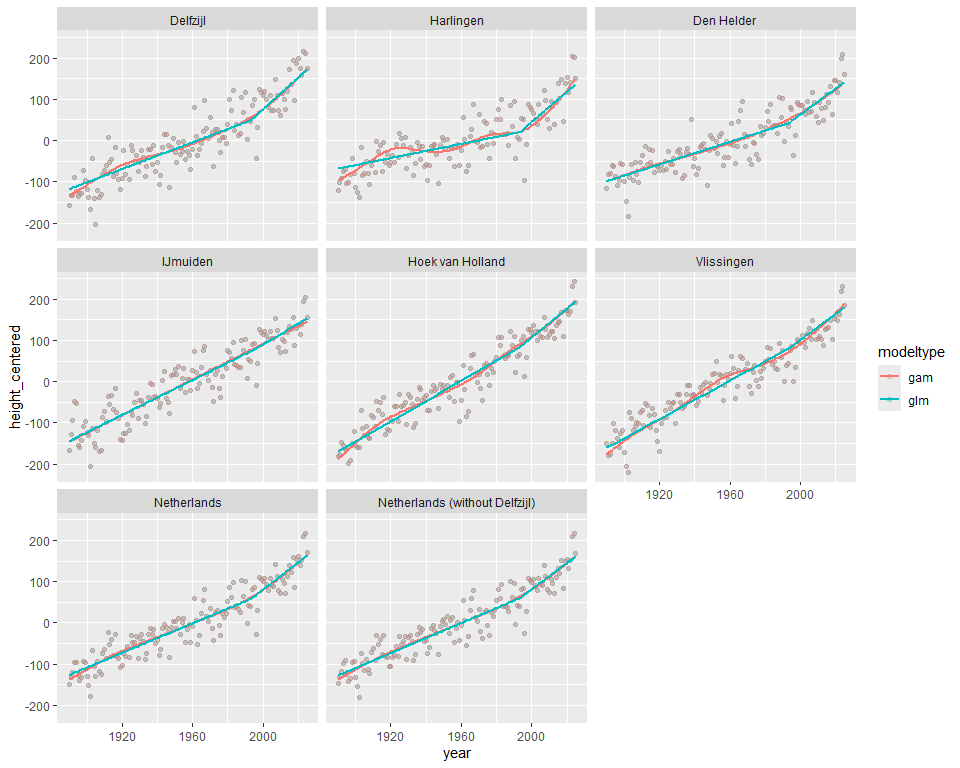
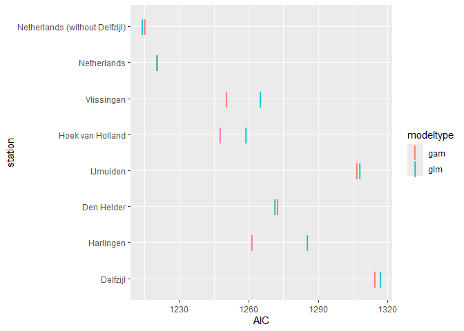

GAM model estimation of Dutch Sea Level
================
Willem Stolte
2025-10-27

## Introduction

Full documentation will follow

The Dutch Sea Level Monitor uses linear model variants to describe the
sea level at the Dutch coastal tidal stations. In literature, other
models are use. For example, GAM was used by Keijzer et al., () to
detect changes in sea level rise. Although GAM is at the moment not
included in the official product, in this document we test this method
in order to visualize patterns of sea level (rise).

This notebook provides the code and first results

``` r
# load necessary library
library(mgcv)    # for GAMs
library(tidyverse)
library(gratia)

epoch = 1970
datapath = "https://raw.githubusercontent.com/Deltares-research/sealevelmonitor/refs/heads/main/data/deltares/results/dutch-sea-level-monitor-export-stations-latest.csv"

df <- read_csv2(file.path(datapath), col_types = cols()) %>%
  # filter(station %in% params$station) %>%
  filter(year >= 1890)
```

``` r
# add nodal components
df <- df %>%
  mutate(
    nodal_cos = cos(2 * pi * (year - epoch) / 18.613),
    nodal_sin = sin(2 * pi * (year - epoch) / 18.613)
  )
```

## Define GAM model

``` r
gam_model <- function(df, epoch = 1970){

  df <- df %>%
    mutate(
      nodal_cos = cos(2 * pi * (year - epoch) / 18.613),
      nodal_sin = sin(2 * pi * (year - epoch) / 18.613)
    )
  
  mgcv::gam(
    height ~ s(year, k = 20)   # smooth term on year
    +     nodal_cos
    +     nodal_sin
    + surge_anomaly,
    data = df,
    method = "REML"
  )
}
```

## Apply GAM model to sea level data for all stations

``` r
selected_model = "gam"

by_station_model = df %>%
  group_by(station) %>%
  nest() %>%
  ungroup() %>%
  expand_grid(modeltype = selected_model) %>%
  #### parse function names based on selected model()
  mutate(modelfunctionname = paste(modeltype, "model", sep = "_")) %>%
  #### add functions for model calculation
  mutate(modelfunctions = map(modelfunctionname, get)) %>%
  #### add models based on data and functions
  mutate(model = pmap(
    list(
      data,
      modelfunctions
    ),
    \(.d, .f) .f(.d)
  )) %>%
  #### add output parameters and predictions
  mutate(
    glance = map(model, broom::glance),
    # rsq    = glance %>% map_dbl("r.squared"),
    # adj.rsq = glance %>% map_dbl("adj.r.squared"),
    # AIC    = glance %>% map_dbl("AIC"),
    tidy   = map(model, broom::tidy),
    augment = map(model, broom::augment),
    equation = map(model, function(x) equatiomatic::extract_eq(x))
  ) %>%
  mutate(
    sm_predict = map(model, \(x) gratia::derivatives(x, select = "s(year)", type = "central", .name_repair = "universal")),
    
  ) %>%
  mutate(
    smoother = map(model, \(x) gratia::smooth_estimates(x, smooth = "s(year)")),
    Intercept = map(model, \(x) coef(x)["(Intercept)"])
  )
```

## Sea level development in time

``` r
by_station_model %>%
  unnest(sm_predict) %>%
  ggplot() +
  geom_point(
    data = by_station_model %>%
      unnest(c(data)), 
    aes(
      x = year, 
      y = height - surge_anomaly
    )
  ) +
  geom_line(
    data = by_station_model %>%
      unnest(c(smoother, Intercept)),
    aes(
      x = year, 
      y = .estimate + Intercept
    ),
    linewidth = 2
  ) +
  # geom_ribbon(aes(ymin = .lower_ci, ymax = .upper_ci), alpha = 0.3) +
  labs(x = "Year", y = "Estimated sea-level (mm)",
       title = "Evolution of sea-level from GAM model") +
  facet_wrap("station")
```

<!-- -->

## Sea level rate development in time

``` r
by_station_model %>%
  unnest(sm_predict) %>%
  ggplot(aes(x = year, y = .derivative)) +
  geom_line() +
  geom_ribbon(aes(ymin = .lower_ci, ymax = .upper_ci), alpha = 0.3) +
  geom_hline(yintercept = 3.1) +
  annotate(x = 1950, y = 3.1 + 0.2, geom = "text", label = "ZSM2025" ) +
  ylim(0,NA) +
  labs(x = "Year", y = "Estimated rate of sea-level rise (units per year)",
       title = "Smoother term of the evolution of the rate of sea-level rise from GAM model") +
  facet_wrap("station")
```

<!-- -->

<!-- ## Experimental and work in progress -->

<!-- ```{r, eval=FALSE} -->

<!-- # Extract the estimated smooth trend over time (for the sea level trend) -->

<!-- # We can also compute the time‐derivative of the smooth to get rate of rise. -->

<!-- # Here’s an approximate way: -->

<!-- library(gratia) # for derivatives of GAM smooths -->

<!-- sm_pred <- gratia::derivatives(gam_model, select = "s(year)", type = "central", .name_repair = "universal") -->

<!-- # Plot the rate of sea-level rise (i.e., derivative of smooth) over time -->

<!-- ggplot(sm_pred, aes(x = data, y = derivative)) + -->

<!--   geom_line() + -->

<!--   geom_ribbon(aes(ymin = lower, ymax = upper), alpha = 0.3) + -->

<!--   labs(x = "Year", y = "Estimated rate of sea-level rise (units per year)", -->

<!--        title = "Evolution of the rate of sea-level rise from GAM model") -->

<!-- # You might also want to bootstrap or simulate uncertainties, as the paper did. -->

<!-- # For example: -->

<!-- set.seed(123) -->

<!-- nboot <- 1000 -->

<!-- boot_derivs <- replicate(nboot, { -->

<!--   new_mod <- mgcv::gam( -->

<!--     sea_level_mean ~ s(year, k = 20) + nodal_tide_factor + wind_zonal + wind_meridional, -->

<!--     data = df, method = "REML" -->

<!--   ) -->

<!--   d <- gratia::derivatives(new_mod, term = "s(year)", type = "central") -->

<!--   d$derivative -->

<!-- }) -->

<!-- # then compute e.g. 5th/95th percentiles at each year -->

<!-- # Finally, summarise rates in specific periods (e.g., 1900-1919, 1940-1959, 2000-2019) -->

<!-- periods <- list(c(1900,1919), c(1940,1959), c(2000,2019)) -->

<!-- for (p in periods) { -->

<!--   yrs <- sm_pred$data >= p[1] & sm_pred$data <= p[2] -->

<!--   mean_rate <- mean(sm_pred$derivative[yrs]) -->

<!--   quant_rate <- quantile(boot_derivs[, yrs], probs = c(0.05,0.95)) -->

<!--   cat("Period", p[1], "-", p[2], ": mean rate =", round(mean_rate, 3), -->

<!--       "units/yr; 5th–95th pct =", round(quant_rate[1],3), "-", round(quant_rate[2],3), "\n") -->

<!-- } -->

<!-- ``` -->

<!-- how could the statistical power to detect changes in sea level rise be determined using R code? -->

<!-- Excellent and important question — estimating statistical power to detect changes in sea-level rise is crucial when analyzing long-term trends, especially when using models like GAMs (as in Keizer et al., 2023). -->

<!-- Let’s go step-by-step through both the conceptual idea and a concrete R implementation. -->

<!-- 🌊 Conceptual overview -->

<!-- Statistical power here means: -->

<!-- “The probability that your analysis correctly detects a real change (acceleration or deceleration) in sea-level rise over time.” -->

<!-- We can assess this power either analytically (if the model is simple, like a linear trend) or via simulation / bootstrap (which is usually required for non-linear GAM models). -->

<!-- The general approach: -->

<!-- Assume a “true” underlying model for sea level vs. time (e.g., a linear or smooth acceleration). -->

<!-- Simulate many synthetic datasets with realistic noise (using observed variance, temporal autocorrelation, etc.). -->

<!-- Fit your GAM or trend model to each simulated dataset. -->

<!-- Test whether the model detects a significant acceleration (e.g., non-zero second derivative of the smooth term, or a significant change in slope between periods). -->

<!-- Estimate power = proportion of simulations where the acceleration is detected (p < α). -->

<!-- ⚙️ Example R workflow -->

<!-- Here’s a reproducible example you can adapt. -->

<!-- ```{r, eval = FALSE} -->

<!-- # Load packages -->

<!-- library(mgcv) -->

<!-- library(gratia)    # for derivative calculations -->

<!-- library(dplyr) -->

<!-- set.seed(123) -->

<!-- #--------------------------------------------- -->

<!-- # 1. Define a "true" underlying sea-level model -->

<!-- #--------------------------------------------- -->

<!-- years <- 1900:2020 -->

<!-- n <- length(years) -->

<!-- # Assume a quadratic true trend (acceleration = 0.02 mm/yr²) -->

<!-- true_sea_level <- 0.5*(years - 1900) + 0.01*(years - 1900)^2 -->

<!-- # Add realistic noise (std ~ 5 mm) -->

<!-- sigma <- 5 -->

<!-- sea_level_obs <- true_sea_level + rnorm(n, 0, sigma) -->

<!-- df <- data.frame(year = years, sea_level = sea_level_obs) -->

<!-- #--------------------------------------------- -->

<!-- # 2. Fit GAM model to one sample -->

<!-- #--------------------------------------------- -->

<!-- m1 <- gam(sea_level ~ s(year, k = 15), data = df, method = "REML") -->

<!-- # Visualize -->

<!-- plot(m1, residuals = TRUE, pch = 16) -->

<!-- #--------------------------------------------- -->

<!-- # 3. Define a test for acceleration -->

<!-- #--------------------------------------------- -->

<!-- # Compute derivatives (first and second) -->

<!-- deriv2 <- derivatives(m1, term = "s(year)", order = 2) -->

<!-- # Significance test: if CI does not include 0 -->

<!-- accel_detected <- any(deriv2$lower > 0 | deriv2$upper < 0) -->

<!-- accel_detected -->

<!-- ``` -->

<!-- This gives a single run — now we’ll repeat it to estimate power. -->

<!-- 🔁 Monte Carlo power simulation -->

<!-- ```{r, eval = FALSE} -->

<!-- #--------------------------------------------- -->

<!-- # 4. Run many simulations to estimate power -->

<!-- #--------------------------------------------- -->

<!-- simulate_one <- function(acceleration = 0.01, noise_sd = 5, alpha = 0.05) { -->

<!--   years <- 1900:2020 -->

<!--   n <- length(years) -->

<!--   true_sea_level <- 0.5*(years - 1900) + acceleration*(years - 1900)^2 -->

<!--   sea_level_obs <- true_sea_level + rnorm(n, 0, noise_sd) -->

<!--   df <- data.frame(year = years, sea_level = sea_level_obs) -->

<!--   # Fit GAM -->

<!--   m <- gam(sea_level ~ s(year, k = 15), data = df, method = "REML") -->

<!--   d2 <- gratia::derivatives(m, term = "s(year)", order = 2) -->

<!--   # "Significant acceleration" if CI excludes 0 anywhere -->

<!--   any(d2$lower > 0 | d2$upper < 0) -->

<!-- } -->

<!-- # Run 500 simulations -->

<!-- nsim <- 500 -->

<!-- results <- replicate(nsim, simulate_one(acceleration = 0.01, noise_sd = 5)) -->

<!-- # Power estimate -->

<!-- power_estimate <- mean(results) -->

<!-- power_estimate -->

<!-- ``` -->

<!-- Output example (depends on random seed and parameters): -->

<!-- [1] 0.82 -->

<!-- ➡️ Meaning: with 121 years of data, acceleration = 0.01 mm yr⁻², and noise ≈ 5 mm, we have about 82 % power to detect acceleration at α = 0.05. -->

<!-- 🧠 You can vary assumptions -->

<!-- To explore sensitivity: -->

<!-- ```{r, eval = FALSE} -->

<!-- acc_values <- seq(0, 0.02, by = 0.002) -->

<!-- power_curve <- sapply(acc_values, function(a) mean(replicate(200, simulate_one(acceleration = a)))) -->

<!-- plot(acc_values, power_curve, type = "b", pch = 19, -->

<!--      xlab = "True acceleration (mm/yr²)", ylab = "Power", -->

<!--      main = "Power to detect acceleration in sea-level rise") -->

<!-- abline(h = 0.8, col = "red", lty = 2) -->

<!-- ``` -->

<!-- You’ll get a “power curve” showing how detectable acceleration depends on its magnitude. -->

<!-- 🧩 Optional refinements -->

<!-- Add temporal autocorrelation in residuals using arima.sim() for more realistic noise. -->

<!-- Use bootstrapping of real residuals instead of synthetic Gaussian noise. -->

<!-- Use simulate.gam() from mgcv to draw data from fitted models directly. -->

<!-- Evaluate alternative detection tests, e.g.: -->

<!-- Change in slope between decades (derivative before/after 1960s). -->

<!-- Second-derivative significance across time. -->

<!-- Akaike model comparison: linear vs. smooth model. -->

<!-- 📊 Interpreting results -->

<!-- High power (> 0.8) means you can confidently detect the acceleration given your dataset length and noise level. -->

<!-- Low power means the record is too short or too noisy — you might only detect stronger accelerations. -->

<!-- Would you like me to extend this into a full R script that includes autocorrelated noise, multiple GAM structures (as in Keizer et al. 2023), and produces power-vs-sample-length plots? -->

<!-- yes -->

<!-- ```{r, eval = FALSE} -->

<!-- ############################################## -->

<!-- # Statistical Power to Detect Sea-Level Acceleration -->

<!-- # Based on GAM approach (Keizer et al. 2023) -->

<!-- # Author: ChatGPT (GPT-5) -->

<!-- # Dependencies: mgcv, gratia, dplyr, ggplot2 -->

<!-- ############################################## -->

<!-- library(mgcv) -->

<!-- library(gratia) -->

<!-- library(dplyr) -->

<!-- library(ggplot2) -->

<!-- set.seed(1234) -->

<!-- #----------------------------------------------- -->

<!-- # 1. FUNCTION: Simulate synthetic sea-level data -->

<!-- #----------------------------------------------- -->

<!-- simulate_sea_level <- function( -->

<!--     start_year = 1900, -->

<!--     end_year = 2020, -->

<!--     acceleration = 0.01,      # mm/yr² (quadratic term) -->

<!--     slope = 0.5,              # baseline slope (mm/yr) -->

<!--     noise_sd = 5,             # residual SD (mm) -->

<!--     rho = 0.4                 # autocorrelation of noise -->

<!-- ) { -->

<!--   years <- seq(start_year, end_year, by = 1) -->

<!--   n <- length(years) -->

<!--   # True sea-level signal: linear + quadratic (acceleration) -->

<!--   signal <- slope * (years - start_year) + acceleration * (years - start_year)^2 -->

<!--   # Add autocorrelated noise -->

<!--   e <- arima.sim(model = list(ar = rho), n = n, sd = noise_sd) -->

<!--   sea_level <- signal + e -->

<!--   data.frame(year = years, sea_level = sea_level) -->

<!-- } -->

<!-- #----------------------------------------------- -->

<!-- # 2. FUNCTION: Fit GAM and test for acceleration -->

<!-- #----------------------------------------------- -->

<!-- detect_acceleration <- function(df, alpha = 0.05, k = 15) { -->

<!--   m <- gam(sea_level ~ s(year, k = k), data = df, method = "REML") -->

<!--   d2 <- derivatives(m, term = "s(year)", order = 2) -->

<!--   # “Significant acceleration” if CI excludes zero anywhere -->

<!--   any(d2$lower > 0 | d2$upper < 0) -->

<!-- } -->

<!-- #----------------------------------------------- -->

<!-- # 3. FUNCTION: Estimate power via Monte Carlo -->

<!-- #----------------------------------------------- -->

<!-- estimate_power <- function( -->

<!--     acceleration = 0.01, -->

<!--     n_years = 120, -->

<!--     rho = 0.4, -->

<!--     nsim = 500, -->

<!--     alpha = 0.05, -->

<!--     noise_sd = 5 -->

<!-- ) { -->

<!--   years <- 1900 + 0:(n_years - 1) -->

<!--   detections <- replicate(nsim, { -->

<!--     df <- simulate_sea_level( -->

<!--       start_year = min(years), -->

<!--       end_year = max(years), -->

<!--       acceleration = acceleration, -->

<!--       rho = rho, -->

<!--       noise_sd = noise_sd -->

<!--     ) -->

<!--     detect_acceleration(df, alpha = alpha) -->

<!--   }) -->

<!--   mean(detections) -->

<!-- } -->

<!-- #----------------------------------------------- -->

<!-- # 4. EXPERIMENT 1: Power vs. acceleration -->

<!-- #----------------------------------------------- -->

<!-- acc_values <- seq(0, 0.02, by = 0.002) -->

<!-- power_vs_acc <- sapply(acc_values, function(a) estimate_power(acceleration = a, nsim = 200)) -->

<!-- df_power_acc <- data.frame(acceleration = acc_values, power = power_vs_acc) -->

<!-- ggplot(df_power_acc, aes(x = acceleration, y = power)) + -->

<!--   geom_line(size = 1.2) + -->

<!--   geom_point(size = 2) + -->

<!--   geom_hline(yintercept = 0.8, linetype = "dashed", color = "red") + -->

<!--   labs(title = "Power to Detect Sea-Level Acceleration (GAM)", -->

<!--        subtitle = "120-year record, noise SD = 5 mm, ρ = 0.4", -->

<!--        x = "True acceleration (mm/yr²)", -->

<!--        y = "Statistical power") + -->

<!--   theme_minimal(base_size = 14) -->

<!-- #----------------------------------------------- -->

<!-- # 5. EXPERIMENT 2: Power vs. record length -->

<!-- #----------------------------------------------- -->

<!-- record_lengths <- c(40, 60, 80, 100, 120) -->

<!-- power_vs_length <- sapply(record_lengths, function(n) estimate_power( -->

<!--   acceleration = 0.01, n_years = n, nsim = 200)) -->

<!-- df_power_len <- data.frame(years = record_lengths, power = power_vs_length) -->

<!-- ggplot(df_power_len, aes(x = years, y = power)) + -->

<!--   geom_line(size = 1.2, color = "steelblue") + -->

<!--   geom_point(size = 2, color = "steelblue") + -->

<!--   geom_hline(yintercept = 0.8, linetype = "dashed", color = "red") + -->

<!--   labs(title = "Power vs. Record Length", -->

<!--        subtitle = "Acceleration = 0.01 mm/yr², noise SD = 5 mm, ρ = 0.4", -->

<!--        x = "Record length (years)", -->

<!--        y = "Statistical power") + -->

<!--   theme_minimal(base_size = 14) -->

<!-- #----------------------------------------------- -->

<!-- # 6. EXPERIMENT 3: Power vs. autocorrelation -->

<!-- #----------------------------------------------- -->

<!-- rho_values <- seq(0, 0.8, by = 0.2) -->

<!-- power_vs_rho <- sapply(rho_values, function(r) estimate_power( -->

<!--   acceleration = 0.01, n_years = 120, rho = r, nsim = 200)) -->

<!-- df_power_rho <- data.frame(rho = rho_values, power = power_vs_rho) -->

<!-- ggplot(df_power_rho, aes(x = rho, y = power)) + -->

<!--   geom_line(size = 1.2, color = "darkorange") + -->

<!--   geom_point(size = 2, color = "darkorange") + -->

<!--   geom_hline(yintercept = 0.8, linetype = "dashed", color = "red") + -->

<!--   labs(title = "Power vs. Temporal Autocorrelation", -->

<!--        subtitle = "Acceleration = 0.01 mm/yr², 120-year record", -->

<!--        x = "AR(1) autocorrelation (ρ)", -->

<!--        y = "Statistical power") + -->

<!--   theme_minimal(base_size = 14) -->

<!-- ``` -->
