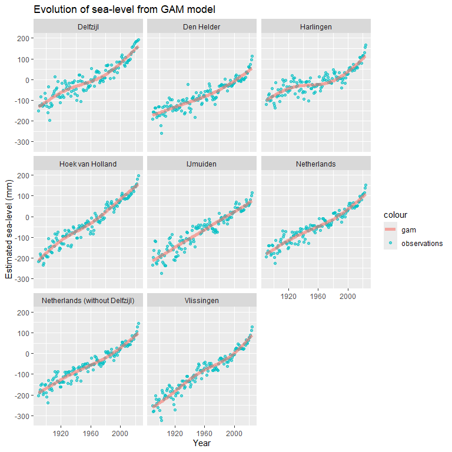
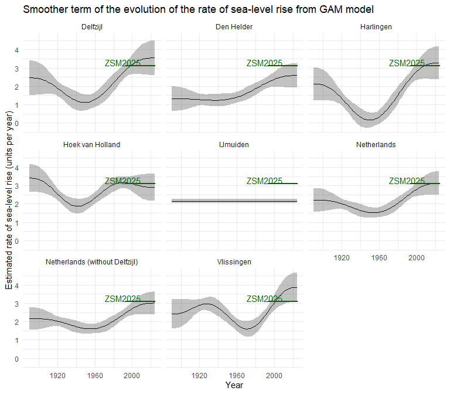

GAM model estimation of Dutch Sea Level
================
Willem Stolte
2026-03-11

## Introduction

Full documentation will follow

The Dutch Sea Level Monitor uses general linearized model variants to
describe the sea level at the Dutch coastal tidal stations. In the
literature, also other models are used. For example, GAM was used by
Keizer et al., (2023) to detect changes in sea level rise by comparing
different periods with respect to GAM fitted sea level changes. Although
GAM is at the moment not included in the official product, in this
document we test this method in order to visualize patterns of sea level
(rise).

This notebook provides the code and first results

``` r
# load necessary library
library(mgcv)    # for GAMs
library(tidyverse)
library(gratia)

epoch = 1970
datapath = "../../data/deltares/input/psmsl_gtsm_yr-latest.csv"

df <- read_delim(file.path(datapath), delim = ";", col_types = cols()) %>%
  # filter(station %in% params$station) %>%
  filter(year >= 1890)
```

## Define GAM

The GAM model used here is using 4 components:

- smooth term
- nodal cosine term
- nodal sine term
- surge anomaly term

No further fine tuning of the GAM model has been done so far

``` r
gam_model <- function(df, epoch = 1970){

  df <- df %>%
    mutate(
      nodal_cos = cos(2 * pi * (year - epoch) / 18.613),
      nodal_sin = sin(2 * pi * (year - epoch) / 18.613)
    )
  
  mgcv::gam(
    height ~ s(year, k = 5)   # smooth term on year
    +     nodal_cos
    +     nodal_sin
    + surge_anomaly,
    data = df,
    method = "REML"
  )
}
```

## Apply GAM model to sea level data for all stations

The GAM model was applied to all six main stations and the composite
stations according to the code below.

``` r
selected_model = "gam"

by_station_model = df %>%
  group_by(station) %>%
  nest() %>%
  ungroup() %>%
  expand_grid(modeltype = selected_model) %>% # in case multiple models are used
  #### parse function names based on selected model()
  mutate(modelfunctionname = paste(modeltype, "model", sep = "_")) %>%
  #### add functions for model calculation
  mutate(modelfunctions = map(modelfunctionname, get)) %>%
  #### add models based on data and functions
  mutate(model = pmap(
    list(
      data,
      modelfunctions
    ),
    \(.d, .f) .f(.d)
  )) %>%
  #### add output parameters and predictions
  mutate(
    glance = map(model, broom::glance),
    # rsq    = glance %>% map_dbl("r.squared"),
    adj.rsq = glance %>% map_dbl("adj.r.squared"),
    # AIC    = glance %>% map_dbl("AIC"),
    npar = glance %>% map_dbl("npar"),
    tidy   = map(model, broom::tidy),
    augment = map(model, broom::augment)#,
    # equation = map(model, function(x) equatiomatic::extract_eq(x))
  ) %>%
  mutate(
    sm_predict = map(model, \(x) gratia::derivatives(x, select = "s(year)", type = "central", .name_repair = "universal")),
    
  ) %>%
  mutate(
    smoother = map(model, \(x) gratia::smooth_estimates(x, smooth = "s(year)")),
    Intercept = map(model, \(x) coef(x)["(Intercept)"])
  )
```

## Outcome of the model

``` r
library(mgcv)
library(broom)
library(dplyr)

summary_table <- by_station_model %>%
  select(station, glance, tidy) %>%
  unnest(c(glance, tidy)) %>%
  select(
    station,
    AIC,
    adj.r.squared,
    npar,
    p.value
  )

knitr::kable(summary_table, caption = "GAM summary table.")
```

| station                        |      AIC | adj.r.squared | npar | p.value |
|:-------------------------------|---------:|--------------:|-----:|--------:|
| Vlissingen                     | 1243.513 |     0.9361823 |    8 |       0 |
| Hoek van Holland               | 1240.397 |     0.9476682 |    8 |       0 |
| Den Helder                     | 1262.298 |     0.8813889 |    8 |       0 |
| Delfzijl                       | 1307.001 |     0.8949587 |    8 |       0 |
| Harlingen                      | 1273.934 |     0.8608704 |    8 |       0 |
| IJmuiden                       | 1297.740 |     0.8992253 |    8 |       0 |
| Netherlands                    | 1212.105 |     0.9391873 |    8 |       0 |
| Netherlands (without Delfzijl) | 1206.283 |     0.9404346 |    8 |       0 |

GAM summary table.

### Skill assessment

``` r
by_station_model %>%
  select(
    station, 
    glance
  ) %>%
  unnest(glance) %>%
  knitr::kable(caption = "Skill assessment table for GAM model.")
```

### Parameters

``` r
by_station_model %>%
  select(
    station, 
    tidy
  ) %>%
  unnest(tidy) %>%
  knitr::kable(caption = "GAM parameter table")
```

| station                        | term    |      edf |   ref.df | statistic | p.value |
|:-------------------------------|:--------|---------:|---------:|----------:|--------:|
| Vlissingen                     | s(year) | 3.655438 | 3.929964 |  436.1142 |       0 |
| Hoek van Holland               | s(year) | 3.494847 | 3.854398 |  614.1079 |       0 |
| Den Helder                     | s(year) | 2.958248 | 3.461452 |  245.6309 |       0 |
| Delfzijl                       | s(year) | 3.441074 | 3.824037 |  216.8197 |       0 |
| Harlingen                      | s(year) | 3.677427 | 3.938022 |  116.7701 |       0 |
| IJmuiden                       | s(year) | 1.000779 | 1.001558 | 1137.0212 |       0 |
| Netherlands                    | s(year) | 3.372275 | 3.781584 |  499.8698 |       0 |
| Netherlands (without Delfzijl) | s(year) | 3.292701 | 3.728437 |  534.0417 |       0 |

GAM parameter table

## Sea level development in time

The comparison between observed and (GAM) modelled sea level for the 6
stations, and the composite stations is shown below. The variation in
observations from 1950 to now is lower than in the period before. this
is related to the wind-surge corrections derived from the GTSM model.
Because of a lack of GTSM output for the years before 1950, for those
years only a correction with the mean surge has been made.

``` r
by_station_model %>%
  unnest(data) %>%
  select(
    station,
    year,
    height,
    surge_anomaly # moet numeriek zijn!
  ) %>%
  ggplot(
    aes(
      x = year, 
      y = height - surge_anomaly
    )
  ) +
  geom_point(
    alpha = 0.6,
    aes(
      color = "observations"
    )) +
  geom_line(
    data = by_station_model %>%
      unnest(c(smoother, Intercept)),
    aes(
      x = year, 
      y = .estimate + Intercept,
      color = "gam"
    ),
    linewidth = 2,
    alpha = 0.6
  ) +
  # geom_ribbon(aes(ymin = .lower_ci, ymax = .upper_ci), alpha = 0.3) +
  labs(x = "Year", y = "Estimated sea-level (mm)",
       title = "Evolution of sea-level from GAM model") +
  facet_wrap("station")
```

<figure>

<figcaption aria-hidden="true">Relative sea level from the six Dutch
main stations.</figcaption>
</figure>

## Sea level rate development in time

The plot below shows the sea level rate in time as estimated using GAM.
It is currently compared to the sea level rate as calculated with the
current Sea Level Monitor preferred model (broken linear) for the
virtual station “Netherlands (without Delfzijl)”. For better comparison
on station level, station-specific results will be added in a later
stage.

``` r
by_station_model %>%
  unnest(sm_predict) %>%
  ggplot(aes(x = year, y = .derivative)) +
  geom_line() +
  geom_ribbon(aes(ymin = .lower_ci, ymax = .upper_ci), alpha = 0.3) +
  # geom_hline(yintercept = 3.1) +
  geom_linerange(xmin = 1993, xmax = 2025, y = 3.1, size = 1, color = "darkgreen") +
  annotate(x = 1990, y = 3.1 + 0.2, geom = "text", label = "ZSM2025", , color = "darkgreen") +
  # ylim(0,NA) +
  labs(x = "Year", y = "Estimated rate of sea-level rise (units per year)",
       title = "Smoother term of the evolution of the rate of sea-level rise from GAM model") +
  facet_wrap("station") +
  theme_minimal()
```

<figure>

<figcaption aria-hidden="true">Relative sea level change rate from the
six Dutch main stations. The horizontal line is the current calculated
sea level change rate as calculated by a broken-linear model in the Sea
Level Monitor.</figcaption>
</figure>

## References

Keizer, Iris, Dewi Le Bars, Cees De Valk, André Jüling, Roderik Van De
Wal, and Sybren Drijfhout. 2023. “The Acceleration of Sea-Level Rise
along the Coast of the Netherlands Started in the 1960s.” Ocean Science
19 (4): 991–1007. <https://doi.org/10.5194/os-19-991-2023>.
