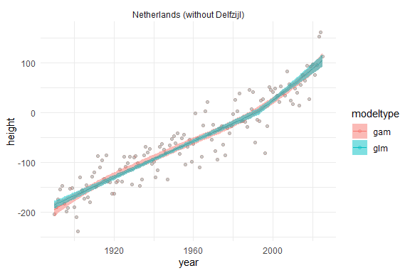
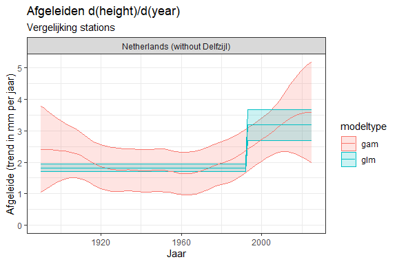
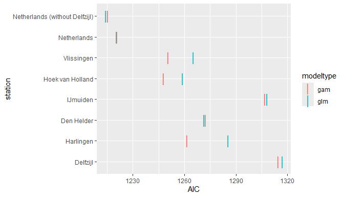
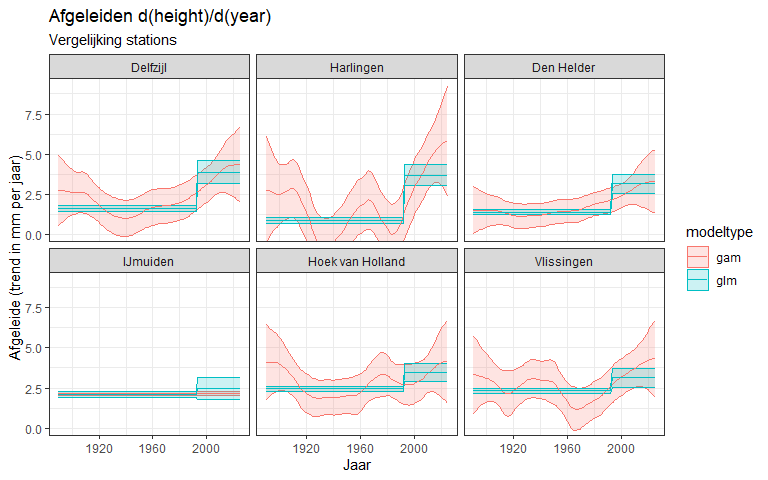

Comparison between GAM and GLM (broken linear) model for Dutch Sea Level
================
Willem Stolte
2026-08-04

## Introduction

The Dutch Sea Level Monitor uses General Linearized Model variants to
describe the sea level at the Dutch coastal tidal stations. In the
literature, also other models are used. For example, GAM was used by
Keizer et al. (2023) to detect changes in sea level rise by comparing
different periods with respect to GAM fitted sea level changes. Although
GAM is at the moment not included in the official product, in this
document we test this method in order to visualize patterns of sea level
changes.

The aim of this notebook is:

- To implement GAM analyses for the Dutch main tidal station
- To compare the GAM with GLM broken linear model (preferred model for
  the Sea Level Monitor 2026) in terms of e.g. AIC

``` r
# load necessary library
library(mgcv)    # for GAMs
library(tidyverse)
library(gratia)

epoch = 1970
datapath = "../../data/deltares/input/psmsl_gtsm_yr-latest.csv"
nstations <- length(params$selected_station)

df <- read_delim(file.path(datapath), delim = ";", col_types = cols()) %>%
  # filter(station %in% params$station) %>%
  filter(year >= 1890)

df$year_c = df$year - epoch

df <- df %>% 
  mutate(
    station = factor(
      station, levels = c(
        "Delfzijl",
        "Harlingen",
        "Den Helder",
        "IJmuiden",
        "Hoek van Holland",
        "Vlissingen",
        "Netherlands",
        "Netherlands (without Delfzijl)"
      )
    )
  ) %>%
  addBreakPoints()
```

## Define GAM and GLM

The GAM model used here is using 4 components:

- smooth term
- nodal cosine term
- nodal sine term
- surge anomaly term

The GLM broken linear model is using the following components:

- linear component
- extra trend from 1993
- nodal cosine term
- nodal sine term
- surge anomaly term

### Add helper variables

``` r
prepare_nodal <- function(df, epoch = 1970){
  df %>%
    mutate(
      nodal_cos = cos(2 * pi * (year - epoch) / 18.613),
      nodal_sin = sin(2 * pi * (year - epoch) / 18.613)
    )
}
```

### Comparing GAM and GLM

The aim is to compare the model fits from GAM and GLM in terms of AIC.
This can only be done when using the same model formulations for both
models. The broken linear model is therefore formulated using the mgcv
package (like the GAM) but without the smoothing term, so only using
linear terms.

Be aware that the exact outcomes of the GLM model in this notebook do
not necessarily match exactly with the GLM outcomes in the Sea Level
Monitor script.

In the GAM formulation, k denotes the basis dimension of a smooth term,
defining the maximum flexibility available to the fitted spline. It sets
an upper bound on the effective degrees of freedom, while the actual
smoothness is determined by penalization during model fitting. It is set
to 50 for this analysis.

``` r
slm_k = 50

gam_model <- function(df, epoch = 1970, k = slm_k){

  mgcv::gam(
    height ~ s(year, k = k)   # smooth term on year
    +     nodal_cos
    +     nodal_sin
    + surge_anomaly,
    family = gaussian(),
    data = df,
    method = "REML"
  )
}

# GLM only using linear terms, no smoother
glm_model <- function(df){

  mgcv::gam(
    height ~ year_c
    +        from1993
    +        nodal_cos
    +        nodal_sin
    +        surge_anomaly,
    family = gaussian(),
    data = df,
    method = "REML"
  )
}
```

Functions to extract predictions, standard errors and derivatives

``` r
## use for plotting - vertically neutral compared to measurements
get_height_predictions <- function(model, newdata){

  preddata <- newdata

  preddata$nodal_cos     <- 0
  preddata$nodal_sin     <- 0
  preddata$surge_anomaly <- mean(newdata$surge_anomaly, na.rm = TRUE)

  p <- predict(
    model,
    newdata = preddata,
    type = "response",
    se.fit = TRUE
  )

  tibble(
    fit_height = p$fit,
    se_height  = p$se.fit
  )
}

get_derivatives <- function(model) {

  # ==== CASE 1: GAM MET SMOOTH ====
  if (length(model$smooth) > 0) {

    der <- gratia::derivatives(
      model,
      term = "s(year)",
      type = "central",
      interval = "confidence",
      unconditional = TRUE
    )


  # Bouw een nette, uniforme tibble met de juiste kolommen
  out <- tibble::tibble(
    x          = der$year,
    derivative = der$.derivative,
    se         = der$.se,
    lower      = der$.lower_ci,
    upper      = der$.upper_ci
  )

    return(out)
  }

  # ==== CASE 2: LINEAIR MODEL ====
  
cf <- coef(model)
vc <- vcov(model)

slope_year <- cf["year_c"]
slope_from <- cf["from1993"]

xvals <- model$model$year_c + 1970

derivative_vals <- ifelse(
  xvals < 1993,
  slope_year,
  slope_year + slope_from
)

var_before <- vc["year_c", "year_c"]

var_after <-
  vc["year_c", "year_c"] +
  vc["from1993", "from1993"] +
  2 * vc["year_c", "from1993"]

se_before <- sqrt(var_before)
se_after  <- sqrt(var_after)

se_vals <- ifelse(
  xvals < 1993,
  se_before,
  se_after
)
  
  tibble::tibble(
    x          = xvals,
    derivative = derivative_vals,
    se         = se_vals,
    lower      = derivative_vals - 1.96 * se_vals,
    upper      = derivative_vals + 1.96 * se_vals
  )
}
```

## Apply GAM and GLM models to sea level data for all stations

The GAM and GLM models was applied to all six main stations and the
composite stations according to the code below.

``` r
selected_model = c("glm", "gam")

by_station_model_compared = df %>%
  prepare_nodal() %>%
  addBreakPoints() %>%
  group_by(station) %>%
  nest() %>%
  ungroup() %>%
  expand_grid(modeltype = selected_model) %>% # in case multiple models are used
  #### parse function names based on selected model()
  mutate(modelfunctionname = paste(modeltype, "model", sep = "_")) %>%
  #### add functions for model calculation
  mutate(modelfunctions = map(modelfunctionname, get)) %>%
  #### add models based on data and functions
  mutate(model = pmap(
    list(
      data,
      modelfunctions
    ),
    \(.d, .f) .f(.d)
  )) %>%
  #### add output parameters and predictions
  mutate(
    glance = map(model, broom::glance),
    # rsq    = glance %>% map_dbl("r.squared"),
    adj.rsq = glance %>% map_dbl("adj.r.squared"),
    AIC    = glance %>% map_dbl("AIC"),
    npar = glance %>% map_dbl("npar"),
    tidy   = map(model, ~ broom::tidy(.x, parametric = TRUE, smooth = TRUE)),
    augment = map(model, broom::augment)#,
    # equation = map(model, function(x) equatiomatic::extract_eq(x))
  ) %>%
  mutate(
  pred_height = map2(
    model,
    data,
    get_height_predictions
  ),
  derivatives = map(model, get_derivatives)
)
```

In general, the resulting predictions from GAM and GLM models are very
similar for most stations. The GAM model follows, as can be expected,
better the variability of the measurements. Especially for individual
stations like Delfzijl and Harlingen, the GLM model seems to miss much
of the variation present in the signal.

``` r
plot_comparison <- function(df) {
  df %>%
    select(data, pred_height, modeltype, station) %>%
    unnest(c(data, pred_height)) %>%
    ggplot(aes(x = year)) +
    geom_point(aes(y = height, color = modeltype), alpha = 0.3) +
    geom_line(aes(y = fit_height, color = modeltype), linewidth = 0.7) +
    geom_ribbon(
    aes(
      ymin = fit_height - 1.96 * se_height,
      ymax = fit_height + 1.96 * se_height,
      fill = modeltype
    ),
    alpha = 0.5
  ) +
    facet_wrap("station") +
    theme_minimal()
}

plot_comparison(by_station_model_compared %>%
                  filter(!grepl("Netherlands", station)))
```

 For
the combined station “Netherlands (without Delfzijl)” GLM and GAM
overlap to a very high extend. In fact, the difference is hard to see

## Results for the average sea level at the Dutch coast

``` r
plot_comparison(by_station_model_compared %>%
                  filter(station %in% params$selected_station )
)
```

<figure>

<figcaption aria-hidden="true">Comparison between GAM and GLM model fits
for all Dutch stations, including the combined stations for the Dutch
coast without Delfzijl.</figcaption>
</figure>

## Estimating sea level rate along the Dutch coast

The plot below shows the sea level rate in time as estimated using GAM
and GLM (broken linear) for the combined station “Netherlands (without
Delfzijl)”. The sea level rate change over time is of course smoother
for the GAM model. However, the two signals are surprisingly alike. It
is furthermore evident that the confidence interval of the GAM model
increase towards the end of the time series

``` r
plot_derivatives <- function(by_station_model_compared) {

  # unnest derivatives én metadata
  df_plot <- by_station_model_compared %>%
    select(station, modeltype, derivatives) %>%
    unnest(c(derivatives))

  ggplot(df_plot, aes(x = x, y = derivative, color = modeltype)) +
    geom_ribbon(aes(ymin = lower, ymax = upper, fill = modeltype),
                alpha = 0.2) +
    geom_line(size = 0.7) +
    # facet_wrap(~ station, scales = "free_y") +
    theme_bw() +
    labs(
      title = "Afgeleiden d(height)/d(year)",
      subtitle = "Vergelijking stations",
      x = "Jaar",
      y = "Afgeleide (trend per jaar)",
      color = "modeltype"
    ) +
    coord_cartesian(ylim = c(0,NA))
}

by_station_model_compared %>%
  filter(station %in% params$selected_station ) %>%
  plot_derivatives() +
  facet_wrap("station")
```

<figure>

<figcaption aria-hidden="true">Derivatives plus confidence
intervals.</figcaption>
</figure>

## AIC comparison

AIC can now be compared between the models. It appears that for all
individual stations the GAM model mostly gives a lower AIC (and
therefore a better fitting model). This is most notably for stations
Harlingen, Hoek van Holland and Vlissingen. However, for the average
station “Netherlands (without Delfzijl)”, the GLM model performs
slightly better (lower AIC).

``` r
by_station_model_compared %>%
  select(station, modeltype, adj.rsq, AIC) %>%
  ggplot(aes(station, AIC, color = modeltype)) +
  geom_point(shape = "|", size = 6) +
  coord_flip()
```

<!-- -->

## Conclusions

A first trial to compare GAM and GLM reveals that both models describe
the sea level change at the Dutch coast well, and the difference between
them in terms of AIC is smalll. For individual stations, the differences
are larger, where GAM better describes the variation.

## References

Keizer, Iris, Dewi Le Bars, Cees De Valk, André Jüling, Roderik Van De
Wal, and Sybren Drijfhout. 2023. “The Acceleration of Sea-Level Rise
along the Coast of the Netherlands Started in the 1960s.” Ocean Science
19 (4): 991–1007. <https://doi.org/10.5194/os-19-991-2023>.

## Appendix

``` r
by_station_model_compared %>%
  filter(!grepl("Netherlands", station)) %>%
  plot_derivatives() +
  facet_wrap("station")
```

<figure>

<figcaption aria-hidden="true">Derivatives plus confidence intervals for
individual stations.</figcaption>
</figure>
