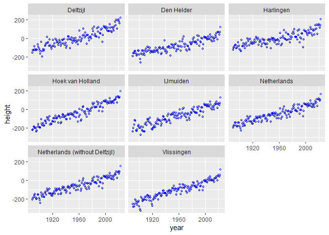
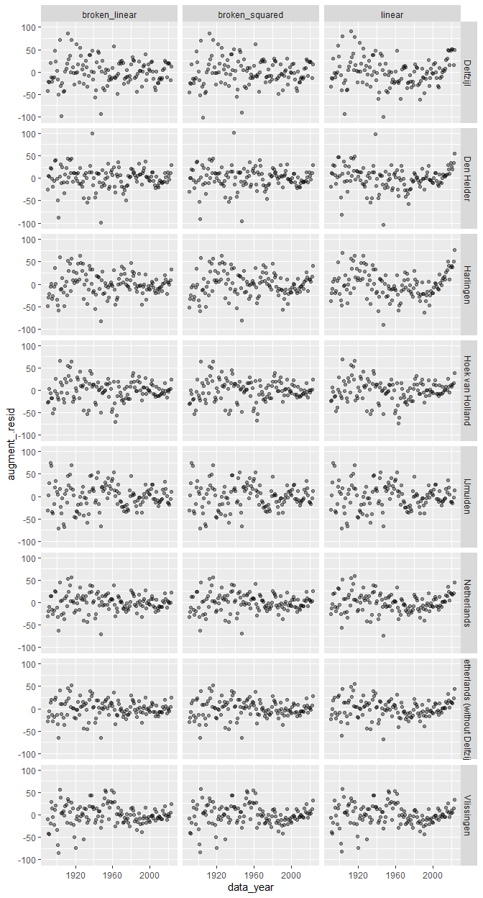
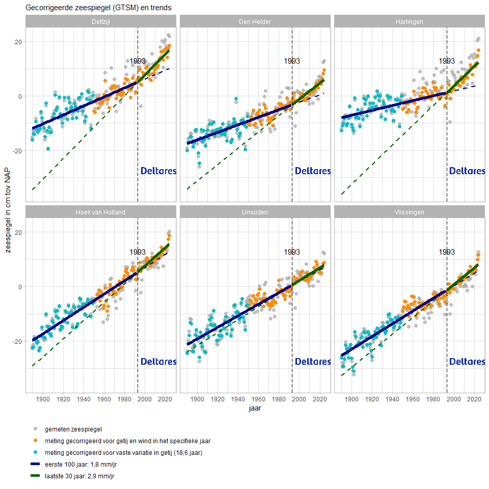
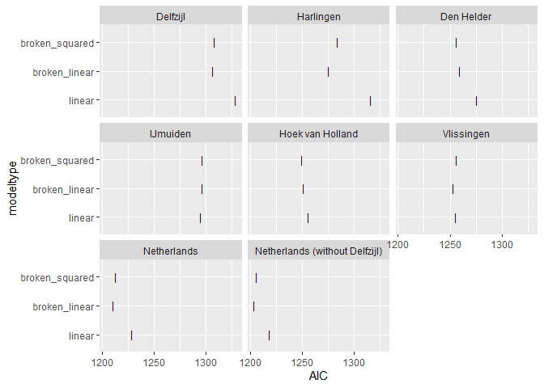

Zeespiegelmonitor analyse
================
Willem Stolte, Nathalie Dees
2024-03-12

# Sea Level Monitor analysis

The Sea Level Monitor methodology is described in detail in Deltares
(2023). Principles are:

- Sea Level is based on yearly averaged sea levels that are reported by
  Rijkswaterstaat to [PSMSL](https://www.psmsl.org) for the six main
  stations.
- The mean of these stations is used to estimate the “current sea-level
  rise”. The measurements since 1890 are taken into account.
  Measurements before that are considered less valid because the
  Amsterdam Ordnance Datum was not yet normalized.
- Sea Level is corrected for yearly fluctuations in *surge* using
  independently modelled surge values from the Global Surge and Tide
  Model (GTSM).
- The trend of Sea Level over the years is fitted with various models
  including nodal tide, with anD without an acceleration term. For the
  models with accelleration terms, the significance of the accelleration
  is tested.
- From the different models a preferred model is chosen based on:
  - lowest AIC (Akaike Information Criteria)
  - significant better fit than the simplest model (linear model)

This document is executed with the following parameters:

``` r
data.frame(
  "name" = names(unlist(params)),
  "value" = unlist(params),
  row.names = NULL
  ) %>%
  knitr::kable(caption = "Values of document parameters")
```

| name               | value                          |
|:-------------------|:-------------------------------|
| monitoryear        | 2025                           |
| startyear          | 1890                           |
| wind_or_surge_type | GTSM                           |
| station1           | Delfzijl                       |
| station2           | Harlingen                      |
| station3           | Den Helder                     |
| station4           | IJmuiden                       |
| station5           | Hoek van Holland               |
| station6           | Vlissingen                     |
| station7           | Netherlands                    |
| station8           | Netherlands (without Delfzijl) |
| modeltype1         | linear                         |
| modeltype2         | broken_linear                  |
| modeltype3         | broken_squared                 |

Values of document parameters

## Get data from PSMSL

Annual average sea level data for the Dutch main stations is downloaded
from the [Permanent Service for Mean Sea Level
site](http://www.psmsl.org) and combined with the Global Tide and Surge
Model (GTSM) annual average surge values. In case PSMSL data is not
available for the most recent year (2025-1)

``` r
# Get data from PSMSL data service
rlr_df <- read_yearly_psmsl_csv(mainstations_df$psmsl_id, filepath = "../../") 
```

In this analysis, measurements over the period 1890 to 2024 are
considered.

``` r
if(params$monitoryear-1 == max(rlr_df$year)){
  cat("Mean annual sea level downloaded from PSMSL are availabale up to ", max(rlr_df$year), ", the time series is up to date. ")
} else {
  cat("Mean annual sea level downloaded from PSMSL are only available up to ", max(rlr_df$year), " and thus incomplete for the current analysis. In order to do a preliminary analysis, measurements from Rijkswatersataat Data Distribution Layer will be used for missing year(s). ")
}
```

Mean annual sea level downloaded from PSMSL are only available up to
2023 and thus incomplete for the current analysis. In order to do a
preliminary analysis, measurements from Rijkswatersataat Data
Distribution Layer will be used for missing year(s).

``` r
# Check if PSMSL is up to date for analysis year

if(max(rlr_df$year) == params$monitoryear-1){
  refreshed_df <- rlr_df
  print("PSMSL time series is up-to-date and is used for analysis")
} else {
  print("The PSMSL time series is not complete. An attempt is made to complete the data using RWS DDL.")
  if(max(rlr_df$year) == params$monitoryear-2){ # robuuster maken. nu alleen check voor een ontbrekend jaar.
    # Check if ddl data from required year exist
    required_file <- file.path("../../data/rijkswaterstaat/ddl/annual_means/", paste0(params$monitoryear-1, ".csv"))
    
    if(file.exists(required_file)){
      ddl_datayear <- read_csv2(required_file) %>%
        filter(
          station %in% mainstations_df$name
        )
      
    } else{
      cat("DDL data for year", params$monitoryear-1, "is not available", sep = " ")
    }
  }
}
```

    FALSE [1] "The PSMSL time series is not complete. An attempt is made to complete the data using RWS DDL."

``` r
# Get GTSM data from local file
gtsm <- read_yearly_gtsm(filename = "../../data/deltares/gtsm/gtsm_surge_annual_mean_main_stations.csv") |>
  mutate(year = year(ymd(t)))
```

``` r
# convert rlr tot nap2005
    refreshed_df <- rlr_df |> 
      mutate(
        height = rlr_height_mm - as.numeric(`nap-rlr`),
      ) |> 
      rename(station = name)

# check if psmsl data need to be completed with ddl data
    try(
      if(
        exists("ddl_datayear") & 
        !unique(ddl_datayear$year) %in% unique(refreshed_df$year)
      ){
        refreshed_df <- refreshed_df |> bind_rows(ddl_datayear)
      },
      silent = T
    )

    refreshed_df <- refreshed_df |>
      left_join(gtsm, by = c(station = "name", year = "year")) |>
      mutate(
        surge_anomaly = case_when(
          year >= 1950 ~ (1000 * surge - mean(1000 * surge, na.rm = T)), # meters to millimeters
          year < 1950 ~ 0
        )
      ) |>
      select(
        year,
        height,
        station,
        surge_anomaly
      ) %>%
      bind_rows(
        . |>
          group_by(year) |>
          summarise(
            height = mean(height, na.rm = T),
            surge_anomaly = mean(surge_anomaly, na.rm = T)
          ) |>
          mutate(
            station = "Netherlands"
          )
      ) %>%
      bind_rows(
        . |>
          filter(station %in% c("Vlissingen", "Hoek van Holland", "Den Helder", "Harlingen", "IJmuiden")) |>
          group_by(year) |>
          summarise(
            height = mean(height, na.rm = T),
            surge_anomaly = mean(surge_anomaly, na.rm = T)
          ) |>
          mutate(
            station = "Netherlands (without Delfzijl)"
          )
      ) |>
      addBreakPoints() %T>%
      write_csv2("../../data/deltares/results/dutch-sea-level-monitor-export-stations-latest.csv") %>%
      filter(year >= params$startyear)
```

### Compare with previous years analysis data

``` r
# previous year did not include gtsm for year 1950.
# Therefore comparison of surge is done for years > 1950

# range(df$surge_anomaly)
# range(refreshed_df$surge_anomaly, na.rm = T)

refreshed_df_filter <- refreshed_df %>% filter(year > 1950 & year < 2023)

ggplot() +
  geom_point(
    data = previous_df, 
    aes(x = year, y = height),
    shape = "+"
  ) +
  geom_point(
    data = refreshed_df, 
    aes(x = year, y = height), 
    color = "blue", 
    shape = 21, 
    fill = "transparent",
    size = 1
  ) +
  facet_wrap(c("station"), ncol = 3)
```

<figure>

<figcaption aria-hidden="true">Comparison of measured sea level with
previous year.</figcaption>
</figure>

``` r
# previous year did not include gtsm for year 1950.
# Therefore comparison of surge is done for years > 1950

# range(df$surge_anomaly)
# range(refreshed_df$surge_anomaly, na.rm = T)

refreshed_df_filter <- refreshed_df %>% filter(year > 1950 & year < 2023)

ggplot() +
  geom_point(
    data = previous_df, 
    aes(x = year, y = surge_anomaly, color = as.character(params$monitoryear-1))
    ) +
  geom_point(
    data = refreshed_df, 
    aes(x = year, y = surge_anomaly, color = as.character(params$monitoryear)), 
    shape = 21, 
    fill = "transparent",
    size = 1
    ) +
  facet_wrap(c("station"), ncol = 3) +
  coord_cartesian(xlim = c(1950, params$monitoryear)) +
  labs(color = "monitor year")
```

<figure>

<figcaption aria-hidden="true">Comparison of GTSM surge anomaly with
previous year.</figcaption>
</figure>

The difference between the gtsm surge anomalies between the years is
caused by the addition of two additional years, 1950 and 2023. The mean
surge for some stations has changed due to this addition, causing the
surge anomaly to move up or down. This has no consequences for the
determination of the sea level trend, but it has effect on the corrected
sea level.

## Locations of the main stations

This document analyses the sea level trend of the main stations in the
Netherlands using different models. Based on geographical coverage and
available time series length six stations are considered to be “main
tide gauge stations”.

Additionally, to calculate the average sea level and sea level trend
along the Dutch Coast, the main station sea level is averaged for each
year (virtual station “Netherlands”). Because the station “Delfzijl” has
a considerable gap in vertical adjustment for subsidence, we also
consider a variant in which Delfzijl is omitted from the main analysis
selection (“Netherlands (without Delfzijl)”).

``` r
map_stations(df = refreshed_df, mainstations_df = mainstations_df, mainstations_locs = mainstations_locs)
```

<figure>

<figcaption aria-hidden="true">Hoofdgetijstations in Nederland. Er is
aangegeven welke stations zijn meegenomen in dit
rekendocument.</figcaption>
</figure>

### Sea level measurements

In this section we look at sea level measurements. The global collection
of tide gauge records at the PSMSL was used to access the data. There
are two types of datasets the “Revised Local Reference” and “Metric”.
For the Netherlands the difference is that the “Revised Local Reference”
undoes the corrections from the NAP correction in 2005, to get a
consistent dataset. Here we transform the RLR back to NAP (without
undoing the correction).

The rlrnap computes the rlr back to latest NAP (ignoring the undoing of
the NAP correction) the alpha paramater is the dominant wind direction
for the stations, based on de Ronde 2013. Id’s are the station ids in
the PSMSL dataset. They may change from year to year as the PSMSL 0
point is arbitary. You can lookup the relevant parameters in the
schematic diagram like this [LRL diagram for station
Vlissingen](https://www.psmsl.org/data/obtaining/rlr.diagrams/20.php)

``` r
knitr::kable(mainstations_df[,c('name', 'psmsl_id', 'msl-rlr', 'msl-nap', 'nap-rlr')], caption = "PSMSL inforamtion on the six mains tide gauge stations in the Netherlands.")
```

| name             | psmsl_id | msl-rlr | msl-nap | nap-rlr |
|:-----------------|:---------|:--------|:--------|:--------|
| Vlissingen       | 20       | 6976    | 46      | 6930    |
| Hoek van Holland | 22       | 6987    | 114     | 6873    |
| Den Helder       | 23       | 6962    | 16      | 6946    |
| Delfzijl         | 24       | 6953    | 130     | 6823    |
| Harlingen        | 25       | 7024    | 110     | 6914    |
| IJmuiden         | 32       | 7014    | 64      | 6950    |

PSMSL inforamtion on the six mains tide gauge stations in the
Netherlands.

Sea level measurements for the six main stations (yearly average) are
shown in figure @ref(fig:zeespiegelmetingen).

``` r
p <- refreshed_df %>%
  dplyr::filter(!grepl("Netherlands", station)) %>%
ggplot(aes(year, height)) +
  geom_point(alpha = 1, aes(color = station), shape = 21, fill = "white", size = 1) +
  geom_line(alpha = 0.5, aes(color = station), linewidth = 0.5) +
  xlab("jaar") + ylab("gemeten zeespiegel in mm") +
  theme_light() +
  theme(legend.position = "bottom")

ggplotly(p) %>% layout(legend = list(x = 0.05, y = 0.95))
```

<figure>

<figcaption aria-hidden="true">Jaarlijks gemiddelde zeespiegel voor de
zes hoofdstations langs de Nederlandse kust.</figcaption>
</figure>

``` r
# p
```

``` r
p <- refreshed_df %>%
  dplyr::filter(grepl("Netherlands", station)) %>%
ggplot(aes(year, height)) +
  geom_point(alpha = 1, aes(color = station), shape = 21, fill = "white", size = 1) +
  geom_line(alpha = 0.5, aes(color = station), linewidth = 0.75) +
  xlab("jaar") + ylab("gemeten zeespiegel in mm") +
  theme_light() +
  theme(legend.position = "bottom")

ggplotly(p) %>% layout(legend = list(x = 0.05, y = 0.95))
```

<figure>

<figcaption aria-hidden="true">Jaarlijks gemiddelde zeespiegel voor
gemiddelde van stations langs de Nederlandse kust.</figcaption>
</figure>

``` r
# p
```

### Sea level high years

``` r
refreshed_df %>%
  filter(year >= 1900) %>%
  dplyr::filter(station == "Netherlands (without Delfzijl)") %>%
  dplyr::arrange(-height) %>%
  dplyr::select(year, station, height_mm = height) %>%
  # dplyr::group_by(station) %>%
  dplyr::slice(c(1:5)) %>%
  knitr::kable(caption = "Overview of the five highest yearly average water levels for the combined station Netherlands (without Delfzijl) in mm during the considered period. ")
```

| year | station                        | height_mm |
|-----:|:-------------------------------|----------:|
| 2024 | Netherlands (without Delfzijl) |     158.2 |
| 2023 | Netherlands (without Delfzijl) |     152.8 |
| 2020 | Netherlands (without Delfzijl) |      96.6 |
| 2022 | Netherlands (without Delfzijl) |      94.6 |
| 2017 | Netherlands (without Delfzijl) |      94.2 |

Overview of the five highest yearly average water levels for the
combined station Netherlands (without Delfzijl) in mm during the
considered period.

### Storm surge

The expected storm surge per year is determined using output of the
Global Tide and Surge Model (GTSM) (ref). This calculates the surge
given the bathymetry and climatic conditions. Model results are
available from 1950 onwards (figure @ref(fig:gtsm-surge)). The model is
run each successive year to calculate the annual average wind and air
pressure for use in the Sea Level Monitor. The calculated variation in
surge (surge anomaly) is subtracted from the measured sea level before
the sea level rise is calculated. For the years before 1950, no runs are
available and sea level is corrected for average surge only. This
correction reduces the variation due to differences in surge per year
and allows a more precise estimate of the long-term trend to be made.

``` r
p <- refreshed_df %>%
  # filter(!grepl("Netherlands", station)) %>%
  # filter(station == "IJmuiden") %>%
ggplot(aes(year, surge_anomaly)) +
  geom_point(alpha = 1, aes(color = station), shape = 21, fill = "white", size = 1) +
  geom_line(alpha = 0.5, aes(color = station), linewidth = 0.75) +
  xlab("jaar") + ylab("windopzet in mm") +
  theme_light() +
  theme(legend.position = "bottom") +
  coord_cartesian(xlim = c(1945, params$monitoryear))

# ggplotly(p) %>% layout(legend = list(x = 0.05, y = 0.95))
p
```

<figure>

<figcaption aria-hidden="true">Modelled surge anomaly (deviation of
storm surge from long year avearge). The yearly averages surge is
calculated for 1950 - now. For earlier years, an average surge is
assumed.</figcaption>
</figure>

## Trend analysis

The sea level trend is calculated using generalized linear regression.
the following models are tested (Deltares 2018 and Deltares 2023):

- linear model
- broken linear model (with breakpoint at 1993)
- broken quadratic model (breakpoint at 1960)

The trend is calculated for all stations individually, for the mean of
all stations (“Netherlands”), and for means of all stations minus
station Delfzijl (“Netherlands without Delfzijl”).

In the regression equation, nodal tide is one of the components and is
estimated as a sinusoid curve with a period of 18.6 years.

``` r
byStation <- refreshed_df %>%
  dplyr::group_by(station) %>%
  tidyr::nest() %>%
  dplyr::ungroup()
```

``` r
selectedmodel <- params$modeltype

models <- byStation %>%
  expand_grid(modeltype = selectedmodel) %>%

  mutate(modelfunctionname = paste(modeltype, "model", sep = "_")) %>%
  # add functions for model calculation
  mutate(modelfunctions = map(modelfunctionname, get)) %>%
  # add models based on data and functions
  mutate(model = pmap(
    list(
      data,
      modelfunctions
    ),
    \(.d, .f) .f(.d)
  )) %>%
  mutate(
    glance = map(model, broom::glance),
    rsq    = glance %>% map_dbl("r.squared"),
    adj.rsq = glance %>% map_dbl("adj.r.squared"),
    AIC    = glance %>% map_dbl("AIC"),
    tidy   = map(model, broom::tidy),
    augment = map(model, broom::augment),
    equation = map(model, function(x) equatiomatic::extract_eq(x, ital_vars = TRUE))
  )
```

``` r
eq <- models %>% 
  distinct(modeltype, equation) %>%
  mutate(equation = paste0("$`", equation, "`$"))

knitr::kable(eq, escape = F)
```

| modeltype | equation |
|:---|:---|
| linear | $`height = \alpha + \beta_{1}(year\ -\ epoch) + \beta_{2}(cos(2\ *\ pi\ *\ (year\ -\ epoch)/(18.613))) + \beta_{3}(sin(2\ *\ pi\ *\ (year\ -\ epoch)/(18.613))) + \epsilon`$ |
| broken_linear | $`height = \alpha + \beta_{1}(year\ -\ epoch) + \beta_{2}(from1993) + \beta_{3}(cos(2\ *\ pi\ *\ (year\ -\ epoch)/(18.613))) + \beta_{4}(sin(2\ *\ pi\ *\ (year\ -\ epoch)/(18.613))) + \epsilon`$ |
| broken_squared | $`height = \alpha + \beta_{1}(year\ -\ epoch) + \beta_{2}(from1960\_square) + \beta_{3}(cos(2\ *\ pi\ *\ (year\ -\ epoch)/(18.613))) + \beta_{4}(sin(2\ *\ pi\ *\ (year\ -\ epoch)/(18.613))) + \epsilon`$ |

## Autocorrelation

Autocorrelation with previous year(s) can sometimes explain part of the
otherwise unexplained variance. Especially when a trend is detected in
the data, autocorrelation with relatively short lags (1 or few years)
often occurs. In case of autocorrelation, we recalculate standard errors
of the estimated parameters accordingly.

``` r
plot_ACF(models)
```

<figure>

<figcaption aria-hidden="true">Autocorrelation plot for selected
stations and models.</figcaption>
</figure>

There appears to be a consistent autocorrelation for all stations and
models with a ‘lag’ of one year. The autocorrelation does not influence
the value of the calculated trend parameters, but needs to be taken into
account when calculating standard errors. The [Newey West autocorrelatie
term](https://search.r-project.org/CRAN/refmans/sandwich/html/NeweyWest.html)
is used to correctly calculate the standard errors.

At station ‘Vlissingen’ there is autocorrelation with a ‘lag’ of 10
years. This could indicate an effect of the 8.8 year ‘lunar perigee
cycle’. Because this only occurs at Vlissingen, this tidal component is
not further accounted for in the analysis.

There is no apparent autocorrelation with a ‘lag’ of 18.6 years, the
‘nodal tide’ cycle. This is because the nodal tide is already
incorporated in the three models.

``` r
require(sandwich)

models <- addHACterms(models)
```

## Heteroskedasticity

### Residuals distribution

The distribution of residuals resembles a normal distribution for most
stations and model variants. Station Harlingen is an example where the
distribution is out of centre when using the linear model. The width of
the residuals distribution is narrower when measurements are corrected
for surge prior to application of the models.

``` r
plotResidualDistribution(models)
```



### Variation of residuals over time

Distribution of residuals should not reveal a clear deviation from a
horizontal line.

``` r
models %>%
  unnest(c(data, augment), names_sep = "_") %>%
  ggplot(aes(data_year, augment_.resid)) +
  geom_point(alpha = 0.4) +
  facet_grid(station ~ modeltype)
```

<!-- -->

## Sea level rise

``` r
lookup <- c(
  Constant = "(Intercept)",
  Trend = "I(year - epoch)",
  u_nodal = "I(cos(2 * pi * (year - epoch)/(18.613)))",
  v_nodal = "I(sin(2 * pi * (year - epoch)/(18.613)))",
  `+ trend 1993` = "from1993",
  `+ square_trend 1960` = "from1960_square",
  AR_term = "previousYearHeight"
)

all_predictions <- makePredictionTable(models, lookup)
```

``` r
ggplot(
  all_predictions,
  aes(x = data_year)
) +
  geom_point(aes(y = data_height), alpha = 0.15) +
  geom_line(aes(y = prediction_recalc)) +
  facet_grid(station ~ modeltype)
```

``` r
  p <- plot_station( 
    predictions_all = all_predictions,
    stationi = unique(all_predictions$station),
    correctionVariant = "GTSM", 
    modelVariant = unique(all_predictions$modeltype), 
    printNumbers = F, 
    startyear = 1890
  ) +
  facet_grid(station ~ modeltype) +
  theme(
    # legend.direction = "horizontal",
    # legend.box = "horizontal",
    legend.position = "bottom", #c(0.975, 0.025),
    # legend.justification = c(1, 0),
    legend.title = element_blank()
  ) +
  theme(strip.text.y = element_text(angle = 90)) 

  
  # ggplotly(p) %>% layout(legend = list(x = 0.05, y = 0.95))
  p
```

<!-- -->

### individual stations

``` r
  p <- plot_station_website(
    predictions_all = all_predictions,
    stationi = unique(all_predictions$station)[!grepl("Netherlands", unique(all_predictions$station))],
    correctionVariant = "GTSM", 
    modelVariant = "broken_linear", 
    printNumbers = F, 
    startyear = 1890
  ) +
  facet_wrap("station", ncol = 3) +
  theme(
    legend.position = "bottom",
    legend.title = element_blank()
  ) +
  theme(strip.text.y = element_text(angle = 90)) 

  
  # ggplotly(p) %>% layout(legend = list(x = 0.05, y = 0.95))
  p
```

<!-- -->

## Parameters

``` r
## gebruik DT in plaats van kableextra
# library(DT)

lookup.df <- data.frame(long_term = unname(lookup),
                        short_term = names(lookup))

parametertable <- models %>%
  select(station, modeltype, tidy) %>% 
  unnest(tidy) %>%
  left_join(models %>%
              select(station, modeltype, tidy.HAC) %>%
              unnest(tidy.HAC),
            by = c(
              station = "station",
              modeltype = "modeltype",
              term = "term.HAC"
            )
  ) %>%
  mutate(across(where(is.numeric), round, 3)) %>%
  left_join(lookup.df, by = c(term = "long_term")) %>%
  select(-term, term = short_term) %>%
  relocate(term, .after = modeltype)

# parametertable %>%
#   DT::datatable(
#     options = list(
#       "digits" = 3
#     )
#   )

write_csv(parametertable, file = paste0("../../results/analysis_output/parameters_", today(), ".csv"))

write_csv(parametertable, file = "../../results/analysis_output/parameters_latest.csv")

  kableExtra::kable(parametertable,
    caption = "Coefficients for all models and stations.",digits = 2
    ) %>%
  kableExtra::scroll_box(height = "500px")
```

<div style="border: 1px solid #ddd; padding: 0px; overflow-y: scroll; height:500px; ">

<table>
<caption>
Coefficients for all models and stations.
</caption>
<thead>
<tr>
<th style="text-align:left;position: sticky; top:0; background-color: #FFFFFF;">
station
</th>
<th style="text-align:left;position: sticky; top:0; background-color: #FFFFFF;">
modeltype
</th>
<th style="text-align:left;position: sticky; top:0; background-color: #FFFFFF;">
term
</th>
<th style="text-align:right;position: sticky; top:0; background-color: #FFFFFF;">
estimate
</th>
<th style="text-align:right;position: sticky; top:0; background-color: #FFFFFF;">
std.error
</th>
<th style="text-align:right;position: sticky; top:0; background-color: #FFFFFF;">
statistic
</th>
<th style="text-align:right;position: sticky; top:0; background-color: #FFFFFF;">
p.value
</th>
<th style="text-align:right;position: sticky; top:0; background-color: #FFFFFF;">
st.err.HAC
</th>
</tr>
</thead>
<tbody>
<tr>
<td style="text-align:left;">
Vlissingen
</td>
<td style="text-align:left;">
linear
</td>
<td style="text-align:left;">
Constant
</td>
<td style="text-align:right;">
-62.80
</td>
<td style="text-align:right;">
2.25
</td>
<td style="text-align:right;">
-27.91
</td>
<td style="text-align:right;">
0.00
</td>
<td style="text-align:right;">
2.41
</td>
</tr>
<tr>
<td style="text-align:left;">
Vlissingen
</td>
<td style="text-align:left;">
linear
</td>
<td style="text-align:left;">
Trend
</td>
<td style="text-align:right;">
2.43
</td>
<td style="text-align:right;">
0.06
</td>
<td style="text-align:right;">
44.22
</td>
<td style="text-align:right;">
0.00
</td>
<td style="text-align:right;">
0.07
</td>
</tr>
<tr>
<td style="text-align:left;">
Vlissingen
</td>
<td style="text-align:left;">
linear
</td>
<td style="text-align:left;">
u_nodal
</td>
<td style="text-align:right;">
5.87
</td>
<td style="text-align:right;">
3.05
</td>
<td style="text-align:right;">
1.93
</td>
<td style="text-align:right;">
0.06
</td>
<td style="text-align:right;">
3.50
</td>
</tr>
<tr>
<td style="text-align:left;">
Vlissingen
</td>
<td style="text-align:left;">
linear
</td>
<td style="text-align:left;">
v_nodal
</td>
<td style="text-align:right;">
-13.09
</td>
<td style="text-align:right;">
2.99
</td>
<td style="text-align:right;">
-4.37
</td>
<td style="text-align:right;">
0.00
</td>
<td style="text-align:right;">
3.75
</td>
</tr>
<tr>
<td style="text-align:left;">
Vlissingen
</td>
<td style="text-align:left;">
broken_linear
</td>
<td style="text-align:left;">
Constant
</td>
<td style="text-align:right;">
-66.66
</td>
<td style="text-align:right;">
2.96
</td>
<td style="text-align:right;">
-22.48
</td>
<td style="text-align:right;">
0.00
</td>
<td style="text-align:right;">
3.02
</td>
</tr>
<tr>
<td style="text-align:left;">
Vlissingen
</td>
<td style="text-align:left;">
broken_linear
</td>
<td style="text-align:left;">
Trend
</td>
<td style="text-align:right;">
2.33
</td>
<td style="text-align:right;">
0.07
</td>
<td style="text-align:right;">
31.70
</td>
<td style="text-align:right;">
0.00
</td>
<td style="text-align:right;">
0.10
</td>
</tr>
<tr>
<td style="text-align:left;">
Vlissingen
</td>
<td style="text-align:left;">
broken_linear
</td>
<td style="text-align:left;">

- trend 1993
  </td>
  <td style="text-align:right;">
  0.71
  </td>
  <td style="text-align:right;">
  0.36
  </td>
  <td style="text-align:right;">
  1.97
  </td>
  <td style="text-align:right;">
  0.05
  </td>
  <td style="text-align:right;">
  0.36
  </td>
  </tr>
  <tr>
  <td style="text-align:left;">
  Vlissingen
  </td>
  <td style="text-align:left;">
  broken_linear
  </td>
  <td style="text-align:left;">
  u_nodal
  </td>
  <td style="text-align:right;">
  5.92
  </td>
  <td style="text-align:right;">
  3.02
  </td>
  <td style="text-align:right;">
  1.96
  </td>
  <td style="text-align:right;">
  0.05
  </td>
  <td style="text-align:right;">
  3.41
  </td>
  </tr>
  <tr>
  <td style="text-align:left;">
  Vlissingen
  </td>
  <td style="text-align:left;">
  broken_linear
  </td>
  <td style="text-align:left;">
  v_nodal
  </td>
  <td style="text-align:right;">
  -12.36
  </td>
  <td style="text-align:right;">
  2.98
  </td>
  <td style="text-align:right;">
  -4.14
  </td>
  <td style="text-align:right;">
  0.00
  </td>
  <td style="text-align:right;">
  3.79
  </td>
  </tr>
  <tr>
  <td style="text-align:left;">
  Vlissingen
  </td>
  <td style="text-align:left;">
  broken_squared
  </td>
  <td style="text-align:left;">
  Constant
  </td>
  <td style="text-align:right;">
  -65.47
  </td>
  <td style="text-align:right;">
  3.78
  </td>
  <td style="text-align:right;">
  -17.32
  </td>
  <td style="text-align:right;">
  0.00
  </td>
  <td style="text-align:right;">
  4.33
  </td>
  </tr>
  <tr>
  <td style="text-align:left;">
  Vlissingen
  </td>
  <td style="text-align:left;">
  broken_squared
  </td>
  <td style="text-align:left;">
  Trend
  </td>
  <td style="text-align:right;">
  2.36
  </td>
  <td style="text-align:right;">
  0.09
  </td>
  <td style="text-align:right;">
  26.23
  </td>
  <td style="text-align:right;">
  0.00
  </td>
  <td style="text-align:right;">
  0.12
  </td>
  </tr>
  <tr>
  <td style="text-align:left;">
  Vlissingen
  </td>
  <td style="text-align:left;">
  broken_squared
  </td>
  <td style="text-align:left;">

  - square_trend 1960
    </td>
    <td style="text-align:right;">
    0.00
    </td>
    <td style="text-align:right;">
    0.00
    </td>
    <td style="text-align:right;">
    0.88
    </td>
    <td style="text-align:right;">
    0.38
    </td>
    <td style="text-align:right;">
    0.00
    </td>
    </tr>
    <tr>
    <td style="text-align:left;">
    Vlissingen
    </td>
    <td style="text-align:left;">
    broken_squared
    </td>
    <td style="text-align:left;">
    u_nodal
    </td>
    <td style="text-align:right;">
    5.86
    </td>
    <td style="text-align:right;">
    3.05
    </td>
    <td style="text-align:right;">
    1.92
    </td>
    <td style="text-align:right;">
    0.06
    </td>
    <td style="text-align:right;">
    3.49
    </td>
    </tr>
    <tr>
    <td style="text-align:left;">
    Vlissingen
    </td>
    <td style="text-align:left;">
    broken_squared
    </td>
    <td style="text-align:left;">
    v_nodal
    </td>
    <td style="text-align:right;">
    -12.80
    </td>
    <td style="text-align:right;">
    3.01
    </td>
    <td style="text-align:right;">
    -4.25
    </td>
    <td style="text-align:right;">
    0.00
    </td>
    <td style="text-align:right;">
    3.79
    </td>
    </tr>
    <tr>
    <td style="text-align:left;">
    Hoek van Holland
    </td>
    <td style="text-align:left;">
    linear
    </td>
    <td style="text-align:left;">
    Constant
    </td>
    <td style="text-align:right;">
    1.64
    </td>
    <td style="text-align:right;">
    2.26
    </td>
    <td style="text-align:right;">
    0.73
    </td>
    <td style="text-align:right;">
    0.47
    </td>
    <td style="text-align:right;">
    2.34
    </td>
    </tr>
    <tr>
    <td style="text-align:left;">
    Hoek van Holland
    </td>
    <td style="text-align:left;">
    linear
    </td>
    <td style="text-align:left;">
    Trend
    </td>
    <td style="text-align:right;">
    2.55
    </td>
    <td style="text-align:right;">
    0.06
    </td>
    <td style="text-align:right;">
    46.38
    </td>
    <td style="text-align:right;">
    0.00
    </td>
    <td style="text-align:right;">
    0.06
    </td>
    </tr>
    <tr>
    <td style="text-align:left;">
    Hoek van Holland
    </td>
    <td style="text-align:left;">
    linear
    </td>
    <td style="text-align:left;">
    u_nodal
    </td>
    <td style="text-align:right;">
    1.32
    </td>
    <td style="text-align:right;">
    3.06
    </td>
    <td style="text-align:right;">
    0.43
    </td>
    <td style="text-align:right;">
    0.67
    </td>
    <td style="text-align:right;">
    3.87
    </td>
    </tr>
    <tr>
    <td style="text-align:left;">
    Hoek van Holland
    </td>
    <td style="text-align:left;">
    linear
    </td>
    <td style="text-align:left;">
    v_nodal
    </td>
    <td style="text-align:right;">
    -9.18
    </td>
    <td style="text-align:right;">
    3.00
    </td>
    <td style="text-align:right;">
    -3.06
    </td>
    <td style="text-align:right;">
    0.00
    </td>
    <td style="text-align:right;">
    3.08
    </td>
    </tr>
    <tr>
    <td style="text-align:left;">
    Hoek van Holland
    </td>
    <td style="text-align:left;">
    broken_linear
    </td>
    <td style="text-align:left;">
    Constant
    </td>
    <td style="text-align:right;">
    -3.29
    </td>
    <td style="text-align:right;">
    2.95
    </td>
    <td style="text-align:right;">
    -1.12
    </td>
    <td style="text-align:right;">
    0.27
    </td>
    <td style="text-align:right;">
    3.22
    </td>
    </tr>
    <tr>
    <td style="text-align:left;">
    Hoek van Holland
    </td>
    <td style="text-align:left;">
    broken_linear
    </td>
    <td style="text-align:left;">
    Trend
    </td>
    <td style="text-align:right;">
    2.43
    </td>
    <td style="text-align:right;">
    0.07
    </td>
    <td style="text-align:right;">
    33.26
    </td>
    <td style="text-align:right;">
    0.00
    </td>
    <td style="text-align:right;">
    0.09
    </td>
    </tr>
    <tr>
    <td style="text-align:left;">
    Hoek van Holland
    </td>
    <td style="text-align:left;">
    broken_linear
    </td>
    <td style="text-align:left;">

    - trend 1993
      </td>
      <td style="text-align:right;">
      0.91
      </td>
      <td style="text-align:right;">
      0.36
      </td>
      <td style="text-align:right;">
      2.53
      </td>
      <td style="text-align:right;">
      0.01
      </td>
      <td style="text-align:right;">
      0.35
      </td>
      </tr>
      <tr>
      <td style="text-align:left;">
      Hoek van Holland
      </td>
      <td style="text-align:left;">
      broken_linear
      </td>
      <td style="text-align:left;">
      u_nodal
      </td>
      <td style="text-align:right;">
      1.39
      </td>
      <td style="text-align:right;">
      3.00
      </td>
      <td style="text-align:right;">
      0.46
      </td>
      <td style="text-align:right;">
      0.64
      </td>
      <td style="text-align:right;">
      3.75
      </td>
      </tr>
      <tr>
      <td style="text-align:left;">
      Hoek van Holland
      </td>
      <td style="text-align:left;">
      broken_linear
      </td>
      <td style="text-align:left;">
      v_nodal
      </td>
      <td style="text-align:right;">
      -8.25
      </td>
      <td style="text-align:right;">
      2.96
      </td>
      <td style="text-align:right;">
      -2.78
      </td>
      <td style="text-align:right;">
      0.01
      </td>
      <td style="text-align:right;">
      3.10
      </td>
      </tr>
      <tr>
      <td style="text-align:left;">
      Hoek van Holland
      </td>
      <td style="text-align:left;">
      broken_squared
      </td>
      <td style="text-align:left;">
      Constant
      </td>
      <td style="text-align:right;">
      -7.07
      </td>
      <td style="text-align:right;">
      3.68
      </td>
      <td style="text-align:right;">
      -1.92
      </td>
      <td style="text-align:right;">
      0.06
      </td>
      <td style="text-align:right;">
      4.26
      </td>
      </tr>
      <tr>
      <td style="text-align:left;">
      Hoek van Holland
      </td>
      <td style="text-align:left;">
      broken_squared
      </td>
      <td style="text-align:left;">
      Trend
      </td>
      <td style="text-align:right;">
      2.35
      </td>
      <td style="text-align:right;">
      0.09
      </td>
      <td style="text-align:right;">
      26.74
      </td>
      <td style="text-align:right;">
      0.00
      </td>
      <td style="text-align:right;">
      0.11
      </td>
      </tr>
      <tr>
      <td style="text-align:left;">
      Hoek van Holland
      </td>
      <td style="text-align:left;">
      broken_squared
      </td>
      <td style="text-align:left;">

      - square_trend 1960
        </td>
        <td style="text-align:right;">
        0.01
        </td>
        <td style="text-align:right;">
        0.00
        </td>
        <td style="text-align:right;">
        2.94
        </td>
        <td style="text-align:right;">
        0.00
        </td>
        <td style="text-align:right;">
        0.00
        </td>
        </tr>
        <tr>
        <td style="text-align:left;">
        Hoek van Holland
        </td>
        <td style="text-align:left;">
        broken_squared
        </td>
        <td style="text-align:left;">
        u_nodal
        </td>
        <td style="text-align:right;">
        1.27
        </td>
        <td style="text-align:right;">
        2.98
        </td>
        <td style="text-align:right;">
        0.43
        </td>
        <td style="text-align:right;">
        0.67
        </td>
        <td style="text-align:right;">
        3.66
        </td>
        </tr>
        <tr>
        <td style="text-align:left;">
        Hoek van Holland
        </td>
        <td style="text-align:left;">
        broken_squared
        </td>
        <td style="text-align:left;">
        v_nodal
        </td>
        <td style="text-align:right;">
        -8.25
        </td>
        <td style="text-align:right;">
        2.94
        </td>
        <td style="text-align:right;">
        -2.81
        </td>
        <td style="text-align:right;">
        0.01
        </td>
        <td style="text-align:right;">
        3.08
        </td>
        </tr>
        <tr>
        <td style="text-align:left;">
        Den Helder
        </td>
        <td style="text-align:left;">
        linear
        </td>
        <td style="text-align:left;">
        Constant
        </td>
        <td style="text-align:right;">
        -56.16
        </td>
        <td style="text-align:right;">
        2.43
        </td>
        <td style="text-align:right;">
        -23.13
        </td>
        <td style="text-align:right;">
        0.00
        </td>
        <td style="text-align:right;">
        2.70
        </td>
        </tr>
        <tr>
        <td style="text-align:left;">
        Den Helder
        </td>
        <td style="text-align:left;">
        linear
        </td>
        <td style="text-align:left;">
        Trend
        </td>
        <td style="text-align:right;">
        1.60
        </td>
        <td style="text-align:right;">
        0.06
        </td>
        <td style="text-align:right;">
        27.02
        </td>
        <td style="text-align:right;">
        0.00
        </td>
        <td style="text-align:right;">
        0.07
        </td>
        </tr>
        <tr>
        <td style="text-align:left;">
        Den Helder
        </td>
        <td style="text-align:left;">
        linear
        </td>
        <td style="text-align:left;">
        u_nodal
        </td>
        <td style="text-align:right;">
        5.73
        </td>
        <td style="text-align:right;">
        3.29
        </td>
        <td style="text-align:right;">
        1.74
        </td>
        <td style="text-align:right;">
        0.08
        </td>
        <td style="text-align:right;">
        3.41
        </td>
        </tr>
        <tr>
        <td style="text-align:left;">
        Den Helder
        </td>
        <td style="text-align:left;">
        linear
        </td>
        <td style="text-align:left;">
        v_nodal
        </td>
        <td style="text-align:right;">
        -14.03
        </td>
        <td style="text-align:right;">
        3.23
        </td>
        <td style="text-align:right;">
        -4.34
        </td>
        <td style="text-align:right;">
        0.00
        </td>
        <td style="text-align:right;">
        4.05
        </td>
        </tr>
        <tr>
        <td style="text-align:left;">
        Den Helder
        </td>
        <td style="text-align:left;">
        broken_linear
        </td>
        <td style="text-align:left;">
        Constant
        </td>
        <td style="text-align:right;">
        -64.92
        </td>
        <td style="text-align:right;">
        3.03
        </td>
        <td style="text-align:right;">
        -21.43
        </td>
        <td style="text-align:right;">
        0.00
        </td>
        <td style="text-align:right;">
        3.10
        </td>
        </tr>
        <tr>
        <td style="text-align:left;">
        Den Helder
        </td>
        <td style="text-align:left;">
        broken_linear
        </td>
        <td style="text-align:left;">
        Trend
        </td>
        <td style="text-align:right;">
        1.38
        </td>
        <td style="text-align:right;">
        0.07
        </td>
        <td style="text-align:right;">
        18.34
        </td>
        <td style="text-align:right;">
        0.00
        </td>
        <td style="text-align:right;">
        0.09
        </td>
        </tr>
        <tr>
        <td style="text-align:left;">
        Den Helder
        </td>
        <td style="text-align:left;">
        broken_linear
        </td>
        <td style="text-align:left;">

        - trend 1993
          </td>
          <td style="text-align:right;">
          1.61
          </td>
          <td style="text-align:right;">
          0.37
          </td>
          <td style="text-align:right;">
          4.38
          </td>
          <td style="text-align:right;">
          0.00
          </td>
          <td style="text-align:right;">
          0.36
          </td>
          </tr>
          <tr>
          <td style="text-align:left;">
          Den Helder
          </td>
          <td style="text-align:left;">
          broken_linear
          </td>
          <td style="text-align:left;">
          u_nodal
          </td>
          <td style="text-align:right;">
          5.85
          </td>
          <td style="text-align:right;">
          3.08
          </td>
          <td style="text-align:right;">
          1.90
          </td>
          <td style="text-align:right;">
          0.06
          </td>
          <td style="text-align:right;">
          3.05
          </td>
          </tr>
          <tr>
          <td style="text-align:left;">
          Den Helder
          </td>
          <td style="text-align:left;">
          broken_linear
          </td>
          <td style="text-align:left;">
          v_nodal
          </td>
          <td style="text-align:right;">
          -12.37
          </td>
          <td style="text-align:right;">
          3.05
          </td>
          <td style="text-align:right;">
          -4.06
          </td>
          <td style="text-align:right;">
          0.00
          </td>
          <td style="text-align:right;">
          3.84
          </td>
          </tr>
          <tr>
          <td style="text-align:left;">
          Den Helder
          </td>
          <td style="text-align:left;">
          broken_squared
          </td>
          <td style="text-align:left;">
          Constant
          </td>
          <td style="text-align:right;">
          -70.51
          </td>
          <td style="text-align:right;">
          3.78
          </td>
          <td style="text-align:right;">
          -18.66
          </td>
          <td style="text-align:right;">
          0.00
          </td>
          <td style="text-align:right;">
          4.08
          </td>
          </tr>
          <tr>
          <td style="text-align:left;">
          Den Helder
          </td>
          <td style="text-align:left;">
          broken_squared
          </td>
          <td style="text-align:left;">
          Trend
          </td>
          <td style="text-align:right;">
          1.26
          </td>
          <td style="text-align:right;">
          0.09
          </td>
          <td style="text-align:right;">
          14.00
          </td>
          <td style="text-align:right;">
          0.00
          </td>
          <td style="text-align:right;">
          0.11
          </td>
          </tr>
          <tr>
          <td style="text-align:left;">
          Den Helder
          </td>
          <td style="text-align:left;">
          broken_squared
          </td>
          <td style="text-align:left;">

          - square_trend 1960
            </td>
            <td style="text-align:right;">
            0.01
            </td>
            <td style="text-align:right;">
            0.00
            </td>
            <td style="text-align:right;">
            4.73
            </td>
            <td style="text-align:right;">
            0.00
            </td>
            <td style="text-align:right;">
            0.00
            </td>
            </tr>
            <tr>
            <td style="text-align:left;">
            Den Helder
            </td>
            <td style="text-align:left;">
            broken_squared
            </td>
            <td style="text-align:left;">
            u_nodal
            </td>
            <td style="text-align:right;">
            5.65
            </td>
            <td style="text-align:right;">
            3.05
            </td>
            <td style="text-align:right;">
            1.85
            </td>
            <td style="text-align:right;">
            0.07
            </td>
            <td style="text-align:right;">
            2.98
            </td>
            </tr>
            <tr>
            <td style="text-align:left;">
            Den Helder
            </td>
            <td style="text-align:left;">
            broken_squared
            </td>
            <td style="text-align:left;">
            v_nodal
            </td>
            <td style="text-align:right;">
            -12.50
            </td>
            <td style="text-align:right;">
            3.01
            </td>
            <td style="text-align:right;">
            -4.15
            </td>
            <td style="text-align:right;">
            0.00
            </td>
            <td style="text-align:right;">
            3.81
            </td>
            </tr>
            <tr>
            <td style="text-align:left;">
            Delfzijl
            </td>
            <td style="text-align:left;">
            linear
            </td>
            <td style="text-align:left;">
            Constant
            </td>
            <td style="text-align:right;">
            24.04
            </td>
            <td style="text-align:right;">
            2.95
            </td>
            <td style="text-align:right;">
            8.16
            </td>
            <td style="text-align:right;">
            0.00
            </td>
            <td style="text-align:right;">
            3.30
            </td>
            </tr>
            <tr>
            <td style="text-align:left;">
            Delfzijl
            </td>
            <td style="text-align:left;">
            linear
            </td>
            <td style="text-align:left;">
            Trend
            </td>
            <td style="text-align:right;">
            1.94
            </td>
            <td style="text-align:right;">
            0.07
            </td>
            <td style="text-align:right;">
            27.05
            </td>
            <td style="text-align:right;">
            0.00
            </td>
            <td style="text-align:right;">
            0.09
            </td>
            </tr>
            <tr>
            <td style="text-align:left;">
            Delfzijl
            </td>
            <td style="text-align:left;">
            linear
            </td>
            <td style="text-align:left;">
            u_nodal
            </td>
            <td style="text-align:right;">
            3.02
            </td>
            <td style="text-align:right;">
            3.99
            </td>
            <td style="text-align:right;">
            0.76
            </td>
            <td style="text-align:right;">
            0.45
            </td>
            <td style="text-align:right;">
            4.76
            </td>
            </tr>
            <tr>
            <td style="text-align:left;">
            Delfzijl
            </td>
            <td style="text-align:left;">
            linear
            </td>
            <td style="text-align:left;">
            v_nodal
            </td>
            <td style="text-align:right;">
            -14.46
            </td>
            <td style="text-align:right;">
            3.92
            </td>
            <td style="text-align:right;">
            -3.69
            </td>
            <td style="text-align:right;">
            0.00
            </td>
            <td style="text-align:right;">
            4.31
            </td>
            </tr>
            <tr>
            <td style="text-align:left;">
            Delfzijl
            </td>
            <td style="text-align:left;">
            broken_linear
            </td>
            <td style="text-align:left;">
            Constant
            </td>
            <td style="text-align:right;">
            12.21
            </td>
            <td style="text-align:right;">
            3.61
            </td>
            <td style="text-align:right;">
            3.38
            </td>
            <td style="text-align:right;">
            0.00
            </td>
            <td style="text-align:right;">
            3.30
            </td>
            </tr>
            <tr>
            <td style="text-align:left;">
            Delfzijl
            </td>
            <td style="text-align:left;">
            broken_linear
            </td>
            <td style="text-align:left;">
            Trend
            </td>
            <td style="text-align:right;">
            1.64
            </td>
            <td style="text-align:right;">
            0.09
            </td>
            <td style="text-align:right;">
            18.36
            </td>
            <td style="text-align:right;">
            0.00
            </td>
            <td style="text-align:right;">
            0.10
            </td>
            </tr>
            <tr>
            <td style="text-align:left;">
            Delfzijl
            </td>
            <td style="text-align:left;">
            broken_linear
            </td>
            <td style="text-align:left;">

            - trend 1993
              </td>
              <td style="text-align:right;">
              2.18
              </td>
              <td style="text-align:right;">
              0.44
              </td>
              <td style="text-align:right;">
              4.96
              </td>
              <td style="text-align:right;">
              0.00
              </td>
              <td style="text-align:right;">
              0.36
              </td>
              </tr>
              <tr>
              <td style="text-align:left;">
              Delfzijl
              </td>
              <td style="text-align:left;">
              broken_linear
              </td>
              <td style="text-align:left;">
              u_nodal
              </td>
              <td style="text-align:right;">
              3.18
              </td>
              <td style="text-align:right;">
              3.68
              </td>
              <td style="text-align:right;">
              0.86
              </td>
              <td style="text-align:right;">
              0.39
              </td>
              <td style="text-align:right;">
              4.41
              </td>
              </tr>
              <tr>
              <td style="text-align:left;">
              Delfzijl
              </td>
              <td style="text-align:left;">
              broken_linear
              </td>
              <td style="text-align:left;">
              v_nodal
              </td>
              <td style="text-align:right;">
              -12.22
              </td>
              <td style="text-align:right;">
              3.63
              </td>
              <td style="text-align:right;">
              -3.36
              </td>
              <td style="text-align:right;">
              0.00
              </td>
              <td style="text-align:right;">
              3.75
              </td>
              </tr>
              <tr>
              <td style="text-align:left;">
              Delfzijl
              </td>
              <td style="text-align:left;">
              broken_squared
              </td>
              <td style="text-align:left;">
              Constant
              </td>
              <td style="text-align:right;">
              6.58
              </td>
              <td style="text-align:right;">
              4.58
              </td>
              <td style="text-align:right;">
              1.44
              </td>
              <td style="text-align:right;">
              0.15
              </td>
              <td style="text-align:right;">
              4.36
              </td>
              </tr>
              <tr>
              <td style="text-align:left;">
              Delfzijl
              </td>
              <td style="text-align:left;">
              broken_squared
              </td>
              <td style="text-align:left;">
              Trend
              </td>
              <td style="text-align:right;">
              1.53
              </td>
              <td style="text-align:right;">
              0.11
              </td>
              <td style="text-align:right;">
              14.02
              </td>
              <td style="text-align:right;">
              0.00
              </td>
              <td style="text-align:right;">
              0.13
              </td>
              </tr>
              <tr>
              <td style="text-align:left;">
              Delfzijl
              </td>
              <td style="text-align:left;">
              broken_squared
              </td>
              <td style="text-align:left;">

              - square_trend 1960
                </td>
                <td style="text-align:right;">
                0.02
                </td>
                <td style="text-align:right;">
                0.00
                </td>
                <td style="text-align:right;">
                4.74
                </td>
                <td style="text-align:right;">
                0.00
                </td>
                <td style="text-align:right;">
                0.00
                </td>
                </tr>
                <tr>
                <td style="text-align:left;">
                Delfzijl
                </td>
                <td style="text-align:left;">
                broken_squared
                </td>
                <td style="text-align:left;">
                u_nodal
                </td>
                <td style="text-align:right;">
                2.92
                </td>
                <td style="text-align:right;">
                3.70
                </td>
                <td style="text-align:right;">
                0.79
                </td>
                <td style="text-align:right;">
                0.43
                </td>
                <td style="text-align:right;">
                4.51
                </td>
                </tr>
                <tr>
                <td style="text-align:left;">
                Delfzijl
                </td>
                <td style="text-align:left;">
                broken_squared
                </td>
                <td style="text-align:left;">
                v_nodal
                </td>
                <td style="text-align:right;">
                -12.60
                </td>
                <td style="text-align:right;">
                3.65
                </td>
                <td style="text-align:right;">
                -3.45
                </td>
                <td style="text-align:right;">
                0.00
                </td>
                <td style="text-align:right;">
                3.72
                </td>
                </tr>
                <tr>
                <td style="text-align:left;">
                Harlingen
                </td>
                <td style="text-align:left;">
                linear
                </td>
                <td style="text-align:left;">
                Constant
                </td>
                <td style="text-align:right;">
                6.03
                </td>
                <td style="text-align:right;">
                2.82
                </td>
                <td style="text-align:right;">
                2.14
                </td>
                <td style="text-align:right;">
                0.03
                </td>
                <td style="text-align:right;">
                3.57
                </td>
                </tr>
                <tr>
                <td style="text-align:left;">
                Harlingen
                </td>
                <td style="text-align:left;">
                linear
                </td>
                <td style="text-align:left;">
                Trend
                </td>
                <td style="text-align:right;">
                1.26
                </td>
                <td style="text-align:right;">
                0.07
                </td>
                <td style="text-align:right;">
                18.34
                </td>
                <td style="text-align:right;">
                0.00
                </td>
                <td style="text-align:right;">
                0.09
                </td>
                </tr>
                <tr>
                <td style="text-align:left;">
                Harlingen
                </td>
                <td style="text-align:left;">
                linear
                </td>
                <td style="text-align:left;">
                u_nodal
                </td>
                <td style="text-align:right;">
                2.29
                </td>
                <td style="text-align:right;">
                3.82
                </td>
                <td style="text-align:right;">
                0.60
                </td>
                <td style="text-align:right;">
                0.55
                </td>
                <td style="text-align:right;">
                4.53
                </td>
                </tr>
                <tr>
                <td style="text-align:left;">
                Harlingen
                </td>
                <td style="text-align:left;">
                linear
                </td>
                <td style="text-align:left;">
                v_nodal
                </td>
                <td style="text-align:right;">
                -11.83
                </td>
                <td style="text-align:right;">
                3.75
                </td>
                <td style="text-align:right;">
                -3.16
                </td>
                <td style="text-align:right;">
                0.00
                </td>
                <td style="text-align:right;">
                4.50
                </td>
                </tr>
                <tr>
                <td style="text-align:left;">
                Harlingen
                </td>
                <td style="text-align:left;">
                broken_linear
                </td>
                <td style="text-align:left;">
                Constant
                </td>
                <td style="text-align:right;">
                -8.75
                </td>
                <td style="text-align:right;">
                3.22
                </td>
                <td style="text-align:right;">
                -2.72
                </td>
                <td style="text-align:right;">
                0.01
                </td>
                <td style="text-align:right;">
                3.25
                </td>
                </tr>
                <tr>
                <td style="text-align:left;">
                Harlingen
                </td>
                <td style="text-align:left;">
                broken_linear
                </td>
                <td style="text-align:left;">
                Trend
                </td>
                <td style="text-align:right;">
                0.89
                </td>
                <td style="text-align:right;">
                0.08
                </td>
                <td style="text-align:right;">
                11.12
                </td>
                <td style="text-align:right;">
                0.00
                </td>
                <td style="text-align:right;">
                0.09
                </td>
                </tr>
                <tr>
                <td style="text-align:left;">
                Harlingen
                </td>
                <td style="text-align:left;">
                broken_linear
                </td>
                <td style="text-align:left;">

                - trend 1993
                  </td>
                  <td style="text-align:right;">
                  2.72
                  </td>
                  <td style="text-align:right;">
                  0.39
                  </td>
                  <td style="text-align:right;">
                  6.95
                  </td>
                  <td style="text-align:right;">
                  0.00
                  </td>
                  <td style="text-align:right;">
                  0.40
                  </td>
                  </tr>
                  <tr>
                  <td style="text-align:left;">
                  Harlingen
                  </td>
                  <td style="text-align:left;">
                  broken_linear
                  </td>
                  <td style="text-align:left;">
                  u_nodal
                  </td>
                  <td style="text-align:right;">
                  2.48
                  </td>
                  <td style="text-align:right;">
                  3.28
                  </td>
                  <td style="text-align:right;">
                  0.76
                  </td>
                  <td style="text-align:right;">
                  0.45
                  </td>
                  <td style="text-align:right;">
                  3.73
                  </td>
                  </tr>
                  <tr>
                  <td style="text-align:left;">
                  Harlingen
                  </td>
                  <td style="text-align:left;">
                  broken_linear
                  </td>
                  <td style="text-align:left;">
                  v_nodal
                  </td>
                  <td style="text-align:right;">
                  -9.04
                  </td>
                  <td style="text-align:right;">
                  3.24
                  </td>
                  <td style="text-align:right;">
                  -2.79
                  </td>
                  <td style="text-align:right;">
                  0.01
                  </td>
                  <td style="text-align:right;">
                  3.67
                  </td>
                  </tr>
                  <tr>
                  <td style="text-align:left;">
                  Harlingen
                  </td>
                  <td style="text-align:left;">
                  broken_squared
                  </td>
                  <td style="text-align:left;">
                  Constant
                  </td>
                  <td style="text-align:right;">
                  -14.44
                  </td>
                  <td style="text-align:right;">
                  4.19
                  </td>
                  <td style="text-align:right;">
                  -3.44
                  </td>
                  <td style="text-align:right;">
                  0.00
                  </td>
                  <td style="text-align:right;">
                  4.61
                  </td>
                  </tr>
                  <tr>
                  <td style="text-align:left;">
                  Harlingen
                  </td>
                  <td style="text-align:left;">
                  broken_squared
                  </td>
                  <td style="text-align:left;">
                  Trend
                  </td>
                  <td style="text-align:right;">
                  0.78
                  </td>
                  <td style="text-align:right;">
                  0.10
                  </td>
                  <td style="text-align:right;">
                  7.80
                  </td>
                  <td style="text-align:right;">
                  0.00
                  </td>
                  <td style="text-align:right;">
                  0.12
                  </td>
                  </tr>
                  <tr>
                  <td style="text-align:left;">
                  Harlingen
                  </td>
                  <td style="text-align:left;">
                  broken_squared
                  </td>
                  <td style="text-align:left;">

                  - square_trend 1960
                    </td>
                    <td style="text-align:right;">
                    0.02
                    </td>
                    <td style="text-align:right;">
                    0.00
                    </td>
                    <td style="text-align:right;">
                    6.08
                    </td>
                    <td style="text-align:right;">
                    0.00
                    </td>
                    <td style="text-align:right;">
                    0.00
                    </td>
                    </tr>
                    <tr>
                    <td style="text-align:left;">
                    Harlingen
                    </td>
                    <td style="text-align:left;">
                    broken_squared
                    </td>
                    <td style="text-align:left;">
                    u_nodal
                    </td>
                    <td style="text-align:right;">
                    2.17
                    </td>
                    <td style="text-align:right;">
                    3.39
                    </td>
                    <td style="text-align:right;">
                    0.64
                    </td>
                    <td style="text-align:right;">
                    0.52
                    </td>
                    <td style="text-align:right;">
                    3.92
                    </td>
                    </tr>
                    <tr>
                    <td style="text-align:left;">
                    Harlingen
                    </td>
                    <td style="text-align:left;">
                    broken_squared
                    </td>
                    <td style="text-align:left;">
                    v_nodal
                    </td>
                    <td style="text-align:right;">
                    -9.65
                    </td>
                    <td style="text-align:right;">
                    3.34
                    </td>
                    <td style="text-align:right;">
                    -2.89
                    </td>
                    <td style="text-align:right;">
                    0.00
                    </td>
                    <td style="text-align:right;">
                    3.81
                    </td>
                    </tr>
                    <tr>
                    <td style="text-align:left;">
                    IJmuiden
                    </td>
                    <td style="text-align:left;">
                    linear
                    </td>
                    <td style="text-align:left;">
                    Constant
                    </td>
                    <td style="text-align:right;">
                    -42.37
                    </td>
                    <td style="text-align:right;">
                    2.60
                    </td>
                    <td style="text-align:right;">
                    -16.27
                    </td>
                    <td style="text-align:right;">
                    0.00
                    </td>
                    <td style="text-align:right;">
                    2.60
                    </td>
                    </tr>
                    <tr>
                    <td style="text-align:left;">
                    IJmuiden
                    </td>
                    <td style="text-align:left;">
                    linear
                    </td>
                    <td style="text-align:left;">
                    Trend
                    </td>
                    <td style="text-align:right;">
                    2.15
                    </td>
                    <td style="text-align:right;">
                    0.06
                    </td>
                    <td style="text-align:right;">
                    33.90
                    </td>
                    <td style="text-align:right;">
                    0.00
                    </td>
                    <td style="text-align:right;">
                    0.08
                    </td>
                    </tr>
                    <tr>
                    <td style="text-align:left;">
                    IJmuiden
                    </td>
                    <td style="text-align:left;">
                    linear
                    </td>
                    <td style="text-align:left;">
                    u_nodal
                    </td>
                    <td style="text-align:right;">
                    10.26
                    </td>
                    <td style="text-align:right;">
                    3.53
                    </td>
                    <td style="text-align:right;">
                    2.91
                    </td>
                    <td style="text-align:right;">
                    0.00
                    </td>
                    <td style="text-align:right;">
                    4.30
                    </td>
                    </tr>
                    <tr>
                    <td style="text-align:left;">
                    IJmuiden
                    </td>
                    <td style="text-align:left;">
                    linear
                    </td>
                    <td style="text-align:left;">
                    v_nodal
                    </td>
                    <td style="text-align:right;">
                    -12.05
                    </td>
                    <td style="text-align:right;">
                    3.46
                    </td>
                    <td style="text-align:right;">
                    -3.48
                    </td>
                    <td style="text-align:right;">
                    0.00
                    </td>
                    <td style="text-align:right;">
                    4.02
                    </td>
                    </tr>
                    <tr>
                    <td style="text-align:left;">
                    IJmuiden
                    </td>
                    <td style="text-align:left;">
                    broken_linear
                    </td>
                    <td style="text-align:left;">
                    Constant
                    </td>
                    <td style="text-align:right;">
                    -43.78
                    </td>
                    <td style="text-align:right;">
                    3.48
                    </td>
                    <td style="text-align:right;">
                    -12.59
                    </td>
                    <td style="text-align:right;">
                    0.00
                    </td>
                    <td style="text-align:right;">
                    3.42
                    </td>
                    </tr>
                    <tr>
                    <td style="text-align:left;">
                    IJmuiden
                    </td>
                    <td style="text-align:left;">
                    broken_linear
                    </td>
                    <td style="text-align:left;">
                    Trend
                    </td>
                    <td style="text-align:right;">
                    2.12
                    </td>
                    <td style="text-align:right;">
                    0.09
                    </td>
                    <td style="text-align:right;">
                    24.57
                    </td>
                    <td style="text-align:right;">
                    0.00
                    </td>
                    <td style="text-align:right;">
                    0.11
                    </td>
                    </tr>
                    <tr>
                    <td style="text-align:left;">
                    IJmuiden
                    </td>
                    <td style="text-align:left;">
                    broken_linear
                    </td>
                    <td style="text-align:left;">

                    - trend 1993
                      </td>
                      <td style="text-align:right;">
                      0.26
                      </td>
                      <td style="text-align:right;">
                      0.42
                      </td>
                      <td style="text-align:right;">
                      0.61
                      </td>
                      <td style="text-align:right;">
                      0.54
                      </td>
                      <td style="text-align:right;">
                      0.37
                      </td>
                      </tr>
                      <tr>
                      <td style="text-align:left;">
                      IJmuiden
                      </td>
                      <td style="text-align:left;">
                      broken_linear
                      </td>
                      <td style="text-align:left;">
                      u_nodal
                      </td>
                      <td style="text-align:right;">
                      10.28
                      </td>
                      <td style="text-align:right;">
                      3.54
                      </td>
                      <td style="text-align:right;">
                      2.90
                      </td>
                      <td style="text-align:right;">
                      0.00
                      </td>
                      <td style="text-align:right;">
                      4.32
                      </td>
                      </tr>
                      <tr>
                      <td style="text-align:left;">
                      IJmuiden
                      </td>
                      <td style="text-align:left;">
                      broken_linear
                      </td>
                      <td style="text-align:left;">
                      v_nodal
                      </td>
                      <td style="text-align:right;">
                      -11.78
                      </td>
                      <td style="text-align:right;">
                      3.50
                      </td>
                      <td style="text-align:right;">
                      -3.37
                      </td>
                      <td style="text-align:right;">
                      0.00
                      </td>
                      <td style="text-align:right;">
                      4.02
                      </td>
                      </tr>
                      <tr>
                      <td style="text-align:left;">
                      IJmuiden
                      </td>
                      <td style="text-align:left;">
                      broken_squared
                      </td>
                      <td style="text-align:left;">
                      Constant
                      </td>
                      <td style="text-align:right;">
                      -43.60
                      </td>
                      <td style="text-align:right;">
                      4.38
                      </td>
                      <td style="text-align:right;">
                      -9.94
                      </td>
                      <td style="text-align:right;">
                      0.00
                      </td>
                      <td style="text-align:right;">
                      4.68
                      </td>
                      </tr>
                      <tr>
                      <td style="text-align:left;">
                      IJmuiden
                      </td>
                      <td style="text-align:left;">
                      broken_squared
                      </td>
                      <td style="text-align:left;">
                      Trend
                      </td>
                      <td style="text-align:right;">
                      2.12
                      </td>
                      <td style="text-align:right;">
                      0.10
                      </td>
                      <td style="text-align:right;">
                      20.31
                      </td>
                      <td style="text-align:right;">
                      0.00
                      </td>
                      <td style="text-align:right;">
                      0.14
                      </td>
                      </tr>
                      <tr>
                      <td style="text-align:left;">
                      IJmuiden
                      </td>
                      <td style="text-align:left;">
                      broken_squared
                      </td>
                      <td style="text-align:left;">

                      - square_trend 1960
                        </td>
                        <td style="text-align:right;">
                        0.00
                        </td>
                        <td style="text-align:right;">
                        0.00
                        </td>
                        <td style="text-align:right;">
                        0.35
                        </td>
                        <td style="text-align:right;">
                        0.73
                        </td>
                        <td style="text-align:right;">
                        0.00
                        </td>
                        </tr>
                        <tr>
                        <td style="text-align:left;">
                        IJmuiden
                        </td>
                        <td style="text-align:left;">
                        broken_squared
                        </td>
                        <td style="text-align:left;">
                        u_nodal
                        </td>
                        <td style="text-align:right;">
                        10.26
                        </td>
                        <td style="text-align:right;">
                        3.54
                        </td>
                        <td style="text-align:right;">
                        2.90
                        </td>
                        <td style="text-align:right;">
                        0.00
                        </td>
                        <td style="text-align:right;">
                        4.32
                        </td>
                        </tr>
                        <tr>
                        <td style="text-align:left;">
                        IJmuiden
                        </td>
                        <td style="text-align:left;">
                        broken_squared
                        </td>
                        <td style="text-align:left;">
                        v_nodal
                        </td>
                        <td style="text-align:right;">
                        -11.92
                        </td>
                        <td style="text-align:right;">
                        3.50
                        </td>
                        <td style="text-align:right;">
                        -3.41
                        </td>
                        <td style="text-align:right;">
                        0.00
                        </td>
                        <td style="text-align:right;">
                        4.00
                        </td>
                        </tr>
                        <tr>
                        <td style="text-align:left;">
                        Netherlands
                        </td>
                        <td style="text-align:left;">
                        linear
                        </td>
                        <td style="text-align:left;">
                        Constant
                        </td>
                        <td style="text-align:right;">
                        -21.61
                        </td>
                        <td style="text-align:right;">
                        2.04
                        </td>
                        <td style="text-align:right;">
                        -10.61
                        </td>
                        <td style="text-align:right;">
                        0.00
                        </td>
                        <td style="text-align:right;">
                        2.25
                        </td>
                        </tr>
                        <tr>
                        <td style="text-align:left;">
                        Netherlands
                        </td>
                        <td style="text-align:left;">
                        linear
                        </td>
                        <td style="text-align:left;">
                        Trend
                        </td>
                        <td style="text-align:right;">
                        1.99
                        </td>
                        <td style="text-align:right;">
                        0.05
                        </td>
                        <td style="text-align:right;">
                        40.07
                        </td>
                        <td style="text-align:right;">
                        0.00
                        </td>
                        <td style="text-align:right;">
                        0.06
                        </td>
                        </tr>
                        <tr>
                        <td style="text-align:left;">
                        Netherlands
                        </td>
                        <td style="text-align:left;">
                        linear
                        </td>
                        <td style="text-align:left;">
                        u_nodal
                        </td>
                        <td style="text-align:right;">
                        4.75
                        </td>
                        <td style="text-align:right;">
                        2.76
                        </td>
                        <td style="text-align:right;">
                        1.72
                        </td>
                        <td style="text-align:right;">
                        0.09
                        </td>
                        <td style="text-align:right;">
                        3.06
                        </td>
                        </tr>
                        <tr>
                        <td style="text-align:left;">
                        Netherlands
                        </td>
                        <td style="text-align:left;">
                        linear
                        </td>
                        <td style="text-align:left;">
                        v_nodal
                        </td>
                        <td style="text-align:right;">
                        -12.44
                        </td>
                        <td style="text-align:right;">
                        2.71
                        </td>
                        <td style="text-align:right;">
                        -4.59
                        </td>
                        <td style="text-align:right;">
                        0.00
                        </td>
                        <td style="text-align:right;">
                        3.10
                        </td>
                        </tr>
                        <tr>
                        <td style="text-align:left;">
                        Netherlands
                        </td>
                        <td style="text-align:left;">
                        broken_linear
                        </td>
                        <td style="text-align:left;">
                        Constant
                        </td>
                        <td style="text-align:right;">
                        -29.20
                        </td>
                        <td style="text-align:right;">
                        2.53
                        </td>
                        <td style="text-align:right;">
                        -11.55
                        </td>
                        <td style="text-align:right;">
                        0.00
                        </td>
                        <td style="text-align:right;">
                        2.35
                        </td>
                        </tr>
                        <tr>
                        <td style="text-align:left;">
                        Netherlands
                        </td>
                        <td style="text-align:left;">
                        broken_linear
                        </td>
                        <td style="text-align:left;">
                        Trend
                        </td>
                        <td style="text-align:right;">
                        1.80
                        </td>
                        <td style="text-align:right;">
                        0.06
                        </td>
                        <td style="text-align:right;">
                        28.68
                        </td>
                        <td style="text-align:right;">
                        0.00
                        </td>
                        <td style="text-align:right;">
                        0.07
                        </td>
                        </tr>
                        <tr>
                        <td style="text-align:left;">
                        Netherlands
                        </td>
                        <td style="text-align:left;">
                        broken_linear
                        </td>
                        <td style="text-align:left;">

                        - trend 1993
                          </td>
                          <td style="text-align:right;">
                          1.40
                          </td>
                          <td style="text-align:right;">
                          0.31
                          </td>
                          <td style="text-align:right;">
                          4.55
                          </td>
                          <td style="text-align:right;">
                          0.00
                          </td>
                          <td style="text-align:right;">
                          0.28
                          </td>
                          </tr>
                          <tr>
                          <td style="text-align:left;">
                          Netherlands
                          </td>
                          <td style="text-align:left;">
                          broken_linear
                          </td>
                          <td style="text-align:left;">
                          u_nodal
                          </td>
                          <td style="text-align:right;">
                          4.85
                          </td>
                          <td style="text-align:right;">
                          2.57
                          </td>
                          <td style="text-align:right;">
                          1.88
                          </td>
                          <td style="text-align:right;">
                          0.06
                          </td>
                          <td style="text-align:right;">
                          2.77
                          </td>
                          </tr>
                          <tr>
                          <td style="text-align:left;">
                          Netherlands
                          </td>
                          <td style="text-align:left;">
                          broken_linear
                          </td>
                          <td style="text-align:left;">
                          v_nodal
                          </td>
                          <td style="text-align:right;">
                          -11.00
                          </td>
                          <td style="text-align:right;">
                          2.54
                          </td>
                          <td style="text-align:right;">
                          -4.32
                          </td>
                          <td style="text-align:right;">
                          0.00
                          </td>
                          <td style="text-align:right;">
                          2.86
                          </td>
                          </tr>
                          <tr>
                          <td style="text-align:left;">
                          Netherlands
                          </td>
                          <td style="text-align:left;">
                          broken_squared
                          </td>
                          <td style="text-align:left;">
                          Constant
                          </td>
                          <td style="text-align:right;">
                          -32.42
                          </td>
                          <td style="text-align:right;">
                          3.22
                          </td>
                          <td style="text-align:right;">
                          -10.07
                          </td>
                          <td style="text-align:right;">
                          0.00
                          </td>
                          <td style="text-align:right;">
                          3.17
                          </td>
                          </tr>
                          <tr>
                          <td style="text-align:left;">
                          Netherlands
                          </td>
                          <td style="text-align:left;">
                          broken_squared
                          </td>
                          <td style="text-align:left;">
                          Trend
                          </td>
                          <td style="text-align:right;">
                          1.74
                          </td>
                          <td style="text-align:right;">
                          0.08
                          </td>
                          <td style="text-align:right;">
                          22.59
                          </td>
                          <td style="text-align:right;">
                          0.00
                          </td>
                          <td style="text-align:right;">
                          0.09
                          </td>
                          </tr>
                          <tr>
                          <td style="text-align:left;">
                          Netherlands
                          </td>
                          <td style="text-align:left;">
                          broken_squared
                          </td>
                          <td style="text-align:left;">

                          - square_trend 1960
                            </td>
                            <td style="text-align:right;">
                            0.01
                            </td>
                            <td style="text-align:right;">
                            0.00
                            </td>
                            <td style="text-align:right;">
                            4.18
                            </td>
                            <td style="text-align:right;">
                            0.00
                            </td>
                            <td style="text-align:right;">
                            0.00
                            </td>
                            </tr>
                            <tr>
                            <td style="text-align:left;">
                            Netherlands
                            </td>
                            <td style="text-align:left;">
                            broken_squared
                            </td>
                            <td style="text-align:left;">
                            u_nodal
                            </td>
                            <td style="text-align:right;">
                            4.69
                            </td>
                            <td style="text-align:right;">
                            2.60
                            </td>
                            <td style="text-align:right;">
                            1.80
                            </td>
                            <td style="text-align:right;">
                            0.07
                            </td>
                            <td style="text-align:right;">
                            2.83
                            </td>
                            </tr>
                            <tr>
                            <td style="text-align:left;">
                            Netherlands
                            </td>
                            <td style="text-align:left;">
                            broken_squared
                            </td>
                            <td style="text-align:left;">
                            v_nodal
                            </td>
                            <td style="text-align:right;">
                            -11.29
                            </td>
                            <td style="text-align:right;">
                            2.57
                            </td>
                            <td style="text-align:right;">
                            -4.40
                            </td>
                            <td style="text-align:right;">
                            0.00
                            </td>
                            <td style="text-align:right;">
                            2.88
                            </td>
                            </tr>
                            <tr>
                            <td style="text-align:left;">
                            Netherlands (without Delfzijl)
                            </td>
                            <td style="text-align:left;">
                            linear
                            </td>
                            <td style="text-align:left;">
                            Constant
                            </td>
                            <td style="text-align:right;">
                            -30.73
                            </td>
                            <td style="text-align:right;">
                            1.96
                            </td>
                            <td style="text-align:right;">
                            -15.65
                            </td>
                            <td style="text-align:right;">
                            0.00
                            </td>
                            <td style="text-align:right;">
                            2.15
                            </td>
                            </tr>
                            <tr>
                            <td style="text-align:left;">
                            Netherlands (without Delfzijl)
                            </td>
                            <td style="text-align:left;">
                            linear
                            </td>
                            <td style="text-align:left;">
                            Trend
                            </td>
                            <td style="text-align:right;">
                            2.00
                            </td>
                            <td style="text-align:right;">
                            0.05
                            </td>
                            <td style="text-align:right;">
                            41.76
                            </td>
                            <td style="text-align:right;">
                            0.00
                            </td>
                            <td style="text-align:right;">
                            0.06
                            </td>
                            </tr>
                            <tr>
                            <td style="text-align:left;">
                            Netherlands (without Delfzijl)
                            </td>
                            <td style="text-align:left;">
                            linear
                            </td>
                            <td style="text-align:left;">
                            u_nodal
                            </td>
                            <td style="text-align:right;">
                            5.10
                            </td>
                            <td style="text-align:right;">
                            2.66
                            </td>
                            <td style="text-align:right;">
                            1.92
                            </td>
                            <td style="text-align:right;">
                            0.06
                            </td>
                            <td style="text-align:right;">
                            2.96
                            </td>
                            </tr>
                            <tr>
                            <td style="text-align:left;">
                            Netherlands (without Delfzijl)
                            </td>
                            <td style="text-align:left;">
                            linear
                            </td>
                            <td style="text-align:left;">
                            v_nodal
                            </td>
                            <td style="text-align:right;">
                            -12.04
                            </td>
                            <td style="text-align:right;">
                            2.61
                            </td>
                            <td style="text-align:right;">
                            -4.61
                            </td>
                            <td style="text-align:right;">
                            0.00
                            </td>
                            <td style="text-align:right;">
                            3.00
                            </td>
                            </tr>
                            <tr>
                            <td style="text-align:left;">
                            Netherlands (without Delfzijl)
                            </td>
                            <td style="text-align:left;">
                            broken_linear
                            </td>
                            <td style="text-align:left;">
                            Constant
                            </td>
                            <td style="text-align:right;">
                            -37.48
                            </td>
                            <td style="text-align:right;">
                            2.47
                            </td>
                            <td style="text-align:right;">
                            -15.20
                            </td>
                            <td style="text-align:right;">
                            0.00
                            </td>
                            <td style="text-align:right;">
                            2.33
                            </td>
                            </tr>
                            <tr>
                            <td style="text-align:left;">
                            Netherlands (without Delfzijl)
                            </td>
                            <td style="text-align:left;">
                            broken_linear
                            </td>
                            <td style="text-align:left;">
                            Trend
                            </td>
                            <td style="text-align:right;">
                            1.83
                            </td>
                            <td style="text-align:right;">
                            0.06
                            </td>
                            <td style="text-align:right;">
                            29.90
                            </td>
                            <td style="text-align:right;">
                            0.00
                            </td>
                            <td style="text-align:right;">
                            0.07
                            </td>
                            </tr>
                            <tr>
                            <td style="text-align:left;">
                            Netherlands (without Delfzijl)
                            </td>
                            <td style="text-align:left;">
                            broken_linear
                            </td>
                            <td style="text-align:left;">

                            - trend 1993
                              </td>
                              <td style="text-align:right;">
                              1.24
                              </td>
                              <td style="text-align:right;">
                              0.30
                              </td>
                              <td style="text-align:right;">
                              4.14
                              </td>
                              <td style="text-align:right;">
                              0.00
                              </td>
                              <td style="text-align:right;">
                              0.29
                              </td>
                              </tr>
                              <tr>
                              <td style="text-align:left;">
                              Netherlands (without Delfzijl)
                              </td>
                              <td style="text-align:left;">
                              broken_linear
                              </td>
                              <td style="text-align:left;">
                              u_nodal
                              </td>
                              <td style="text-align:right;">
                              5.18
                              </td>
                              <td style="text-align:right;">
                              2.51
                              </td>
                              <td style="text-align:right;">
                              2.06
                              </td>
                              <td style="text-align:right;">
                              0.04
                              </td>
                              <td style="text-align:right;">
                              2.71
                              </td>
                              </tr>
                              <tr>
                              <td style="text-align:left;">
                              Netherlands (without Delfzijl)
                              </td>
                              <td style="text-align:left;">
                              broken_linear
                              </td>
                              <td style="text-align:left;">
                              v_nodal
                              </td>
                              <td style="text-align:right;">
                              -10.76
                              </td>
                              <td style="text-align:right;">
                              2.48
                              </td>
                              <td style="text-align:right;">
                              -4.33
                              </td>
                              <td style="text-align:right;">
                              0.00
                              </td>
                              <td style="text-align:right;">
                              2.83
                              </td>
                              </tr>
                              <tr>
                              <td style="text-align:left;">
                              Netherlands (without Delfzijl)
                              </td>
                              <td style="text-align:left;">
                              broken_squared
                              </td>
                              <td style="text-align:left;">
                              Constant
                              </td>
                              <td style="text-align:right;">
                              -40.22
                              </td>
                              <td style="text-align:right;">
                              3.14
                              </td>
                              <td style="text-align:right;">
                              -12.81
                              </td>
                              <td style="text-align:right;">
                              0.00
                              </td>
                              <td style="text-align:right;">
                              3.19
                              </td>
                              </tr>
                              <tr>
                              <td style="text-align:left;">
                              Netherlands (without Delfzijl)
                              </td>
                              <td style="text-align:left;">
                              broken_squared
                              </td>
                              <td style="text-align:left;">
                              Trend
                              </td>
                              <td style="text-align:right;">
                              1.77
                              </td>
                              <td style="text-align:right;">
                              0.07
                              </td>
                              <td style="text-align:right;">
                              23.71
                              </td>
                              <td style="text-align:right;">
                              0.00
                              </td>
                              <td style="text-align:right;">
                              0.09
                              </td>
                              </tr>
                              <tr>
                              <td style="text-align:left;">
                              Netherlands (without Delfzijl)
                              </td>
                              <td style="text-align:left;">
                              broken_squared
                              </td>
                              <td style="text-align:left;">

                              - square_trend 1960
                                </td>
                                <td style="text-align:right;">
                                0.01
                                </td>
                                <td style="text-align:right;">
                                0.00
                                </td>
                                <td style="text-align:right;">
                                3.76
                                </td>
                                <td style="text-align:right;">
                                0.00
                                </td>
                                <td style="text-align:right;">
                                0.00
                                </td>
                                </tr>
                                <tr>
                                <td style="text-align:left;">
                                Netherlands (without Delfzijl)
                                </td>
                                <td style="text-align:left;">
                                broken_squared
                                </td>
                                <td style="text-align:left;">
                                u_nodal
                                </td>
                                <td style="text-align:right;">
                                5.04
                                </td>
                                <td style="text-align:right;">
                                2.54
                                </td>
                                <td style="text-align:right;">
                                1.99
                                </td>
                                <td style="text-align:right;">
                                0.05
                                </td>
                                <td style="text-align:right;">
                                2.75
                                </td>
                                </tr>
                                <tr>
                                <td style="text-align:left;">
                                Netherlands (without Delfzijl)
                                </td>
                                <td style="text-align:left;">
                                broken_squared
                                </td>
                                <td style="text-align:left;">
                                v_nodal
                                </td>
                                <td style="text-align:right;">
                                -11.03
                                </td>
                                <td style="text-align:right;">
                                2.50
                                </td>
                                <td style="text-align:right;">
                                -4.40
                                </td>
                                <td style="text-align:right;">
                                0.00
                                </td>
                                <td style="text-align:right;">
                                2.86
                                </td>
                                </tr>
                                </tbody>
                                </table>
                                </div>

## Which model is the preferred model?

### Is there a significant acceleration?

``` r
acc_broken_linear <- parametertable %>%
  filter(modeltype == "broken_linear") %>%
  filter(term == "+ trend 1993") %>%
  select(station, p.value )
knitr::kable(acc_broken_linear, caption = "p-values for the acceleration term in the broken linear model for all stations. ")
```

| station                        | p.value |
|:-------------------------------|--------:|
| Vlissingen                     |   0.051 |
| Hoek van Holland               |   0.012 |
| Den Helder                     |   0.000 |
| Delfzijl                       |   0.000 |
| Harlingen                      |   0.000 |
| IJmuiden                       |   0.541 |
| Netherlands                    |   0.000 |
| Netherlands (without Delfzijl) |   0.000 |

p-values for the acceleration term in the broken linear model for all
stations.

For the broken linear model, there is a significant acceleration
starting in the year 1993 when fitting the average sea level combined
for all stations without Delfzijl. For individual stations, the
acceleration is not significant for the stations Vlissingen, Hoek van
Holland and IJmuiden.

``` r
acc_broken_squared <- parametertable %>%
  filter(modeltype == "broken_squared") %>%
  filter(term == "+ square_trend 1960") %>%
  select(station, p.value )
knitr::kable(acc_broken_squared, caption = "p-vallues for the acceleration term in the broken squared model for all stations. ")
```

| station                        | p.value |
|:-------------------------------|--------:|
| Vlissingen                     |   0.382 |
| Hoek van Holland               |   0.004 |
| Den Helder                     |   0.000 |
| Delfzijl                       |   0.000 |
| Harlingen                      |   0.000 |
| IJmuiden                       |   0.729 |
| Netherlands                    |   0.000 |
| Netherlands (without Delfzijl) |   0.000 |

p-vallues for the acceleration term in the broken squared model for all
stations.

For the broken squared model, there is a significant acceleration
starting in the year 1960 when fitting the average sea level combined
for all stations without Delfzijl. For individual stations, the
acceleration is not significant for the stations Vlissingen, Hoek van
Holland and IJmuiden.

### Which model has the lowest Akaike Information Criterion (AIC)?

Of the two models with an acceleration term, the model with lowest AIC
is the preferred model.

``` r
models %>%
  # filter(station == "Netherlands (without Delfzijl)") |>
  mutate(station = as.character(station)) %>%
  select(station, modeltype, AIC) %>%
  # unite(`modeltype x station`, modeltype, station) %>%
  arrange(-AIC) %>% 
  mutate(modeltype = factor(modeltype, levels=config$runparameters$modeltype)) %>%
  mutate(station = factor(station, levels=config$runparameters$station)) %>%
  ggplot(aes(x = modeltype, y = AIC)) +
  geom_point(size = 3, shape = "|") +
  coord_flip() +
  facet_wrap("station")
```

<!-- -->

For the combined stations Netherlands and Netherlands (without
Delfzijl), the non-linear model has the lowest AIC, and is therefore the
first candidate for the preferred model. In the next section, it is
tested whether the non-linear model explains the observed variation
significantly better than the simplest model, the linear model.

For stations Den Helder and Hoek van Holland, the broken squared model
is the model with lowest AIC.

At station IJmuiden, all three models have similar AIC.

Considering all stations, the broken linear and the broken squared model
describe the observed variation approximately equally well.

### Is the preferred model significantly better than the linear model?

The broken linear model is chosen as the preferred candidate because it
gave a better explanation of the observation, corrected for the degrees
of freedom of the model (AIC criterion). Here, it is tested whether the
broken linear model is *significantly* better model that the most simple
model, the broken linear model.

``` r
# extract models to compare
bl <- models %>% 
  filter(
    station == "Netherlands (without Delfzijl)",
    modeltype == "broken_linear"
  ) %>%
  select(model) %>% unlist(recursive = F) %>% unname()

l <- models %>% 
  filter(
    station == "Netherlands (without Delfzijl)",
    modeltype == "linear"
  ) %>%
  select(model) %>% unlist(recursive = F) %>% unname()

# create anova table
t <- anova(l[[1]], bl[[1]])
# extract p value from table
p_value <- t$`Pr(>F)`[2]

if(p_value<0.01) {
  alternativemodelaccepted = TRUE
  alternativemodelrefused = FALSE
}
```

The Anova table for model comparison is shown below.

``` r
makePrettyAnovaTable(t, 3)
```

| Res.Df |   RSS |  Df | Sum of Sq |    F |        p |
|-------:|------:|----:|----------:|-----:|---------:|
|    131 | 61200 |     |           |      |          |
|    130 | 54100 |   1 |      7130 | 17.2 | 6.16e-05 |

The acceleration model (broken linear) has one more degree of freedom
than the linear model. The broken linear model is significantly better
than the linear model (p \< 0.001).

## Conclusions

Based on the above analysis, the following conclusions are drawn:

Based on variance analysis the broken linear model is significantly
better than the linear model. the broken linear model is accepted as the
preferred model.

</div>
