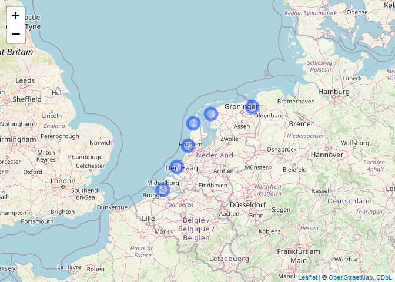
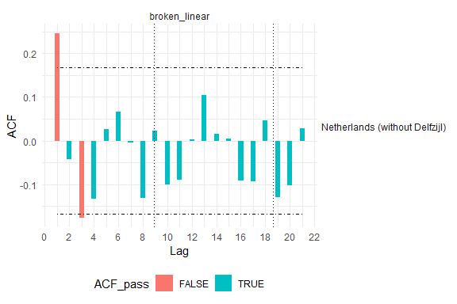
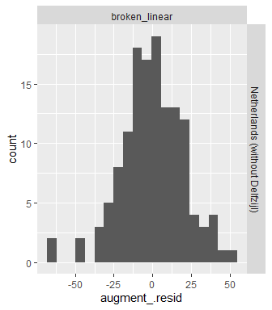
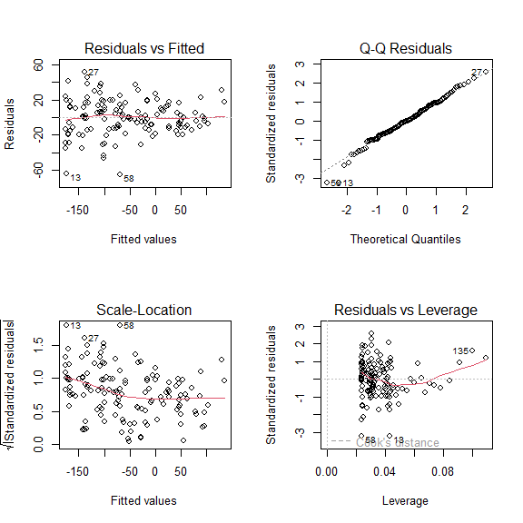
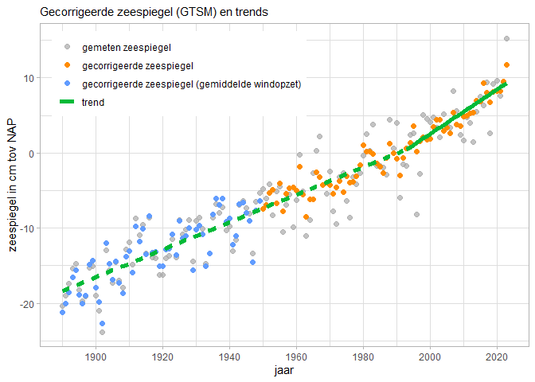
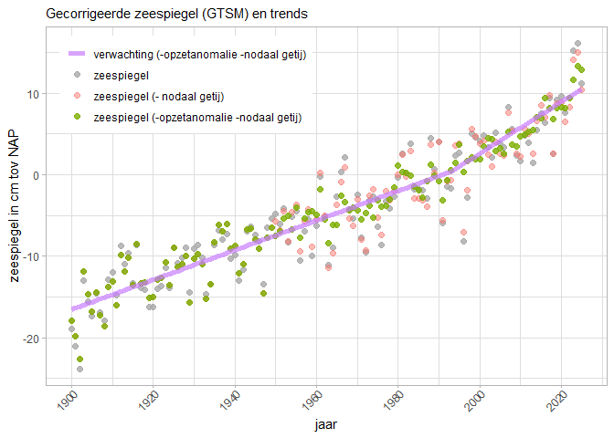
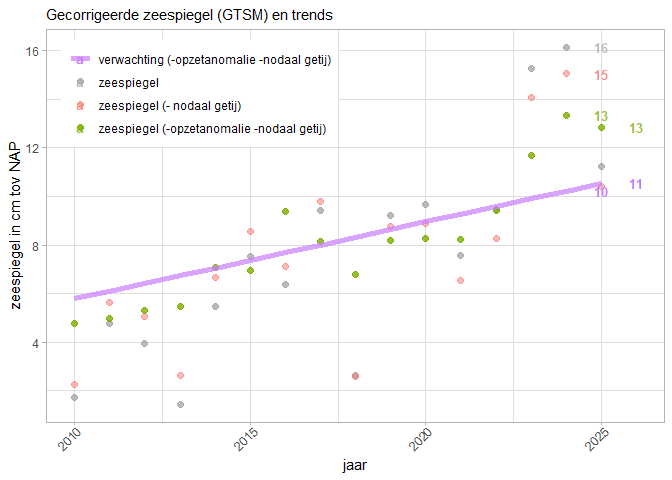
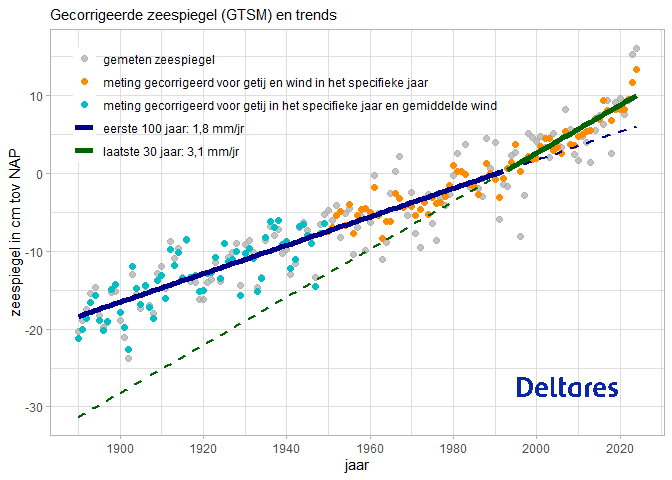

Zeespiegelmonitor
================
Willem Stolte, Nathalie Dees
2024-03-12

## Inleiding

De zeespiegelmonitor bepaalt voor elk jaar de stand van zaken rond de
zeespiegel aan de Nederlandse kust. Het bevat primair de indicatoren
gemiddelde zeespiegel en zeespiegelstijging.

Zeespiegelgegevens worden verzameld door Rijkswaterstaat en jaarlijks
doorgegeven aan de Permanent Service for Mean Sea Level
([PSMSL](https://www.psmsl.org)). Deze gegevens zijn de basis voor de
Zeespiegelmonitor.

``` r
  df <- read_csv2(file.path("../", "../data/deltares/results/dutch-sea-level-monitor-export-stations-latest.csv")) %>%
  filter(station %in% params$station) %>%
  filter(year >= 1890)
```

### Zeespiegelmetingen

Maandelijks en jaarlijks gemiddelde waterhoogtegegevens worden ingelezen
via [PSMSL](https://psmsl.org/data/obtaining/) voor de Nederlandse
hoofdstations. PSMSL geeft waterhoogtes ten opzichte van “revised local
reference”. Deze moet per station worden teruggerekend naar waterhoogte
t.o.v. NAP 2005, waarna de waterhoogtes per jaar worden gemiddeld over
de stations Harlingen, Den Helder, IJmuiden, Hoek van Holland,
Vlissingen. Station Delfzijl wordt op dit moment niet meegenomen omdat
het een aantal jaren niet gekoppeld is geweest aan het NAP
referentievlak. De verkregen gemiddelde waterhoogte over de laatste 10
jaren is te zien in tabel @ref(tab:metingenView).

``` r
df %>% 
  arrange(-year) %>%
  select(
    year, 
    `height in mm`  = height, 
    station) %>%
  head(10) %>%
  kableExtra::kable(caption = "Zeespiegelhoogte in mm over de laatste 10 jaar")
```

| year | height in mm | station                        |
|-----:|-------------:|:-------------------------------|
| 2023 |        152.8 | Netherlands (without Delfzijl) |
| 2022 |         94.6 | Netherlands (without Delfzijl) |
| 2021 |         75.8 | Netherlands (without Delfzijl) |
| 2020 |         96.6 | Netherlands (without Delfzijl) |
| 2019 |         92.0 | Netherlands (without Delfzijl) |
| 2018 |         26.2 | Netherlands (without Delfzijl) |
| 2017 |         94.2 | Netherlands (without Delfzijl) |
| 2016 |         63.6 | Netherlands (without Delfzijl) |
| 2015 |         75.2 | Netherlands (without Delfzijl) |
| 2014 |         54.8 | Netherlands (without Delfzijl) |

Zeespiegelhoogte in mm over de laatste 10 jaar

### Windopzet

Windopzet wordt berekend voor de zes hoofdstations met het Global Tide
and Surge Model (GTSM). Het gemiddelde over stations Netherlands
(without Delfzijl) per jaar is de windopzet per jaar. Hieruit wordt de
windopzetanomalie berekend als de windopzet gedeeld door de gemiddelde
windopzet over alle jaren die beschikbaar zijn (1950 - nu). Deze
windopzetanomalie wordt gebruikt om de variatie in het zeespiegelsignaal
ten gevolge van windopzet zo veel mogelijk weg te nemen.Hierdoor kan er
preciezer een schatting van de trend en eventueel een trendbreuk worden
gevonden.

``` r
df %>% 
  arrange(-year) %>%
  select(year, 
         `opzetanomalie in mm`  = surge_anomaly, 
         station) %>%
  head(10) %>%
  mutate(`opzetanomalie in mm` = signif(`opzetanomalie in mm`, 2)) %>%
  kableExtra::kable(caption = "Opzetanomalie (de afwijking in opzet van het langjarige gemiddelde) berekend door GTSM in mm over de laatste 10 jaar")
```

| year | opzetanomalie in mm | station                        |
|-----:|--------------------:|:-------------------------------|
| 2023 |                24.0 | Netherlands (without Delfzijl) |
| 2022 |               -12.0 | Netherlands (without Delfzijl) |
| 2021 |               -17.0 | Netherlands (without Delfzijl) |
| 2020 |                 6.2 | Netherlands (without Delfzijl) |
| 2019 |                 5.9 | Netherlands (without Delfzijl) |
| 2018 |               -42.0 | Netherlands (without Delfzijl) |
| 2017 |                17.0 | Netherlands (without Delfzijl) |
| 2016 |               -23.0 | Netherlands (without Delfzijl) |
| 2015 |                16.0 | Netherlands (without Delfzijl) |
| 2014 |                -4.0 | Netherlands (without Delfzijl) |

Opzetanomalie (de afwijking in opzet van het langjarige gemiddelde)
berekend door GTSM in mm over de laatste 10 jaar

## Keuze van stations

De Zeespiegelmonitor heeft als doel om een overzicht te geven van de
zeespiegel en -stijging voor de gehele Nederlandse kust. Hiervoor worden
in principe de 6 hoofdstations gemiddeld. In de Zeespiegelmonitor (2023)
is geconstateerd dat de waarden voor Delfzijl de laatste 15-20 jaar niet
aan dezelfde standaard voldoen als voor de overige stations. in de
tussentijd zijn correcties uitgevoerd voor deze meetwaarden. Deze zijn
nog niet in deze Zeespiegelmonitor opgenomen. Op dit moment wordt dus
gerekend met de vijf resterende stations. We noemen dit virtuele station
Netherlands (without Delfzijl).

``` r
map_stations(df = df, mainstations_df = mainstations_df, mainstations_locs = mainstations_locs)
```

<figure>

<figcaption aria-hidden="true">Hoofdgetijstations in Nederland. Er is
aangegeven welke stations zijn meegenomen in dit
rekendocument.</figcaption>
</figure>

## Is er een versnelling?

Om de zeespiegelstijging over de laatste 10-15 jaar correct te berekenen
wordt er rekening mee gehouden dat er in de loop van de tijd een
verandering (versnelling) van de zeespiegel is geweest. Deze versnelling
is lang niet gevonden in de Nederlandse metingen (Zeespiegelmonitor
2018). Vanaf 2021 is deze versnelling wel waargenomen (Zeespiegelmonitor
2023). In het rekendocument
[“Sealevelanalysis”](https://github.com/Deltares-research/sealevelmonitor/blob/main/analysis/sealevelmonitor/sealevelanalysis.md)
is uitgezocht welk model het voorkeursmodel is voor de bepaling van de
huidige zeespiegelstijging. Op dit moment worden de volgende modellen
getest:

- lineair model (geen versnelling)
- gebroken lineair model (met versnelde stijging vanaf 1993)
- gebroken kwadratisch model (met versnelling vanaf 1960)

De keuze voor model wordt gedaan op basis van 3 criteria:

- Er moet een significant betere fit zijn t.o.v. het meest simpele model
  (lineair)
- De versnellingsterm moet significant zijn
- De AIC waarde is lager dan van de overige modellen

Uit het analysedocument is gebleken:

``` r
selectedmodel <- params$modeltype
cat("Het voorkeursmodel voor de bepaling van de huidige zeespiegelstijging is het ", selectedmodel, " model.")
```

Het voorkeursmodel voor de bepaling van de huidige zeespiegelstijging is
het broken_linear model. In voorliggend rekendocument wordt daarom
gerekend met het broken_linear modeltype en gegevens van het (virtuele)
station Netherlands (without Delfzijl).

``` r
selectedmodel <- params$modeltype

models <- df %>%
  dplyr::group_by(station) %>%
  tidyr::nest() %>%
  dplyr::ungroup() %>%
  #### add model names for selected model(s)
  expand_grid(modeltype = selectedmodel) %>%
  #### parse function names based on selected model()
  mutate(modelfunctionname = paste(modeltype, "model", sep = "_")) %>%
  #### add functions for model calculation
  mutate(modelfunctions = map(modelfunctionname, get)) %>%
  #### add models based on data and functions
  mutate(model = pmap(
    list(
      data,
      modelfunctions
    ),
    \(.d, .f) .f(.d)
  )) %>%
  #### add output parameters and predictions
  mutate(
    glance = map(model, broom::glance),
    rsq    = glance %>% map_dbl("r.squared"),
    adj.rsq = glance %>% map_dbl("adj.r.squared"),
    AIC    = glance %>% map_dbl("AIC"),
    tidy   = map(model, broom::tidy),
    augment = map(model, broom::augment),
    equation = map(model, function(x) equatiomatic::extract_eq(x))
  )
```

### Omgaan met autocorrelatie

Autocorrelatie is de kruiscorrelatie van een functie of signaal met
zichzelf ([wikipedia](https://nl.wikipedia.org/wiki/Autocorrelatie)). In
het zeespiegelsignaal voor alle hoofdstations is een consistente
autocorrelatie met een ‘lag’ van 1 jaar gevonden (zie rekendocument
[Sealevelanalysis](https://github.com/Deltares-research/sealevelmonitor/blob/main/analysis/sealevelmonitor/sealevelanalysis.md)).
Dit is niet ongebruikelijk voor lange tijdseries die een trend vertonen.
Hierdoor kan niet alle variatie worden toegekend aan het model zelf, en
moet de standaardfout van de modelparameters worden gecorrigeerd voor de
autocorrelatie. Dit gebeurt met een [Newey West
autocorrelatieterm](https://search.r-project.org/CRAN/refmans/sandwich/html/NeweyWest.html).

``` r
plot_ACF(models)
```

<figure>

<figcaption aria-hidden="true">Autocorrelatiediagram voor de gebruikte
meetreeks. De rode kolommen geven een significante autocorrelatie aan.
Autocorrelatie met een lag van 1 jaar is de enige die consistent is over
alle stations en modellen.</figcaption>
</figure>

``` r
require(sandwich)

models <- addHACterms(models)
```

## Heteroskedasticity

Er wordt gecontroleerd of de verdeling van de residuen regelmatig is
verdeeld over de tijd en over de te schatten waarde.

### Residuals distribution

``` r
models %>%
  unnest(c(data, augment), names_sep = "_") %>%
ggplot(aes(x = augment_.resid)) +
  geom_histogram(bins = 20, stat = ) +
                  facet_grid(station ~ modeltype)
```

<div class="figure" style="text-align: center">


<p class="caption">
De verdeling (histogram) van de residuen.
</p>

</div>

## Variation of residuals over time

Bij een geschikt model verwachten we een regelmatige verdeling van
residuen over de tijd. Wanneer deze sterk afwijkt dan kan dat een
aanwijzing zijn dat het model niet geschikt is, of dat bepaalde
correcties niet goed zijn uitgevoerd.

``` r
models %>%
  unnest(c(data, augment), names_sep = "_") %>% #str(max.level = 2)
ggplot(aes(data_year, augment_.resid)) +
  geom_point(alpha = 0.4) +
  facet_grid(station ~ modeltype) #+
```

<figure>

<figcaption aria-hidden="true">De verdeling van residuwaarden uitgezet
tegen de tijd in jaren.</figcaption>
</figure>

## Sea level rise

``` r
lookup <- c(
  Constant = "(Intercept)",
  Trend = "I(year - epoch)",
  u_nodal = "I(cos(2 * pi * (year - epoch)/(18.613)))",
  v_nodal = "I(sin(2 * pi * (year - epoch)/(18.613)))",
  `+ trend 1993` = "from1993",
  `+ square_trend 1960` = "from1960_square",
  AR_term = "previousYearHeight"
)

all_predictions <- makePredictionTable(models, lookup)
```

``` r
uitvoer_df <- all_predictions %>% 
  mutate(
    `data_height (-nodal -surge anomaly)` = `data_height-surge_anomaly`-nodal_tide,
    `preds_height (-nodal -surge anomaly)` = `preds_height-surge_anomaly`-nodal_tide
  ) %>%
  select(
    station,
    modeltype,
    jaar = data_year,
    `gemeten waterhoogte` = data_height,
    `gecorrigeerde waterhoogte` = `data_height (-nodal -surge anomaly)`,
     `fit`= `preds_height (-nodal -surge anomaly)`
  ) 

write_csv(uitvoer_df, file = "../../results/plotdata2024.csv")

p = plot_station_website(
    stationi = params$station,
    predictions_all = all_predictions %>% 
      filter(station == params$station) %>%
      filter(modeltype == params$modeltype), 
    correctionVariant = params$wind_or_surge_type, 
    modelVariant = params$modeltype, 
    printNumbers = F,
    plotVline = F,
    startyear = 1890)

p
```

<!-- -->

``` r
ggsave(paste0("../../results/sl_web_", params$station, params$modeltype, ".png"), width = 8, height = 5)
```

``` r
p <- plot_station(
  stationi = params$station,
    predictions_all = all_predictions %>% 
      filter(station == params$station) %>%
      filter(modeltype == params$modeltype), 
    correctionVariant = params$wind_or_surge_type, 
    modelVariant = params$modeltype, 
    printNumbers = F)

  ggplotly(p) %>% layout(legend = list(x = 0.05, y = 0.95))
```

<!-- -->

``` r
  # p
```

``` r
p <- plot_station( 
  stationi = params$station,
    predictions_all = all_predictions %>% 
      filter(station == params$station) %>%
      filter(modeltype == params$modeltype), 
    correctionVariant = params$wind_or_surge_type, 
    modelVariant = params$modeltype, 
    printNumbers = T,
    plotVline = F,
    startyear = 2010)

  ggplotly(p) %>% layout(legend = list(x = 0.05, y = 0.95))
```

<!-- -->

``` r
  # p
```

``` r
p = plot_station_website(
    stationi = params$station,
    predictions_all = all_predictions %>% 
      filter(station == params$station) %>%
      filter(modeltype == params$modeltype), 
    correctionVariant = params$wind_or_surge_type, 
    modelVariant = params$modeltype, 
    printNumbers = F,
    plotVline = F,
    startyear = 1890)

p
```

<!-- -->

``` r
ggsave(paste0("../../results/sl_web_", params$station, params$modeltype, ".png"), width = 8, height = 5)
```

## Trend parameters

For the preferred station Netherlands (without Delfzijl) and model
broken_linear, the following set of parameters have been found.

``` r
library(DT)

lookup.df <- data.frame(long_term = unname(lookup),
                        short_term = names(lookup))

parameterTable <- models %>%
  select(station, modeltype, tidy) %>% 
  unnest(tidy) %>%
  left_join(models %>%
              select(station, modeltype, tidy.HAC) %>%
              unnest(tidy.HAC),
            by = c(
              station = "station",
              modeltype = "modeltype",
              term = "term.HAC"
            )
              ) %>%
  mutate(across(where(is.numeric), round, 3)) %>%
  left_join(lookup.df, by = c(term = "long_term")) %>%
  select(
    short_term,
    estimate,
    st.err.HAC,
    p.value
  )

# DT::datatable(parameterTable, caption = "Parameters en standaardfouten voor het voorkeursmodel en -station.",
#   options = list(
#       "digits" = 2
#     )
#   )

  kableExtra::kable(
    parameterTable,
    caption = "Coefficients for all models and stations.",digits = 2
    )
```

| short_term    | estimate | st.err.HAC | p.value |
|:--------------|---------:|-----------:|--------:|
| Constant      |   -37.35 |       2.30 |    0.00 |
| Trend         |     1.83 |       0.07 |    0.00 |
| \+ trend 1993 |     1.11 |       0.26 |    0.00 |
| u_nodal       |     4.70 |       2.68 |    0.06 |
| v_nodal       |   -10.64 |       2.82 |    0.00 |

Coefficients for all models and stations.

``` r
zeespiegel2023_cm <- df$height[df$year==params$monitoryear-1]/10
zeespiegel_gem_getij_gem_opzet_cm <- all_predictions %>% 
  filter(data_year == 2023) %>%
  mutate(zsp_nod_surge = (`data_height-surge_anomaly` - nodal_tide)/10) %>%
  select(zsp_nod_surge) %>% unlist %>% unname

if(params$modeltype == "broken_linear"){
  trend_message = cat(
    "## Uitspraken over de zeespiegel trend",
    paste("De lineaire trend tot 1993 bedraagt", 
          round(parameterTable$estimate[parameterTable$short_term == "Trend"], 1), 
          " +/- ", 
          round(parameterTable$st.err.HAC[parameterTable$short_term == "Trend"], 1), 
          "mm/jaar."),
    paste("De extra trend na 1993 bedraagt", 
          round(parameterTable$estimate[parameterTable$short_term == "+ trend 1993"], 1), 
          " +/- ", 
          round(parameterTable$st.err.HAC[parameterTable$short_term == "+ trend 1993"], 1), 
          "mm/jaar."),
    paste("Na 1993 is de totale trend verhoogd en bedraagt", 
          round(parameterTable$estimate[parameterTable$short_term == "Trend"], 1) +
            round(parameterTable$st.err.HAC[parameterTable$short_term == "Trend"], 1), 
          " +/- ", 
          round(parameterTable$st.err.HAC[parameterTable$short_term == "Trend"], 1) +
            round(parameterTable$st.err.HAC[parameterTable$short_term == "+ trend 1993"], 1), 
          "mm/jaar."),
    sep = "\n\n"
  )
}
```

## Uitspraken over de zeespiegel trend

De lineaire trend tot 1993 bedraagt 1.8 +/- 0.1 mm/jaar.

De extra trend na 1993 bedraagt 1.1 +/- 0.3 mm/jaar.

Na 1993 is de totale trend verhoogd en bedraagt 1.9 +/- 0.4 mm/jaar.

``` r
print(trend_message)
```

NULL

<!-- ### Uitspraken over de stand van de zeespiegel in 2023. -->
<!-- In 2023 was de gemiddelde zeespiegel 152.8 cm tov NAP (2005). -->
<!-- Gecorrigeerd voor de afwijking van een gemiddeld nodaal getij en windopzet was de zeespiegel in 2023 12 cm tov NAP (2005).  -->
<!-- Gerekend met het voorkeursmodel, broken_linear en station Netherlands (without Delfzijl) zijn de volgende trends vastgesteld:  -->

## Vergelijking met de analyse van vorig jaar.

| station | zeespiegel (1970) | trend (voor 1993) | se | trend (vanaf 1993) |  |
|---:|:--:|:--:|:--:|:--:|:--:|
| Netherlands (without Delfzijl) | -39.3 | 1.8 | 0.1 | 2.9 | 0.4 |
