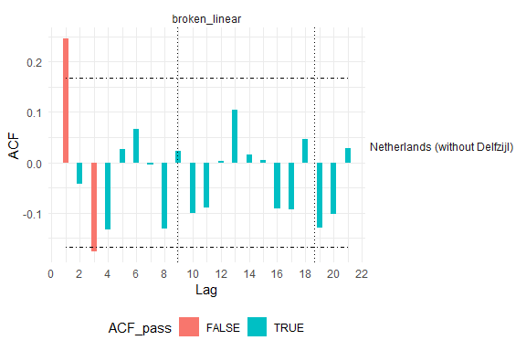
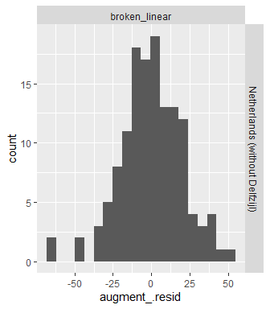
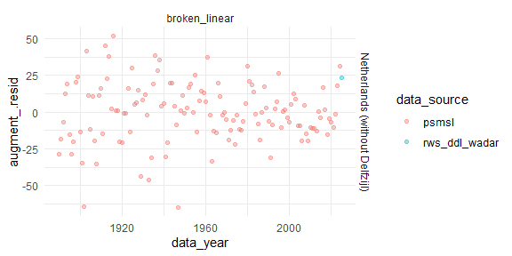
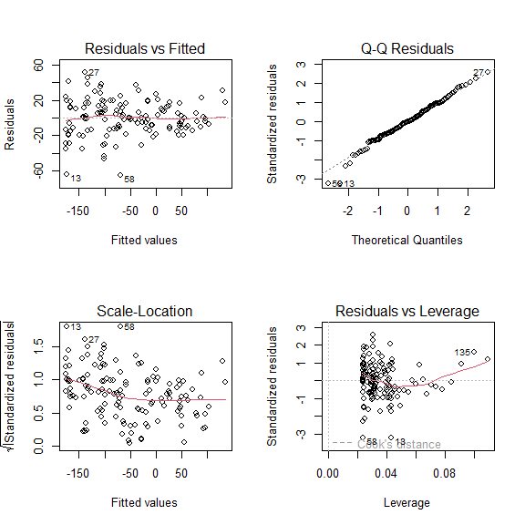
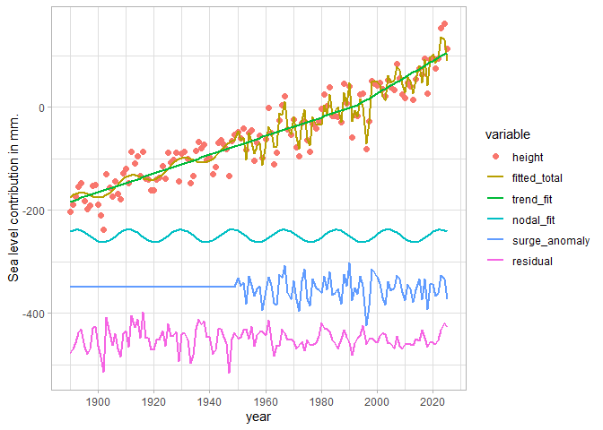
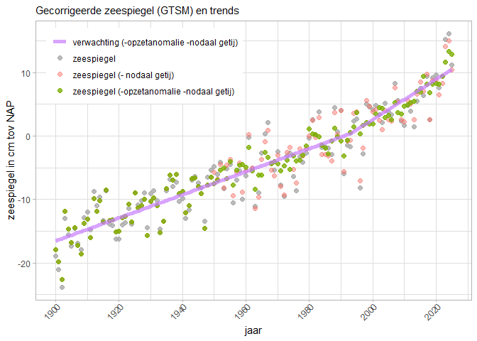
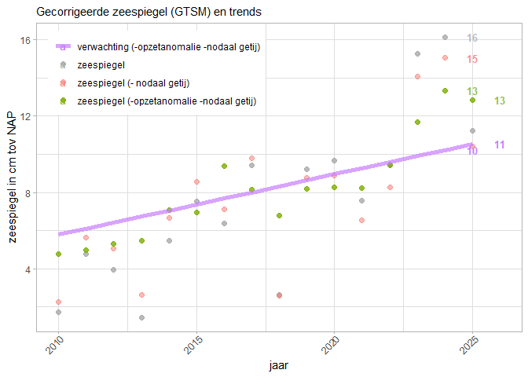
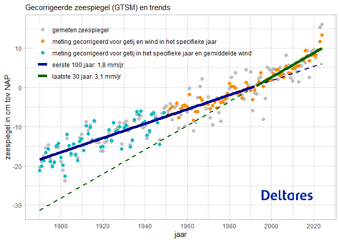

Zeespiegelmonitor
================
Willem Stolte, Nathalie Dees
15 April, 2026

## Inleiding

De zeespiegelmonitor bepaalt voor elk jaar de stand van zaken rond de
zeespiegel aan de Nederlandse kust. Het bevat primair de indicatoren
gemiddelde zeespiegel en zeespiegelstijging.

Zeespiegelgegevens worden verzameld door Rijkswaterstaat en jaarlijks
doorgegeven aan de Permanent Service for Mean Sea Level
([PSMSL](https://www.psmsl.org)). Deze gegevens zijn de basis voor de
Zeespiegelmonitor.

``` r
  df <- read_delim(
    file.path(
  "../../data/deltares/input/psmsl_gtsm_yr-latest.csv"),
    delim = ";") %>%
  filter(station %in% params$station) %>%
  filter(year >= params$startyear) %>%
  filter(
    case_when(
      !params$include_ddl ~ source == "psmsl",
              TRUE ~ TRUE)
  )
```

### Zeespiegelmetingen

Maandelijks en jaarlijks gemiddelde waterhoogtegegevens worden ingelezen
via [PSMSL](https://psmsl.org/data/obtaining/) voor de Nederlandse
hoofdstations. PSMSL geeft waterhoogtes ten opzichte van “revised local
reference”. Deze moet per station worden teruggerekend naar waterhoogte
t.o.v. NAP 2005, waarna de waterhoogtes per jaar worden gemiddeld over
de stations Harlingen, Den Helder, IJmuiden, Hoek van Holland,
Vlissingen. Station Delfzijl wordt op dit moment niet meegenomen omdat
het een aantal jaren niet gekoppeld is geweest aan het NAP
referentievlak. De verkregen gemiddelde waterhoogte over de laatste 10
jaren is te zien in tabel @ref(tab:metingenView).

``` r
df %>% 
  arrange(-year) %>%
  dplyr::select(
    year, 
    `height in mm`  = height, 
    station
    ) %>%
  head(10) %>%
  kableExtra::kable(caption = "Zeespiegelhoogte in mm over de laatste 10 jaar")
```

| year | height in mm | station                        |
|-----:|-------------:|:-------------------------------|
| 2025 |     112.5181 | Netherlands (without Delfzijl) |
| 2024 |     161.4000 | Netherlands (without Delfzijl) |
| 2023 |     152.8000 | Netherlands (without Delfzijl) |
| 2022 |      94.6000 | Netherlands (without Delfzijl) |
| 2021 |      75.8000 | Netherlands (without Delfzijl) |
| 2020 |      96.6000 | Netherlands (without Delfzijl) |
| 2019 |      92.0000 | Netherlands (without Delfzijl) |
| 2018 |      26.2000 | Netherlands (without Delfzijl) |
| 2017 |      94.2000 | Netherlands (without Delfzijl) |
| 2016 |      63.6000 | Netherlands (without Delfzijl) |

Zeespiegelhoogte in mm over de laatste 10 jaar

### Windopzet

De hoeveelheid windopzet aan de Nederlandse kust varieert sterk van jaar
tot jaar. Daarom worden zeespiegelstanden gecorrigeerd voor windopzet.
Dit is nodig om een zuiverder signaal van de zeespiegel te kunnen
gebruiken in de analyse. Windopzet wordt berekend voor de zes
hoofdstations met het Global Tide and Surge Model (GTSM). In deze
analyse wordt de windopzet voor Netherlands (without Delfzijl) berekend
als gemiddelde over de bijdragende stations. Daarna wordt de
windopzetanomalie berekend als de windopzet gedeeld door de gemiddelde
windopzet over alle jaren die beschikbaar zijn (1950 - nu). Deze
windopzetanomalie wordt gebruikt om de variatie in het zeespiegelsignaal
ten gevolge van windopzet zo veel mogelijk weg te nemen. Hierdoor kan er
preciezer een schatting van de trend en eventueel een trendbreuk worden
gevonden.

``` r
df %>% 
  arrange(-year) %>%
  dplyr::select(year, 
         `opzetanomalie in mm`  = surge_anomaly, 
         station) %>%
  head(10) %>%
  mutate(`opzetanomalie in mm` = signif(`opzetanomalie in mm`, 2)) %>%
  kableExtra::kable(caption = "Opzetanomalie (de afwijking in opzet van het langjarige gemiddelde) berekend door GTSM in mm over de laatste 10 jaar")
```

| year | opzetanomalie in mm | station                        |
|-----:|--------------------:|:-------------------------------|
| 2025 |               -24.0 | Netherlands (without Delfzijl) |
| 2024 |                17.0 | Netherlands (without Delfzijl) |
| 2023 |                24.0 | Netherlands (without Delfzijl) |
| 2022 |               -12.0 | Netherlands (without Delfzijl) |
| 2021 |               -17.0 | Netherlands (without Delfzijl) |
| 2020 |                 6.2 | Netherlands (without Delfzijl) |
| 2019 |                 5.9 | Netherlands (without Delfzijl) |
| 2018 |               -42.0 | Netherlands (without Delfzijl) |
| 2017 |                17.0 | Netherlands (without Delfzijl) |
| 2016 |               -23.0 | Netherlands (without Delfzijl) |

Opzetanomalie (de afwijking in opzet van het langjarige gemiddelde)
berekend door GTSM in mm over de laatste 10 jaar

## Keuze van stations

De Zeespiegelmonitor heeft als doel om een overzicht te geven van de
zeespiegel en -stijging voor de gehele Nederlandse kust. Hiervoor worden
in principe de 6 hoofdstations gemiddeld. In de Zeespiegelmonitor (2023)
is geconstateerd dat de waarden voor Delfzijl de laatste 15-20 jaar niet
aan dezelfde standaard voldoen als voor de overige stations. in de
tussentijd zijn correcties uitgevoerd voor deze meetwaarden. Deze zijn
nog niet in deze Zeespiegelmonitor opgenomen. Op dit moment wordt dus
gerekend met de vijf resterende stations. We noemen dit virtuele station
““.

## Is er een versnelling?

Om de zeespiegelstijging over de laatste 10-15 jaar correct te berekenen
wordt er rekening mee gehouden dat er in de loop van de tijd een
verandering (versnelling) van de zeespiegel kan zijn geweest. Deze
versnelling is lang niet gevonden in de Nederlandse metingen
(Zeespiegelmonitor 2018). Vanaf 2021 is geconcludeerd dat de
zeespiegelstijging vanaf 1993 sneller gaat dan in de periode daarvoor
(Zeespiegelmonitor 2023). In het rekendocument
[“Sealevelanalysis”](https://github.com/Deltares-research/sealevelmonitor/blob/main/analysis/sealevelmonitor/sealevelanalysis.md)
is uitgezocht welk model het voorkeursmodel is voor de bepaling van de
huidige zeespiegelstijging. Op dit moment worden de volgende modellen
getest:

- lineair model (geen versnelling)
- gebroken lineair model (met versnelde stijging vanaf 1993)
- gebroken kwadratisch model (met versnelling vanaf 1960)

De keuze voor model wordt gedaan op basis van 3 criteria:

- Er moet een significant betere fit zijn t.o.v. het meest simpele model
  (lineair)
- De versnellingsterm moet significant zijn
- De AIC waarde is lager dan van de overige modellen

Uit het analysedocument is gebleken:

``` r
selectedmodel <- params$modeltype
cat("Het voorkeursmodel voor de bepaling van de huidige zeespiegelstijging is het ", selectedmodel, " model.")
```

Het voorkeursmodel voor de bepaling van de huidige zeespiegelstijging is
het broken_linear model. In voorliggend rekendocument wordt daarom
gerekend met het broken_linear modeltype en gegevens van het (virtuele)
station Netherlands (without Delfzijl).

``` r
selectedmodel <- params$modeltype

models <- df %>%
  addBreakPoints() %>%
  dplyr::group_by(station) %>%
  tidyr::nest() %>%
  dplyr::ungroup() %>%
  #### add model names for selected model(s)
  expand_grid(modeltype = selectedmodel) %>%
  #### parse function names based on selected model()
  mutate(modelfunctionname = paste(modeltype, "model", sep = "_")) %>%
  #### add functions for model calculation
  mutate(modelfunctions = map(modelfunctionname, get)) %>%
  #### add models based on data and functions
  mutate(model = pmap(
    list(
      data,
      modelfunctions
    ),
    \(.d, .f) .f(.d)
  )) %>%
  #### add output parameters and predictions
  mutate(
    glance = map(model, broom::glance),
    rsq    = glance %>% map_dbl("r.squared"),
    adj.rsq = glance %>% map_dbl("adj.r.squared"),
    AIC    = glance %>% map_dbl("AIC"),
    tidy   = map(model, broom::tidy),
    augment = map(model, broom::augment),
    equation = map(model, function(x) equatiomatic::extract_eq(x))
  )
```

### Omgaan met autocorrelatie

``` r
plot_ACF(models)
```

<figure>

<figcaption aria-hidden="true">Autocorrelatiediagram voor de gebruikte
meetreeks. De rode kolommen geven een significante autocorrelatie aan.
Autocorrelatie met een lag van 1 jaar is de enige die consistent is over
alle stations en modellen.</figcaption>
</figure>

Autocorrelatie is de kruiscorrelatie van een functie of signaal met
zichzelf ([wikipedia](https://nl.wikipedia.org/wiki/Autocorrelatie)). In
het zeespiegelsignaal voor alle hoofdstations is een consistente
autocorrelatie met een ‘lag’ van 1 jaar gevonden (zie rekendocument
[Sealevelanalysis](https://github.com/Deltares-research/sealevelmonitor/blob/main/analysis/sealevelmonitor/sealevelanalysis.md)).
Dit is niet ongebruikelijk voor lange tijdseries die een trend vertonen.
Hierdoor kan niet alle variatie worden toegekend aan het model zelf, en
moet de standaardfout van de modelparameters worden gecorrigeerd voor de
autocorrelatie. Dit gebeurt met een [Newey West
autocorrelatieterm](https://search.r-project.org/CRAN/refmans/sandwich/html/NeweyWest.html).

``` r
require(sandwich)

models <- addHACterms(models)

models <- models %>%
  mutate(
    tidy.HAC = pmap(
      list(model, vcov.HAC),
      ~ broom::tidy(
          .x,
          vcov = .y
        )
    )
  )
```

## Heteroskedasticity

In dit deel wordt gecontroleerd of de verdeling van de residuen
regelmatig is verdeeld over de tijd en over de te schatten waarde.

### Verdeling van residuen.

De verdeling van residuen uitgezet tegen de verwachte waarde levert bij
benadering een normale verdeling op.

``` r
models %>%
  unnest(c(data, augment), names_sep = "_") %>%
ggplot(aes(x = augment_.resid)) +
  geom_histogram(bins = 20, stat = ) +
                  facet_grid(station ~ modeltype)
```

<div class="figure" style="text-align: center">


<p class="caption">

De verdeling (histogram) van de residuen.
</p>

</div>

## Verdeling van residuen

Bij een geschikt model verwachten we een regelmatige verdeling van
residuen over de tijd. Wanneer deze sterk afwijkt dan kan dat een
aanwijzing zijn dat het model niet geschikt is, of dat bepaalde
correcties niet goed zijn uitgevoerd.

``` r
models %>%
  unnest(c(data, augment), names_sep = "_") %>% #str(max.level = 2)
ggplot(aes(data_year, augment_.resid, color = data_source)) +
  geom_point(alpha = 0.4) +
  facet_grid(station ~ modeltype) +
  theme_minimal()
```

<figure>

<figcaption aria-hidden="true">De verdeling van residuwaarden uitgezet
tegen de tijd in jaren.</figcaption>
</figure>

Bovenstaande figuur laat zien dat de spreiding van residuen groter is
voor de jaren vóór 1950. Dit zijn de jaren waarvoor geen correctie van
opzet voor elk jaar, maar alleen voor een gemiddeld jaar wordt
uigevoerd. Voor die jaren zijn geen GTSM berekeningen beschikbaar zijn.
We concluderen dat er geen systematische afwijking van residuen is in de
loop van de tijd. Wel is de variantie niet helemaal gelijk verdeeld in
de tijd.Het verdient aanbeveling om de GTSM reeks aan te vullen voor
jaren vóór 1950.

``` r
par(mfrow=c(2,2))
plot(models$model[[1]])
```

<figure>

<figcaption aria-hidden="true">Vier diagnostische plots van het lineaire
regressiemodel, bestaande uit residualen‑diagnostiek, een Q–Q‑plot, een
scale–location‑diagram en een leverage‑plot met Cook’s
distances.</figcaption>
</figure>

Bovenstaande diagnostische grafieken wijzen erop dat het regressiemodel
over het algemeen voldoet aan de belangrijkste modelaannames. Hoewel er
enkele lichte afwijkingen zichtbaar zijn — voornamelijk in de
residustructuur en de verdelingsuiteinden — zijn er geen aanwijzingen
voor ernstige schendingen. Het model kan daarom als adequaat worden
beschouwd voor verdere interpretatie.

## Zeespiegelstijging resultaten

``` r
# vertaaltabel voor presentatie van parameters

lookup <- c(
  Constant = "(Intercept)",
  Trend = "I(year - epoch)",
  u_nodal = "I(cos(2 * pi * (year - epoch)/(18.613)))",
  v_nodal = "I(sin(2 * pi * (year - epoch)/(18.613)))",
  `+ trend 1993` = "from1993",
  `+ square_trend 1960` = "from1960_square",
  AR_term = "previousYearHeight"
)

all_predictions <- makePredictionTable(models, lookup)
```

## Bijdrage van de verschillende componenten in het regressiemodel aan de totale zeespiegel

``` r
# aim: produce predictions for:
# trend only (+ SE)
# nodal cycle only (+ SE)

source("_common/predict_partials_functions.R")
source("_common/writefunctions.R")
aug_long <- models %>%
  mutate(
    augmented = map2(model, data, ~ predict_partial_se(.x, .y, parts = c("trend", "nodal"), level = 0.95))
  ) %>%
  select(augmented) %>%
  unnest(augmented)

write_aug_long(df = aug_long, filename = "../../data/deltares/results/dutch-sea-level-products.csv")
```

``` r
aug_long %>%
  mutate(residual = height - trend_fit - nodal_fit - surge_anomaly) %>%
  select(year, name, height, surge_anomaly, trend_fit, nodal_fit, fitted_total, residual) %>%
  pivot_longer(-c(name, year), names_to = "variable", values_to = "value") %>%
  mutate(value = ifelse(variable %in% c("nodal_fit"), value - 250, value)) %>%
  mutate(value = ifelse(variable %in% c("surge_anomaly"), value - 350, value)) %>%
  mutate(value = ifelse(variable %in% c("residual"), value - 450, value)) %>%
  mutate(variable = factor(variable, levels = c("height", "fitted_total", "trend_fit", "nodal_fit", "surge_anomaly", "residual"))) %>%
  ggplot(aes(x = year)) +
  geom_point(data = . %>% filter(variable == "height"), aes(y = value, color = variable), size = 2) +
  geom_line(data = . %>% filter(variable != "height"), aes(y = value, color = variable), size = 1) +
  ylab("Sea level contribution in mm.") +
  theme_light() +
  scale_x_continuous(breaks = breaks_pretty(10))
```

<figure>

<figcaption aria-hidden="true">Contribution of all factors to the trend
estimation of Dutch sea level. Contributions of surge_anomaly, nodal_fit
and rest have been lowered by 250 mm for presenation
reasons.</figcaption>
</figure>

``` r
# ggsave("c:\\OneDriveTemp\\ZSM_for_infographic.svg")
```

## Zeespiegel met de verschillende termen

``` r
p <- plot_station(
  stationi = params$station,
  predictions_all = all_predictions %>% 
    filter(station == params$station) %>%
    filter(modeltype == params$modeltype), 
  correctionVariant = params$wind_or_surge_type, 
  modelVariant = params$modeltype, 
  printNumbers = F, 
  datayear = 2024
)

  # ggplotly(p) %>% layout(legend = list(x = 0.05, y = 0.95)) # voor interactieve plot
  p
```

<!-- -->

``` r
p <- plot_station(
  stationi = params$station,
  predictions_all = all_predictions %>% 
    filter(station == params$station) %>%
    filter(modeltype == params$modeltype), 
  correctionVariant = params$wind_or_surge_type, 
  modelVariant = params$modeltype, 
  printNumbers = T,
  plotVline = F,
  startyear = 2010,
  datayear = 2024)

  # ggplotly(p) %>% layout(legend = list(x = 0.05, y = 0.95))
  p
```

<!-- -->

``` r
if(params$modeltype == "broken_linear"){
p = plot_station_website_broken_linear(
    stationi = params$station,
    predictions_all = all_predictions %>% 
      filter(station == params$station) %>%
      filter(modeltype == params$modeltype), 
    correctionVariant = params$wind_or_surge_type, 
    modelVariant = params$modeltype, 
    printNumbers = F,
    plotVline = F,
    startyear = 1890)
}

if(params$modeltype == "broken_squared"){
p = plot_station_website_broken_squared(
    stationi = params$station,
    predictions_all = all_predictions %>% 
      filter(station == params$station) %>%
      filter(modeltype == params$modeltype), 
    correctionVariant = params$wind_or_surge_type, 
    modelVariant = params$modeltype, 
    printNumbers = F,
    plotVline = F,
    startyear = 1890)
}

p
```

<!-- -->

``` r
# different formats for publication. possibly change way of saving e.g. use dpi iso width and height. 
# 
ggsave(paste0("../../results/sl_web_", params$station, params$modeltype, ".png"), width = 8, height = 5)
ggsave(paste0("../../results/sl_web_", params$station, params$modeltype, ".svg"), width = 8, height = 5)
ggsave(paste0("../../results/sl_web_", params$station, params$modeltype, ".eps"), width = 8, height = 5)
ggsave(paste0("../../results/sl_web_", params$station, params$modeltype, ".pdf"), width = 8, height = 5)
```

## Trend parameters

For the preferred station Netherlands (without Delfzijl) and model
broken_linear, the following set of parameters have been found.

``` r
caption_text <- paste("Coefficients for the preferred model(", params$modeltype, ") and the composite station ", params$station)

library(DT)

lookup.df <- data.frame(long_term = unname(lookup),
                        short_term = names(lookup))

parameterTable <- models %>%
  select(station, modeltype, tidy.HAC) %>% #, tidy 
  unnest(tidy.HAC) %>%
  mutate(across(where(is.numeric), round, 3)) %>%
  left_join(lookup.df, by = c(term = "long_term")) %>%
  select(
    short_term,
    estimate,
    std.error,
    p.value
  )

  kableExtra::kable(
    parameterTable,
    caption = caption_text, 
    digits = 2
    )
```

| short_term    | estimate | std.error | p.value |
|:--------------|---------:|----------:|--------:|
| Constant      |   -37.98 |      2.47 |    0.00 |
| Trend         |     1.82 |      0.06 |    0.00 |
| \+ trend 1993 |     1.35 |      0.29 |    0.00 |
| u_nodal       |     5.59 |      2.50 |    0.03 |
| v_nodal       |   -10.75 |      2.49 |    0.00 |

Coefficients for the preferred model( broken_linear ) and the composite
station Netherlands (without Delfzijl)

``` r
# calculate trends and SE before and after 1993

trends <- models %>%
  select(
    station,
    modeltype,
    model,
    rsq,
    AIC
  ) %>%
  mutate(
    post1993_trend = map_dbl(model, ~{
      b <- coef(.x)
      b["I(year - epoch)"] + b["from1993"]
    }),
    post1993_se = map_dbl(model, ~{
      V <- vcov(.x)
      sqrt(
        V["I(year - epoch)", "I(year - epoch)"] +
        V["from1993", "from1993"] +
        2*V["I(year - epoch)", "from1993"]
      )
    })
  ) %>%
  mutate(
    df_resid = map_dbl(model, ~ df.residual(.x)),
    crit = qt(0.975, df_resid),
    post1993_lwr = post1993_trend - crit * post1993_se,
    post1993_upr = post1993_trend + crit * post1993_se
  )
```

``` r
zeespiegel2023_cm <- df$height[df$year==params$monitoryear-1]/10
zeespiegel_gem_getij_gem_opzet_cm <- all_predictions %>% 
  filter(data_year == 2023) %>%
  mutate(zsp_nod_surge = (`data_height-surge_anomaly` - nodal_tide)/10) %>%
  select(zsp_nod_surge) %>% unlist %>% unname

cat("## Uitspraken over de zeespiegel trend \n\n" )
```

## Uitspraken over de zeespiegel trend

``` r
cat("De volgende uitspraken gelden voor berekeningen gedaan aan het virtuele station ", params$station, "en het voorkeursmodel ", params$modeltype, ".", "De analyse houdt rekening met wind en nodaal getij. \n\n")
```

De volgende uitspraken gelden voor berekeningen gedaan aan het virtuele
station Netherlands (without Delfzijl) en het voorkeursmodel
broken_linear . De analyse houdt rekening met wind en nodaal getij.

``` r
if(params$modeltype == "broken_linear"){
  trend_message = cat(
    paste("De lineaire trend tot 1993 bedraagt", 
          round(parameterTable$estimate[parameterTable$short_term == "Trend"], 1), 
          " +/- ", 
          round(parameterTable$std.error[parameterTable$short_term == "Trend"], 1), 
          "mm/jaar."),
    paste("De extra trend na 1993 bedraagt", 
          round(parameterTable$estimate[parameterTable$short_term == "+ trend 1993"], 1), 
          " +/- ", 
          round(parameterTable$std.error[parameterTable$short_term == "+ trend 1993"], 1), 
          "mm/jaar."),
    paste("Na 1993 is de totale trend verhoogd en bedraagt", 
          round(trends$post1993_trend, 1),
          " +/- ", 
          round(trends$post1993_se, 1), 
          "mm/jaar."),
    sep = "\n\n"
  )
}
```

De lineaire trend tot 1993 bedraagt 1.8 +/- 0.1 mm/jaar.

De extra trend na 1993 bedraagt 1.4 +/- 0.3 mm/jaar.

Na 1993 is de totale trend verhoogd en bedraagt 3.2 +/- 0.3 mm/jaar.

``` r
if(params$modeltype == "broken_squared"){
  
  Trend = round(
    parameterTable$estimate[parameterTable$short_term == "Trend"], 
    1
  )
  
  `+trend_current` = round(
    parameterTable[parameterTable$short_term == "+ square_trend 1960",]$estimate * 2 * (params$monitoryear-1 - 1960),
    1
  )
  
  SE_trend = round(
    parameterTable$st.err.HAC[parameterTable$short_term == "Trend"], 
    1
  )
  
  `SE_+trend_current` = round(
    parameterTable$st.err.HAC[parameterTable$short_term == "+ square_trend 1960"] / 
      parameterTable[parameterTable$short_term == "+ square_trend 1960",]$estimate *
      parameterTable[parameterTable$short_term == "+ square_trend 1960",]$estimate * 2 * (params$monitoryear-1 - 1960), 
    1
  )
  
  
  trend_message = cat(
    
    "## Uitspraken over de zeespiegel trend",
    
    paste("De lineaire trend tot 1960 bedroeg", 
          Trend, " +/- ", SE_trend, "mm/jaar."),
    paste("De extra trend na 1960 is stijgende en bedroeg in het jaar ", params$monitoryear - 1, 
         `+trend_current`, " +/- ", `SE_+trend_current`, "mm/jaar."),
    paste("Na 1960 is de totale trend ook stijgende en bedroeg in het jaar ", config$runparameters$monitoryear - 1, 
          Trend + `+trend_current`, " +/- ", SE_trend + `SE_+trend_current`, "mm/jaar."),
    sep = "\n\n"
  )
}
```
