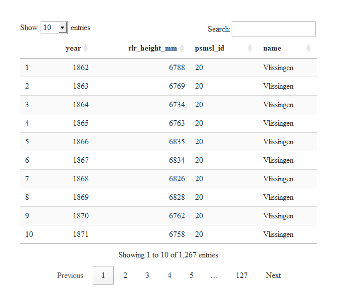
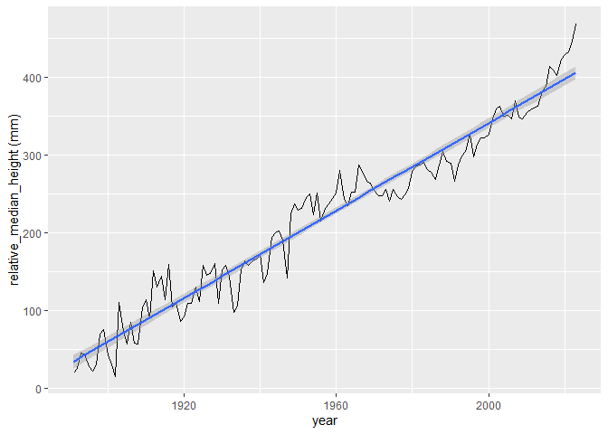
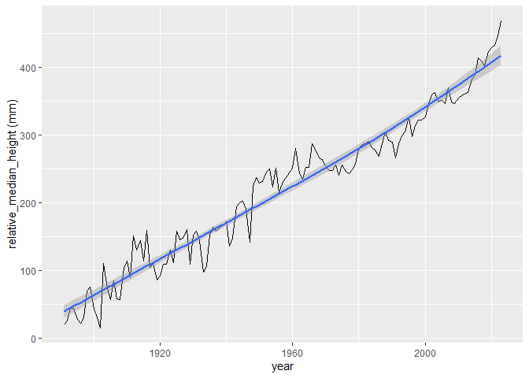

Virtual station analysis
================
Willem Stolte
2025-02-05

## Introduction

Sea level monitor uses a standardized method to determine the average
sea level along the Dutch coast, and estimating the effect of nodal tide
and storm surge. This method is averageing the sea level figures from
the 6 main stations for all years from 1900 to present. This averages
out any anomalies in individual stations that may have occurred due to
changes in position or methods of the measuring station, and local
effects such as morphological changes that may have influenced yearly
mean sea level during periods.

## Overall methodology

In order to better estimate the sea level changes along the coast, we
are testing to construct a “virtual” station, where the effect of
anomalies that occur at separate stations are minimized. A simple way to
accomplish this is to calculate median values (as opposed to mean values
in the current SLM) of yearly sea levels for all stations. However,
since the average sea levels between stations is different,
inconsistencies can occur by taking median values of absolute sea level.
Therefore, we first calculate the difference per year for each station,
and then calculate the yearly difference for the “virtual” station by
taking the median of all stations per year. From these differences,
median sea level is reconstructed, using sea level at the start of the
time series as a reference. A disadvantage is that the absolute vertical
reference (e.g. to NAP) is lost during this exercise. It is therefore at
this moment only an anlysis of the relative change of sea level.

### Obtaining PSMSL “revised local reference” (RLR) water level data

``` r
# get all Dutch PSMSL stations
ids <- c(mainstations_df$psmsl_id, 1551, 9, 236)
names <- c(mainstations_df$name, "Roompot Buiten", "Maassluis", "West-Terschelling")
slrData <- read_yearly_psmsl_csv(station_nr = ids, filepath = "../")
slrData2 <- slrData %>%
  select(
    year,
    rlr_height_mm,
    psmsl_id
  ) %>%
  left_join(
    tibble(id = ids, name = names),
    by = c(psmsl_id = "id")
  )

DT::datatable(slrData2)
```

<!-- -->

### Data selection

Data are available for 9 stations, from approximately 1860 onward,
depending on the location. In the Sea Level Monitor, only data from 1890
onward is used, because of a proper vertical reference before that time.
We will here also select this period for further analysis.

``` r
slrData2 %>%
  ggplot(aes(year, rlr_height_mm)) +
  geom_line(aes(color = name)) +
  facet_wrap("name")
```

<figure>

<figcaption aria-hidden="true">PSMSL obtained revised local reference
water levels for all available Dutch stations.</figcaption>
</figure>

``` r
slrData2 <- slrData2 %>% filter(year >= 1890)
```

### Add surge

GTSM surge values for each year is added to the dataframe. At the moment
of this analysis, GTSM output for the 6 main stations was available.

``` r
# Get GTSM data from local file
gtsm <- read_yearly_gtsm(filename = "../data/deltares/gtsm/gtsm_surge_annual_mean_main_stations.csv") |>
  mutate(year = year(ymd(t)))
```

``` r
  slrData3 <- slrData2 |>
      left_join(gtsm, by = c(name = "name", year = "year")) |>
      mutate(
        surge_anomaly = case_when(
          year >= 1950 ~ (1000 * surge - mean(1000 * surge, na.rm = T)), # meters to millimeters
          year < 1950 ~ 0
        )
      ) |>
  mutate(`height-surge anomaly` = rlr_height_mm - surge_anomaly) |>
      select(
        psmsl_id,
        year,
        rlr_height_mm,
        name,
        surge_anomaly,
        `height-surge anomaly`
      )

ggplot(
  slrData3 %>% 
    group_by(name) %>% 
    filter(
      sum(surge_anomaly)!=0,
      year > 1940
      ), 
  aes(year, surge_anomaly)) + 
  geom_line(aes(color = name))+
  theme(legend.position = "bottom")
```

<figure>

<figcaption aria-hidden="true">Surge anomalies (mm) for all available
stations.</figcaption>
</figure>

### Calculate changes per year for all stations

For each station and year, the change of water level (corrected for
surge) relative to the previous year is calculated.

``` r
# Met GTSM correctie
slrDiff2 <- slrData3 %>%
  filter(psmsl_id %in% mainstations_df$psmsl_id) %>%
  group_by(psmsl_id, name) %>%
  mutate(
    diff = `height-surge anomaly`-lag(`height-surge anomaly`, default=first(`height-surge anomaly`))
  ) %>% ungroup()

ggplot(slrDiff2, aes(year, diff)) +
  geom_line(aes(color = name)) +
   theme(legend.position = "bottom")
```

<figure>

<figcaption aria-hidden="true">Changes in sea level (surge corrected)
per station and year (mm) for all available stations.</figcaption>
</figure>

### calculate median slopes

For each year, the median change per year is calculated. By taking the
median value, any outlier station values will not have an effect on the
outcome.

``` r
slrMedian <- slrDiff2 %>%
  pivot_wider(id_cols = c(year), names_from = "name", values_from = "diff") %>%
  rowwise() %>%
  mutate(n = sum(!is.na(c_across(!year)))) %>%
  mutate(median = median(c_across(!year), na.rm = T)) %>%
  ungroup()  %>% 
  filter(
    year > 1890,
    n > 5
  )

ggplot(slrMedian, aes(year, median)) +
  geom_line(data = slrMedian %>%
           select(-n, -median) %>%
           pivot_longer(cols = -year, names_to = "station", values_to = "diff_mm"),
         aes(year, diff_mm, color = station), linewidth = 1, alpha = 0.5) +
  geom_line(linewidth = 1) +
   theme(legend.position = "bottom") +
  geom_vline(xintercept = 1932, linewidth = 1, color = "blue", alpha = 0.5) +
  annotate("text", x = 1935, y = 120, label = "1932")
```

<figure>

<figcaption aria-hidden="true">Median change in surge corrected sea
level for all stations (black line), per year. The change in surge
corrected sea level for each station is added with colored
lines.</figcaption>
</figure>

``` r
cat("The mean value of the median slope over all stations and years is",
  round(mean(slrMedian$median), 2), 
  "+/-", 
  round(sd(slrMedian$median)),
  "mm per year")
```

    FALSE The mean value of the median slope over all stations and years is 3.52 +/- 23 mm per year

### Results with linear model fit

``` r
slrMedian %>%
  mutate(`relative_median_height (mm)` = cumsum(median)) %>%
  ggplot(aes(year, `relative_median_height (mm)`)) +
  geom_line(aes()) +
  geom_smooth(method = "lm", formula = 
                y ~ I(x - 1970) #+ 
        # I(cos(2 * pi * (x - 1970)/(18.613))) + 
        # I(sin(2 * pi * (x - 1970)/(18.613)))
  )
```

<!-- -->

### Results with broken linear model (breakpoint 1993)

``` r
slrMedian %>%
  mutate(`relative_median_height (mm)` = cumsum(median)) %>%
  ggplot(aes(year, `relative_median_height (mm)`)) +
  geom_line(aes()) +
  geom_smooth(method = "lm", formula = 
                y ~ x +
                  I((x-1993)*(x > 1993)) #+
                # I(cos(2 * pi * (x - 1970)/(18.613))) +
                # I(sin(2 * pi * (x - 1970)/(18.613)))
  )
```

<!-- -->

``` r
# lm(Value ~ Num*(Num >= 6.30) + Num*(Num < 6.30)
```

### Results with quadratic model (breakpoint 1960)

``` r
slrMedian %>%
  mutate(`relative_median_height (mm)` = cumsum(median)) %>%
  ggplot(aes(year, `relative_median_height (mm)`)) +
  geom_line(aes()) +
  geom_smooth(method = "lm", formula = 
                y ~ x +
                  I((x-1960)*(x-1960)*(x > 1960)) #+
                # I(cos(2 * pi * (x)/(18.613))) +
                # I(sin(2 * pi * (x)/(18.613)))
  )
```

<!-- -->

``` r
# lm(Value ~ Num*(Num >= 6.30) + Num*(Num < 6.30)
```
