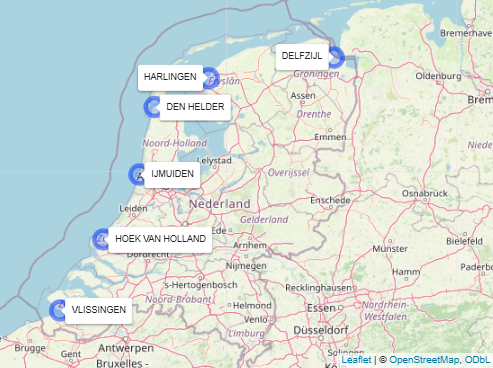
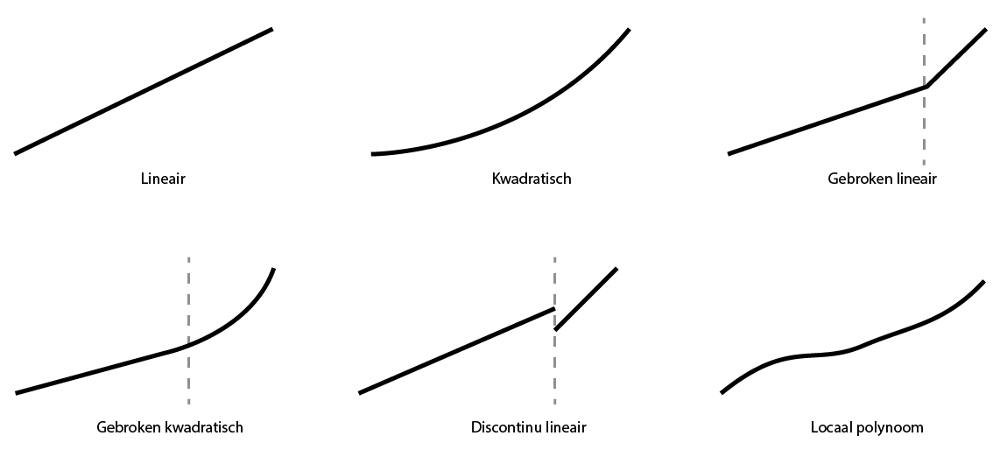
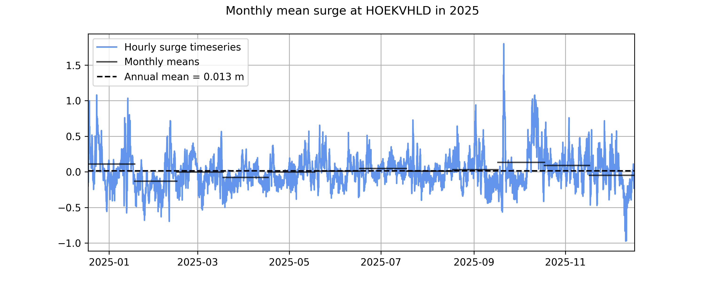
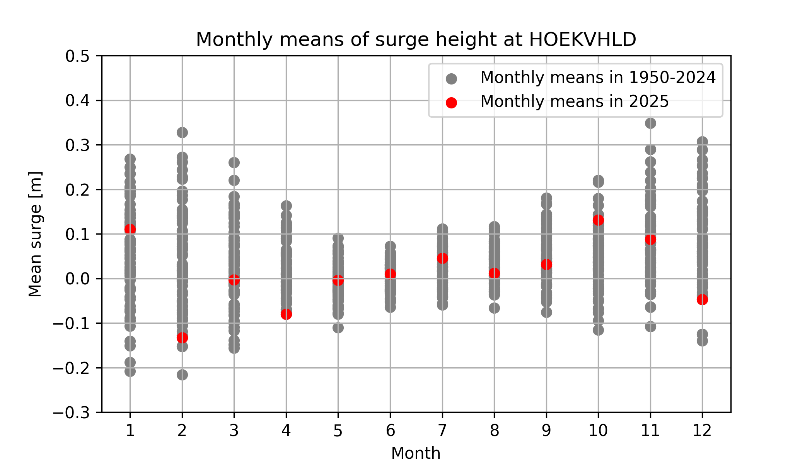
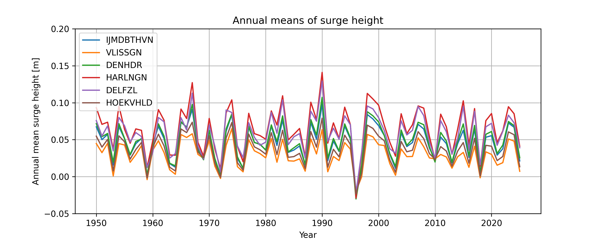
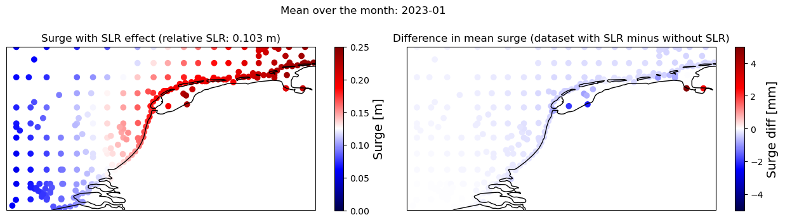

---
acronyms:
  insert_loa: false
  loa_title: "Lijst met afkortingen"
  insert_links: false
  fromfile:
    - acronyms.yml
---

# Methodiek {#methodiek}

In hoofdstuk @sec-inleiding wordt uitgelegd dat er een 'huidige zeespiegel' nodig is, onder andere om de suppletiebehoefte te bepalen. Huidig is in de context van deze toepassing eigenlijk geen tijdspunt, maar een tijdsspanne. Het gaat niet om de zeespiegel vandaag, maar om de zeespiegel van enkele jaren terug tot nu.

In de bijlage \@ref(metingen) wordt uitgelegd hoe de metingen precies tot stand komen.

## Afwegingen {#afwegingen}

Bij het selecteren van de methode worden er diverse afwegingen gemaakt, waarbij we gebruik maken van onderstaande criteria. Dit hoofdstuk geeft een overzicht van de belangrijkste modelkeuzes en de bijbehorende onderbouwing. Uitgangspunt voor de afwegingen is het bepalen van een goede maat voor de huidige zeespiegelstijging ten behoeve van het suppletieprogramma en de suppletiebehoefte.

**Stabiliteit** - de gebruikte methodiek moet niet van jaar tot jaar te veel variëren.

**Spaarzaamheid** - parcimonie: principe dat de eenvoudigste van twee ongeveer even plausibele verklaringen voor hetzelfde fenomeen de voorkeur heeft

**Robuustheid** - trend moet niet te veel afhangen van modelkeuzes

**Voorspelkracht** - toepassing van model in het verleden moet een goede hindcast opleveren voor een voorspelhorizon die vergelijkbaar is met de lengte van de gewenste periode (10-15 jaar)

**Behoudend** - methode moet temporeel aansluiten oftewel over de gehele periode met metingen toepasbaar zijn zonder onderbreking of verspringing.

**Generaliseerbaarheid** - methode moet ook werken bij andere stations dan in Nederland

**Power** - als er een verandering is moet de methode dat snel detecteren

**Fysisch verklaarbaar** - de gekozen formulering moet verklaarbaar zijn vanuit fysisch oogpunt

## Algemene methodiek

In dit onderzoek maken we gebruik van een \acr{GLM}, een gegeneralizeerde vorm van een lineair regressiemodel. Vooral omdat de variatie goed verklaard wordt [@Watson2016]. We gaan er vanuit dat de zeespiegel sneller aan het stijgen is of binnenkort sneller gaat stijgen dan in het verleden (ruwweg de twintigste eeuw)[^1]. Dit heeft implicaties voor de verwachte zeespiegel en zeespiegelstijging. Daarom maken we gebruik van schattingen van de versnelling, zie \@ref(versnelling-methods). Merk op dat een lineair model niet impliceert dat de zeespiegelstijging een rechte lijn moet volgen. Ook polynome, sinusoïde, exponentiële en loglineaire modellen vallen onder de \acr{GLM} familie.

[^1]: Zie ook laatste IPCC rapport: <https://www.ipcc.ch/report/ar6/wg1/chapter/chapter-9/>

## Meetgegevens {#bronnen}

In dit onderzoek maken we gebruik van gegevens voor de 6 zogenaamde hoofdstations Vlissingen, Hoek van Holland, IJmuiden, Den Helder, Harlingen en Delfzijl. Deze kuststations leveren sinds 1890, toen het \acr{NAP} overal was doorgevoerd, betrouwbare metingen. Gegevens worden betrokken uit de [\acr{PSMSL} database](https://psmsl.org/data/). Rijkswaterstaat draagt zorg voor de aanlevering van gegevens aan \acr{PSMSL}.

De overige stations waarvan gegevens in \acr{PSMSL} opvraagbaar zijn worden niet gebruikt. Het station van West-Terschelling (1921) wordt buiten beschouwing gelaten omdat het in de buurt ligt van Den Helder en Harlingen. Het station van Maassluis (1848) ligt kustinwaarts ten opzichte van Hoek van Holland en kan afgesloten worden door de Maeslantkering. Daardoor is de waterstand niet meer gelijk aan die van de open zee. Het station Roompot Buiten heeft een relatief korte historie (jaargemiddelden beschikbaar sinds 1982) en overlapt met Vlissingen. Roompot Buiten heeft wel een belangrijke functie in de operationele toepassing, waarin Roompot Buiten wel en IJmuiden niet als een hoofdstation wordt gezien. Roompot Buiten is in de Zeespiegelmonitor niet meegenomen als hoofdstation.

We maken in de analyse geen onderscheid naar in welke mate de stations zijn beïnvloed door ingrepen aan de kust. Het is bekend dat sommige ingrepen wel invloed hebben op de metingen. Denk hierbij aan de aanleg van de Afsluitdijk, de aanleg van de Deltawerken, sinds de jaren 1990 het dynamisch kustbeheer en vooral de diverse lokale aanpassingen binnen de havens. Hoewel bekend is dat deze ingrepen over kortere of langere tijd een effect hebben op de waterstand [@Becker2009] ontbreekt op dit moment de kennis om hier op een kwantitatieve manier voor te corrigeren. Wel is het zo dat door het middelen van waterstanden gemeten bij de hoofdstations een deel van deze effecten uitgemiddeld zullen worden.

Sinds de vorige Zeespiegelmonitor is aangenomen dat de waarden bij Station Delfzijl onzeker zijn doordat de vertikale positie de laatste 10-15 jaar niet correct is doorgevoerd [@Honingh2021]. Rijkswaterstaat heeft begin 2022 geconstateerd dat een inhaalslag nodig is voor de verticale correctie van de waterstandsmetingen bij Delfzijl. Deze correctie is bij het schrijven van dit rapport wel herberekend maar nog niet via de geijkte manieren (WADAR, PSMSL) gepubliceerd. Daarom berekenen we de zeespiegel en -stijging op basis van het gemiddelde van alleen de 5 andere hoofdstations.

## Metingen en recente correcties {#sec-metingen-en-recente-correcties}

Voor de Zeespiegelmonitor worden jaargemiddelden gebruikt die beschikbaar zijn in \acr{PSMSL}. Deze gegevens worden door \acr{RWS} jaarlijks berekend en aan \acr{PSMSL} aangeleverd. Voorafgaand aan de berekening van gemiddelden worden de meetgegevens gecontroleerd, en waar nodig aangevuld of gecorrigeerd (@Honingh2021).

Recent heeft een extra controle en correctie plaatsgevonden voor de getijdemetingen. Dit betreft 2 typen correcties:

- herberekening van gemiddelden op basis van 10-minutenreeksen (dit werd tot nu toe gedaan op basis van uurgegevens)
- Herberekening van NAP referentiewaarden voor station Delfzijl

<placeholder>De maand- en jaargemiddelden zijn op dit moment (februari 2026) preliminair uitgerekend, maar zijn nog niet aangeleverd aan {PSMSL}.

<placeholder> consequenties voor zeespiegel, zss en keuze stations uitleggen (maar pas toepassen als gegevens in PSMSL staan)

## Uitleg relatieve zeespiegelstijging (aan de hand van infographic)

De methode in dit onderzoek bouwt verder op de aanpak zoals beschreven in @Baart2015. De variatie in de zeespiegel wordt in een aantal componenten uitgesplitst. Het uitsplitsen van de variatie van jaargemiddelde zeespiegel wordt gedaan met behulp van een \acr{GLM}. Een lineair model wordt gebruikt als onderdelen tot elkaar optellen. In deze sectie beschrijven we welke termen in dit model meegenomen worden en waarom.

In eenvoudige vorm wordt de waterstand beschreven als de volgende vergelijking:

$$h_t = constante + trend + versnelling? + getij + wind + residu$$ {#eq-trend}

## Welke termen?

De versnelling is optioneel (zie sectie \@ref(versnelling-methods). In \@ref(eq:gedetailleerdevergelijking) is de gedetailleerde wiskundige vergelijking van het regressiemodel voor de zeewaterstand opgenomen.

### Versnelling? {#versnelling-methods}

In de vorige Zeespiegelmonitor is geconstateerd dat een versnellingsterm noodzakelijk is voor de correcte beschrijving van de gemiddelde zeespiegelstijging langs de Nederlandse kust. Om de versnelling van de zeespiegel te beschrijven zijn er in de literatuur verschillende varianten in omloop. Deze worden hieronder schematisch weergegeven en beschreven.

1.  Een *lineaire* aanpak gaat ervan uit dat de versnelling afwezig is. Deze methode wordt toegepast door NOAA voor [historische reeksen](https://tidesandcurrents.noaa.gov/sltrends/mslUSTrendsTable.html). Vanuit het spaarzaamheidsprincipe veronderstellen we dat dit model geldt (nulhypothese) tenzij het verworpen wordt.
2.  Een *kwadratische versnelling*. Dit is de gebruikelijke [@Jevrejeva2014; @Church2011] en formele manier om de versnelling mee te nemen. De methode bevat naast een parameter voor de lineaire trend in de zeespiegelstijging een extra parameter voor de versnelling in de zeespiegelstijging (zie \@ref(eq:trend)). Op de significantie van deze parameter wordt statistisch getoetst. Deze methode wordt weergegeven met vergelijking \@ref(eq:quadratictrend).
3.  De *gebroken lineaire* methode gaat ervan uit dat de zeespiegelstijging abrupt versneld is. Een abrupte versnelling kan optreden als een groot gebied tegelijk boven het 0 punt komt te liggen. In de praktijk wordt het ook gebruikt om een aparte trend uit te rekenen voor het satelliettijdperk. Sinds 1993 (na de lancering van de [TOPEX/Poseidon](https://eospso.nasa.gov/missions/topexposeidon) satelliet) meten we de zeespiegel ook met satellieten . De satellietmetingen laten een hogere zeespiegelstijging zien dan de gemeten waterstanden in het getijstationtijdperk ('tide gauge era'). Hierbij wordt 1993 vaakgenoemd als de start van de versnelde zeespiegel [bijvoorbeeld @Stocker2013]. Om goede vergelijkingen te maken is het daarom nodig om ook voor deze periode een trend te bepalen. In deze methode kan de trendparameter vanaf het jaar 1993 wijzigen. Op de significantie van de trendbreuk wordt statistisch getoetst. Dit gebroken trendmodel wordt weergegeven in vergelijking \@ref(eq:brokentrend).
4.  De *gebroken kwadratische* versnelling gaat er van uit dat de zeespiegel in de jaren 60 van de vorige eeuw is gaan versnellen als gevolg van de verhoogde uitstoot van broeikasgassen na de tweede wereldoorlog (Slangen et al. 2016, Dangendorf et al. 2019). Met een geavanceerd statische methode is dit ook gevonden door Keizer et al (submitted). Voor toepassing hier wordt vóór 1960 een lineaire toename aangenomen. De versnelling vanaf 1960 wordt berekend op de manier die hierboven is beschreven bij de kwadratische versnelling. Dit gebroken trendmodel wordt weergegeven in vergelijking \@ref(eq:brokenquadratic).

De keuze van het model heeft implicaties voor de huidige zeespiegel, immers het bepaalt deels hoeveel zeespiegel er wordt toegekend aan veranderingen in getij of windopzet. Het is dus belangrijk om het model te kiezen dat met de grootst mogelijke waarschijnlijkheid de huidige zeespiegelstijging beschrijft. Tegelijkertijd houden we vast aan de uitgangspunten in paragraaf \@ref(afwegingen). De uiteindelijke modelkeuze (welk model is beter dan het simpelste, dus lineaire, model) vindt plaats op twee criteria. Er moet sprake zijn van een significante acceleratie of deceleratie en er moet sprake zijn van een beter model. Dat laatste wordt vastgesteld met behulp van het \acr{AIC}, waarbij een afweging wordt gemaakt tussen de complexiteit en de toegevoegde waarde. Het \acr{AIC} criterium is een afweging op basis van de statische eigenschappen van de verschillende modellen. Het doet geen uitspraak over de juistheid van onderliggende fysische processen.

5.  Een andere methode is om een *discontinue lineaire* trend te berekenen. Door over aparte perioden trends uit te rekenen krijg je trends waarvan de intercepts niet aansluit op de vorige periode. Dit is de methode zoals gebruikt in het laatste [IPCC rapport](https://www.ipcc.ch/report/ar6/wg1/chapter/chapter-9/). Hierbij worden trends over verschillende perioden apart uitgerekend.
6.  *Lokaal polynoom* is een methode met meer vrijheidsgraden en wat exploratiever van aard. De parameters worden gebaseerd op "expert judgement" en "trial en error" [@Cleveland1996]. Het voordeel van deze methode is dat deze de mogelijkheid open laat van een meer variërende trend over tijd. Het nadeel is dat deze methode door het grotere aantal vrijheidsgraden ook wat meer kan "wapperen", vooral aan het uiteinde. Dat wil zeggen dat de trend aan het eind van de reeks, met nieuwe data, snel van richtingscoefficient kan veranderen.

De laatste twee methoden hebben we in deze rapportage niet gebruikt vanwege de genoemde nadelen.## Uitleg GNSS stations

## Windopzet {#sec-windopzet}

Een van de factoren die de zeespiegel beïnvloeden is de windopzet (storm surge). Om de bijdrage hiervan te kwantificeren, is de gemiddelde jaarlijkse windopzet berekend op basis van de GTSM-ERA5 dataset, die uurlijkse mondiale waterstanden en windopzet tijdreeksen bevat voor de periode vanaf 1950 tot heden. De dataset is gebaseerd op het (\acr{GTSM}), een dieptegemiddeld hydrodynamisch model dat getijden, windopzet en hun niet-lineaire interacties in de wereldoceaan simuleert, aangestuurd door de ERA5 atmosferische heranalyse. De stormopzet wordt bepaald als het verschil tussen een gecombineerde windopzet-getijdensimulatie en een simulatie met uitsluitend astronomisch getij en is als afzonderlijke variabele beschikbaar in de dataset. Meer informatie is beschikbaar in de documentatie van de [GTSM-ERA5-dataset](https://doi.org/10.24381/cds.a6d42d60) en in [@Muis2023], [@Aleksandrova2026].

Modelresultaten voor windopzet uit GTSM runs worden geselecteerd per hoofdstation. Deze worden daarna gemiddeld per maand voor elk hoofdstation en opgeslagen voor later gebruik in de Zeespiegelmonitor (zie dit [rekendocument](https://github.com/Deltares-research/sealevelmonitor/blob/develop_reporting26_aleksandrova/analysis/gtsm/get_monthly_means_surge.ipynb)). In de onderstaande figuur zijn, ter illustratie voor Hoek van Holland, de uurlijkse tijdreeks van de windopzet in 2025 en de daaruit afgeleide maand- en jaargemiddelden weergegeven.

De maandgemiddelden vertonen interjaarlijkse variaties, maar zijn in het algemeen hoger gedurende het winterseizoen. De onderstaande figuur toont de spreiding van de maandgemiddelden van de windopzet voor Hoek van Holland voor de periode 1950–2025.

De gemiddelde jaarlijkse stormopzet varieert tussen locaties en individuele meetstations, afhankelijk van de weersomstandigheden in een bepaald jaar en de blootstelling van de getijdestationlocatie aan wind- en storminvloeden. De onderstaande figuur toont de tijdreeks van de jaarlijkse gemiddelde stormopzet voor de hoofdstations.

In de Zeespiegelmonitor analyse wordt de correctie voor windopzet als volgt berekend:

- Voor elk station wordt jaargemiddeld windopzet berekend.

- Jaargemiddelde windopzet wordt getransformeerd tot jaarlijkse afwijking (opzetanomalie) van het gemiddelde.

- De opzetanomalie per jaar en station wordt afgetrokken van de zeespiegelhoogte om tot de gecorrigeerde zeespiegel te komen.

Voor het gemiddelde over Nederland worden de gecorrigeerde zeespiegelwaarden gemiddeld over de stations.

De huidige versie van GTSM die gebruikt wordt voor berekening van windopzet voor de Zeespiegelmonitor wordt aangestuurd door een waterpeil inclusief een stijging. De zeespiegelstijging die is toegepast is afgeleid van SLR-projecties in \acr{AR5} van \acr{IPCC}. Deze wijken waarschijnlijk af van de daadwerkelijk waargenomen zeespiegelstijging. De bijdrage van zeespiegelstijging wordt bij de berekening van de windopzet grotendeels opgeheven doordat de stormopzet wordt gedefinieerd als het verschil tussen de totale waterstand (getij en windopzet) en een simulatie met uitsluitend getij. Wel kan zeespiegelstijging een geringe indirecte invloed hebben op de berekende stormopzet, doordat veranderingen in de waterdiepte de hydrodynamische processen beïnvloeden. Het is daarom belangrijk om te weten of de gebruikte stijging invloed heeft op de berekende windopzet aan de Nederlandse kust. Dit is gecontroleerd door de GTSM-ERA5 modelopstelling voor 2023 te draaien, zodat modelresultaten zowel met als zonder \acr{SLR} (totaal waterpeil en alleen getijdenruns) worden getoond. Deze resultaten zijn vergeleken (zoals te zien in dit [rekendocument](https://github.com/VU-IVM/gtsm3-era5-nrt/blob/main/02_analysis_and_validation/p06_compare_SLR_effect_surge_mean.ipynb). Uit deze resultaten kan worden geconcludeerd:

- SLR in 2023, die in onze modelruns is opgenomen, is \~0.1 m te opzichte van het referentie periode 1986-2005.
- Dit niveau van SLR heeft geen significant effect op de gemiddelde windopzet. Het verschil dat het model veroorzaakt is verwaarloosbaar (minder dan 1 mm).
- Op enkele locaties diep in de Waddenzee is er enig verschil in windopzet tussen de twee runs, maar dit zijn locaties in relatief afgesloten gebieden in ondiep water. Het verschil blijft beperkt tot enkele millimeters.

Hieruit concluderen we dat de windopzet uit \acr{GTSM} inclusief zeespiegelstijging, die we op dit moment gebruiken voor de Zeespiegelmonitor, niet wordt beïnvloed door de gebruikte zeespiegelprojectie.

## Getij {#sec-getij}

Naast windopzet zorgt ook het getij, met name de nodale cyclus, voor een variatie in de zeespiegel over de jaren [@Woodworth2012, @Baart2012f]. Daarom wordt de variatie door de nodale cyclus meegenomen als gelinearizeerde amplitude en fase, in de vorm van een u en v component (vergelijking (2.2)). Het is ook mogelijk om het equilibrium getij (Fedor Baart, van Gelder, et al. 2012) op te leggen. Het equilibrium getij is het getij dat zou optreden zonder invloed van land of ondiepte op de propagatie van de getijgolf. In Nederland en op veel andere plaatsen is de amplitude en fase van het in de regressie meegenomen nodaal getij niet hetzelfde als het equilibrium getij. Er is lange tijd discussie geweest over welk getij het meest geschikt is om mee te rekenen in langjarige analyses (Woodworth vs Baart). Recent is aangetoond dat het waargenomen nodaal getij aan de Nederlandse kust verklaarbaar beïnvloed wordt door modulatie van de M2 getijgolf in de Noordzee (Lebars et al., ). Dit brengt de twee denkbeelden dichter bij elkaar. Het lijkt er hierbij op dat de in de regressie geschatte nodale cyclus min of meer precies beantwoord aan het beeld van een gemoduleerd M2 getij.

## Rekenmethode voor de bepaling van de huidige zeespiegelstijging

De stijging van de zeespiegel wordt wiskundig beschreven met een model, waaruit we de meest waarschijnlijk stijging berekenen over de gewenste periode (laatste 15 jaar). De keuze van het model dient ook te voldoen aan de gestelde criteria (#afwegingen). De keus aan modellen die getest worden is over de jaren langzaam uitgebreid. In \@Dillingh2010 werd een kwadratische term toegevoegd aan het initiële lineaire model, om een versnelling al dan niet te accepteren. Er was toen alleen voor station Den Helder een significante toename van de zeespiegestijging met het gebruikte model. In de Zeespiegelmonitor 2014 (\@Baart2014a) is daarom alleen het lineaire model toegepast, met een uitbreiding van een LOESS term om het model beter te laten aansluiten bij projecties. In de Zeespiegel 2018 (\@Baart2019) is opnieuw de kwadratische term als toevoeging op het lineaire model getest, samen met een trendbreuk model (gebroken lineair model) waarbij het breekpunt in 1993 gekozen werd. De keuze voor 1993 was gemotiveerd door:

- 1993 is het startjaar van satellietmetingen. Door de breuk in 1993 te leggen wordt de trend ook berekend vanaf dit jaar, wat vergelijking met satellietmetingen vergemakkelijkt. Tevens wordt de aansluiting met gegevens van vóór 1993 behouden.
- Rond 1993 stond de zeespiegel vrij laag, deels door de uitbraak van de Pinatubo vulkaan. Gedeeltelijk daardoor laten latere analyses zien dat voor een gebroken lineair model dit het meest waarschijnlijke breekpunt is \[\@\].

## Metingen van het zeeniveau met satellieten (altimetrie) {#altimetrie}

uitleg, voordelen, nadelen, verschillen. Zie ook eerdere rapportages.

### Beschikbare satellieten en metingen

### Nieuwe satellieten

### Wanneer kan overgegaan worden op satellietmetingen
