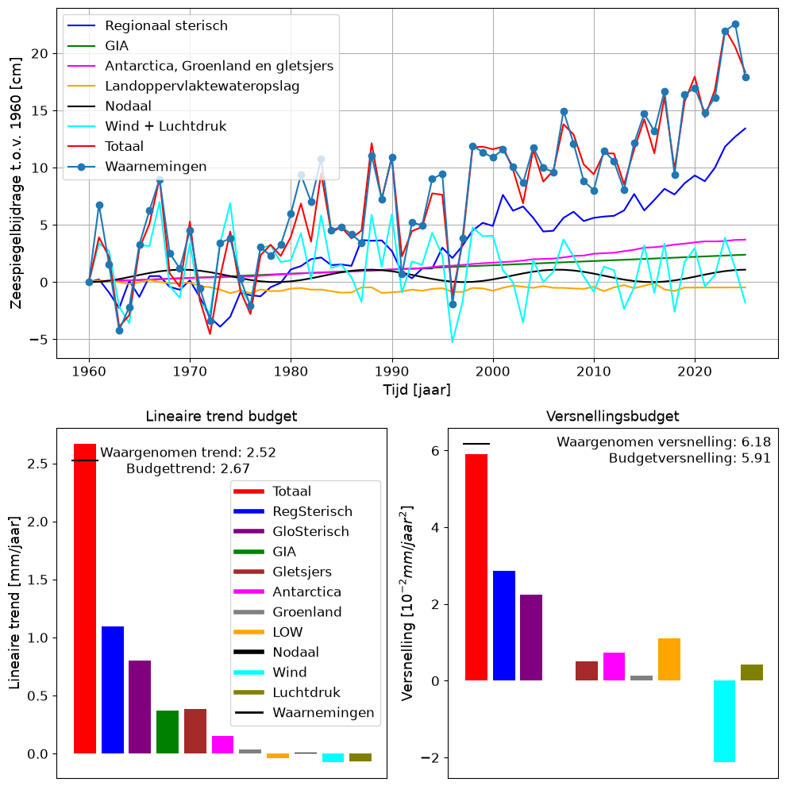

---
acronyms:
  include_unused: false
  insert_loa: false
  loa_title: ""
  fromfile:
  - acronyms.yml
---

# Resultaten {#resultaten}

Dit hoofdstuk beschrijft de resultaten voor zeespiegelmetingen tot en met 2025. De berekeningen die hieraan ten grondslag liggen zijn vastgelegd in een [rekendocument](link-naar-notebook).

We lopen langs de verschillende onderdelen van de resultaten, te weten:

- windopzet
- voorkeursmodel
- huidige zeespiegel en -stijging
- de rol van bodemdaling
- 

## Windopzetcorrectie {#sec-winsopzetcorrectie}

De invloed van windopzet op de metingen wordt gecorrigeerd. Hiervoor gebruiken we berekeningen met het \acr{GTSM} (zie paragraaf \@ref(sec-windopzet)). Vergeleken met de vorige rapportage in 2022 zijn de berekeningen met het \acr{GTSM} uitgebreid met de jaren 2022-2025, maar ook voor de periode 1950-1978. Hierdoor is er nu een ruim 70 jaar lange serie voor berekende windopzet.

Voor de correctie van de zeespiegel voor windopzet wordt een gemiddelde opzet gebruikt voor de periode voor 1950, en de (jaargemiddelde) afwijking van het langjarig gemiddelde voor de periode vanaf 1950 (figuur \@ref(fig:gtsm-opzet)).

## Voorkeursmodel {#sec-voorkeursmodel}

In paragraaf \@ref(sec-modelkeuze) wordt uitgelegd hoe we tot een voorkeursmodel komen om de huidige stijging van de zeespiegel zo goed mogelijk te beschrijven. De berekeningen voor deze keuze staan in een [online rekendocument](link-naar-rekendocument-analyse). Dit jaar is, net als in de vorige rapportage, het gebroken lineaire model het best passende model en dit model blijkt het gemeten signaal (inclusief correctie voor windopzet en getij) significant beter te beschrijven dan een lineair model. De aanname bij dit model is dat de zeespiegel vanaf het begin van de jaren '90 sneller is gaan stijgen. 

## Huidige zeespiegel(stijging) {#sec-huidige}

Op basis van de gegevens en het voorkeursmodel kunnen we de volgende conclusies trekken over de stijging van de zeespiegel aan de Nederlandse kust:

- De lineaire trend tot 1993 bedraagt 1.8 +/- 0.1 mm/jaar.
- De extra trend na 1993 bedraagt 1.4 +/- 0.3 mm/jaar.
- Na 1993 is de totale trend verhoogd en bedraagt 3.2 +/- 0.3 mm/jaar.

## Bodemdaling en zeespiegelstijging {#sec-bodemdaling}

Bij alle getijdenstations bestaat het gemeten relatieve zeespiegelstijgingssignaal voor een deel uit lange-termijn geologische bodemdaling [@Hijma2025b]. Deze daling wordt hoofdzakelijk veroorzaakt door tektonische en glacio-isostatische bodemdaling en heeft dalingssnelheden die van zuid naar noord toenemen van circa 2 naar 5 cm/eeuw (@fig-totgeol100yr). De metingen worden hier niet voor gecorrigeerd en de via PSMSL beschikbare zeespiegeldata omvatten dus deze lange-termijn geologische bodemdalingscomponent.

![Geologische bodemdaling per 100 jaar [@Hijma2025b]](images/Totgeol100yr_nieuw.png){#fig-totgeol100yr width="80%"}

Er zijn twee stations waar ook bodemdaling door gaswinning heeft plaatsgevonden, namelijk Hoek van Holland en Delfzijl. Bij Hoek van Holland gaat het om minder dan 2 cm in de laatste decennia en gaan we er vanuit dat deze daling in het zeespiegelsignaal zit. De verwachte daling door gaswinning in de komende decennia is minder dan 1 cm [@Hijma2026]. De daling bij Delfzijl is veel groter geweest en bedraagt ongeveer 30 cm sinds 1963. Voor Delfzijl weten we vrij zeker dat de bodemdaling sinds 1973 niet in de zeespiegeldata zit, maar dat de metingen gecorrigeerd worden [@Jong1973, punt 5]. Dit betekent dat de relatieve zeespiegelstijging bij Delfzijl eigenlijk sneller gaat dan in PSMSL gepubliceerd wordt, omdat de daling door gaswinning niet meegenomen wordt. Tussen de start van de gaswinning in Groningen in 1963 en 1973 daalde de bodem bij Delfzijl ongeveer 7 cm. Wij gaan er hier vanuit dat deze daling op dezelfde manier is behandeld als de daling na 1973, conform [@Jong1973, punt 5], en dus niet in het zeespiegelsignaal zit. Door het dichtdraaien van de gaskraan is de daling bij het station sterk afgenomen en naar verwachting zal deze nog slechts enkele centimeters bedragen in de komende decennia [@Hijma2026].

Station Harlingen wordt waarschijnlijk al enigszins beïnvloed door bodemdaling door zoutwinning, al is de gemodelleerde invloed momenteel nog zeer gering en van recente datum. De zoutwinning vindt plaats op de Waddenzee ten westen van Harlingen en naar verwachting zal hierdoor de komende 30 jaar een aantal centimeter bodemdaling optreden bij Harlingen [@Hijma2025c; @Hijma2026]. De onzekerheid is echter groot en een kleine verschuiving in de vorm of positie van de bodemdalingsschotel kan resulteren in geen extra bodemdaling of juist nog enkele centimeters meer. De extra bodemdaling wordt gemonitord, waardoor een eventuele impact op de zeespiegelmetingen goed in beeld zal komen.

Bij de meeste stations is de totale bodemdaling dus gelijk aan de geologische bodemdaling, maar bij enkele stations is de totale bodemdaling een optelsom van de geologische bodemdaling en de daling door delfstofwinning. @tbl-bodemdalingscomponenten geeft per station de snelheid van de verschillende bodemdalingscomponenten, de gemeten relatieve zeespiegelstijging en de afgeleide absolute zeespiegelstijging. @fig-totdaling100yr geeft een ruimtelijk beeld van de gecombineerde bodemdaling door geologische bodemdaling en daling door winning. @sec-bodemdalingscomponenten geeft enkele achtergronden bij de verschillende bodemdalingscomponenten.

| station | Geologische bodemdaling (mm/jaar) | Daling door winning (mm/jaar) | Totale bodemdaling (mm/jaar) | Huidige relatieve ZSS (mm/jaar) | Huidige absolute ZSS (mm/jaar) |
|------------|------------|------------|------------|------------|------------|
| Vlissingen | 0.23 | 0 | 0.23 | 2.32+0.83=3.15 | ??? |
| Hoek van Holland | 0.33 | 0.2 | 0.3 | 2.40+1.05=3.45 | ??? |
| IJmuiden | 0.42 | 0 | 0.42 | 2.09+0.40=2.49 | ??? |
| Den Helder | 0.48 | 0 | 0.48 | 1.35+1.79=3.14 | ??? |
| Harlingen | 0.37 | 0 | 0.37 | 0.86+2.84=3.7 | ??? |
| Delfzijl | 0.39 | 4 | 0.39 | 1.62+2.27=3.89 | ??? |
: Uitsplitsing bodemdaling [op basis van @Hijma2025b and @Hijma2026] en zeespiegelstijging per station (dit rapport). Geologische bodemdaling is constant op tijdschalen van eeuwen, de dalingssnelheid door winning is berekend voor de periode 1996-2025. De totale bodemdaling bij Hoek van Holland is inclusief daling door winning, bij Delfzijl exclusief daling door winning (zie tekst). De gemiddelde relatieve zeespiegelstijging is gemeten over de periode xxx (gebroken lineair model). Het 66%-betrouwbaarheidsinterval staat tussen haakjes vermeld. {#tbl-bodemdalingscomponenten}

![Totale bodemdaling in het kustgebied in de laatste 100 jaar [@Hijma2026]](images/Totaledaling1926_2025.png){#fig-totdaling100yr width=80%}

## Zeespiegelbudget {#sec-budget}

Aan de ene kant wordt de relatieve zeespiegel gemeten met getijdenmeters langs de Nederlandse kust. Aan de andere kant worden ook de fysische processen die zeespiegelverandering veroorzaken, zoals opwarming van de oceaantemperatuur en het smelten van gletsjers en ijskappen, gemeten met in-situ- en satellietmetingen. We gebruiken aardmodellen van zwaartekracht, rotatie en elastische vervorming van het land om het smelten van landijs te koppelen aan veranderingen in de relatieve zeespiegel langs de kust. Hierdoor kunnen we controleren of de som van de fysische mechanismen die invloed hebben op zeespiegelverandering in lijn ligt met de zeespiegelwaarnemingen. In de afgelopen 10 jaar is grote vooruitgang geboekt om de balans (@frederikse_closing_2016 en @camargo_regionalizing_2023) te verfijnen, tot het punt dat deze methode nu een uitgebreid inzicht kan bieden in de redenen voor zeespiegelverandering langs de Nederlandse kust (@le_bars_connecting_2025).

Eerdere zeespiegelmonitor rapporten bevatten al een bespreking van de oorzaken van zeespiegelstijging, maar het is voor het eerst dat er een volledige budget wordt getoond op interannuele tot multidecadale tijdschalen. Het budget die wij presenteren is ontwikkeld door het KNMI om de KNMI’23-zeespiegelscenario's te ontwikelen (@le_bars_constraining_2025, @le_bars_connecting_2025). Het biedt een budget voor de gemiddelde zeespiegel van zes getijdenstations langs de kust (Vlissingen, Hoek van Holland, IJmuiden, Den Helder, Harlingen, Delfzijl). We merken drie verschillen op met de oorspronkelijk gepubliceerde resultaten (@van_dorland_knmi_2023). Ten eerste begint de balans nu in 1960 in plaats van in 1993. Het jaar 1993 is nuttig omdat het vergelijking met satellietaltimetriegegevens mogelijk maakt, maar het gebruik van het jaar 1960 levert een langere tijdreeks op waarmee veranderingen op de lange termijn kunnen worden geanalyseerd. Ten tweede is de bijdrage van ijscapssels na 2018 uitgebreid met behulp van de satellietmissies GRACE en GRACE-FO, in plaats van een lineaire extrapolatie van de oorspronkelijke tijdreeks van @Frederikse2020. Ten derde is de balans bijgewerkt tot en met 2025, terwijl de oorspronkelijke liep tot en met 2021.

In het bovenste paneel van @fig-budget zijn de jaarlijkse zeespiegelobservaties weergegeven met stalenblauwe stippen. Dit kan worden vergeleken met de som van alle bijdragen in het rood. De kwadratisch gemiddelde afwijking (root mean square error) tussen de twee tijdreeksen bedraagt 1,1 cm. Tijdreeksen van de belangrijkste factoren achter de zeespiegelstand langs de Nederlandse kust worden eveneens getoond. De belangrijkste factoren voor zeespiegelvariabiliteit zijn wind en luchtdruk (@sec-winsopzetcorrectie), de 18,6-jarige nodaal cyclus en sterische effecten. De regionale en mondiale sterische bijdrage vertegenwoordigt de invloed van veranderingen in temperatuur en zoutgehalte op de zeespiegel. Deze bijdrage is niet lokaal; het vindt niet plaats in de Noordzee omdat deze te ondiep is, maar ontstaat in de diepe oceaan en wordt naar de Noordzee getransporteerd (@calafat_mechanisms_2012). In het paneel linksonder wordt de lineaire trend van elke bijdragende factor getoond en het paneel rechtsonder toont de versnelling. Voor deze panelen zijn sommige factoren verder opgesplitst in afzonderlijke processen. We zien dat de waargenomen trend over de periode 1960-2025 van 2,5 mm/jaar dicht bij de trend van de som van de bijdragen van 2,7 mm/jaar ligt. De belangrijkste bijdragen aan de trend zijn de regionale en mondiale sterische effecten, gevolgd door het smelten van gletsjers en glaciale isostatische aanpassing (GIA, @sec-bodemdaling). De versnelling van de som van de factoren komt eveneens overeen met de waargenomen versnelling. De meeste processen vertonen een versnelling, maar wind draagt bij aan een vertraging. GIA verandert alleen op een tijdschaal van duizenden jaren, waardoor het wel bijdraagt aan de lineaire trend, maar niet aan de versnelling.

{#fig-budget width=80%}

Deze  budget stelt ons in staat om de waargenomen verandering van de zeespiegel toe te schrijven aan specifieke fysische mechanismen op interannuele tot multidecadale tijdschalen. Zo zien we bijvoorbeeld dat de hoge zeespiegelwaarden van 2023 en 2024 werden gedreven door een sterke toename van sterische expansie in combinatie met een bovengemiddelde opwaaiing door de wind, terwijl 2025 lager uitviel omdat de windbijdrage kleiner was dan gebruikelijk.

Deze methode kent haar beperkingen. Wanneer de methode wordt toegepast op individuele getijdenstations, neemt de overeenkomst tussen de waarnemingen en de som van de bijdragende factoren af. Dit is waarschijnlijk te wijten aan lokale fysische processen zoals veranderingen in getijden, rivierafvoer en kustbescherming. Bovendien presenteren we alleen de veranderingen sinds 1960, omdat veranderingen van vóór 1960 niet kunnen worden toegeschreven aan de hier gepresenteerde fysische processen. Dit zou het gevolg kunnen zijn van een gebrek aan waarnemingen van de oceantemperatuur en het zoutgehalte, of van een afname in de kwaliteit van de metingen van getijdenstations. Hoewel Delfzijl in andere secties niet is opgenomen in de gemiddelde zeespiegel langs de kust, is het hier wel inbegrepen, in lijn met de oorspronkelijke KNMI-studies. Het weglaten van Delfzijl uit het gemiddelde heeft echter geen invloed op de belangrijkste conclusies die in deze sectie worden getrokken.

## Vergelijking met scenario's (#sec-scenarios)

## Variatie binnen Nederland {#sec-ruimtelijke-variatie}

## Vergelijking met satellietmetingen

## Lijst met gebruikte afkortingen

\printacronyms

