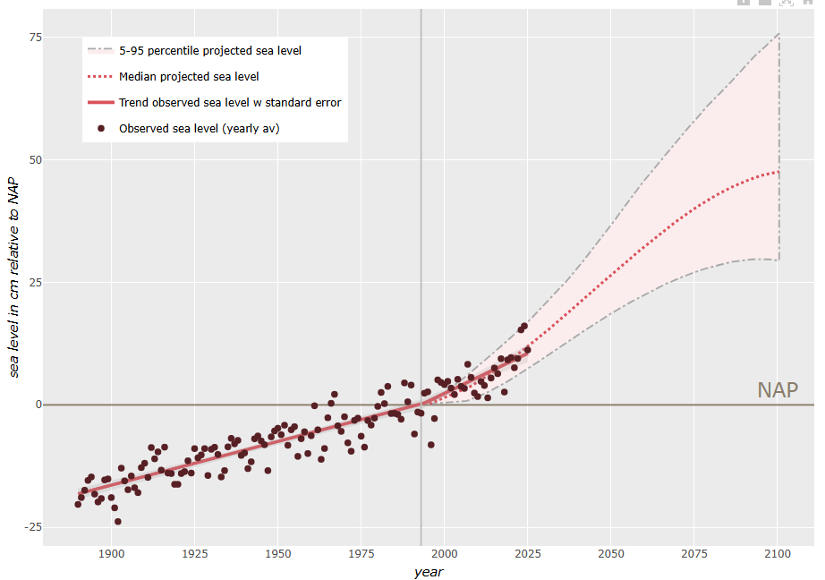

---
acronyms:
  include_unused: false
  insert_loa: false
  loa_title: ""
  fromfile:
  - acronyms.yml
---

# Resultaten {#resultaten}

Dit hoofdstuk beschrijft de resultaten voor zeespiegelmetingen tot en met 2025. De berekeningen die hieraan ten grondslag liggen zijn vastgelegd in een [rekendocument](link-naar-notebook).

We lopen langs de verschillende onderdelen van de resultaten, te weten:

- windopzet
- voorkeursmodel
- huidige zeespiegel en -stijging
- de rol van bodemdaling
- 

## Windopzetcorrectie {#sec-winsopzetcorrectie}

De invloed van windopzet op de metingen wordt gecorrigeerd. Hiervoor gebruiken we berekeningen met het \acr{GTSM} (zie paragraaf \@ref(sec-windopzet)). Vergeleken met de vorige rapportage in 2022 zijn de berekeningen met het \acr{GTSM} uitgebreid met de jaren 2022-2025, maar ook voor de periode 1950-1978. Hierdoor is er nu een ruim 70 jaar lange serie voor berekende windopzet.

Voor de correctie van de zeespiegel voor windopzet wordt een gemiddelde opzet gebruikt voor de periode voor 1950, en de (jaargemiddelde) afwijking van het langjarig gemiddelde voor de periode vanaf 1950 (figuur \@ref(fig:gtsm-opzet)).

## Voorkeursmodel {#sec-voorkeursmodel}

In paragraaf \@ref(sec-modelkeuze) wordt uitgelegd hoe we tot een voorkeursmodel komen om de huidige stijging van de zeespiegel zo goed mogelijk te beschrijven. De berekeningen voor deze keuze staan in een [online rekendocument](link-naar-rekendocument-analyse). Dit jaar is, net als in de vorige rapportage, het gebroken lineaire model het best passende model en dit model blijkt het gemeten signaal (inclusief correctie voor windopzet en getij) significant beter te beschrijven dan een lineair model. De aanname bij dit model is dat de zeespiegel vanaf het begin van de jaren '90 sneller is gaan stijgen. 

## Huidige zeespiegel(stijging) {#sec-huidige}

Op basis van de gegevens en het voorkeursmodel kunnen we de volgende conclusies trekken over de stijging van de zeespiegel aan de Nederlandse kust:

- De lineaire trend tot 1993 bedraagt 1.8 +/- 0.1 mm/jaar.
- De extra trend na 1993 bedraagt 1.4 +/- 0.3 mm/jaar.
- Na 1993 is de totale trend verhoogd en bedraagt 3.2 +/- 0.3 mm/jaar.

## Bodemdaling en zeespiegelstijging {#sec-bodemdaling}

Bij alle getijdenstations bestaat het gemeten relatieve zeespiegelstijgingssignaal voor een deel uit lange-termijn geologische bodemdaling [@Hijma2025b]. Deze daling wordt hoofdzakelijk veroorzaakt door tektonische en glacio-isostatische bodemdaling en heeft dalingssnelheden die van zuid naar noord toenemen van circa 2 naar 5 cm/eeuw (@fig-totgeol100yr). De metingen worden hier niet voor gecorrigeerd en de via PSMSL beschikbare zeespiegeldata omvatten dus deze lange-termijn geologische bodemdalingscomponent.

![Geologische bodemdaling per 100 jaar [@Hijma2025b]](images/Totgeol100yr_nieuw.png){#fig-totgeol100yr width="80%"}

Er zijn twee stations waar ook bodemdaling door gaswinning heeft plaatsgevonden, namelijk Hoek van Holland en Delfzijl. Bij Hoek van Holland gaat het om minder dan 2 cm in de laatste decennia en gaan we er vanuit dat deze daling in het zeespiegelsignaal zit. De verwachte daling door gaswinning in de komende decennia is minder dan 1 cm [@Hijma2026]. De daling bij Delfzijl is veel groter geweest en bedraagt ongeveer 30 cm sinds 1963. Voor Delfzijl weten we vrij zeker dat de bodemdaling sinds 1973 niet in de zeespiegeldata zit, maar dat de metingen gecorrigeerd worden [@Jong1973, punt 5]. Dit betekent dat de relatieve zeespiegelstijging bij Delfzijl eigenlijk sneller gaat dan in PSMSL gepubliceerd wordt, omdat de daling door gaswinning niet meegenomen wordt. Tussen de start van de gaswinning in Groningen in 1963 en 1973 daalde de bodem bij Delfzijl ongeveer 7 cm. Wij gaan er hier vanuit dat deze daling op dezelfde manier is behandeld als de daling na 1973, conform [@Jong1973, punt 5], en dus niet in het zeespiegelsignaal zit. Door het dichtdraaien van de gaskraan is de daling bij het station sterk afgenomen en naar verwachting zal deze nog slechts enkele centimeters bedragen in de komende decennia [@Hijma2026].

Station Harlingen wordt waarschijnlijk al enigszins beïnvloed door bodemdaling door zoutwinning, al is de gemodelleerde invloed momenteel nog zeer gering en van recente datum. De zoutwinning vindt plaats op de Waddenzee ten westen van Harlingen en naar verwachting zal hierdoor de komende 30 jaar een aantal centimeter bodemdaling optreden bij Harlingen [@Hijma2025c; @Hijma2026]. De onzekerheid is echter groot en een kleine verschuiving in de vorm of positie van de bodemdalingsschotel kan resulteren in geen extra bodemdaling of juist nog enkele centimeters meer. De extra bodemdaling wordt gemonitord, waardoor een eventuele impact op de zeespiegelmetingen goed in beeld zal komen.

Bij de meeste stations is de totale bodemdaling dus gelijk aan de geologische bodemdaling, maar bij enkele stations is de totale bodemdaling een optelsom van de geologische bodemdaling en de daling door delfstofwinning. @tbl-bodemdalingscomponenten geeft per station de snelheid van de verschillende bodemdalingscomponenten, de gemeten relatieve zeespiegelstijging en de afgeleide absolute zeespiegelstijging. @fig-totdaling100yr geeft een ruimtelijk beeld van de gecombineerde bodemdaling door geologische bodemdaling en daling door winning. @sec-bodemdalingscomponenten geeft enkele achtergronden bij de verschillende bodemdalingscomponenten.

| station | Geologische bodemdaling (mm/jaar) | Daling door winning (mm/jaar) | Totale bodemdaling (mm/jaar) | Huidige relatieve ZSS (mm/jaar) | Huidige absolute ZSS (mm/jaar) |
|------------|------------|------------|------------|------------|------------|
| Vlissingen | 0.23 | 0 | 0.23 | 2.32+0.83=3.15 | ??? |
| Hoek van Holland | 0.33 | 0.2 | 0.3 | 2.40+1.05=3.45 | ??? |
| IJmuiden | 0.42 | 0 | 0.42 | 2.09+0.40=2.49 | ??? |
| Den Helder | 0.48 | 0 | 0.48 | 1.35+1.79=3.14 | ??? |
| Harlingen | 0.37 | 0 | 0.37 | 0.86+2.84=3.7 | ??? |
| Delfzijl | 0.39 | 4 | 0.39 | 1.62+2.27=3.89 | ??? |
: Uitsplitsing bodemdaling [op basis van @Hijma2025b and @Hijma2026] en zeespiegelstijging per station (dit rapport). Geologische bodemdaling is constant op tijdschalen van eeuwen, de dalingssnelheid door winning is berekend voor de periode 1996-2025. De totale bodemdaling bij Hoek van Holland is inclusief daling door winning, bij Delfzijl exclusief daling door winning (zie tekst). De gemiddelde relatieve zeespiegelstijging is gemeten over de periode xxx (gebroken lineair model). Het 66%-betrouwbaarheidsinterval staat tussen haakjes vermeld. {#tbl-bodemdalingscomponenten}

![Totale bodemdaling in het kustgebied in de laatste 100 jaar [@Hijma2026]](images/Totaledaling1926_2025.png){#fig-totdaling100yr width=80%}

## Vergelijking met projecties (#sec-scenarios)

## Vergelijking met zeespiegelbudgetten {#sec-budgetten}

## Variatie binnen Nederland {#sec-ruimtelijke-variatie}

De analyse en bepaling van de zeespiegelstijging aan de Nederlandse kust wordt gedaan aan het gemiddelde van alle hoofdstations (voorlopig even zonder Delfzijl). Als we dezelfde methode toepassen op de individuele stations krijgen we een idee van de variatie in zeespiegelstijging door de tijd langs de Nederlandse kust (@fig-slr-hoofdstations). In de figuur valt het volgende op:

1) De stations in het Waddengebied vertonen een sterkere "knik", wat betekent dat de gemiddelde stijging na 1993 meer verhoogd is t.o.v. vóór 1993 dan bij de stations aan de Hollandse kust. 
1) Bij verschillende stations zijn er zichtbare uitschieters gedurende bepaalde perioden. Dit verschilt per station.

{#fig-slr-hoofdstations}

## Vergelijking met satellietmetingen

## Lijst met gebruikte afkortingen

\printacronyms

