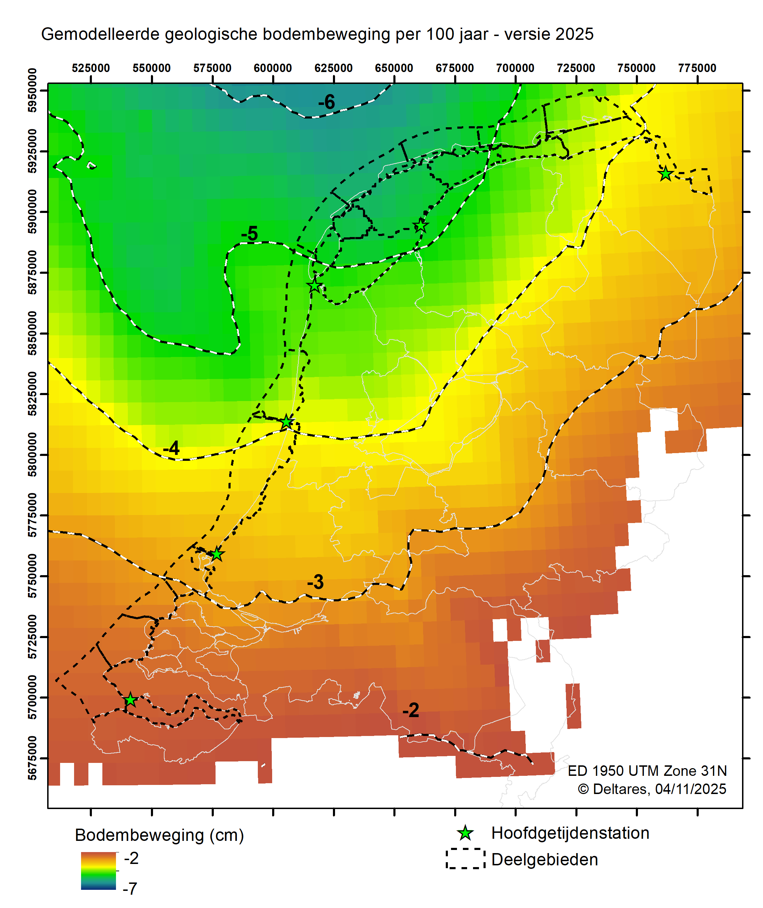

---
acronyms:
  insert_loa: false
  loa_title: "Lijst met afkortingen"
  insert_links: false
  fromfile:
    - acronyms.yml
---

# Resultaten {#resultaten}

## Voorkeursmodel

## Huidige zeespiegel(stijging) {#huidige}

## Bodemdaling en relatieve/absolute zeespiegelstijging
Bij alle getijdenstations bestaat de relatieve zeespiegelstijging voor een deel uit lange-termijn geologische bodemdaling [@Hijma2025b]. Deze daling wordt hoofdzakelijk veroorzaakt door tektonische en glacio-isostatische bodemdaling en heeft dalingssnelheden die van zuid naar noord toenemen van circa 2 naar 5 cm/eeuw (@fig-totgeol100yr). 

{#fig-totgeol100yr}

Er zijn twee stations waar ook bodemdaling door gaswinning heeft plaatsgevonden, namelijk Hoek van Holland en Delfzijl. Bij Hoek van Holland gaat het om 1-2 cm in de laatste decennia en gaan we er vanuit dat deze daling in het zeespiegelsignaal zit. De verwachte daling door gaswinning in de komende decennia is minder dan 1 cm [@hijma2026]. De daling bij Delfzijl is veel groter geweest en bedraagt ongeveer 30 cm sinds 1963. Voor Delfzijl weten we vrij zeker dat de bodemdaling sinds 1973 niet in de zeespiegeldata zit, maar dat de metingen gecorrigeerd worden [@Jong1973, punt 5]. Dit betekent dat de relatieve zeespiegelstijging bij Delfzijl eigenlijk sneller gaat dan in PSMSL gepubliceerd wordt, omdat de daling door gaswinning niet meegenomen wordt. Tussen de start van de gaswinning in Groningen in 1963 en 1973 daalde de bodem bij Delfzijl ongeveer 7 cm. Wij gaan er hier vanuit dat deze daling op dezelfde manier is behandeld als de daling na 1973, conform [@dJong1973, punt 5], en dus niet in het zeespiegelsignaal zit. Door het dichtdraaien van de gaskraan is de daling bij het station sterk afgenomen en naar verwachting zal deze nog slechts enkele centimeters bedragen in de komende decennia.

In de toekomst zal station Harlingen waarschijnlijk beïnvloed gaan worden door bodemdaling door zoutwinning. De winning is recent gestart in de Waddenzee ten westen van Harlingen en de bodemdalingsschotel lijkt Harlingen op termijn te gaan bereiken. Dit zal de komende 30 jaar tot meerdere centimeters bodemdaling leiden [@Hijma2025c; @Hijma2026]. De onzekerheid is echter groot en een kleine verschuiving in de vorm of positie van de schotel kan resulteren in geen bodemdaling of juist nog enkele centimeters meer. De bodemdaling wordt echter goed gemonitord, waardoor de eventuele impact op de zeespiegelmetingen goed in beeld zal komen.

{#fig-totgeol100yr}

## Vergelijking met scenarios (KNMI)

## Vergelijking met zeespiegelbudgetten

## Variatie binnen Nederland

## Vergelijking? met satellietmetingen
