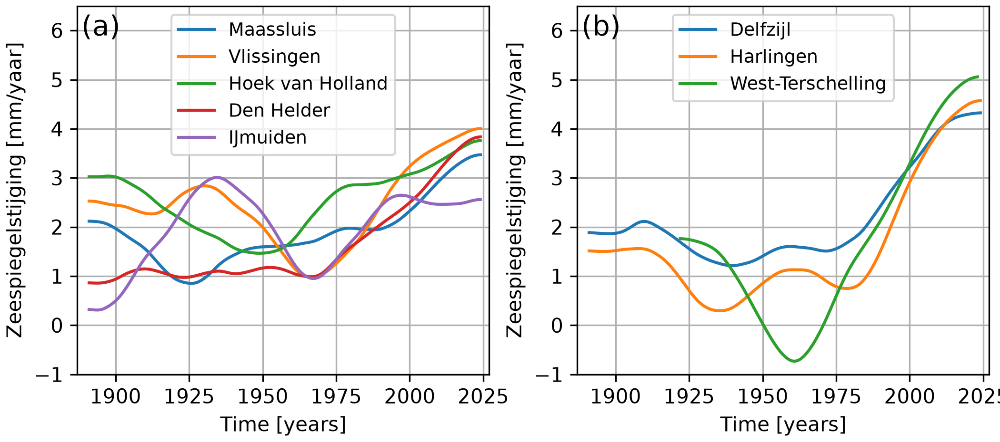
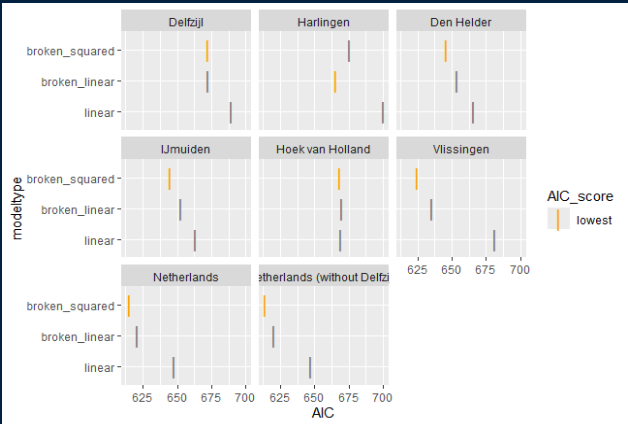
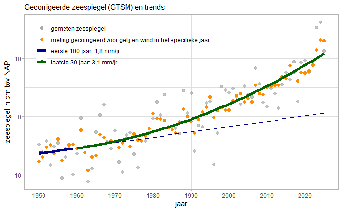

---
acronyms:
  include_unused: false
  insert_loa: false
  loa_title: ""
  fromfile:
  - acronyms.yml
---

# Discussie {#sec-discussie}

## Toepassingsbereik van de gebruikte methodiek {#sec-toepassingsbereik}

Is de gebruikte methode doelmatig voor het beoogde gebruik? Hiervoor is het nodig om de methode op te splitsen in de verschillende onderdelen.

Er is gekozen voor de hoofdstations langs de Nederlandse kust, omdat deze het beste de relatieve zeespiegel aangeven voor onze kust. Satellietgegevens hebben een grotere ruimtelijke dekking, maar zijn niet gedetailleerd genoeg in de kustzone (zie @sec-altimetrie). Van het hoofdstation Delfzijl is gebleken dat er een achterstand is in de verticale correcties t.o.v. \acr{NAP}. Daarom is dit station niet meegenomen in de hoofdresultaten (@sec-resultaten)). Rijkswaterstaat is wel bezig om voor deze achterstand met terugwerkende kracht te corrigeren. Mogelijk wordt in een volgende monitor Delfzijl dan weer toegevoegd.

Het effect van wind of storm is een belangrijke bron van variatie voor de jaarlijkse zeespiegel aan de Nederlandse kust [@Baart2014a; @Gerkema2017]. Sinds de rapportage in 2022 gebruikern we resultaten van het \acr{GTSM} model om voor het effect van wind op de gemiddelde waterstand te corrigeren. Eerst was dit allen nog beschikbaar voor de periode van 1979 tot nu, maar voor de huidige rapportage is het model uitgebreid met jaren 1950 tot nu. \acr{GTSM} is zeer geschikt om het effect van wind op de zeespiegel te schatten omdat het geheel onafhankelijk is van het gebruikte regressiemodel dat gebruikt wordt om de zeespiegelstijging te schatten.

:::{.callout-note title="Placeholder"}
placeholder Vergelijking GTSM - DCSM
:::

Behalve wind, is ook het nodale getij een bron van variatie voor de jaarlijkse gemiddelde zeespiegel. Dit is uitgelegd in paragraaf @sec-methodiek. Vanwege de lange periode van deze terugkerende variatie (ruim 18 jaar) is het van belang of de zeespiegel op weg is naar een hoger of lager jaargemiddeld getij. Een onafhankelijke schatting van het nodaal getij is mogelijk door middel van berekening van het zogenaamde equilibrium getij. Echter, het geobserveerde getij aan de Nederlandse kust blijkt daarvan af te wijken, door fysische processen die de doorwerking van het nodale getij op het contentinale plat bepalen (zie paragraaf @sec-getij voor meer details. Om die reden wordt het nodaal getij meegenomen als term in de regressie, waardoor de variatie in zeespiegelhoogte door het getij beter verklaard wordt. Dit is in lijn met recent onderzoek hieraan (@Bult2024).

Volgens de criteria die we hanteren voor modelkeuze (\acr{AIC}) is, net als bij de voorgaande rapportage, een keuze gemaakt voor het gebroken lineaire model met een knikpunt in 1993 (zie dit [rekendocument](https://github.com/Deltares-research/sealevelmonitor/blob/main/analysis/sealevelmonitor/sealevelanalysis.md)). Dit is het meest geschikte model voor schatting van de huidige zeespiegel (op grond van onze criteria), en de zeespiegelstijging over de afgelopen decennia. De methode is geschikt om over relatief korte tijd een verandering van zeespiegelstijging te detecteren. Gegeven het feit dat we een knik veronderstellen is dit een beter model dan het lineaire. Ook is er op grond van de residuen geen reden om het model af te wijzen. De gebruikte methodiek zegt echter niet veel over de oorzaak van deze verandering.

We zien deze keer wel dat de twee verschillende modellen met een versnellingsterm (gebroken lineair en gebroken kwadratisch) maar weinig verschillen in termen van \acr{AIC}. Het gebroken kwadratische model zal beter gaan presteren in het geval dat de zeespiegel zou blijven versnellen. Ondanks dat de modellen voor de afgelopen dicht bij elkaar liggen, is het verschil tussen de modellen, wanneer deze geextrapoleerd worden naar de komende jaren, veel groter. Dat zou een abrupte verandering geven van de verwachte (geëxtrapoleerde) zeespiegel. De komende jaren zal bekeken worden of het nodig is om hierop in te spelen door de methodiek eventueel aan te passen (@sec-uitkijk-methodiek). 

Voor kustonderhoud via zandsuppletie is de huidige methode geschikt. Zandsuppletie is een reactief proces, bedoeld om het volume zand dat nodig is om het kustfundament mee te laten groeien met de zeespiegel aan te vullen. Hiervoor is een zo betrouwbaar mogelijke schatting van de zeespiegelstijging over de afgelopen jaren nodig. De methode die gebruikt wordt voor het presenteren van de resultaten in hoofdstuk \@ref(resultaten) voldoet daaraan.

De zeespiegelmonitor is niet bedoeld om de verwachte zeespiegelstand langere tijd vooruit (bijvoorbeeld in 2050 of 2100) te bepalen. Tegelijkertijd zien we dat zeespiegelscenario's niet bedoeld zijn om op korte termijn de zeespiegel te voorspellen. Voor de planning van zandsuppletie op middellange termijn (10-15 jaar vooruit) is het nodig om een zo nauwkeurig mogelijke schatting te maken van de zeespiegelstijging over die periode. Hiervoor is binnen de zeespiegelmonitor geen methodiek vastgelegd. Totdat een betere methode beschikbaar is, kiezen we een periode van tot 15 jaar vooruit, als de periode waarvoor we het gebruik van de huidige zeespiegel en -stijging zoals beschreven in het voorkeursmodel aanraden.

Een huidige zeespiegelstand op zichzelf is niet geschikt voor beoordelingen van veiligheid. Daarvoor is de verwachte maximale zeespiegel nodig (getij + absolute zeespiegel + bodemdaling + hoogwater + golven) ten opzichte van de hoogte van de keringen. Het kan wel als component gebruikt worden.

## Waarom een model met een versnellingsterm {#sec-versnelling-discussie}

De zeespiegel aan de Nederlandse kust stijgt, en stijgt versneld sinds de jaren negentig, blijkt uit de resultaten. We concluderen dit uit het feit dat het gebroken lineaire model al een aantal jaren significant beter is dan het tot 2018 toe gebruikte lineaire model. Een versnelde zeespiegel aan de Nederlandse kust was met andere methodieken eerder ook aangetoond door @Steffelbauer2022 en @Keizer2022. De gerapporteerde stijging over de laatste decennia komt ook overeen met de wereldwijde stijging van de oceanen, zoals gemeten met satellieten.

@Steffelbauer2022 onderzocht met een soortgelijke methodiek als de Zeespiegelmonitor of er een significant gezamelijk knikpunt was in de tijdreeks van waterhoogte van de Nederlandse hoofdstations tot 2019. Er is een grotere subset van stations gebruikt (Maassluis en Terschelling zijn ook meegenomen) inclusief Delfzijl. Ook is het knikpunt bepaald aan de afzonderlijke stations (maar wel gezamenlijk), en niet aan het gemiddelde zoals in de Zeespiegelmonitor. Geconstateerd werd dat er een gezamenlijk knikpunt was in 1993. Deze constatering vinden we nu ook in de Zeespiegelmonitor. Gemiddeld over de stations werd door @Steffelbauer2022 een zeespiegelstijging gevonden van 2.7 ± 0.4 mm/jaar voor de periode na 1993. 

@Keizer2022 onderzocht de trend in zeespiegelstijging over een lange termijn met een geavanceerd statistische methode. Voor correctie door windopzet is de \acr{20CR} heranalyse gebruikt. Na een correctie van de zeespiegel voor de lange termijn windveranderingen is de zeespiegelstijging en het verschil daarin over tijd geschat met behulp van \acr{GAM}. Er is ook rekening gehouden met seizoensvariatie in windopzet. De conclusie uit dit artikel is dat de zeespiegelstijging in de periode 2000-2019 (3.0\[2.4 - 3.5\] mm/jaar) significant hoger is dan in de periode 1940-1959 (1.5\[1.1 - 1.8\] mm/jaar).

Het \acr{PBL} heeft in zijn [Compendium voor de Leefomgeving](https://www.clo.nl/indicatoren) een grafiek opgenomen over de zeespiegel(stijging) in Nederland. Hiervoor worden dezelfde basisgegevens gebruikt als de Zeespiegelmonitor. De laatste update is van oktober 2026. In het Compendium worden gegevens gemodelleerd met \acr{IRW} (@Visser2015). 

:::{.callout-note title="Placeholder"}
placeholder analyse PBL (verwacht in oktober 2026)
:::

De huidige stijging in de zeespiegelmonitor ($3.2 \pm 0.3\,mm/jaar$) is dus consistent met de hierboven genoemde studies.

In de vorige Zeespiegelmonitor is geconcludeerd dat de windopzet het best geschat kon worden door windopzet berekend uit het \acr{GTSM} model direct te gebruiken als correctie. Hierbij is de mate van windopzet onafhankelijk geschat van de trendbepalingsmethode. In de tussentijd hebben we het aantal jaren waarvoor deze windopzet berekend is uitgebreid van 1979 - 2022 (een serie van 43 jaar) in de vorige rapportage tot 1950 - 2025 (75 jaar) in de huidige rapportage. Dit heeft niet tot wezenlijk andere resultaten of conclusies geleid.

:::{.callout-note title="Placeholder"}
De wereldwijde stijging van de zeespiegel is ... (uit satellietgegevens)
:::

:::{.callout-note title="Placeholder"}
Onderstaand moet nog gecontroleerd worden
:::

Sommerend komen we op de volgende balans van de wereldwijde versus de Nederlandse zeespiegelstijging over de periode 1993-2021. De zeespiegelstijging over deze periode is in Nederlands hoger dan over de periode voor 1993, zoals besproken in paragraaf \@ref(versnelling-results). Eigenlijk zou de zeespiegelstijging hoger moeten zijn dan globaal, omdat in Nederland naast de zeespiegelstijging ook nog bodemdaling is. Maar omdat 3cm van de globale zeespiegelstijging een correctie is die niet aan de kust gemeten wordt en omdat we op een gunstige plek liggen wat betreft de bijdrage van Groenlands massaverlies aan de zeespiegelstijging (9cm) zien we aan de kust van Nederland toch een lagere zeespiegelstijging dan globaal. Andere effecten, zoals veranderingen in dichtheid, zijn hier buiten beschouwing gelaten.

## Verschillen binnen Nederland {#verschillen-binnen-nederland}

De gemiddelde zeespiegelstijging over alle zes (minus Delfzijl) hoofdstations is $3.2 \pm 0.3\,mm/jaar$. Er zijn echter verschillen tussen de stations. De grootste verschillen doen zich voor in de periode vóór 1993. In die periode vertonen Harlingen, en in mindere mate ook Den Helder en Delfzijl lagere stijging dan de stations aan de Hollandse kust (Vlissingen, Hoek van Holland en IJmuiden (@sec-ruimtelijke-variatie). Er zijn sterke aanwijzingen dat deze lagere stijging over verschillende decennia veroorzaakt is door de aanpassing van de westelijke Waddenzee aan de afsluiting van de Zuiderzee. De afsluiting (grofweg 1930 - 2000) heeft gezorgd voor een enorme verkleining van het bekken. Hierdoor is het getij veranderd, en heeft het systeem zich langzaam maar zeker aangepast met als gevolg een langdurige verandering van bodemligging en geulsystemen, stroming, en hierdoor weer getij. Verder is de zoetwaterverdeling in de westelijke Waddenzee hierdoor veranderd. Bovendien vertonen de veranderingen ook onderlinge afhankelijkheid. Veranderingen in spuidebieten van het IJsselmeer hebben nog meer bijgedragen aan veranderingen in de zoutverspreiding. Hierdoor is het aannemelijk dat er langjarige veranderingen zijn geweest in de zeespiegelstijging bij stations in de buurt van de westelijke Waddenzee. Er zijn verschillende aanwijzingen dat rond 1990 - 2000 de aanpassing van de Waddenzee aan de afsluiting sterk afzwakte. Gelijktijdig hiermee is te zien dat de zeespiegelstijging voor de verschillende stations sinds het begin van de jaren 1990 weer min of meer gelijk opgaat. Voor meer informatie wordt verwezen naar Bijlage #zeespiegel-in-de-waddenzee

## Onzekerheden

Over het algemeen vertonen de stations een zeer gelijksoortige huidige zeespiegelstijging. Dat geeft vertrouwen in de metingen en de methodiek om de huidige zeespiegelstijging vast te stellen. Ook het feit dat de resultaten overeenkomen met resultaten van andere partijen met verschillende methodische aanpak, geeft veel vertrouwen. De op dit moment bekende onzekerheden worden hieronder genoemd.

### Loskoppeling van NAP vlak voor Delfzijl

Voor Delfzijl zijn er onzekerheden veroorzaakt door bodemdaling door gaswinning. Het laatste decennium is dit station losgekoppeld van het NAP nulvlak vanwege de te snelle verandering in hoogte. Rijkswaterstaat CIV is bezig om voor Delfzijl de gemeten waterhoogtes te herzien, waarbij niet langer NAP gebruikt wordt als verticale referentie, maar de geoïde. Hiermee zullen de trends voor Delfzijl geïnterpreteerd moeten worden als absolute zeespiegelstijging. De verwachting is dat de herziening binnen de komende jaren beschikbaar komt. 

### Versnelde daling van de M-bout bij IJmuiden {#sec-ijmuiden}

Het statistische GAM-model beschreven in @keizer_acceleration_2023 biedt een manier om naar de continue evolutie van de snelheid van de zeespiegel in de tijd te kijken. De resultaten voor 8 stations langs de kust zijn weergegeven in @fig-gam-diff. In paneel (a) tonen we stations aan de Noordzeekust en in paneel (b) stations in de Waddenzee. Zoals vermeld in @sec-bodemdaling is de recente veranderingssnelheid bij IJmuiden lager dan bij alle andere stations. Dit zou te wijten kunnen zijn aan een fout in de meting van het peilstation (M-bout) ten opzichte van de dichtstbijzijnde nulpaal (Fig. 13 in @Honingh2021). De daling van de M-bout laat 14 mm bodemdaling zien tussen 2003 en 2004, vergeleken met een gemiddelde bodemdalingssnelheid van 1,3 mm/jaar in de daaropvolgende jaren. Deze mogelijke meetfout zou leiden tot een reductie van de trend over 1993–2025 met ongeveer 0,4 mm/jaar, wat zou verklaren waarom IJmuiden een uitbijter is. Aan de kant van de Waddenzee zien we dat, hoewel de snelheid van de zeespiegelstijging in Delfzijl in de jaren 50 en 60 het snelst was, deze nu het langzaamst is. Dit zou het gevolg kunnen zijn van de correctie voor bodemdaling door gaswinning, waarbij ook voor andere bronnen van bodemdaling wordt gecorrigeerd, wat de snelheid van de zeespiegelstijging verlaagt ten opzichte van de andere stations.

{#fig-gam-diff width=80%}

### Onzekerheden veroorzaakt door niet-verklaarde kortdurende variatie

- "schommelingen" veelal meest zichtbaar bij individuele stations. Deze zijn soms te herleiden naar grote ingrepen (Deltawerken, Afsluitdijk). Het is aannemelijk dat er meer variatie is te koppelen aan grote ingrepen in het verleden, denk aan uitbreidingen van havens of sluizen, verdiepingen, zoetwaterverdeling. Dit wordt in de komende jaren verder uitgezocht. 
- Verticale referenties die sturend zijn voor de afstelling van de meetinstrumenten (zie paragraaf en infographics). Dit zijn de nulpalen die gekoppeld zijn aan de hoofdgetijdestations. De hoogtes van ondergrondse merken die samen het NAP netwerk vormen zijn gepubliceerd vanaf 1970-1980, afhankelijk van locatie. <Plaatje NAPinfo> Deze hoogtes zijn bepaald in verschillende projecten, ten opzichte van het regionale referentienetwerk. Alleen in de \acr{NWP} worden deze waarden weer gerelateerd aan de nationale referenties op de Veluwe. Na de laatste \acr{NWP} zijn de hoogtes daarom ook herberekend. Wat opvalt is dat het verloop van de hoogtes in de tijd niet helemaal constant is. Vooral stations Harlingen en Den Helder vertonen een verschil waarbij er vóór pakweg 1990 een duidelijk snellere daling is van de nulpaal t.o.v. de regionale referenties dan daarna. Dit valt samen met de sterke knik in relatieve zeespiegelstijging bij die stations. Aangezien deze metingen gebruikt worden om de meetinstrumenten af te stellen is het niet uit te sluiten dat dit een bijdrage heeft geleverd aan een veranderende zeespiegelstijging in die periode. Zie ook bijlage <zeespiegelstijging in de Waddenzee>  
  

## Uitkijk naar methodische ontwikkelingen {#sec-uitkijk-methodiek}

Met de huidige methodiek lopen we tegen een paar uitdagingen aan. Dit ligt onder andere aan het feit dat er slechts vanaf 1950 gecorrigeerd kan worden voor de jaarlijks variërende windopzet met \acr{GTSM}. Hoewel dit in principe het zeespiegelsignaal verbetert, zorgt dit ook voor een inhomogene variantie. Hiermee wordt op dit moment niet rekening gehouden. Een ander punt is dat op termijn de zeespiegelveranderingen niet meer goed voldoen aan de relatief beperkte set die we nu testen (lineair, gebroken lineair, en gebroken kwadratisch). Het is de bedoeling om deze vraag de komende jaren uit te werken. Hieronder volgt een korte uitkijk naar hoe de methodiek zich verder zou kunnen ontwikkelen.

### Corrigeren voor, of expliciet opnemen van de verandering in variantie door windopzetcorrectie

Het uitbreiden van de windopzet gegevens naar de jaren vóór 1950 zou het probleem van de veranderende variantie kunnen oplossen. Op dit moment zijn er geen klimaatheranalyses waarmee \acr{GTSM} aangestuurt kan worden voor die jaren. Mocht er een alternatieve methode zijn dan zal dat worden bekeken. Hoewel dit de analyse statistisch robuster maakt, is niet te verwachten het de uitkomst wat betreft de huidige zeespiegelstijging veel zal veranderen.   

### Analyse alleen voor jaren met windopzetcorrectie

Door alleen metingen vanaf 1950 mee te nemen in de analyse wordt het probleem van verschillen in variantie over de tijd omzeild. Er is nog een reden om de tijdserie in te korten. Oudere metingen zijn onzekerder dan nieuwere. Dit heeft te maken met de frequentie van meten () en het feit dat de absolute verticale referentie van de zeespiegelmetingen vóór de invoering van nulpalen (1958) een grotere onzekerheid kende dan daarna.

Mogelijke nadelen zijn er ook. Door de tijdserie in te korten wordt mogelijk waardevolle informatie niet gebruikt. Ook kan het toelaten van een knikpunt onzekerder resultaten opleveren als deze dichter bij het begin van de tijdserie komt te liggen, zoals het knikpunt bij 1960 voor het gebroken kwadratische model. Ook moet nagedacht worden hoe om te gaan met bijvoorbeeld een verandering van het voorkeursmodel als gevolg van het verkorten van de tijdserie.

<voorbeelden van analyse met kortere tijdserie>

:::{#fig-kortere-tijdserie-AIC}

{width=60%}

AIC Analyse van zeespiegeltijdserie met een verkorte tijdserie (vanaf 1950) met de methodiek van de Zeespiegelmonitor. Door het weglaten van veel meetdata verschuift het voorkeursmodel van gebroken lineair naar gebroken kwadratisch.

:::

Omdat dan een ander model gekozen wordt als voorkeursmodel zal ook de schatting van de stijging van de zeespiegel veranderen, en vooral ook de schatting voor de komende jaren. 

:::{#fig-kortere-tijdserie-kwadratisch}

{width=60%}

Analyse van zeespiegeltijdserie met een verkorte tijdserie (vanaf 1950) met de methodiek van de Zeespiegelmonitor. Door het weglaten van veel meetdata verschuift het voorkeursmodel van gebroken lineair naar gebroken kwadratisch.

:::

### Meer modellen toevoegen

Op dit moment wordt een lineaire (\acr{LM}) of gegeneraliseerde lineaire modelfunctie (\acr{GLM}) gebruikt. In andere studies wordt ook wel een \acr{GAM} (@Keizer2022), \acr{LOESS}, of \acr{IRW} (@Visser2015) gebruikt . Het belangrijkste verschil is dat een GLM een vooraf gespecificeerde parametrische relatie tussen voorspellers en respons veronderstelt, terwijl een GAM, wanneer een spline functie wordt toegevoegd, deze relatief flexibel en niet-parametrisch uit de data schat . Een \acr{GAM} zou de variatie van de meetgegevens beter kunnen beschrijven. Deze betere beschrijving komt niet door een betere duiding van natuurkundige principes, maar door een hogere graad van vrijheid.

Een eerste vergelijking van een GAM en GLM model met dezelfde methodiek en dataset laat zien dat er op het oog weinig verschillen zijn in de beschrijving van de gemiddelde zeespiegel langs de Nederlandse kust.

:::{#fig-gam-glm-zeespiegel}

{width=80%}

Vergelijking GAM en "broken linear" model voor de Nederlandse zeespiegelmetingen.

:::

De zeespiegelstijging over de jaren is bij het gebroken lineaire model abrupt in 1993, en verloopt geleidelijker bij het \acr{GAM} model (@fig-gam-glm-zss). Een karakteristiek voor flexibele modellen als \acr{GAM} is dat de onzekerheid over de bepaalde zeespiegelstijging toeneemt naar de uiteinden van de tijdserie. Voor de gemiddelde zeespiegelstijging over de laatste decennia lijken de modellen zeer goed overeen te komen. 

:::{#fig-gam-glm-zss}

{width=80%}

Vergelijking van de snelheid van zeespiegelstijging zoals geschat met het GAM model en het "broken linear" model inclusief het betrouwbaarheidsinterval.

:::

Wanneer de modellen toegepast worden op de individuele stations, zijn de verschillen groter. Het \acr{GAM}, dat een flexibele curve ondersteunt, kan beter de variatie van individuele stations volgen dan de \acr{GLM} variant (@fig-gam-glm-zeespiegel-stations). We zien dan ook dat, op basis van het vergelijken van AIC \acr{GAM} beter presteert bij indiduele stations, maar dat \acr{GLM} beter presteert voor de gemiddelde zeespiegel in Nederland. Deze analyse is ook te vinden in een online [rekendocument](https://github.com/Deltares-research/sealevelmonitor/blob/main/analysis/sealevelmonitor/gam-knmi-analyse.md). 

:::{#fig-gam-glm-zeespiegel-stations}

{width=80%}

Vergelijking van de snelheid van zeespiegelstijging zoals geschat met het GAM model en het "broken linear" model inclusief het betrouwbaarheidsinterval voor de zes hoofdstations.

:::

::: {.content-visible when-format="html"}

## Lijst met gebruikte afkortingen

\printacronyms

:::
