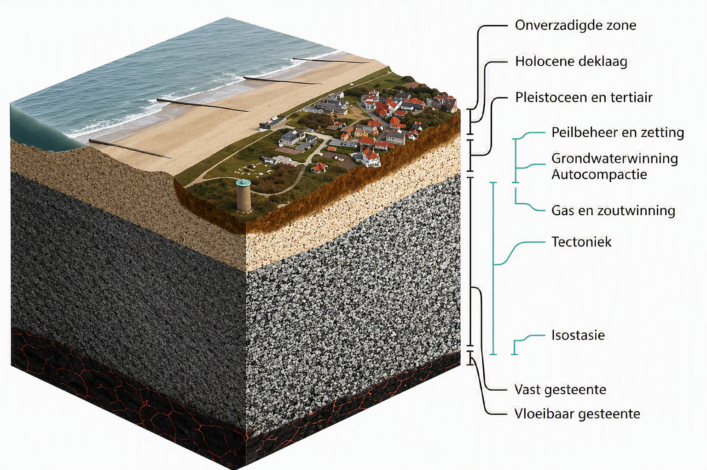
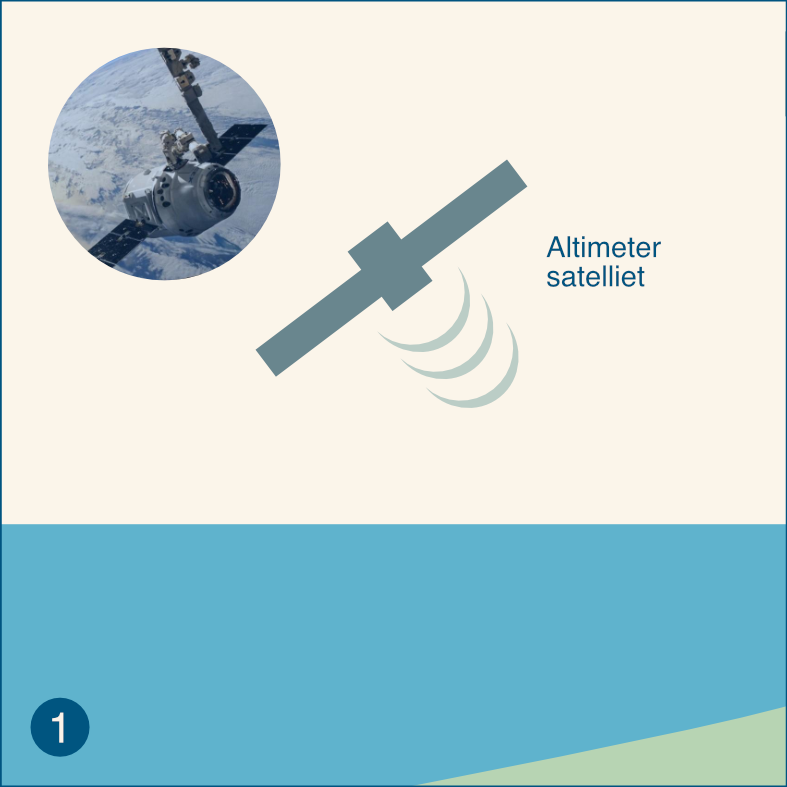
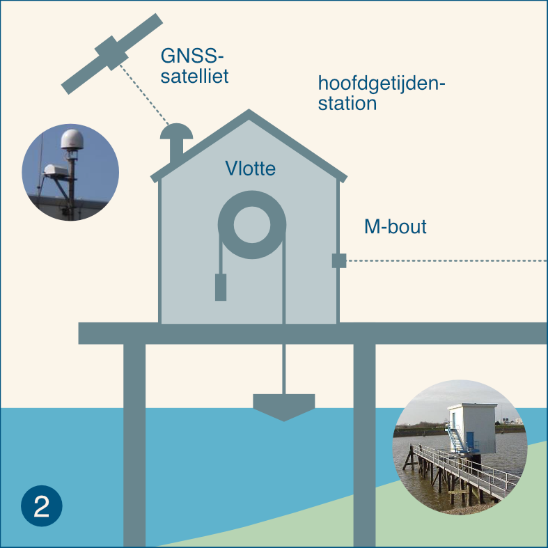

---
acronyms:
  insert_loa: false
  loa_title: "Lijst met afkortingen"
  insert_links: false
  fromfile:
    - acronyms.yml
---

# Bijlagen {-}

## Bodemdaling componenten {#sec-bodemdalingcomponenten}

Het is al heel lang bekend dat de zeespiegelmetingen in Nederland worden beïnvloed door bodemdaling [@Veen1945,@Veen1954] en dat ze feitelijk de relatieve zeespiegelbewegingen weergeven. Bodemdaling is de optelsom van verschillende componenten (@fig-Bodemdalingscomponenten) en niet alle componenten zijn relevant voor de zeespiegelmetingen. Dit komt omdat de stations diep gefundeerd staan en alleen beïnvloed worden door bodemdaling in de lagen onder de fundering. Maaivelddaling door veenoxidatie of verlaging van de grondwaterstand hebben dus geen inlvoed op de zeespiegelmetingen, maar diepere bodemdaling door geologische processen of gaswinning wel. In @tbl-bodemdalingscomponenten worden de verschillende componenten nader omschreven.

{#fig-Bodemdalingscomponenten}

| Hoofdoorzaak | Oorzaak | Beschrijving |
|------------------|------------------|------------------------------------|
| Geologische bodembeweging | Tektoniek (0.2-1.5 cm/eeuw | Daling of opheffing die wordt veroorzaakt door spanningen in de ca. 100 km dikke Euraziatische aardplaat waar Nederland deel van uitmaakt. De spanningen hangen samen met het naar elkaar toe bewegen van de Afrikaanse en Euraziatische aardplaat en het uit elkaar drijven van Europa en Noord-Amerika. De snelheid van tektonische bodemdaling neemt toe van Goeree (2 mm/eeuw) tot meer dan 1 cm/eeuw in de Waddenzee. |
| Geologische bodembeweging | Isostasie(2-5 cm/eeuw) | Daling die samenhangt met het terugbuigen van de aardplaat in Noordwest Europa door het afsmelten van de grote ijskappen die in de laatste glaciale periode op Groot-Brittannië en Scandinavië rustten. Bij het ontstaan van de ijskappen werd de aardplaat onder het gewicht van het vele ijs doorgebogen en in een rand daarom heen kwam de aardplaat juist omhoog. Het proces van herstel (terugbuigen) is nog gaande, en omdat Nederland op de omhoogkomende rand lag daalt Nederland. |
| Geologische bodembeweging | Autocompactie (\<\< 1 cm/eeuw) | Samendrukking van afzettingen tussen het maaiveld en honderden meters diepte. Deze compactie vindt plaats onder het eigen gewicht en door toename van dat gewicht in het recente geologische verleden door jonge afzettingen. |
| Antropogene bodemdaling | Olie-/gaswinning(cm-dm per eeuw) | Daling aan het maaiveld die wordt veroorzaakt door de drukverlaging in olie- of gasvelden en die zorgt voor samendrukking van de betreffende lagen. Speelt bij Hoek van Holland en Delfzijl. |
| Antropogene bodemdaling | Zoutwinning (cm-m per eeuw) | Daling die wordt veroorzaakt door de lage druk in de cavernes die ontstaan door het winnen van zout. De cavernes worden langzaam dichtgedrukt en zorgen voor inzakking van bovenliggende lagen. Speelt mogelijk over enige tijd bij Harlingen. |
| Antropogene bodemdaling | Grondwaterwinning (cm-dm per eeuw) | Daling die wordt veroorzaakt door de waterdrukverlaging in de bodemlagen in de omgeving van de winning waardoor de laag waaruit wordt gewonnen, maar ook boven en/of onderliggende lagen, worden samengedrukt. |
| Antropogene bodemdaling | Peilbeheer (cm-dm per eeuw) | Daling die samenhangt met periodische aanpassing/verlaging (t.o.v. NAP) van het waterpeil in sloten en vaarten in gebieden met maaivelddaling om een gewenste drooglegging (verschil tussen maaiveld en waterpeil) te handhaven. |
| Antropogene bodemdaling | Zetting (cm-dm per eeuw) | Daling onder invloed van extra gewicht dat op het maaiveld (of waterbodem) wordt aangebracht door de mens en waardoor lagen in de ondergrond worden samengedrukt. |

: De belangrijkste componenten van bodembeweging in Nederland, afgeleid van @Hijma2017 en @Hijma2018 {#tbl-bodemdalingscomponenten}

# Van meting naar zeespiegelverandering.

Deze paragraaf bevat de informatie van de "infographics", geproduceerd in het kader van de Zeespiegelmonitor. Het bevat uitleg op verschillende niveau's in woord en beeld om de zeespiegelmetingen en veranderingen daarin juist te interpreteren.

## relatieve zeespiegelverandering

Er zijn **twee methoden** om zeespiegelveranderingen te meten en in kaart te brengen. Wereldwijd worden zeespiegelveranderingen hoofdzakelijk bepaald middels hoogtemetingen met (**altimetrie) satellieten**, waarmee absolute veranderingen worden bepaald ten opzichte van het middelpunt van de aarde. De methode is toepasbaar vanaf 10-50 km voor de kust, omdat dichterbij de kust te veel ruis in de gegevens zit. Momenteel wordt wereldwijd gemiddeld een absolute zeespiegelstijging van 3,3 mm per jaar gemeten.

Een tweede methode is het **meten van waterstanden** en het analyseren van langjarige trends om de relatieve zeespiegelverandering te bepalen. Dit wordt voor de zes Nederlandse **hoofdgetijdenstations** gedaan. Bij het bepalen van de trend wordt rekening gehouden met fluctuaties in de waterstanden door wind en getij. De gevonden relatieve zeespiegelstijging is relevant voor het Nederlandse kustbeleid, voor het bepalen van de benodigde suppletievolumes en ontwerp van de primaire waterkeringen.

De relatieve zeespiegelstijging is niet overal gelijk langs de Nederlandse kust, er zijn regionale verschillen onder invloed van bodemdaling en absolute zeespiegelstijging. Hoe deze begrippen zich tot elkaar verhouden wordt hieronder toegelicht.

::: {#fig-hoogtemetingen layout-ncol=2}

{#fig-altimeter}

{#fig-gnssmeting}

Hoogtemetingen in de kustzone. Directe metingen van het zeeoppervlak met behulp van satellietaltimetrie (a) en hoogtemeting van het meetinstrument in de getijdestations met GNSS (b).
:::

**Absolute zeespiegelstijging**

Op wereldschaal wordt zeespiegelstijging voornamelijk onderzocht middels altimetrie satellieten die de afstand tussen het water en de satelliet meten. Met behulp van verschillende nabewerkingen wordt de werkelijke gemiddelde verhoging van de zeespiegel ten opzichte van het centrum van de aarde bepaald, dit noemen we de absolute zeespiegelverandering.

**Bodemdaling**

Bodemdaling bij de getijdenstations wordt veroorzaakt door geologische bodembewegingen en soms ook door winning van grondstoffen (hoofdzakelijk gaswinning). Ook is het mogelijk dat de fundering van het getijdenstation langzaam beweegt. Over het algemeen wordt ondiepe bodemdaling (bijv. inklinking) hier niet meegenomen. Zie ook @sec-bodemdalingcomponenten. 

**Relatieve zeespiegelstijging**

De relatieve zeespiegelstijging in Nederland is een combinatie van absolute zeespiegelstijging en bodemdaling in de diepe ondergrond. De benodigde hoeveelheid suppletiezand langs de Nederlandse kust wordt bepaald door de relatieve zeespiegelstijging voor de zes hoofdgetijdenstations te middelen. Het is niet altijd zeker waardoor regionale verschillen worden veroorzaakt, grootschalige waterwerken kunnen hier deels voor verantwoordelijk zijn[\[1\]](#_ftn1). Om beter inzicht te krijgen in onzekerheden en regionale verschillen is het wenselijk zowel de relatieve zeespiegelstijging, de absolute zeespiegelstijging en de bodemdaling in kaart te brengen voor de verschillende getijdenstation.

## In kaart brengen van zeespiegelstijging

Ten behoeve van het Nederlandse waterveiligheidsbeleid wordt jaarlijks de stand en de ontwikkeling van de zeespiegel vastgesteld. Hiervoor maakt de Zeespiegelmonitor gebruik van gegevens voor de zes zogenaamde Nederlandse hoofdgetijdenstations. Bij deze stations wordt de waterstand gemeten en geanalyseerd om de jaarlijkse zeespiegelstand vast te stellen en langjarige trendanalyses uit te voeren. Jaarlijkse gemiddelden voor hoofdgetijdenstations worden via de Permanent Service for Mean Sea Level (PSMSL) database geraadpleegd. Rijkswaterstaat (RWS) levert deze gegevens jaarlijks toe aan PSMSL (zie nadere toelichting op pagina 6 van deze infographic).

In het verleden hebben diverse kleinere en grotere ingrepen aan de Nederlandse kust plaatsgevonden die invloed hebben op de metingen. Voorbeelden hiervan zijn de aanleg van de Deltawerken en de Afsluitdijk. De methode om de zeespiegelstijging langs de Nederlandse kust te bepalen maakt geen onderscheid in de mate waarin de hoofdgetijdenstations beïnvloed zijn door deze ingrepen. In de Zeespiegelmonitor (2022) is geen gebruik gemaakt van station Delfzijl, vanwege onzekerheden in het doorvoeren van correcties voor de bodemdaling door gaswinning. Dit leidt tot informatieverlies en is uiteraard niet wenselijk. Dit is ook één van de aanleidingen geweest om beter inzicht te willen krijgen in de werkwijze voor het inmeten van de waterstanden en NAP-hoogtes van de vlotter/radar en de nulpaal bij de (hoofd)getijdenstations. Ook worden de gegevens van Delfzijl op dit moment (begin 2026) gecorrigeerd, waardoor ze later weer beschikbaar zijn voor trendberekeningen.

Naast de waterstandsmetingen bij de getijdenstations wordt gebruik gemaakt van altimetriemetingen via satellieten. De satellieten meten de zeehoogte (altimetrie) op basis van een radar altimeter. Deze meetmethodiek is gestart in 1992, na de lancering van de TOPEX/Poseidon satelliet, en inmiddels zijn er meerdere satellieten die de hoogte meten. Deze satellietgegevens zijn beschikbaar met een temporele resolutie van zes dagen en worden in de zeespiegelmonitor gebruikt als verificatie van de absolute zeespiegelstijging zoals afgeleid voor de getijdenstations.

De satellietgegevens zijn niet gevalideerd langs de kust, omdat op deze locaties de metingen “vervuild” kunnen raken. Dit heeft twee oorzaken: i) onzekerheden in de correctie voor getij en ii) er wordt deels land en deels water gemeten. Daarom moet men in analyses voorzichtig zijn met het gebruik van satellietgegevens in de kustzone.

## Waterstandsmetingen bij hoofgetijdenstations

De zes hoofdgetijdenstations die binnen de Zeespiegelmonitor gebruikt worden om de zeespiegelstijging langs de Nederlandse kust te bepalen zijn sinds 1862 Vlissingen, sinds 1864 Hoek van Holland, sinds 1871 IJmuiden, sinds 1865 Den Helder, sinds 1865 Harlingen en sinds 1865 Delfzijl. Voor het meten van de waterstanden bij de getijdenstations is de meest gangbare meetmethode een DNM-meetinstrument (Digitale Niveaumeter; vlottersysteem). De hoofdgetijdenstations zijn allemaal uitgerust met vlottersystemen, behalve bij IJmuiden-Buitenhaven waar sinds 2020 met radar wordt gemeten vanwege toenemende verzandingsproblemen bij de toevoerbuis van het vlottersysteem. Beide instrumenten hebben een aanwijsbaar referentiepunt en bij beide meetmethoden wordt de afstand vanaf het meetinstrument tot het water gemeten. Omdat vóór 1890 onduidelijkheid is over de precieze verticale referentie van de getijdenstations, worden alleen gegevens vanaf 1890 gebruikt.

Vervolgens worden de waterstandsmetingen geanalyseerd en wordt een langjarige trend bepaald per hoofdgetijdenstation. De methodiek die de Zeespiegelmonitor hiervoor hanteert is in 2014 vastgesteld. Bij het bepalen van de trend wordt rekening gehouden met fluctuaties in de waterstanden. Hierbij is de 18.613 jarige nodale cyclus, veroorzaakt door de veranderende positie van het maanvlak ten opzichte van de evenaar, de belangrijkste cyclus in de waterstanden. Verder zijn er seizoenseffecten die worden veroorzaakt door wind, luchtdruk en temperatuur. Dit is weergeven in het figuur *bijdrage aan de zeespiegelstijging*.

De gemeten waterstand wordt gerefereerd aan een diepgefundeerde paal, de nulpaal of een ander NAP-peilmerk. Voor de hoofdgetijdenstations gaat het doorgaans om de M-bout die in de muur van het station is bevestigd. Het hoogtesysteem in Nederland is gedefinieerd ten opzichte van het NAP (Normaal Amsterdams Peil). Met ‘het NAP’ wordt het NAP-nulvlak bedoeld. Het NAP-nulvlak wordt in de praktijk vastgelegd door middel van zes ondergrondse peilmerken, op de zandgronden van Midden-Nederland, die stabiel worden verondersteld. Daarnaast zijn er NAP-peilmerken, bronzen bouten bevestigd aan gebouwen, bruggen en viaducten, waarvan het hoogteverschil met het denkbeeldige NAP-nulvlak bekend is. Hierdoor ontstaat een samenhangende set van peilmerken waarvan de NAP-hoogte bekend verondersteld is, ons referentiesysteem. Er zijn twee typen NAP-peilmerken, primaire en secundaire merken, dit wordt nader toegelicht op pagina 4 van deze infographic. De primaire peilmerken zijn stabieler omdat deze meestal gefundeerd zijn in het Pleistoceen.

## Controles van de waterstandsmetingen en meetapparatuur

De waterstandsmetingen en meetinstrumenten worden met verschillende frequenties gecontroleerd, namelijk:

• 2x per dag vindt er een visuele controle van de waterstandsmetingen plaats. In deze controle wordt vooral gecontroleerd of het meetinstrument de waterstand registreert. Alleen als er iets mis lijkt te zijn met de metingen wordt er iemand fysiek naar het station gestuurd om de meetapparatuur te inspecteren.

• 1x per maand vindt er een controle van trendmatige ontwikkelingen plaats. Afwijkingen kunnen komen door bijvoorbeeld vervuiling, slibophoping, een verstopte toevoerleiding, een vlotterband die loskomt van het vlotterwiel of door bijvoorbeeld een aanvaring. Als dit het geval is wordt de correctie vanaf dit incident (zichtbaar door een duidelijk sprong) doorgevoerd. Dit kan worden gedetecteerd door een faseverschuiving ten opzichte van het gedrag bij buurstations.

• 1x per jaar wordt de hoogtemeting van de waterstandsinstrumenten gecontroleerd t.o.v. de nulpalen (P-bout) of de muurbouten (M-bout), dit wordt ook wel de B0-verificatie genoemd. Deze meting wordt door een aannemer uitgevoerd met een kruislijnlaser met een nauwkeurigheid van \<1,4 mm. Indien de afwijking tussen het meetinstrument en het NAP-peilmerk groter is dan 6 mm moet het instrument door de aannemer versteld worden, dit is vrijblijvend voor een afwijking in de range van 1-6 mm. De meetreeks wordt hierbij met 1 cm gecorrigeerd en de correctie wordt door middel van lineaire interpolatie tussen de vorige B0-verificatie en de huidige B0-verificatie toegepast. Deze B0-verificatie wordt geregistreerd (datum, hoogte NAP-referentie, wie de meting heeft uitgevoerd, etc.) in pdf-bestanden. Vertaling vanuit meting naar eventuele correctie doet RWS-CIV-Vaste Meetnetten.

• Alleen bij Harlingen en Den Helder bevindt de nulpaal (P-bout) zich in het getijdenstation. Bij de andere hoofdgetijdenstations betreft dit de muurbout (M-bout) die afhankelijk van de fundering anders kan bewegen ten opzichte van de nulpaal. Daarom moet ook de M-bout t.o.v. de nulpaal (P-bout) worden ingemeten. Dit gebeurt niet jaarlijks, maar mits toegankelijk tijdens primaire en secundaire waterpassingen. Deze waterpassingen worden op de volgende pagina toegelicht. In 2021 is éénmalig een controle van alle hoogtes van muurbouten (M-bouten) ten opzichte van de nulpaal (P-bout) uitgevoerd. Sindsdien is ook een aantal stations extra gecontroleerd en worden de M-bouten nu met regionale waterpassingen meegenomen. Bij een aantal stations is een afwijking geconstateerd tijdens deze controles. De M-bout die aan het hoofdgetijdenstation bevestigd is, vertoont bij een afwijking niet dezelfde beweging als het primaire peilmerk (de P-bout). De afwijkingen waren bij deze controles als volgt: Vlissingen 1 mm in 2021, Hoek van Holland 1 mm in 2021, IJmuiden 14 mm in 2021 en 2 mm in 2025 en Delfzijl 6 mm in 2021 en 12 mm in 2023.

## Waterpassingen

De NAP-peilmerken werden voorheen per regio 1x per 10 jaar ingemeten (ook wel de A0-controle/correctie genoemd), in wat ook wel ‘planperiodes’ genoemd worden. Alleen de minder stabiele locaties (Groningen en Friesland) werden 1x per 5 jaar ingemeten. Deze metingen werden voor zowel de primaire en secundaire peilmerken uitgevoerd en de informatie werd ontsloten in de NAP-info viewer en via webservices. De vaste cycli van 5 of 10 jaar zijn losgelaten, omdat er nu geprioriteerd wordt op basis van deformatiekaarten.

Ten slotte zijn er de nauwkeurigheidswaterpassingen (NWP’s); dit zijn de landelijke waterpassingen. Bij de NWP’s wordt de hoogte van primaire landelijke punten t.o.v. het NAP-nulvlak vastgelegd. Deze NWP’s vinden niet met een reguliere frequentie plaats, maar zijn altijd uitgevoerd vanwege een specifieke aanleiding. Er zijn tot nu toe vijf NWP’s uitgevoerd. In de programmering wordt een volgende NWP opgenomen, maar hiervoor staat de timing nog niet vast. De aanleiding voor deze NWP is een gewenste controle van de primaire merken en in verband met de aansluiting bij Europese referentiesystemen, om betere omrekening mogelijk te maken door dit te combineren met GNSS-metingen. Naar aanleiding van de 5^de^ NWP zijn de volgende correcties voor de hoofdgetijdenstations doorgevoerd in 2005: Delfzijl -8,2 mm; Den Helder -16,8 mm; Harlingen -6,5 mm; Hoek van Holland -6,5 mm; IJmuiden -21,5 mm en Vlissingen -29,7 mm.

## Geologische bodemdaling en GNSS-metingen

Een alternatieve methode voor het monitoren van de bodembeweging bij hoofdgetijdenstation is middels Global Navigation Satellite System (GNSS) stations. Voor monitoring van de bodembeweging van een GNSS-antenne bij een hoofdgetijdenstation is geen transformatie nodig, omdat de referentiehoogte voor het vergelijken van hoogtes op twee tijdstippen niet uitmaakt. Wel is het relevant of de GNSS-antenne en het waterstandsmeetinstrument dezelfde bodembeweging vertonen. Hiervoor is het nodig om zowel de NAP-hoogte van de GNSS-antenne en het waterstandsmeetinstrument herhaaldelijk te vergelijken met de hoogte van de nulpaal, waarvan bekend is dat deze in het Pleistoceen gefundeerd zijn. Om eventuele verzakkingen van de GNSS-antenne zo goed mogelijk in beeld te brengen zijn bij de getijdenstations met GNSS-apparatuur ook extra muurbouten geplaatst. Op deze manier kunnen eventuele ongelijkheden in zakkingen (scheefstand) bij een getijdenstation in kaart worden gebracht. Met behulp van waterpassing en tachymetrie kan jaarlijks de precieze hoogte ten opzichte van het NAP-nulvlak worden bepaald (lokale deformatie) voor zowel het peilmerk en de GNSS-antenne. Deze jaarlijkse meting staat los van de B0-meting, aangezien niet dezelfde apparatuur gebruikt wordt en niet dezelfde mensen de metingen uitvoeren.

De resultaten van de GNSS-metingen kunnen worden gebruikt om de gemodelleerde geologische bodemdaling (door tektoniek en isostasie) bij de getijdenstations te valideren. Hiervoor zijn metingen relevant om de bodemdaling van de top van het Pleistoceen in Nederland te bepalen, waarbij bodemdaling in het Holocene pakket, door compactie en veenoxidatie, geen rol speelt.[\[2\]](#_ftn2) Aangezien bodembewegingen langzame processen zijn, is een meetreeks van minimaal 10 jaar nodig om de GNSS-metingen zinvol te kunnen vergelijken met de gemodelleerde bodemdaling, waarvan de gegevens gebruikt worden in de Zeespiegelmonitor. Als de GNSS-metingen betrouwbare en robuuste gegevens gaan opleveren kunnen ze direct ingezet worden voor het analyseren van de zeespiegeltrends. Bij de hoofdgetijdenstations zijn de GNSS-antennes geplaatst tussen 2004-2022. Een overzicht per station is opgenomen in Honingh (2024)[\[3\]](#_ftn3).

## Gegevensontsluiting

De waterstandsmetingen worden iedere 10 seconden geregistreerd (ruwe gegevens). Uit deze ruwe gegevens wordt een 10-minutengemiddelde bepaald. Indien deze gemiddelde waterstand niet wordt berekend wordt er een missende waarde gerapporteerd. De ruwe gegevens werden voorheen niet bewaard. De 10- minuten gemiddelde waterstanden worden direct openbaar ontsloten via de RWS WaterWebservices. Eerder werden de gemiddelde waterstanden na twee dagen opgeslagen in de permanente database DONAR (Data Opslag Natte Rijkswaterstaat). Deze database bevatte (gecorrigeerde) waterstandsgegevens en een statuskenmerk. Het statuskenmerk geeft aan of op deze gegevens een eerste validatieslag binnen het Landelijk Meetnet Water (LMW) uitgevoerd is aan de hand van buurstations. Missende waarden worden dan opgevuld middels gegevens van een back-up sensor of middels Multi Lineaire Regressie (MLR).

DONAR wordt momenteel vervangen door WADAR (WaterData Rijkswaterstaat). In deze database worden nu ook de gemiddelde 1-minutenwaarde, 10-minutenwaarde, de maandelijkse trendanalyse correctiereeksen, de jaarlijkse B0-correctiereeksen en de NAP-correctiereeksen opgeslagen. Correctiereeksen zijn sinds 2021 opgesteld, maar het was binnen DONAR nog niet mogelijk deze te ontsluiten.

Jaarlijks geeft RWS-CIV de gegevens van gemiddelde waterstanden van de hoofdgetijdenstations en enkele andere stations door aan de Permanent Service for Mean Sea Level (PSMSL). Deze PSMSL-gegevens vormt in het principe de invoer van de Zeespiegelmonitor. Daarom is de timing van het delen van gegevens relevant. De gegevens worden jaarlijks na de B0-verificatie gedeeld in verband met eventuele correcties. Daarnaast moeten latere correctie ook worden gedeeld met PSMSL. Momenteel wordt er gewerkt aan het vergelijken van PSMSL- en DONAR-gegevens en het doorvoeren van correcties uit het verleden in PSMSL.

Voor de Zeespiegelmonitor wordt gebruik gemaakt van de gegevens van PSMSL, geharmoniseerd naar de zogenoemde Revised Local Reference (RLR), waar de correctie van 2005 al is verwerkt. Hierdoor zit er geen sprong in de trends wat bij DONAR wel het geval is. Dit wordt nader toegelicht op de PSMSL-website. Door deze bewerking wordt de relatieve zeespiegelstijging voor de Nederlandse kust bepaald ten opzichte van de diepere pleistocene zandlaag, een laag die doorgaans stabiel verondersteld wordt maar ook aan beweging onderhevig is. 

[\[1\]](#_ftnref1) Becker, M., M. Karpytchev, M. Davy, and K. Doekes. 2009. “Impact of a Shift in Mean on the Sea Level Rise: Application to the Tide Gauges in the Southern Netherlands.” Continental Shelf Research 29 (4): 741–49. https://doi.org/10.1016/j.csr.2008.12.005.

[\[2\]](#_ftnref2) Hijma (2019).  Bodemdalingsmonitor 2019 Kustfundament en getijdenbekkens - NAP-peilmerkenanalyse, monitoringsstrategie, isostatische modellen

[\[3\]](#_ftnref3) Honingh (2024). Procedures en meetresultaten - GNSS-stations
