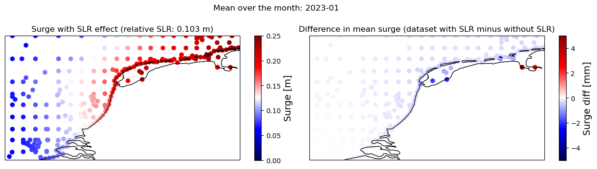

---
acronyms:
  insert_loa: false
  loa_title: "Lijst met afkortingen"
  insert_links: false
  fromfile:
    - acronyms.yml
---

# Methodiek {#methodiek}

```{r setup-methoden}
require(tidyverse)
require(leaflet)
```

In hoofdstuk @sec-inleiding wordt uitgelegd dat er een 'huidige zeespiegel' nodig is, onder andere om de suppletiebehoefte te bepalen. Huidig is in de context van deze toepassing eigenlijk geen tijdspunt, maar een tijdsspanne. Het gaat niet om de zeespiegel vandaag, maar om de zeespiegel van enkele jaren terug tot nu.

In de bijlage \@ref(metingen) wordt uitgelegd hoe de metingen precies tot stand komen.

## Afwegingen {#afwegingen}

Bij het selecteren van de methode worden er diverse afwegingen gemaakt, waarbij we gebruik maken van onderstaande criteria. Dit hoofdstuk geeft een overzicht van de belangrijkste modelkeuzes en de bijbehorende onderbouwing. Uitgangspunt voor de afwegingen is het bepalen van een goede maat voor de huidige zeespiegelstijging ten behoeve van het suppletieprogramma en de suppletiebehoefte.

**Stabiliteit** - de gebruikte methodiek moet niet van jaar tot jaar te veel variëren.

**Spaarzaamheid** - parcimonie: principe dat de eenvoudigste van twee ongeveer even plausibele verklaringen voor hetzelfde fenomeen de voorkeur heeft

**Robuustheid** - trend moet niet te veel afhangen van modelkeuzes

**Voorspelkracht** - toepassing van model in het verleden moet een goede hindcast opleveren voor een voorspelhorizon die vergelijkbaar is met de lengte van de gewenste periode (10-15 jaar)

**Behoudend** - methode moet temporeel aansluiten oftewel over de gehele periode met metingen toepasbaar zijn zonder onderbreking of verspringing.

**Generaliseerbaarheid** - methode moet ook werken bij andere stations dan in Nederland

**Power** - als er een verandering is moet de methode dat snel detecteren

**Fysisch verklaarbaar** - de gekozen formulering moet verklaarbaar zijn vanuit fysisch oogpunt

## Algemene methodiek

In dit onderzoek maken we gebruik van een \acr{GLM}, een gegeneralizeerde vorm van een lineair regressiemodel. Vooral omdat de variatie goed verklaard wordt [@Watson2016]. We gaan er vanuit dat de zeespiegel sneller aan het stijgen is of binnenkort sneller gaat stijgen dan in het verleden (ruwweg de twintigste eeuw)[^methodiek-1]. Dit heeft implicaties voor de verwachte zeespiegel en zeespiegelstijging. Daarom maken we gebruik van schattingen van de versnelling, zie \@ref(versnelling-methods). Merk op dat een lineair model niet impliceert dat de zeespiegelstijging een rechte lijn moet volgen. Ook polynome, sinusoïde, exponentiële en loglineaire modellen vallen onder de \acr{GLM} familie.

[^methodiek-1]: Zie ook laatste IPCC rapport: <https://www.ipcc.ch/report/ar6/wg1/chapter/chapter-9/>

## (Meet)gegevens {#bronnen}

In dit onderzoek maken we gebruik van gegevens voor de 6 zogenaamde hoofdstations Vlissingen, Hoek van Holland, IJmuiden, Den Helder, Harlingen en Delfzijl. Deze kuststations leveren sinds 1890, toen het \acr{NAP} overal was doorgevoerd, betrouwbare metingen. Gegevens worden betrokken uit de [\acr{PSMSL} database](https://psmsl.org/data/). Rijkswaterstaat draagt zorg voor de aanlevering van gegevens aan \acr{PSMSL}.

De overige stations waarvan gegevens in \acr{PSMSL} opvraagbaar zijn worden niet gebruikt. Het station van West-Terschelling (1921) wordt buiten beschouwing gelaten omdat het in de buurt ligt van Den Helder en Harlingen. Het station van Maassluis (1848) ligt kustinwaarts ten opzichte van Hoek van Holland en kan afgesloten worden door de Maeslantkering. Daardoor is de waterstand niet meer gelijk aan die van de open zee. Het station Roompot Buiten heeft een relatief korte historie (jaargemiddelden beschikbaar sinds 1982) en overlapt met Vlissingen. Roompot Buiten heeft wel een belangrijke functie in de operationele toepassing, waarin Roompot Buiten wel en IJmuiden niet als een hoofdstation wordt gezien. Roompot Buiten is in de Zeespiegelmonitor niet meegenomen als hoofdstation.

```{r, out.width="80%", fig.cap= "Locatie van de 6 hoofdstations.", eval=FALSE}

if(knitr::is_html_output()){
stations <- read_delim("https://raw.githubusercontent.com/openearth/sealevel/master/data/psmsl/NLstations.csv", delim = ";")
leaflet(stations) %>%
  addTiles() %>%
  addCircleMarkers(lat = ~Lat, lng = ~Lon, label = ~StationName, labelOptions = labelOptions(noHide = T))
} else
  knitr::include_graphics("figures/station-map.png")
```

We maken geen onderscheid naar in welke mate de stations zijn beïnvloed door de diverse ingrepen aan de Nederlandse kust. Er hebben diverse kleinere en grotere ingrepen plaatsgevonden die invloed hebben op de metingen. Denk hierbij aan de aanleg van de Afsluitdijk, de aanleg van de Deltawerken, sinds de jaren 1990 het dynamisch kustbeheer en vooral de diverse lokale aanpassingen binnen de havens. Deze effecten onderscheiden we niet.

Op dit moment is van Station Delfzijl onzeker of de vertikale positie de laatste 10-15 jaar correct is doorgevoerd [@Honingh2021]. Zij schrijven:

> Delfzijl is het enige hoofdgetijdenstation waarvan de nulpaal niet tot het primaire meetnet behoort. Dit komt doordat de olie, gas en zoutwinning hebben geresulteerd in onstabiele merken in het grootste deel van Friesland en Groningen, waardoor deze niet deel uitmaken van het primaire net. Dit betekent dat Delfzijl alleen met secundaire waterpassingen wordt ingemeten. Omdat Delfzijl tot een zakkingsgevoelig gebied behoort, worden eens per 5 jaar secundaire waterpassingen uitgevoerd in dit gebied. Tijdens deze waterpassingen worden zowel de nulpaal en de M-bout ingemeten. De laatste jaren zijn hoogtewijzingen bij Delfzijl echter niet goed doorgevoerd voor de waterstandsmetingen. De laatste hoogtewijziging van de nulpaal bij Delfzijl is doorgevoerd in 2013 (hoogte=4,247 m+NAP), terwijl de laatste regionale waterpassing in 2018 (hoogte=4,220 m+NAP) is uitgevoerd (Kremers, 2021 & Alberts, 2020). Ook zijn er in de periode 2015-2020 geen B0-correcties geweest, omdat de maximale geconstateerde afwijking 3 mm was. Echter worden de B0-metingen ten opzichte van de M-bout ingemeten, maar de M-bout wordt nu niet jaarlijks ingemeten ten opzichte van de nulpaal. Dit is wel noodzakelijk omdat de nulpaal en de M-bout onafhankelijk van elkaar bewegen.

Rijkswaterstaat heeft begin 2022 geconstateerd dat een inhaalslag nodig is voor de verticale correctie van de waterstandsmetingen bij Delfzijl. Deze correctie wordt begin 2023 verwacht. Vanwege deze onzekerheid berekenen we de zeespiegel en -stijging ook op basis van het gemiddelde van alleen de 5 andere hoofdstations. Het weglaten van gegevens van Delfzijl leidt tot informatieverlies, maar het meenemen van dit station zou kunnen leiden tot fouten. We kiezen hier voor het vermijden van fouten. Zogauw er gecorrigeerde waarden voor Delfzijl beschikbaar zijn, kan de analyse met alle zes hoofdstations herhaald worden. De verwachting is dat dit in de eerste helft van 2023 gebeurt (mondelinge communicatie, Rijkswaterstaat).

## Uitleg relatieve zeespiegelstijging (infographic)

## Uitleg GNSS stations

## Metingen en recente correcties

Voor de Zeespiegelmonitor worden jaargemiddelden gebruikt die beschikbaar zijn in \acr{PSMSL}. Deze gegevens worden door \acr{RWS} jaarlijks berekend en aan \acr{PSMSL} aangeleverd. Voorafgaand aan de berekening van gemiddelden worden de meetgegevens gecontroleerd, en waar nodig aangevuld of gecorrigeerd (@Honingh2021). 

Recent heeft een extra controle en correctie plaatsgevonden voor de getijdemetingen. Dit betreft 2 typen correcties:

- herberekening van gemiddelden op basis van 10-minutenreeksen (dit werd tot nu toe gedaan op basis van uurgegevens)
- Herberekening van NAP referentiewaarden voor station Delfzijl

Deze gegevens zijn (februari 2026) nog niet aangeleverd aan \{PSMSL}.


## Correcties voor wind en getij (uitgebreidere beschrijving GTSM)

### Principes

### Practische uitvoering

### Zeespiegelstijging en GTSM

De modelresultaten die berekend worden met GTSM houden al rekening met zeespiegelstijging. De zeespiegelstijging die is toegepast is afgeleid van SLR-projecties in \acr{AR5} van \acr{IPCC}. Deze wijken waarschijnlijk af van de daadwerkelijk waargenomen zeespiegelstijging. Het is daarom belangrijk om te weten of de gebruikte stijging invloed heeft op de berekende windopzet aan de Nederlandse kust. Dit is gecontroleerd door de GTSM-ERA5 modelopstelling voor 2023 te draaien, zodat modelresultaten zowel met als zonder \acr{SLR} (totaal waterpeil en alleen getijdenruns) worden getoond. Deze resultaten zijn vergeleken (zoals te zien in het rekendocument op https://github.com/VU-IVM/gtsm3-era5-nrt/blob/main/02_analysis_and_validation/p06_compare_SLR_effect_surge_mean.ipynb).

Uit deze resultaten kan worden geconcludeerd:

- SLR in 2023, die in onze modelruns is opgenomen, is ~0,1 m.
- Dit niveau van SLR heeft geen significant effect op de gemiddelde pieken (het verschil dat het model veroorzaakt is verwaarloosbaar - minder dan 1 mm).
- Op enkele locaties diep in de Waddenzee is er enig verschil in pieken tussen de twee runs, maar dit zijn locaties in relatief afgesloten gebieden in ondiep water. Het verschil blijft beperkt tot enkele millimeters ().

```{r GTSM-SLR-diff, fig.cap="Gemiddelde windopzet op de zeespiegel voor 2023 inclusief zeespiegelstijging zoals gedefinieerd in \acr{GTSM} (linker figuur) en het verschil in windopzet tussen modelruns met en zonder zeespiegelstijging (rechter figuur). Voor verder uitleg zie de tekst."}

```

Hieruit concluderen we dat de windopzet uit \acr{GTSM} inclusief zeespiegelstijging, die we op dit moment gebruiken voor de Zeespiegelmonitor, niet wordt beïnvloed door de gebruikte zeespiegelprojectie. 

## Rekenmethode

De stijging van de zeespiegel wordt wiskundig beschreven met een model, waaruit we de meest waarschijnlijk stijging berekenen over de gewenste periode (laatste 15 jaar). De keuze van het model dient ook te voldoen aan de gestelde criteria (\#afwegingen). De keus aan modellen die getest worden is over de jaren langzaam uitgebreid. In \@Dillingh2010 werd een kwadratische term toegevoegd aan het initiële lineaire model, om een versnelling al dan niet te accepteren. Er was toen alleen voor station Den Helder een significante toename van de zeespiegestijging met het gebruikte model. In de Zeespiegelmonitor 2014 (\@Baart2014a) is daarom alleen het lineaire model toegepast, met een uitbreiding van een LOESS term om het model beter te laten aansluiten bij projecties. In de Zeespiegel 2018 (\@Baart2019) is opnieuw de kwadratische term als toevoeging op het lineaire model getest, maar ook een trendbreuk (gebroken lineair model) in 1993. De keuze voor 1993 was gemotiveerd door:

- 1993 is het startjaar van satellietmetingen. Door de breuk in 1993 te leggen wordt de trend ook berekend vanaf dit jaar, wat vergelijking met satellietmetingen vergemakkelijkt
- Rond 1993 stond de zeespiegel vrij laag, deels door de uitbraak van de Pinatubo vulkaan. Latere analyses hebben laten zien dat voor een gebroken lineair model dit het meest waarschijnlijke breekpunt is ()


## Wanneer kan overgegaan worden op metingen met satellieten

